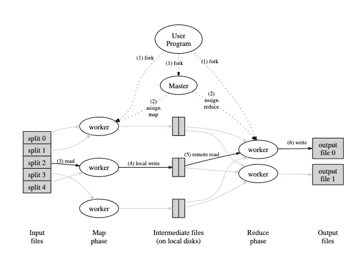

# MapReduce:大型集群上的简化数据处理

> 原文：<https://levelup.gitconnected.com/paper-summary-mapreduce-simplified-data-processing-on-large-clusters-58dac068462e>

## 从谷歌构建的分布式大规模计算管道中吸取的经验教训。

[拉杰什瓦尔·巴楚](https://unsplash.com/@rajeshwerbatchu7?utm_source=medium&utm_medium=referral)在[号航天飞机](https://unsplash.com?utm_source=medium&utm_medium=referral)上拍摄的照片

# 什么是 MapReduce？

MapReduce 是一个支持大规模计算自动并行化和分布的界面，同时**抽象出“并行化、容错、数据分布和负载平衡的混乱细节”** [1]。

顾名思义，MapReduce 的灵感来自于许多函数语言中的 *map* 和 *reduce* 函数。这些功能允许 MapReduce 轻松地并行化大型计算，并使用重新执行作为处理故障的关键机制。

# MapReduce 试图解决哪些问题？

在 MapReduce 之前，谷歌已经进行了数百次计算，处理大量原始数据来计算各种派生数据。

他们发现大多数计算在概念上很简单。然而，困难以大量输入数据的形式出现，其计算必须分布在数千台机器上才能在合理的时间内完成。分布式计算中出现的一些问题包括:

1.  如何并行化计算
2.  如何分发大的输入/输出数据
3.  如何处理故障

**因此，MapReduce 的主要目标是通过将并行化、容错、数据分布和负载平衡的所有细节都抽象出来，为没有分布式和并行系统经验的程序员提供一个易于使用的界面**。

主要目标带来的一个好处是，通过简单地向集群中添加新机器，可以更容易地提高计算过程的性能，因为 MapReduce 会自动为程序员处理所有的抽象。

# MapReduce(架构)的全貌

我们可以使用 MapReduce 以两个用户定义函数的形式来表示计算:Map 和 Reduce。

map := (k1，v1) → list(k2，v2)

减少:= (k2，列表(v2)) →列表(v3)

*映射*:取一个数据输入(键，值)对，产生一组中间(键，值)对。MapReduce 库将与同一个中间键 I 相关联的所有中间值分组在一起，并将它们传递给 Reduce 函数。

*减少*:接受一个中间键和该键的一组值。它合并这些值，形成一个可能更小的值集。请注意，中间值通过迭代器提供给 reduce 函数。这使我们能够处理太大而不适合内存的值列表。

请注意，在实际用例中，我们可以链接多个 MapReduce 作业 Reduce 操作的输出通常作为输入提供给另一个 MapReduce 作业，或者可能是另一个分布式应用程序。

图 1:MapReduce 作业执行的高级概述。改编自[1]。

注意，输入数据被分成一组 M 个输入文件。这些较小的输入文件可以由不同的机器并行处理。使用用户定义的分区函数将每个 Reduce 调用的输入数据分成 R 个部分。M 和 R 均由用户指定。

图 1 显示了 MapReduce 作业的整体流程。当用户调用 MapReduce 作业时，将发生以下一系列操作(图 1 中的编号标签对应于下面列表中的编号):

1.用户程序将输入文件分成 M 个部分，通常为 16-64MB(Google 使用 GFS 来自动划分输入数据)。然后，它在一组机器上启动程序的许多副本。

2.程序的一个副本是特殊的——母版。其余的是由主人分配工作的工人。有 M 个映射任务和 R 个归约任务要分配。主人挑选空闲的工人，给每个人分配一个地图任务或一个归约任务。

> 请注意，在 2004 年，网络带宽是一个巨大的瓶颈，作者希望尽量减少通过网络传递的数据。如局部性优化一节所述，主服务器倾向于将映射作业调度到已经包含输入数据的机器上。因此，地图作业通常在与输入数据相同的本地计算机上运行(无需通过网络传输输入文件)。

3.被分配了地图任务的工作者读取相应输入文件的内容。它解析键/值对，并将每一对传递给用户定义的映射函数。Map 函数产生的中间键/值对被缓冲在 Map worker 的内存中。

4.缓冲对被周期性地写入映射工作器的本地磁盘，由 Reduce 分区函数分成 R 个区域。这些缓冲对在本地磁盘上的位置被传递回主设备，主设备负责将这些位置转发给 Reduce 工作器。

> 请注意，减少作业仅在所有地图作业完成后开始(请参考常见问题部分)。

5.当主进程通知 Reduce worker 这些位置时，它使用远程过程调用从 Map workers 的本地磁盘读取缓冲数据。

当 Reduce worker 读取了所有的中间数据后，它会按照中间键对它们进行排序，以便将所有出现的相同键组合在一起。需要进行排序，因为通常许多不同的键映射到同一个 reduce 任务。如果中间数据量太大，不适合内存，就使用外部排序。

6.reduce 工作器遍历排序后的中间数据，对于遇到的每个唯一的中间键，它会将该键和相应的一组中间值传递给用户的 Reduce 函数。Reduce 函数的输出被附加到最终的输出文件中。

*总结第 5 步和第 6 步，这是 Reduce 工人需要采取的步骤:*

A.所有地图作业完成后，Reduce workers 将从所有地图工作者的本地磁盘中提取中间数据(从分区中)。

B.Reduce workers 将按中间键对数据进行排序。

C.分类后，工人会传递中间键以减少功能。

D.Reduce 函数的输出被附加到最终的输出文件中。

7.当所有的 Map 任务和 Reduce 任务完成后，主机唤醒用户程序。

# MapReduce 的主要经验是什么？

由[凯利·西克玛](https://unsplash.com/@kellysikkema?utm_source=medium&utm_medium=referral)在 [Unsplash](https://unsplash.com?utm_source=medium&utm_medium=referral) 上拍摄的照片

1.**限制编程模型**使得并行化和分布式计算变得更加容易，甚至使得这样的计算具有容错能力。

对于 MapReduce，作者限制模型接受键/值对，输出也是键/值对。这样做允许他们将计算实现到 Map 和 Reduce 函数中，使并行计算更容易。

2.**冗余执行**可用于减少慢速机器(掉队者)的影响，并处理机器故障和数据丢失。

如果工作进程失败，MapReduce master 只是重新执行无法联系到的工作进程所做的工作，并继续前进。

在出现“掉队者”的情况下(掉队者是一台花费异常长的时间来完成最后几个 Map 或 Reduce 任务之一的机器，因此延长了所需的总时间)，当 MapReduce 操作接近完成时，主服务器在剩余的进行中的任务上调度备份执行。这些冗余备份过程可以加快完成所有任务所需的总时间。

# MapReduce 什么时候不适合？

1.当你需要实时处理时，MapReduce 可能不是最快的选择。

2.将每件事都实现到一系列 Map 和 Reduce 函数中并不总是很容易。

3.当您的中间进程需要相互通信时(Map 和 Reduce 作业是隔离运行的)。

4.当您需要处理流数据时。请注意，所有由 MapReduce 处理的输入数据首先由地图工作进程批量处理，然后由 Reduce 工作进程处理。

5.当您可以在本地机器上获得想要的结果时。“显然，与分布式系统相比，配置和管理独立系统要容易得多。”[2]

# 常见问题解答

1.  Reduce workers 中的混洗过程(从所有地图工作进程中提取中间数据)是否与 Reduce 操作同时发生？

不，不是的。Reduce 工作器将交替处理来自 map 工作器的数据，对中间数据进行排序，并将排序后的数据传递给 Reduce 函数。

2.归约操作是否与映射操作同时发生？

不。您可以将 Map 和 Reduce 操作视为成批发生。Reduce 工作器必须等待所有映射作业完成，才能开始对数据进行洗牌、排序和传递到 Reduce 函数中。

这是因为 MapReduce 保证了排序，即在一个给定的分区内，中间的键/值对以递增的键顺序进行处理(参见[1]的第 4.2 节)。

换句话说，为了让 Reduce 操作开始，在调用 Reduce 函数之前，必须先收集整个分区，然后进行排序。

确保我们拥有整个分区的唯一方法是等待所有映射操作完成，以便处理所有输入片。

# 参考

[1]杰弗里·迪恩和桑杰·格玛瓦特(2004 年)。MapReduce:大型集群上的简化数据处理。[https://pdos.csail.mit.edu/6.824/papers/mapreduce.pdf](https://pdos.csail.mit.edu/6.824/papers/mapreduce.pdf)

[2]堆栈溢出帖子[https://Stack Overflow . com/questions/18585839/what-is-the-families-of-MapReduce](https://stackoverflow.com/questions/18585839/what-are-the-disadvantages-of-mapreduce)

[3]麻省理工学院 6.824 的 2021 年新加坡国立大学 DYOM 课程的常见问题部分。