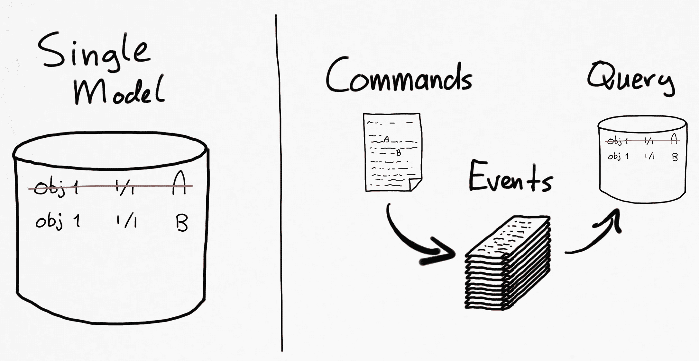
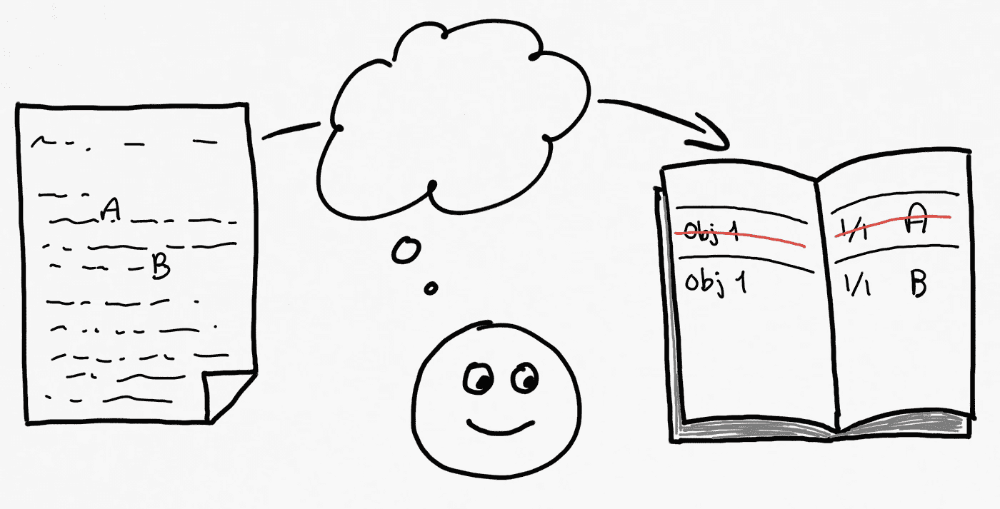
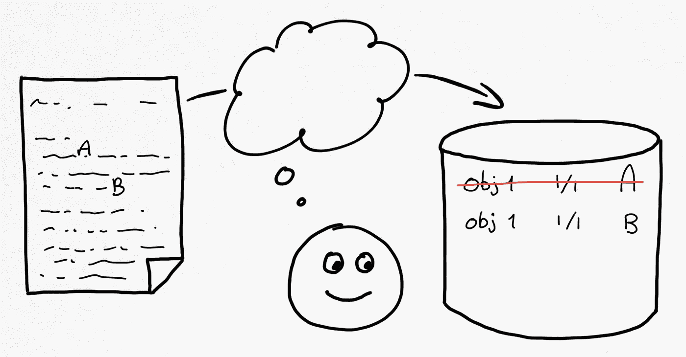
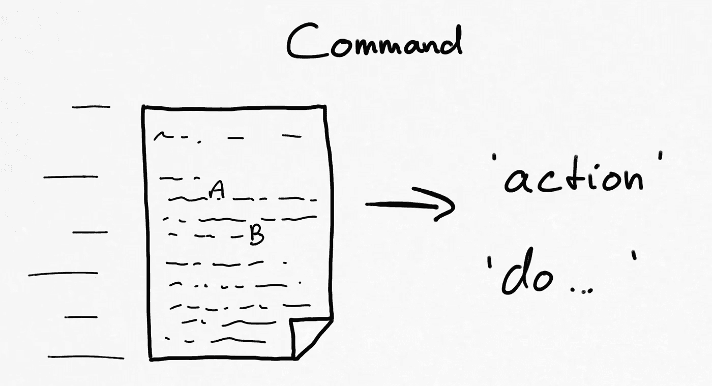
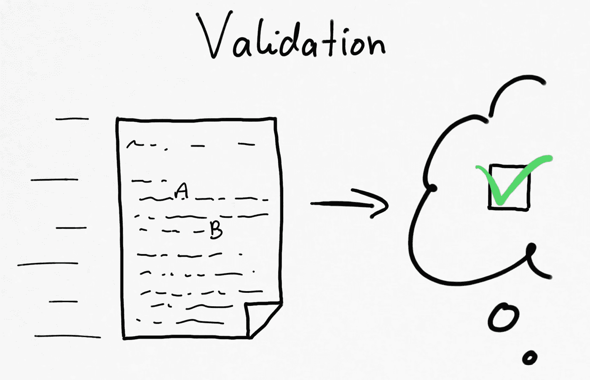
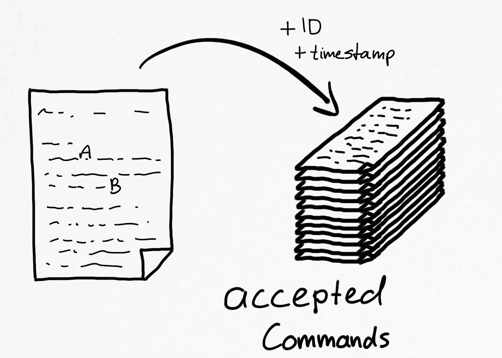
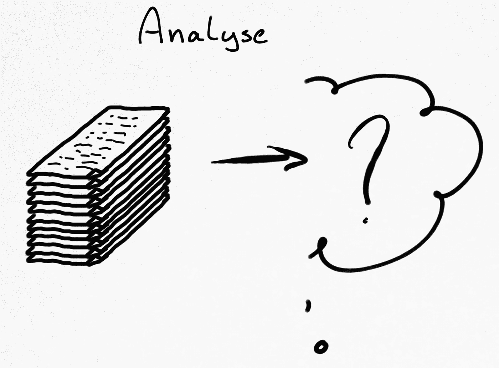
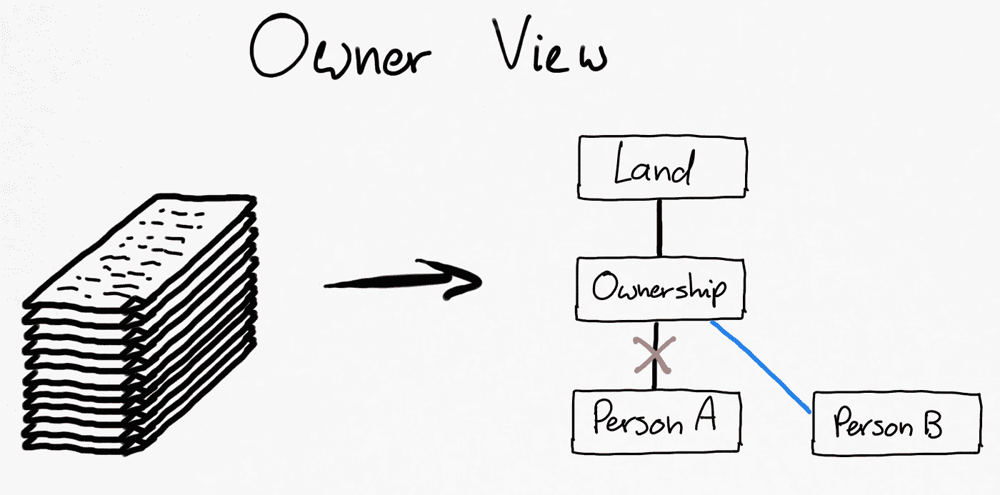

# 从单一模型到命令、事件和查询的范式转变

> 原文：<https://levelup.gitconnected.com/paradigm-shift-from-single-model-to-commands-events-and-queries-ee68a97de9aa>

在[软件吞噬世界](https://quoteinvestigator.com/2018/01/24/software/)的时代，存储和计算能力不再昂贵，是时候改变我们只使用单一数据模型的模式了。随着我们的社会人口越来越多，我们需要系统来保存我们的记录。多年来，我们以不同的方式用一个共同的模式开发了这些系统:一本书里的一个表格。在这些书籍的第一次数字化过程中，我们转移到了数据库中的一个表格。现在是时候将我们头脑中的流动转化为数据了！

在本文中，我将使用荷兰土地管理局的一个例子(‘因为我在那里工作；-)很容易联系或理解。土地管理是关于谁拥有一块土地。谁拥有就纳税，谁可以出售。让我们想象一个人 A 拥有一块土地，并将其出售给 B。在荷兰，A 和 B 需要去公证处进行合法转让，转让将被写入契约，由双方签字。这份契约将被送到荷兰土地管理局，在公共登记册上公布。现在所有权已经从 A 人转移到 b 人了。

在土地管理局，每块土地都有一个记录系统。这曾经是纸上谈兵。在当地的办公室，会有大量的书籍，每块土地有两页。每当处理一个契约时，合格的书被从档案中取出，并选择适当的页面来删除前所有者并写下这片土地的新所有者。请注意，*契约*是收到并处理的文件，转换为*通过*和*写下*新的所有者是一个人的解释。办理房契的职员脑子里发生了一些事情。

记录系统的纸质保存方式

然后介绍了计算机系统。是啊，让我们去数码！嗯……数字化是指我们用数据库记录系统取代了纸张记录系统。向前迈进了一步，但流程和执行仍与“纸质方式”相同。在过去的几十年中，计算机系统、技术和自动化的兴起对我们的工作方式产生了巨大的影响，但直到最近几年，可以处理和存储的数据量还没有那么多。

*第一种*数字方式保存系统记录

如今，存储(相对)便宜，处理能力和内存也是如此。这些资源再也没有限制了。这是因为**数据**才能存在的[智能](https://www.thoughtworks.com/insights/blog/intelligent-empowerment-next-wave-technology-led-disruption)时代！如果我们想发展和应用智能，我们需要尊重*所有涉及的*数据。这意味着契约的数据和我们头脑中的数据(以及验证规则)。

让我们先看看房契。契约是在表达一种行为，一种“做某事”。它在指挥着什么。姑且称之为:一个**命令**。我们接受了一个过程的启动契约(在土地管理办公室；它是另一个过程的结果——正如另一个一般模式一样；见结论)而且我们从来没有为它开发过数据模型。现在，我们需要显式地对命令建模，以将用作流程触发器的数据形式化。

命令

接下来的步骤是解开我们头脑中的过程。我们实际上做的第一步是*验证*。我们确认该契约是“正常的”,公证人也做了适当的工作。这是我们执行的法律的一部分。其次，我们检查人 A 是否能够把它卖给其他人。如果他或她目前不拥有土地，应该不可能出售(咄！).

心理过程第一步:确认

一旦契约被验证和接受，我们可以直接进入编辑当前状态:删除当前所有者并写下新所有者。这看起来很合理…但是等等，我们也在丢失数据。突破点是数据！写下新主人也是数据！哦，好吧，契约的实际接受，验证的结果，也是数据！我们错过了这里…

让我们建立一个新的数据堆栈，所有*接受的命令*都在这里存档。让我们为每个接受的命令添加一个 ID 和一个接受的时间戳。这些是记录系统上发生的**事件**。事件以前发生过，所以我们需要用过去式来表达。因此，该命令是一个表示“转移所有权”行为的契约而该事件表达了在记录系统中已经被接受和改变的内容:“所有权转移”。

事件第 1 部分:明确接受的命令，包括 ID 和接受的时间戳

现在我们有了一堆事件，也就是被接受的命令，是时候进入我们心理过程的第二步了:接受命令的效果是什么？实际上这也是在事件中捕捉到的。在这个例子中，事件更加明确:“所有权从人 A 转移到人 B”。

事件第 2 部分:记录系统中变更的明确描述

这是删除人 A 的记录并为人 b 写下新记录的输入。这是我们心理过程的第三步。我们分析刚刚发生的事件的后果，并在编辑记录系统时进行转换。现在我们可以更新我们的*视图*,看看谁是这片土地的当前所有者。

查询(或查看):谁是当前所有者？

这是将被查询的唯一视图吗？大概不会！我们可能需要了解某个人拥有多少块土地。或者，我们可能希望分析某个区域(一组注册的土地)中的人员流动。或者……嗯，也许我们想查询一些我们还不知道的东西。拥有一堆关于记录系统如何发展的事件使我们能够在稍后的时间点构建一个新的**查询**，包括所有的历史数据！哇！数据*就是*力量！让智能来:-D

从单一模型到命令、事件和查询的范式转变

总结:几十年来，我们开发了记录系统，以保持我们的管理整洁和有用。在数字空间中，有理由不做任何(真正的)改变，直接从纸张转向“数字”。现在，我们没有任何借口忽略所有涉及的数据，如果我们想继续前进并利用智能，我们*需要*考虑所有数据。因此，我们需要改变单一模型的范式，转向显式命令、事件和查询！

与所有范式一样，这种转变需要一些时间才能进入我们的思维体系。根据我的经验，在这种转变变得有意义之前，需要花上几周的时间来重新思考(所以请慢慢来；——)

其次，事件对我们的物质世界来说是非常自然的。事情总是同时发生的，平行的和连续的。如今的计算机系统需要扩大规模，通过这样做，它们变得与我们的物理世界非常相似，事情总是同时、并行和顺序地发生。两方面都驱动了 [*事件驱动的*](https://en.wikipedia.org/wiki/Event-driven_architecture) *模式。在* [*域内驱动设计*](https://en.wikipedia.org/wiki/Domain-driven_design) *社区这是提升到业务域的业务事件和架构模式‘命令查询责任分离’(CQRS)和事件源。*