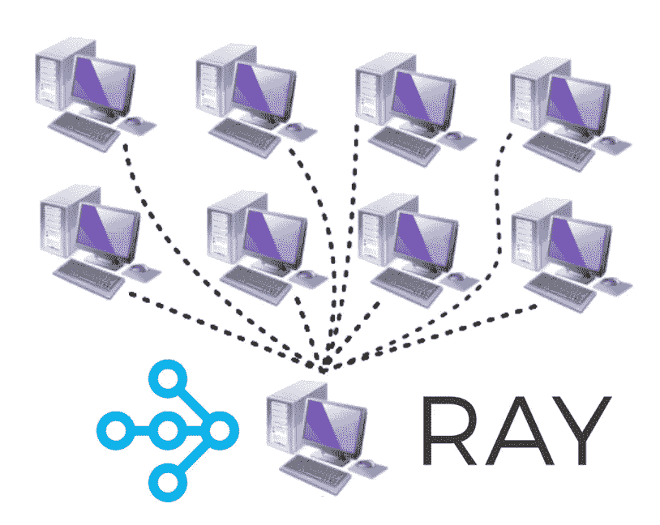

# 使用 Python 中的 Ray 轻松执行分布式计算

> 原文：<https://levelup.gitconnected.com/parallel-and-distributed-computing-in-python-using-ray-e14f9e46fc16>

## *介绍分布式计算的概念，并使用开源 Python 库 Ray 编写可在分布式系统上工作的可扩展代码。*


在 [Unsplash](https://unsplash.com?utm_source=medium&utm_medium=referral) 上 [Marcin Jozwiak](https://unsplash.com/@marcinjozwiak?utm_source=medium&utm_medium=referral) 拍摄的照片

我们在之前的文章中已经看到了如何使用[线程和多重处理](https://www.earthinversion.com/techniques/parallel-computing-in-python/)来同时执行我们的计算。即使是具有多个 CPU 内核的单处理器计算机(一个处理器具有一个或多个内核，一个计算机具有一个或多个处理器)，也会给人一种能够同时运行多个任务的错觉。当我们有多个处理器时，我们可以真正以并行方式执行计算。

# 并行计算还是分布式计算？

并行计算在现代计算中非常有用，几乎是必需的，其目标是实现最高性能。我们将长时间运行的计算分成更小的块，并将它们分配给不同的处理器。这种策略允许我们在相同的时间内做更多的计算。为了构建基于 GUI 的应用程序，系统的并行设计总是需要的，以便一个线程可以保持可用以更新 GUI 并响应用户输入。

并行计算和分布式计算的区别在于，对于并行计算，多个处理器驻留在同一个主板上。分布式计算同时使用多台计算机来解决一个问题。现代分布式系统能够通过网络(局域网/广域网)进行通信。分布式计算的优势在于它的价格和可扩展性。如果我们需要更多的电力，那么我们可以很容易地添加更多的计算机。

本质上，并行和分布式计算的架构非常相似。主要区别在于分布式计算使用分布式内存空间，而不是共享内存空间。拥有一个可以为我们的应用程序提供统一的逻辑(而不是物理)内存空间的软件层，可以帮助我们运行为分布式计算的并行计算编写的代码。

在本文中，我们将看到如何使用开源 Python 库 Ray 来帮助我们执行并行和分布式计算。Ray 采用 Pythonic 函数和类，并将它们转换为分布式设置的任务和参与者。我们将只看到函数的例子，但是类的概念是非常相似的。

# 使用`pip`安装射线



作者图片

这将安装支持仪表板+集群启动器的 Ray。

```
pip install 'ray[default]'
```

如果您需要最小安装:

```
pip install -U ray
```

# Ray 中带任务的并行计算

让我们执行一个来自我们在[上一篇文章](https://www.earthinversion.com/techniques/parallel-computing-in-python/)的例子，我们使用`concurrent.futures`运行，并与我们使用`ray`运行相同的任务进行比较。

```
import time
import concurrent.futures

Stime = time.perf_counter()
tasks = []
sleepTimes = [0.1, 0.2, 0.1, 0.5, 0.7, 0.9, 0.5,
              0.4, 1.5, 1.3, 1.0, 0.3, 0.7, 0.6, 0.3, 0.8]
print(f"Total time of sleep: {sum(sleepTimes)} for {len(sleepTimes)} tasks")

def my_awesome_function(sleepTime=0.1):
    time.sleep(sleepTime)
    return f"Sleep time {sleepTime}"

all_results = []
with concurrent.futures.ProcessPoolExecutor() as executor:
    tasks = [executor.submit(my_awesome_function, sleep)
             for sleep in sleepTimes]

    for ff in concurrent.futures.as_completed(tasks):
        all_results.append(ff.result())

print(f"Finished in {time.perf_counter()-Stime:.2f}")
```

这返回

```
$ python test_ray.py 
Total time of sleep: 9.9 for 16 tasks 
Finished in 1.65
```

按顺序完成这项工作需要 9.9 秒。因为我们执行并行执行，所以我们在我的计算机上用 1.65 秒完成了这项工作。请注意，对于您的电脑，这个时间可能会有所不同。

现在，让我们用雷做同样的工作。我们首先使用`ray.init()`初始化光线。decorary`ray.remote`将 Python 函数转换成可以远程异步执行的函数。它立即返回可以并行执行的函数的 N 个副本。

```
import time
import ray

import concurrent.futures

Stime = time.perf_counter()
tasks = []
sleepTimes = [0.1, 0.2, 0.1, 0.5, 0.7, 0.9, 0.5,
              0.4, 1.5, 1.3, 1.0, 0.3, 0.7, 0.6, 0.3, 0.8]
print(f"Total time of sleep: {sum(sleepTimes)} for {len(sleepTimes)} tasks")

# Start Ray.
ray.init()

@ray.remote #convert to a function that can be executed remotely and asynchronously
def my_awesome_function(sleepTime=0.1):
    time.sleep(sleepTime)
    return f"Sleep time {sleepTime}"

tasks = []
for sleep in sleepTimes:
    tasks.append(my_awesome_function.remote(sleep))

all_results = ray.get(tasks)
print(f"Finished in {time.perf_counter()-Stime:.2f}")
```

这返回

```
Total time of sleep: 9.9 for 16 tasks 
Finished in 3.18
```

开销会造成一些延迟，但对于大型计算来说，这种延迟可以忽略不计。

# 大型计算的聚合值

Ray 可以很容易地用来聚合多个值，这对于构建需要在多台机器上聚合计算的大型应用程序至关重要。对于大型计算，Ray 可以将聚合的运行时间从线性改为对数。

让我们看一个例子:

```
import time
import ray
import numpy as np

Stime = time.perf_counter()

@ray.remote
def create_matrix(size):
    return np.random.normal(size=size)

@ray.remote
def multiply_matrices(x, y):
    return np.dot(x, y)

@ray.remote
def sum_matrices(x, y):
    return np.add(x, y)

m1 = create_matrix.remote([1000, 1000])
m2 = create_matrix.remote([1000, 1000])
m3 = create_matrix.remote([1000, 1000])
m4 = create_matrix.remote([1000, 1000])

m12 = multiply_matrices.remote(m1, m2)
m34 = multiply_matrices.remote(m3, m4)

a12_34 =  sum_matrices.remote(m12, m34)

## Results
MM = ray.get(a12_34)

print(f"Finished in {time.perf_counter()-Stime:.2f}")
```

在上面的例子中，我们首先创建四个矩阵，将它们分组为两个，将组中的矩阵相乘，然后将每组相乘的结果相加。这里，乘法是并行进行的，然后将结果相加得到总和。

# 参考

1.  [安装射线](https://docs.ray.io/en/latest/installation.html)
2.  Pierfederici，F. (2016)。用 Python 实现分布式计算。《物理学杂志 A:数学与理论》(第 44 卷，第 8 期)。帕克特出版有限公司
3.  [现代并行和分布式 Python:关于 Ray 的快速教程](https://towardsdatascience.com/modern-parallel-and-distributed-python-a-quick-tutorial-on-ray-99f8d70369b8)

*原载于 2021 年 11 月 6 日 https://www.earthinversion.com*[](https://www.earthinversion.com/utilities/parallel-and-distributed-computing-in-python-using-ray/)**。**