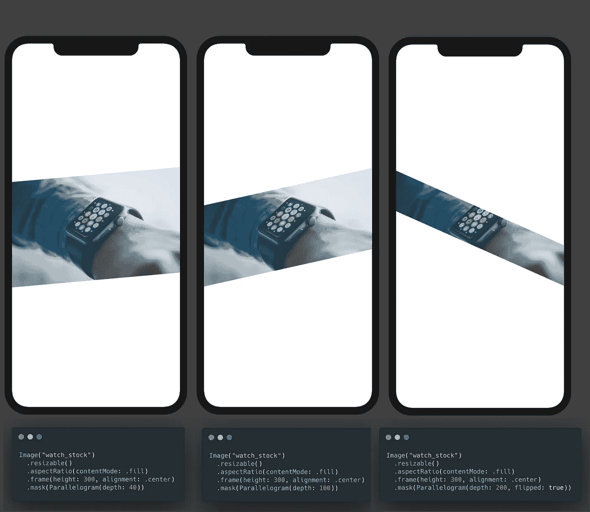

# SwiftUI 平行四边形形状和遮罩教程

> 原文：<https://levelup.gitconnected.com/parallelogram-shape-and-mask-tutorial-7473a4135483>

## 让-马克·布里安内

前几天我在浏览各种网站时，注意到了许多流行网站的倾斜卡片和布局设计。例如[条纹](https://stripe.com)、[尾翼](https://tailwindui.com/)和[火基](https://firebase.google.com/)。我用一个定制的平行四边形`Shape`将这个设计带到 SwiftUI 中。在我们深入到这里的教程之前，看看下面的一些例子，看看你能做什么。

> 在开始之前，请考虑使用这个[链接](https://trailingclosure.com/signup/)订阅，如果你没有在[TrailingClosure.com](https://trailingclosure.com/)上阅读这篇文章，请随时来看看我们！


我用平行四边形创造的例子

## 入门指南

如果您还没有，请启动 Xcode 并创建一个新项目。从那里，您需要创建一个名为`Parallelogram.swift`的新文件。这将是我们存储自定义`Shape`结构的文件。

> 如果你以前没有构建过自己的`Shape`，那么看看这篇关于 Swift 黑客的伟大文章[。保罗将复习基础知识，让你跟上进度。](https://www.hackingwithswift.com/quick-start/swiftui/how-to-draw-a-custom-path)

```
import SwiftUI

struct Parallelogram: Shape {

    func path(in rect: CGRect) -> Path {
    	// Return Custom Path Here
    }
}
```

看看下面的图表，看看这个形状是如何工作的。一个`CGRect`将被传入`Shape`的`path(in rect:)`函数，从那里我们将利用一个 struct 属性绘制一个`Path`，我们将在第二个函数中创建一个名为`depth`的函数。


1.  首先在名为`depth`的结构中声明一个`CGFloat`属性。这将是我们的平行四边形将“切入”`CGRect`的距离。

```
import SwiftUI

struct Parallelogram: Shape {

    var depth: CGFloat

    func path(in rect: CGRect) -> Path {
    	// Return Custom Path Here
    }
}
```

2.现在在`path(in rect:)`函数中，定义一个新的`Path`来绘制平行四边形。

```
import SwiftUI

struct Parallelogram: Shape {

    var depth: CGFloat

    func path(in rect: CGRect) -> Path {
    	Path { p in
        	// Draw parallelogram here using 'p'
        }
    }
}
```

3.接下来，我们要画出路径。记住，我们需要相对于传入的`rect`而不是一个标准尺寸来绘制这个路径。这将允许形状相对于它所在视图的大小进行缩放。


带坐标的形状

记住上面的图形，我们将从图形的左上方开始，顺时针移动。

```
import SwiftUI

struct Parallelogram: Shape {

    var depth: CGFloat
    var flipped: Bool = false

    func path(in rect: CGRect) -> Path {
        Path { p in
        	p.move(to: CGPoint(x: 0, y: depth))
            p.addLine(to: CGPoint(x: rect.width, y: 0))
            p.addLine(to: CGPoint(x: rect.width, y: rect.height - depth))
            p.addLine(to: CGPoint(x: 0, y: rect.height))
            p.closeSubpath()
        }
    }
}
```

如果你愿意，你也可以给`Parallelogram`形状添加一个变量，允许你在绘制路径时水平翻转形状。这比创建形状后在形状上使用`.rotation3DEffect()`调用要简单一些。

```
import SwiftUI

struct Parallelogram: Shape {

    var depth: CGFloat
    var flipped: Bool = false

    func path(in rect: CGRect) -> Path {
        Path { p in
            if flipped {
                p.move(to: CGPoint(x: 0, y: 0))
                p.addLine(to: CGPoint(x: rect.width, y: depth))
                p.addLine(to: CGPoint(x: rect.width, y: rect.height))
                p.addLine(to: CGPoint(x: 0, y: rect.height - depth))
            } else {
                p.move(to: CGPoint(x: 0, y: depth))
                p.addLine(to: CGPoint(x: rect.width, y: 0))
                p.addLine(to: CGPoint(x: rect.width, y: rect.height - depth))
                p.addLine(to: CGPoint(x: 0, y: rect.height))
            }
            p.closeSubpath()
        }
    }
}
```

## 示例使用

就像上面的一些例子一样，你可以很容易地用下面的形状屏蔽掉一个`Image`或`View`:

```
Image("watch_stock")
    .resizable()
    .aspectRatio(contentMode: .fill)
    .frame(height: 300, alignment: .center)
    .mask(Parallelogram(depth: 50))
```



使用各种参数的示例

## 使用匹配的几何体效果

最好的部分是，你可以使用这个形状与许多其他 SwiftUI 功能，如匹配的几何效果。请注意下面的视频中，当封面照片被点击时，它是如何去除遮罩的。

## 让我们看看你做了什么！

我们想看看你用这个教程做了什么！给我们发照片！在推特 [@TrailingClosure](https://twitter.com/TrailingClosure) 、Instagram 上找到我们，或者发邮件到 howdy@TrailingClosure.com联系我们。