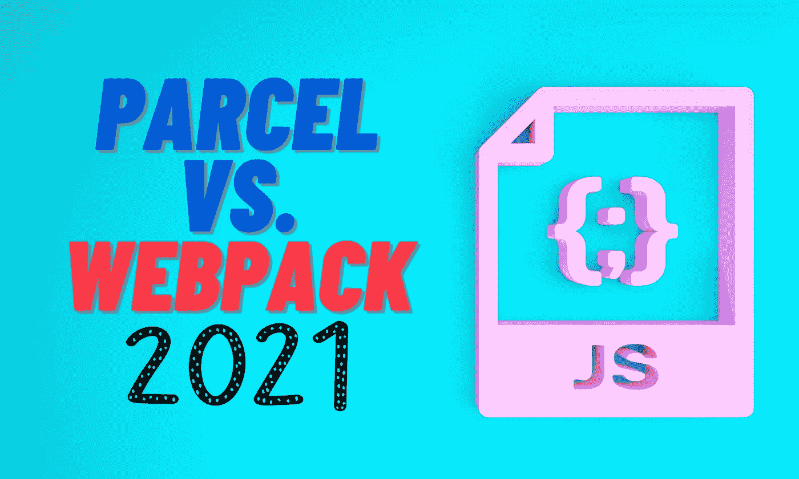
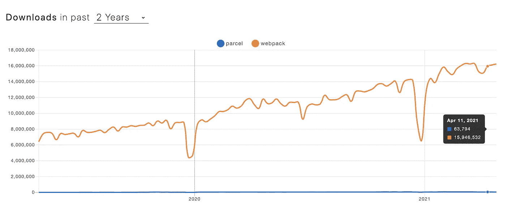
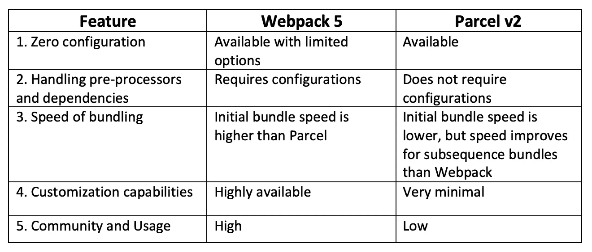

# 包裹与网络包 2021

> 原文：<https://levelup.gitconnected.com/parcel-vs-webpack-2021-64c347bcb31>

## 为您的前端选择正确的捆扎机



如果您是一名前端开发人员，您可能熟悉作为项目捆绑者的 WebPack。大多数开发人员和团队使用 WebPack 作为他们的主要 JavaScript bundler。我也在我的大部分项目中使用 WebPack。然而，当我偶然发现这个包时，我冒昧地测试了它。

在这篇文章中，我将分享我使用 Parcel 的经验，并与 WebPack 进行比较。

在我们开始之前，让我给你一个小小的剧透，为什么包裹对我有吸引力。

> 与其他需要大量配置设置的捆扎机相比，package 无需任何配置即可启动并运行。

这难道不是开始探索这个捆绑器的好理由吗？😃

# 零配置设置

我们大多数人都习惯于使用 Create React App (CRA)来生成我们的 React 项目。这是设置 React 项目最简单的方法，不需要太多的手动配置设置。然而，问题是，CRA 隐藏了网络包的配置。因此，如果您需要定制您的捆绑配置，或者如果您需要更多高级功能，您仍然需要手动设置 WebPack。

有这样的例子，我花了几天时间来配置和优化一个项目的捆绑包。最基本的 WebPack 配置如下所示。

```
const webpack = require('webpack');
const path = require('path');

const config = {
    entry: './src/app.js',
    output: {
        path: path.resolve(__dirname, 'dist'),
        filename: 'bundle.js'
    },
    module: {
        rules: [
            {
                test: /\.(js|jsx)$/,
                exclude: /node_modules/,
                use: 'babel-loader'
            }
        ]
    }
};
module.exports = config;
```

这可以根据您需要的配置进行扩展。启动项目的 WebPack 脚本需要添加到`package.json`中。

> **点注:**
> 
> 有了最新发布的 WebPack(第 5 版)，您也可以使用零配置的 WebPack。它将假设您的项目入口点是`src/index.js`，并将包输出到`dist/main.js`进行生产的缩小和优化。

然而，在大多数情况下，如果您使用 WebPack，您将不得不扩展默认配置以满足您的需求。因此，WebPack 配置文件对于大型项目来说是必不可少的。

现在，让我们看看启动和运行包需要什么。

用 Parcel 捆绑和运行您的项目的唯一要求是将这个脚本添加到您的`package.json`

```
"scripts": {
  "start": "parcel index.html",
}
```

您的应用程序脚本应该包含在 HTML 文件中，并且 Parcel 会监视这个 HTML 文件以正确完成它的工作。它也可以观看 JavaScript 文件而不是 HTML 文件。

就一句台词！是不是很牛逼？😃

# 依赖性和预处理器

与 WebPack 不同，Parcel 不需要配置来处理预处理程序和依赖项。包裹会自动处理它，无需手动操作即可安装。

这是没有麻烦的，因为你不需要弄乱预处理器版本，包括在配置文件等。

Parcel 使管理依赖项和预处理程序变得非常简单。到目前为止，包裹似乎是赢家。但是不要太兴奋。WebPack 出名有很多原因。

事实上，包裹本身也有一些问题。我们将在本文中继续讨论这些内容。

# 代码分割

Parcel 以代码分割支持和动态导入而闻名。是的，它确实如此，并且如预期的那样工作。然而，当涉及到代码分割时，Parcel 也有一些缺点。

在 Parcel 中，捆绑文件夹具有扁平结构。因此，它不会在捆绑文件夹中单独包含您的图像、CSS、JS。一切都会在一起。在我看来，这看起来有点乱，因为很难快速找到一个捆绑文件。甚至`index.html`也会和其余的文件挤在一起。

与此相反，WebPack 将在捆绑的文件夹中有一个干净的结构，在那里你可以识别图像、CSS 文件、JS 文件等。分开。

# 捆绑速度

当您最初捆绑您的应用程序时，与 WebPack 相比，package 通常会花费相当多的时间。WebPack 更快。但是，在后续的构建中(当你在观察和构建时)，Parcel 要快得多。

此外，在初始构建之后，我很少经历长时间的构建。这对开发人员非常有用，因为它提高了开发质量，节省了大量时间。

包裹也有一个，

> 热模块替换，在开发过程中无需页面刷新即可更新元素。

此外，它有一个“生产模式”,通过避免不必要的构建步骤来加速构建。

# 使用这些捆绑器的第三方工具

使用 Parcel 进行定制是非常简单的，许多第三方工具都不能使用它。然而，迄今为止，WebPack 仍然是定制之王，许多第三方工具是他们的首选捆绑技术。下面，工具在内部使用 WebPack 作为默认捆绑器。

[**盖茨比**](https://www.gatsbyjs.com/)——是一个基于 React 的网站生成器，让你创建高度优化的网站，我们可以通过 cdn 提供服务。它使用 WebPack 作为默认捆绑器，并允许您定制它的一些配置，如[代码分割](https://www.gatsbyjs.com/docs/glossary/webpack/)。

[**Bit**](https://bit.dev) — Is 是一个[开源](https://github.com/teambit/bit)工具，让你创建*真正的*模块化应用与*独立*创作、版本化和维护组件。Bit 使用 WebPack 捆绑隔离的组件，并使用模块联合特性为[微前端](https://blog.bitsrc.io/revolutionizing-micro-frontends-with-webpack-5-module-federation-and-bit-99ff81ceb0)进行运行时集成。

[**Angular**](https://v5.angular.io/guide/webpack)**/**[**React**](https://reactjs.org/docs/code-splitting.html)**/**[**VueJS**](https://cli.vuejs.org/guide/webpack.html#simple-configuration)—最流行的前端框架和库都带有默认的 WebPack 配置，并根据需要进行扩展。

# 摘要

正如您所看到的，WebPack 仍然是最受欢迎的捆绑包，并且在可预见的未来将继续保持领先地位。



来源: [NPM 趋势](https://www.npmtrends.com/parcel-vs-webpack)

但是，在我看来，对于小规模的应用程序，Parcel 是一个很好的捆绑器。对我来说效果很好。但是，有几件事需要注意。

但是在您的应用程序中使用 Parcel v1 有点冒险。这个版本在安装依赖项时存在问题，必须通过向构建脚本添加标志来缓解这些问题。

然而，一个改进的新版本的包裹(第 2 版)现在出来了，大多数以前的问题已经得到了解决。您可以在此处参考 package v2 文档[。](https://v2.parceljs.org/)

如果您的应用程序是企业级的，我觉得迁移到 Parcel 并不安全，因为它可能会限制您的选择，尽管 Parcel 拥有吸引人的特性。所以，还是坚持用 WebPack 比较好。



Webpack 5 与 package v2

让我知道你对包裹的想法。感谢阅读！