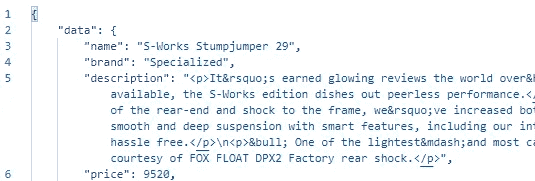
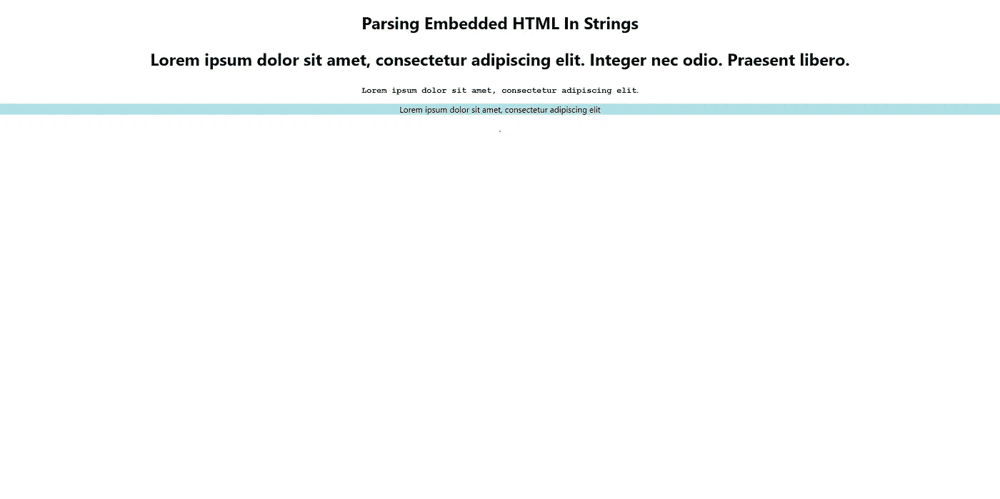

# 用 React HTML 解析器解析 React.js 中嵌入的 HTML。

> 原文：<https://levelup.gitconnected.com/parsing-embedded-html-in-react-js-with-react-html-parser-e8e22227790a>



遇到过这种情况吗？

使用 JSON 的时间越长，您就越有可能遇到这样的数据集，它将 HTML 作为字段之一嵌入到字符串中。如果您希望能够在 React.js 中显示这些数据，同时还考虑到内部 HTML 的样式，有一个简单易用的包叫做 [**React HTML 解析器**](https://www.npmjs.com/package/react-html-parser) ，它将为您处理这项工作**。**

1.  **安装包**

```
npm i react-html-parser
```

2.**导入并使用解析器。**

3.**结果。**



非常适合输入的 JSON 数据！