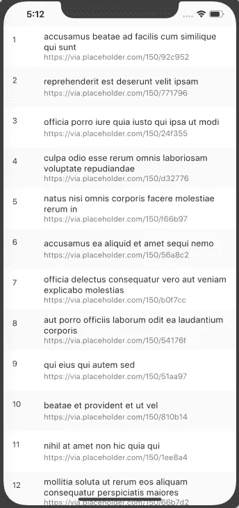
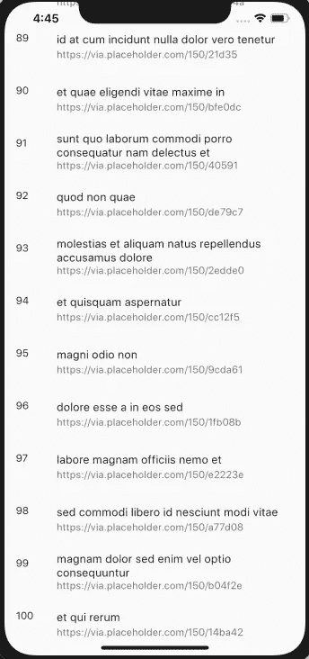

# 在 Dart 中解析 JSON

> 原文：<https://levelup.gitconnected.com/parsing-json-in-dart-47833e698879>

在本文中，我将介绍在 Dart 中解析 JSON 的基础知识。最后，您将拥有一个带有列表视图的应用程序，其字段将由从 API 获取的数据填充。



第一步:

要获得 JSON 数据，您需要执行 http 方法，而要在 Flutter 中使用 http 方法，您需要导入一个库，该库支持常见的 http 方法，如 GET、POST、PUT、DELETE 等。

转到您的 *pubspec.yaml* 文件，在依赖项部分，编写:

```
http: ^0.12.0+1
```

保存文件，旋舞会自动运行*【旋舞包获取】*命令。(至少在 Visual Code Studio 中是这样)。

第二步:

导航到您的 *main.dart* 文件。清除文件中的所有内容。

让我们从导入我们稍后将需要的库开始:

```
import 'package:flutter/material.dart';import 'package:http/http.dart' as http;
```

第一个包对于材料组件是必不可少的。第二个包是我们包含在项目依赖项中的包。

现在，将应用程序中的入口点定义为:

```
void main(){runApp(MyApp())};
```

或者简而言之，

```
void main() => runApp(MyApp());
```

接下来，让我们定义一下 *MyApp* 类。

第三步:

我将在一个类中编写我所有的代码，这个类将有多个状态，所以这个类将是有状态的。

```
class MyApp extends StatefulWidget {
    @override _MyAppState createState() => _MyAppState();
}class _MyAppState extends State<MyApp> {
    @override Widget build(BuildContext context) {
        return MaterialApp(
            debugShowCheckedModeBanner: false,
            home: Scaffold(
                body: Center(),
            ),
        );
     }
}
```

第四步:

现在我们有了一个基本的结构，让我们开始使用 API 来获得结果。为此我将使用 [JSONPlaceholder REST API](https://jsonplaceholder.typicode.com/) 。更确切地说，[https://jsonplaceholder.typicode.com/photos](https://jsonplaceholder.typicode.com/photos)。

获得的 JSON 有一个对象列表，每个对象有五个属性: *albumId* 、 *id* 、 *title* 、 *url* 和 *thumbnailUrl。现在让我们只关注三个属性:id、title 和 thumbnailUrl，忽略其余的。*

接下来让我们用这三个属性和一个构造函数创建一个类。我们还将在*图片*类中包含一个 *fromJson()* 工厂方法，以便于从 Json 对象创建*图片对象*。

```
class Picture{
    int id;
    String title, thumbnailUrl;
    Picture({this.id,this.title,this.thumbnailUrl});
    factory Picture.fromJson(Map<String, dynamic> json) {
        return Picture(
            id: json['id'] as int,
            title: json['title'] as String,
            thumbnailUrl: json['thumbnailUrl'] as String,
         );
     }
}
```

第五步:

接下来，我们来做一个网络请求。

让我们创建一个函数来获取 JSON 响应，并适当地将其转换成图片类型的列表。

Flutter 有一个非常棒的特性，叫做未来。未来用于表示在未来某个时间可用的潜在值或误差。Future 总是伴随着一个数据类型(如 Future <int>或 Future <string>等。).</string></int>

我们无法预测我们的请求何时会有结果，我们可能在 1 秒、10 秒或 10 分钟后得到结果；或者，由于某些错误，我们可能永远得不到结果，相反，我们可能带着错误着陆。这就是为什么我们的函数不会返回一个列表<picture>，而是一个未来的<list>>。</list></picture>

第二件重要的事情是函数将被标记为 async，也就是说，它异步地执行它的操作。

所以基本上，

```
Future<List<Picture>> obtainJson() async{
    final response = await http.get('https://jsonplaceholder.typicode.com/photos'); **//1**
    String responseBody = response.body; **//2**
    dynamic jsonObject = json.decode(responseBody); **//3**
    final convertedJsonObject = jsonObject.cast<Map<String, dynamic>>(); **//4**
    List<Picture> list = convertedJsonObject.map<Picture>((json) => Picture.fromJson(json)).toList(); **//5**
    return list; **//6**
}
```

1.  在第一行，我们执行了一个 http `get`请求，并将其标记为`await`，这样在`get`操作返回之前，函数体中的进一步操作不会被执行。一个 http `get`操作返回一个未来<响应>值。我们已经将该值存储到" *response"* 变量中。
2.  接下来，我们将获得这个响应的主体。这个主体是 String 类型的，所以我们将它存储到 String 类型的变量" *responseBody"* "中。
3.  接下来，我们将把这个字符串转换成一个 JSON 对象。json.decode()函数接受 string 类型的参数，并返回结果 json 主体。
4.  现在我们有了一个 JSON 对象，我们将把它转换成一个 String 类型的 Map，dynamic，也就是 Map <string dynamic="">。为此，我们将执行 cast 方法。结果值存储在变量“ *convertedJsonObject* 中。</string>
5.  现在我们有了一个地图，我们将把它作为参数传递给 *Picture.fromJson* ，它返回一个 Picture 对象。所有的值都需要这样做。此外，我们想要一个图片列表，而不仅仅是一张图片。为此我们使用*。toList()* 。
6.  最后我们会返回这个列表。

第六步:

我们需要一个列表来显示结果。因此，我们肯定需要一个 ListView 小部件，但是在 http 请求返回任何数据时或之前，我们的 ListView 可能没有值。或者我们可能会遇到错误，没有列表显示，在这种情况下，我们需要某种视觉输出来表明这一点。

因此，我们将使用 FutureBuilder。FutureBuilder 有两个非常重要的属性， *future* 和 *builder* (不是很有思想的名字吧？).

属性 future 指定了成功或失败的值，而 builder 提供了切换用例来处理每种可能的结果。

确保在您的 *_MyAppState* 的 *build(_)* 函数中定义了这个变量。

```
var futureBuilder = new FutureBuilder(
  future: obtainJson(),
  builder: (BuildContext context, AsyncSnapshot snapshot) {
    switch (snapshot.connectionState) {
        case ConnectionState.none:
            return Text('Press button to start.');
        case ConnectionState.active:
            return Text('Awaiting result...');
        case ConnectionState.waiting:
            return Text('Awaiting result...');
        case ConnectionState.done:
            if (snapshot.hasError) 
                return Text('Error:${snapshot.error}');
            return listViewBuilder(context, snapshot.data);
        default:
            return Text('Some error occurred');
    }
  }
);
```

我还没有定义 *listViewBuilder(_，_)* 函数。让我们在下一步做那件事。注意，这个函数将返回一个列表视图。

所以不管连接状态如何，变量 *futureBuilder* 总是有一个小部件值。

第七步:

现在让我们定义 *listViewBuilder(_，_)* 函数。

```
Widget listViewBuilder(BuildContext context,List<dynamic> values)
{
  return ListView.builder(
    itemBuilder: (BuildContext context, int index) {
      return ListTile(
        leading: Text((values[index].id).toString()),
        title: Text((values[index].title).toString()),
        subtitle: Text((values[index].thumbnailUrl).toString()),
       );
     }
   );
}
```

传递的值只是图片对象。因此，我们可以很容易地访问图片类的值。id，。标题，。thumbnailUrl)。的。toString()将这些属性值转换为字符串。

第八步:

最后一步，也许是非常重要的一步，是利用 *futureBuilder* 变量中的小部件。为此，把你的脚手架变成:

```
Scaffold(
  body: Center(
    child: futureBuilder,
  ),
),
```

现在，当您运行应用程序时，您应该会在屏幕上看到以下内容:



如果你可能错过了什么，检查完整的 *main.dart* 文件:

```
import 'dart:convert';
import 'package:flutter/material.dart';
import 'package:http/http.dart' as http;void main() => runApp(MyApp());class MyApp extends StatefulWidget {
  @override _MyAppState createState() => _MyAppState();
}class _MyAppState extends State<MyApp> {

  Future<List<Picture>> obtainJson() async {
    final response = await http.get('https://jsonplaceholder.typicode.com/photos');
    String responseBody = response.body;
    dynamic jsonObject = json.decode(responseBody);
    final convertedJsonObject = jsonObject.cast<Map<String, dynamic>>();
    List<Picture> list = convertedJsonObject.map<Picture>((json) => Picture.fromJson(json)).toList();
    return list;
  } Widget listViewBuilder(BuildContext context, List<dynamic> values
  {
    return ListView.builder(
      itemBuilder: (BuildContext context, int index) {
        return ListTile(
          leading: Text((values[index].id).toString()),
          title: Text((values[index].title).toString()),
          subtitle: Text((values[index].thumbnailUrl).toString()),
        );
      }
    );
  } @override Widget build(BuildContext context) {
    var futureBuilder = new FutureBuilder(
      future: obtainJson(),
      builder: (BuildContext context, AsyncSnapshot snapshot) {
        switch (snapshot.connectionState) {
          case ConnectionState.none:
            return Text('Press button to start.');
          case ConnectionState.active:
            return Text('Awaiting result...');
          case ConnectionState.waiting:
            return Text('Awaiting result...');
          case ConnectionState.done:
            if (snapshot.hasError) 
              return Text('Error: ${snapshot.error}');
            return listViewBuilder(context, snapshot.data);
          default:
            return Text('Some error occurred');
           }
         }
       ); return MaterialApp(
    debugShowCheckedModeBanner: false,
    home: Scaffold(
      body: Center(
        child: futureBuilder,
      ),
    ),
  );
 }
}class Picture {
  int id;
  String title, thumbnailUrl;
  Picture({this.id, this.title, this.thumbnailUrl});
  factory Picture.fromJson(Map<String, dynamic> json) {
    return Picture(
      id: json['id'] as int,
      title: json['title'] as String,
      thumbnailUrl: json['thumbnailUrl'] as String,
    );
  }
}
```