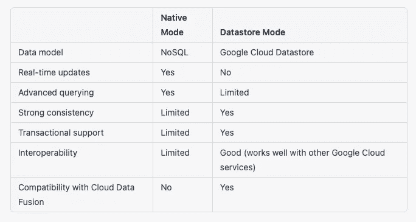

# 优化 Firestore 数据库的 10 个技巧

> 原文：<https://levelup.gitconnected.com/part-1-10-tips-for-optimizing-your-firestore-database-f32bd0c90d26>


# 技巧#1 为您的用例选择正确的数据库模式

使用 Firestore 时，为您的用例选择正确的数据库模式非常重要。Firestore 提供两种模式:本地模式和数据存储模式。以下是每种模式的简要概述，以及您可能需要使用它的时间:

## 本地模式

这是 Firestore 更新、更强大的版本，提供实时更新和高级查询功能。它使用 NoSQL 数据模型，非常适合需要处理大量读写操作的应用程序。如果您需要实时更新或者希望能够对数据执行更高级的查询，您应该考虑使用纯模式。

## 数据存储模式

这是 Firestore 的遗留版本，基于 Google Cloud Datastore 产品。它提供了强大的一致性和事务支持，这使它成为某些类型工作负载的良好选择，例如那些需要强大一致性或需要与其他 Google 云服务交互的工作负载。如果你需要强一致性或者想要使用其他 Google 云服务，你可以考虑使用 Datastore 模式。

下表总结了本机模式和数据存储模式之间的主要差异:



如果您不确定使用哪种数据库模式，您可以尝试两种模式，看看哪种模式更适合您的特定用例。通过迁移数据和索引定义以及更新客户端库和安全规则，您可以随时在本机模式和数据存储模式之间切换。

在选择正确的数据库模式时，评估应用程序的特定需求和要求非常重要。考虑您将存储的数据类型、您期望处理的读写操作量以及您的任何其他特定要求。您可能还想测试每种模式的性能和可伸缩性，看看哪种模式更适合您的用例。请记住，每种模式都有自己的权衡，由您来决定哪种模式最适合您的应用。

# 技巧#2 设计一个高效且可伸缩的数据结构

设计高效且可扩展的数据结构对于优化 Firestore 数据库至关重要。设计良好的数据结构可以提高性能，减少需要存储和检索的数据量，并使数据处理更加容易。以下是设计高效且可伸缩的数据结构的一些技巧:

*   尽可能使用嵌套数据结构:Firestore 支持嵌套数据结构，这使得组织和检索相关数据更加容易。例如，如果您有一个用户集合，并且每个用户都有一个喜爱的产品列表，您可以将喜爱的产品作为一个数组存储在用户文档中，如下所示:

```
{
  "name": "John Smith",
  "favorites": [
    { "product_id": "p1", "name": "Product 1" },
    { "product_id": "p2", "name": "Product 2" },
    { "product_id": "p3", "name": "Product 3" }
  ]
}
```

*   非规范化数据:在传统的关系数据库中，通常通过将数据分解成更小的相关表并使用连接来检索数据来规范化数据。然而，在像 Firestore 这样的 NoSQL 数据库中，这可能是低效的，因为它需要多次读取操作，并且会增加需要存储的数据量。相反，您可以通过在多个文档和集合中复制数据来反规范化数据。例如，如果您有一个用户集合和一个产品集合，您可以将用户喜爱的产品作为一个数组存储在用户文档中，并将产品详细信息存储在产品集合中，如下所示:

```
// User document
{
  "name": "John Smith",
  "favorites": ["p1", "p2", "p3"]
}

// Product documents
{ "product_id": "p1", "name": "Product 1" }
{ "product_id": "p2", "name": "Product 2" }
{ "product_id": "p3", "name": "Product 3" }
```

*   谨慎使用数组:数组对于存储项目列表很有用，但是在 Firestore 中使用时效率也很低。因为 Firestore 必须读取整个数组来检索单个元素，所以查询包含大量元素的数组会比较慢。此外，存储大型数组会增加文档的大小以及需要存储和检索的数据量。为了优化数据结构，应该尽量少用数组，只在必要的时候使用。
*   使用引用而不是嵌入数据:如果需要在文档中存储大量数据，使用引用比直接嵌入数据更有效。引用是一种特殊类型的字段，它存储数据库中另一个文档的 ID，而不是整个文档本身。当需要访问数据时，可以使用查询单独检索引用的文档。这可以减小文档的大小并提高性能，尤其是对于不常访问或实时不需要的数据。
*   考虑使用子集合:如果有大量相关的文档被一起访问，可以考虑使用子集合来组织它们。子集合是文档中的一个集合，它对于存储与父文档密切相关的数据非常有用。例如，如果您有一个用户集合，并且每个用户都有大量的帖子，您可以使用一个子集合来存储每个用户文档中的帖子，如下所示:

```
{
  "name": "John Smith",
  "posts": [
    { "title": "Post 1", "body": "..." },
    { "title": "Post 2", "body": "..." },
    { "title": "Post 3", "body": "..." }
  ]
}
```

通过遵循这些提示，并花时间设计一个高效且可伸缩的数据结构，您可以显著提高 Firestore 数据库的性能和可伸缩性。

# 技巧#3 使用复合索引来支持高级查询

Firestore 提供了高级查询功能，但是为了有效地使用它们，您需要建立复合索引。复合索引是包括多个字段的索引，而不仅仅是单个字段。它允许您执行复杂的查询，同时基于多个字段对数据进行筛选和排序。

下面是一个基于单个字段筛选数据的简单查询示例:

```
db.collection("users").where("age", ">", 30).get()
```

该查询从“users”集合中检索“age”字段大于 30 的所有文档。

若要执行基于多个字段筛选数据的查询，您需要设置一个复合索引。例如，要按年龄和位置筛选用户，可以使用以下查询:

```
db.collection("users").where("age", ">", 30).where("location", "==", "San Francisco").get()
```

要设置复合索引，您需要指定要包含的字段以及它们的索引顺序。例如，要为“年龄”和“位置”字段设置索引，可以使用以下索引定义:

```
{
  "fields": [
    { "fieldPath": "age", "order": "ASCENDING" },
    { "fieldPath": "location", "order": "ASCENDING" }
  ]
}
```

该索引定义告诉 Firestore 创建一个包括“年龄”和“位置”字段的索引，并对这两个字段的索引条目进行升序排序。

一旦建立了复合索引，就可以使用它来执行基于多个字段对数据进行筛选和排序的高级查询。如果您有一个大型数据集，并且需要执行复杂的查询来检索特定的数据，这可能特别有用。

值得注意的是，复合索引会占用额外的空间，并可能影响性能

# 技巧 4:对数据进行非规范化处理，以减少对连接的需求

在传统的关系数据库中，通常通过将数据分解成更小的相关表并使用连接来检索数据来规范化数据。然而，在像 Firestore 这样的 NoSQL 数据库中，这可能是低效的，因为它需要多次读取操作，并且会增加您需要存储和检索的数据量。

为了优化 Firestore 中的数据结构，您可以通过在多个文档和集合中复制数据来取消数据的规范化。反规范化可以减少对连接的需求并提高性能，特别是对于频繁访问或需要实时检索的数据。

下面是一个规范化数据结构的示例，它使用两个集合“users”和“posts”来存储用户和帖子数据:

```
// Users collection
{ "user_id": "u1", "name": "John Smith" }
{ "user_id": "u2", "name": "Jane Doe" }

// Posts collection
{ "post_id": "p1", "user_id": "u1", "title": "Post 1", "body": "..." }
{ "post_id": "p2", "user_id": "u1", "title": "Post 2", "body": "..." }
{ "post_id": "p3", "user_id": "u2", "title": "Post 3", "body": "..." }
```

要检索特定用户的帖子，您需要使用一个连接来组合来自“users”和“posts”集合的数据。

要反规范化这个数据结构，您可以将用户的帖子存储为用户文档中的一个数组，如下所示:

```
// Users collection
{ 
  "user_id": "u1", 
  "name": "John Smith",
  "posts": [
    { "post_id": "p1", "title": "Post 1", "body": "..." },
    { "post_id": "p2", "title": "Post 2", "body": "..." }
  ]
}
{ 
  "user_id": "u2", 
  "name": "Jane Doe",
  "posts": [
    { "post_id": "p3", "title": "Post 3", "body": "..." }
  ]
}
```

这种非规范化的数据结构允许您通过简单地读取用户文档中的“posts”数组来检索用户的帖子，而不是执行连接。这可以提高性能并减少需要存储和检索的数据量。

请记住，反规范化是有代价的，并不适合所有的数据结构。在决定是否对数据进行反规范化之前，您应该仔细考虑您的特定需求和要求。

# 技巧#5 使用批处理操作来提高性能

Firestore 允许您执行批处理操作，以提高性能并减少需要执行的读写操作的数量。批处理操作是作为一个单元一起执行的一组写或更新操作。通过使用批处理操作，您可以一次执行多个操作，这可以减少完成这些操作所需的时间和资源。

以下是如何使用批处理操作一次更新多个文档的示例:

```
let batch = db.batch();
let doc1 = db.collection("users").doc("u1");
let doc2 = db.collection("users").doc("u2");
batch.update(doc1, { name: "John Smith" });
batch.update(doc2, { name: "Jane Doe" });
batch.commit().then(() => {
  console.log("Batch update complete");
});
```

这段代码创建了一个批处理对象，并向其中添加了两个更新操作，每个用户文档一个。然后，它使用`commit()`方法执行批处理操作，同时更新两个文档。

您还可以使用批处理操作来执行多个写入或删除操作。例如，您可以使用批处理操作一次删除多个文档，或者在一次操作中写入大量文档。

批处理操作可以显著提高 Firestore 数据库的性能，尤其是对于需要大量读写操作的工作负载。但是，需要注意的是，批处理操作有一定的限制，例如每批的最大规模为 500 个操作，最大速率为每秒一批。要优化批处理操作的使用，您应该考虑应用程序的特定需求和要求，并测试不同批处理大小和频率的性能，以找到最佳平衡。

还值得注意的是，批处理操作是原子性的，这意味着它们要么全部完成，要么根本没有完成。如果在批处理操作过程中出现错误，将不会应用任何操作，这对于保持数据的一致性非常有用。

总之，批处理操作是优化 Firestore 数据库性能的强大工具。通过将多个读写操作组合在一起，可以减少需要执行的操作数量，并提高应用程序的整体性能。

[](https://medium.com/@nicchong/part-2-10-tips-for-optimizing-your-firestore-database-67c0394b1117) [## 第 2 部分:优化 Firestore 数据库的 10 个技巧

### 在这篇博文中，我们介绍了一些优化 Firestore 数据库和提高性能的技巧

medium.com](https://medium.com/@nicchong/part-2-10-tips-for-optimizing-your-firestore-database-67c0394b1117) 

**不要错过我即将推出的内容和案例指南:**

[【https://medium.com/@nicchong/subscribe】T4](https://medium.com/@nicchong/subscribe)

如果你有什么问题，我在这里帮忙，在评论区等你:)