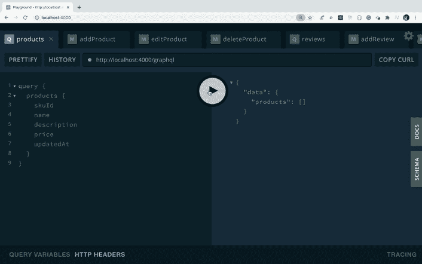
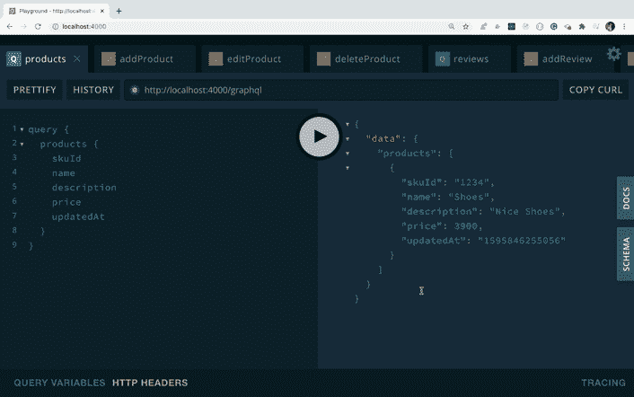

# 使用 GraphQL 作为后端 API 构建一个全栈应用程序(第 2 部分)

> 原文：<https://levelup.gitconnected.com/part-2-build-a-full-stack-app-using-graphql-as-backend-api-a1231753cdd4>

使用 MongoDB + GraphQL + React + Node.js 栈构建 App。


[卡洛斯·穆扎](https://unsplash.com/@kmuza?utm_source=medium&utm_medium=referral)在 [Unsplash](https://unsplash.com?utm_source=medium&utm_medium=referral) 上的照片

这是使用 GraphQL API 构建全栈应用程序系列的第二部分。如果你还没有看过第一部分，请点击查看。

在上一篇文章中，我们从头开始探索了 GraphQL 的基础。在本文中，我们将为我们的全栈应用程序创建 GraphQL APIs。

## 我们开始吧

在这里从[克隆前一篇文章的存储库代码](https://github.com/myogeshchavan97/graphql-fullstack-app/tree/graphql_initial_code)

切换到代码分支

```
git checkout graphql_initial_code
```

通过执行以下命令，创建并切换到新的 git 分支

```
git checkout -b part2_full_stack_app
```

安装所需的依赖项

```
yarn add mongoose@5.9.25 lodash@4.17.19
```

从`server/src`文件夹中打开`schema.graphql`,在这里用[中的内容替换其内容](https://github.com/myogeshchavan97/graphql-fullstack-app/blob/part2_full_stack_app/server/src/schema.graphql)

在这个文件中，我们添加了两个查询，一个用于获取所有产品，另一个用于获取特定产品的评论。

对于突变，我们增加了`add`、`edit`和`delete`产品，对于评论`add`和`delete`评论查询。

如果你注意到突变，我们有这样的突变

```
addProduct(skuId: ID!, data: ProductInput): Product!
```

我们将`ProductInput`输入类型声明为

```
input ProductInput {
  name: String!
  description: String!
  price: Float!
}
```

因此，我们没有使用`addProduct(skuId: ID!, name: String!, description: String!, price: Float!): Product!`，而是将额外的参数转移到单独的输入类型`ProductInput`，这是一种非常常见的做法，可以使查询保持简单和易于管理。

因此，当访问突变中的参数而不是`args.name`或`args.description`时，我们需要使用`args.data.name`或`args.data.description`，因为我们已经在参数列表(`data: ProductInput`)中将参数命名为`data`。

这是这里唯一的新变化。如果您已经阅读了本系列的第一部分，那么所有其他模式代码看起来都很熟悉。

现在，在`server`文件夹中新建一个`db`文件夹，并在其中添加`connection.js`文件，内容如下

```
const mongoose = require('mongoose');mongoose.connect('mongodb://127.0.0.1:27017/ecom_products', {
  useNewUrlParser: true,
  useUnifiedTopology: true,
  useCreateIndex: true,
  useFindAndModify: false
});
```

这里，我们添加了 MongoDB 连接细节，以连接到本地 MongoDB 数据库。如果您还没有安装 MongoDB 数据库，请查看本文在本地安装 MongoDB 数据库。

在`server`文件夹中新建一个`model`文件夹，并在其中添加`Product.js`和`Review.js`文件。

在`Product.js`内添加以下内容

```
const mongoose = require('mongoose');const ProductSchema = mongoose.Schema(
  {
    skuId: {
      type: String,
      required: true,
      unique: true
    },
    name: {
      type: String,
      required: true
    },
    description: {
      type: String,
      required: true
    },
    price: {
      type: Number,
      required: true
    }
  },
  {
    timestamps: true
  }
);const Product = mongoose.model('Product', ProductSchema);module.exports = Product;
```

在这个文件中，我们用`Product`集合的`skuId`、`name`、`description`、`price`字段定义了 MongoDB 数据库模式。`skuId`是电子商务应用中使用的唯一产品 Id。

我们还向模型添加了`timestamps: true`属性，这样每个文档都会自动添加`createdAt`和`updatedAt`时间戳。

在`Review.js`文件中，添加以下内容

```
const mongoose = require('mongoose');const ReviewSchema = mongoose.Schema(
  {
    title: {
      type: String,
      required: true
    },
    comment: {
      type: String,
      required: true
    },
    product: {
      type: mongoose.Schema.Types.ObjectId,
      required: true,
      ref: 'Product'
    }
  },
  {
    timestamps: true
  }
);const Review = mongoose.model('Review', ReviewSchema);module.exports = Review;
```

在这个文件中，我们为`Review`集合添加了`title`、`comment`和`product`字段。`product`是一个外键字段，引用了`Product`模型中的`_id`字段。

打开`src/index.js`并用以下内容替换

```
const { GraphQLServer } = require('graphql-yoga');
const Query = require('./resolvers/Query');
const Mutation = require('./resolvers/Mutation');
require('../db/connection');const server = new GraphQLServer({
  typeDefs: './src/schema.graphql',
  resolvers: {
    Query,
    Mutation
  }
});const options = {
  port: 4000,
  endpoint: '/graphql'
};server.start(options, ({ port }) =>
  console.log(`server started on port ${port}.`)
);
```

将`utils`文件夹中的`users.js`文件重命名为`functions.js` ，并替换为以下内容

```
const getMessage = (message) => {
  return message.substring(message.indexOf(':') + 1);
};module.exports = { getMessage };
```

现在，从`resolvers`文件夹中打开`Query.js`文件，替换为以下内容

```
const _ = require('lodash');
const Product = require('../../model/Product');
const Review = require('../../model/Review');
const { getMessage } = require('../utils/functions');const Query = {
  async products() {
    try {
      let products = await Product.find({});
      products = _.orderBy(products, ['updatedAt'], ['desc']);
      return products;
    } catch (error) {
      throw new Error('Error while getting list of products. Try again later.');
    }
  },
  async reviews(parent, args, ctx, info) {
    try {
      const { skuId } = args;
      const product = await Product.findOne({ skuId });
      if (!product) {
        throw new Error(`Message:Product with skuId ${skuId} does not exist.`);
      }
      let reviews = await Review.find({ product: product._id });
      reviews = _.orderBy(reviews, ['updatedAt'], ['desc']); return reviews;
    } catch (error) {
      const message = error.message;
      if (message.startsWith('Message')) {
        throw new Error(getMessage(message));
      } else {
        throw new Error('Error while getting reviews. Try again later.');
      }
    }
  }
};module.exports = Query;
```

在这个文件中，我们添加了一个解析器`products`函数，使用`Product`模型上的`find`方法获取 MongoDB 数据库中添加的所有产品，然后我们使用 lodash 的`orderBy`方法获取按更新日期降序排序的产品。

```
products = _.orderBy(products, ['updatedAt'], ['desc']);
```

然后，我们添加了一个`reviews`解析器函数，在这里我们采用`skuId`，并获取与该`skuId(product)`相关的所有评论。

在函数内部，首先我们检查是否有一个提供了`skuId`的产品

```
const product = await Product.findOne({ skuId });
```

如果没有这样的产品，我们抛出一个错误。如果产品存在，我们会接受该产品的所有评论

```
let reviews = await Review.find({ product: product._id });
```

现在，打开`resolvers`文件夹中的`Mutation.js`文件，在这里用[中的内容替换](https://github.com/myogeshchavan97/graphql-fullstack-app/blob/part2_full_stack_app/server/src/resolvers/Mutation.js)

在这个文件中，在`addProduct`解析器函数中，我们首先检查数据库中是否已经有一个具有相同`skuId`的产品。如果不存在这样的产品，那么我们使用`product.save`方法将该产品添加到数据库中。

在`editProduct`函数中，我们首先检查要编辑的产品是否存在。如果它存在，那么我们将在`fields`对象中添加要更新的字段，并调用`findOneAndUpdate`方法来更新该产品。

注意，我们将`{ new: true }`作为最后一个参数传递给`findOneAndUpdate`函数，以获取更新后的产品，这样我们就可以将其返回给客户端。

如果我们没有通过`{ new: true }`参数，那么我们将获得更新之前的旧产品细节。

在`deleteProduct`函数中，我们通过`skuId`删除产品。如果产品被删除，保留它的评论就没有意义了，所以我们也用`deleteMany`的方法删除了它所有的评论。

在`addReview`函数中，我们首先获取所提供的`skuId`的产品，然后将评论和产品 id `(_id)`一起添加到`Review`集合中，产品 id 是`Review`模型中的外键。

在`deleteReview`函数中，我们通过它的`id`删除评论。如果删除成功，那么我们将返回`true`。

就是这个原因，我们在`schema.graphql`文件中添加了`Boolean`作为`deleteReview`突变的返回类型。

```
deleteReview(reviewId: ID!): Boolean!
```

从`resolvers`文件夹中删除`Subscription.js`文件，因为我们不会在此应用中使用`Subscription`。

现在，我们可以测试所有的查询和变异。

从`server`文件夹运行`yarn start`命令启动服务器，并导航到 [http://localhost:4000/](http://localhost:4000/)

另外，确保您已经通过执行`./mongod --dbpath=<path_to_mongodb-data_folder>`命令启动了 MongoDB 服务器，如本文中的[所述。](/how-to-install-mongodb-database-on-local-environment-19a8a76f1b92)

**获取所有产品的 GraphQL 查询:**

```
query {
  products {
    skuId
    name
    description
    price
    updatedAt
  }
}
```

最初，我们没有任何产品，所以我们得到一个空数组。


产品查询结果

**GraphQL 突变增加一个新产品:**

```
mutation {
  addProduct(
    skuId: "1234",
    data: {
      name: "Shoes", description: "Nice Shoes",
      price: 3900
    }) {
    skuId
    name
    description
    price
    updatedAt
  }
}
```



添加产品突变

**GraphQL 突变编辑产品:**

```
mutation {
  editProduct(skuId: "1234", data: {
    name: "Shoes",
    description: "Best quality shoes"
    price: 31000
  }) {
    skuId
    name
    description
    price
    updatedAt
  }
}
```



编辑产品突变

**GraphQL 突变删除一个产品:**

```
mutation {
  deleteProduct(skuId: "1234") {
    skuId
    name
    description
    price
    updatedAt
  }
}
```


删除产品突变

如您所见，一旦产品被删除，再次尝试删除它会向我们显示一个错误`Product with skuId 1234 does not exist.`，因此我们的验证也工作正常。

**GraphQL 突变为添加一个综述:**

```
mutation {
  addReview(skuId: "1234", data:{
    title: "First Review",
    comment: "Description for first review"
  }) {
    _id
    title
    comment
    updatedAt
  }
}
```


添加审阅突变

**GraphQL 突变删除综述:**

在下面的变异中，使用来自上述`addReview`查询的`_id`字段值作为`reviewId`字段值。

```
mutation {
  deleteReview(
    reviewId: "5f1eb33ca6ef0c0ba026370e"
  )
}
```


删除审阅突变

本文到此为止。在下一篇文章中，我们将构建一个使用这些 GraphQL APIs 的 React 应用程序。

您可以在[这个分支](https://github.com/myogeshchavan97/graphql-fullstack-app/tree/part2_full_stack_app)中找到本文的完整源代码

看看这个系列的下一部分[这里](/build-a-full-stack-app-using-graphql-as-backend-api-part-3-4af6489112e0?source=friends_link&sk=ec961bae4e5dafde4890322fce744be9)

[](/build-a-full-stack-app-using-graphql-as-backend-api-part-3-4af6489112e0) [## 使用 GraphQL 作为后端 API 构建一个全栈应用程序(第 3 部分)

### 使用 MongoDB + GraphQL + React + Node.js 栈构建 App。

levelup.gitconnected.com](/build-a-full-stack-app-using-graphql-as-backend-api-part-3-4af6489112e0) 

今天到此为止。我希望你学到了新东西。

**别忘了直接在你的收件箱** [**订阅我的每周简讯，里面有惊人的技巧、窍门和文章。**](https://yogeshchavan.dev/)