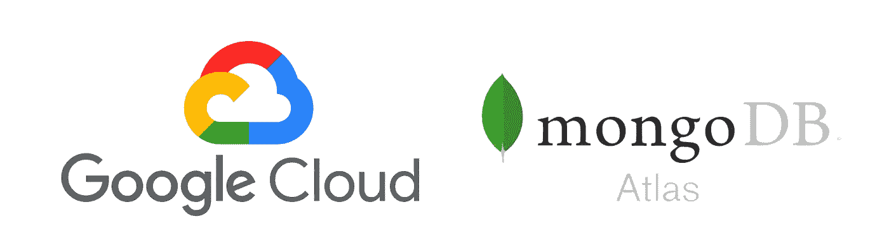
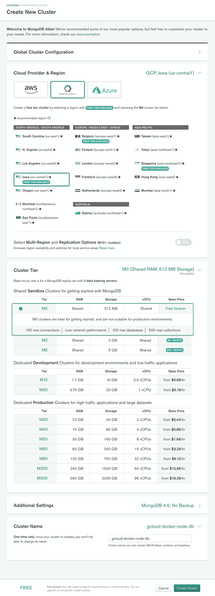

# 在 Atlas 上部署和保护 MongoDB

> 原文：<https://levelup.gitconnected.com/part-2-deploy-and-secure-mongodb-on-atlas-4820d539a1dc>



## 目录

*   [简介](https://medium.com/p/4820d539a1dc#1b03)
*   [在 Mongo Atlas 上部署 MongoDB](https://medium.com/p/4820d539a1dc#8d55)
*   [用 MongoDB 配置 node . js app](https://medium.com/p/4820d539a1dc#bbc9)
*   [测试 MongoDB 连接](https://medium.com/p/4820d539a1dc#a88f)
*   [配置 NAT 网关](https://medium.com/p/4820d539a1dc#42ba)
*   [安全 MongoDB 集群](https://medium.com/p/4820d539a1dc#2408)
*   [检查一切正常](https://medium.com/p/4820d539a1dc#ee7e)

# 介绍

这篇文章是我上一篇文章[在 Google Cloud 上 Dockerizing 和 auto scaling Node.js](https://medium.com/@francescovirga_50717/dockerizing-and-autoscaling-node-js-on-google-cloud-ef8db3b99486)的延续，这篇文章概述了如何在 Google Cloud 上部署和扩展 node . js。第一篇文章中的各种组件和配置会在这里被引用，所以我建议你如果还没有的话，可以去看看。

对于本教程，我们将从通过 Mongo Atlas 部署一个 MongoDB 实例开始。然后，我们将 Node.js 应用程序连接到数据库，最后配置一个 NAT(网络地址转换)网关，通过同一个 IP 地址路由所有的输出流量。这将允许我们将该 IP 列入 MongoDB 部署的白名单，确保只有我们自己的虚拟机可以访问数据库。NAT 网关是必需的，因为我们的托管实例组会在虚拟机自动添加或删除时为其重新分配新的 IP 地址(因为我们的托管实例组配置为自动扩展)。

我把我自己的代码上传到 GitHub [这里](https://github.com/francescov1/gcloud-docker-node-tutorial)以防你在这个过程中遇到任何问题，所以确保把它放在手边以防万一！

# 在 Mongo Atlas 上部署 MongoDB

Mongo Atlas 在部署和管理 MongoDB 部署方面绝对令人惊叹。它允许我们在各种云提供商(Google Cloud、AWS 和 Azure)上部署我们的数据库，选择要部署的区域和正在使用的虚拟机的确切规格。最好的部分是，一旦我们部署，我们可以很容易地改变任何这些配置和 Mongo Atlas 将自动迁移我们所有的数据到一个新的虚拟机与新的设置。它还允许我们将 MongoDB 放在与托管实例组 VM 相同的地理位置，确保服务器之间的通信经历尽可能低的延迟。



前往[https://www.mongodb.com/cloud/atlas](https://www.mongodb.com/cloud/atlas)，点击*免费试用。*注册后，您应该会立即进入一个页面，在这里您可以配置和部署您的第一个 MongoDB 集群。集群就是一组共享相同数据的 MongoDB 实例。

对于云提供商，选择 *Google Cloud* ，以及 *lowa(美国中部-1)* 作为地区。**通常，我们会希望确保我们的 MongoDB 部署与我们在 Google Cloud 中的托管实例组位于同一区域(在我们的示例中，这是 *South Carolina (us-east1)* )，但出于本教程的目的，我们将坚持使用 us-central1，以允许我们使用自由层。**将*集群层*设置为 *M0* ，因为这将确保我们不会产生任何费用，并将*附加设置*保持不变。最后，为您的集群名称输入 **gcloud-docker-node-db** ，以保持与我们在[上一篇文章](https://medium.com/@francescovirga_50717/dockerizing-and-autoscaling-node-js-on-google-cloud-ef8db3b99486)中的命名约定一致。点击*创建集群*。

*注意:在为生产部署数据库时，确保将您的层至少升级到***M10。**

*当集群初始化时，在你的 Mongo Atlas 控制台中进入*安全*选项卡，在 *MongoDB 用户*下点击*添加新用户*。输入**默认**作为用户名，点击*自动生成安全密码*填写密码栏，点击*显示*并确保复制生成的密码(如果丢失不用担心，您可以简单地生成一个新的)。将*用户权限*设置为 ***读写任意数据库*** ，点击*添加用户。**

*接下来点击 *IP 白名单*并点击*添加 IP 地址*。点击*允许从任何地方访问*并点击*确认*。这打开了我们的 MongoDB，可以从任何 IP 地址访问它(仍然需要 MongoDB 用户名和密码来连接，所以我们还没有完全向所有人开放我们的数据库)。不要担心，一旦我们配置了 NAT 网关，我们会阻止它只对我们的谷歌虚拟机开放。*

*现在回到*概述*选项卡，一旦集群完成初始化，点击*连接*，然后点击*连接您的应用*。选择*短 SRV 连接串*并记下如下所示的连接串。*

# *用 MongoDB 配置 Node.js 应用程序*

*在上一个教程中，我们简单地使用了一个[样板文件生成器脚本](https://github.com/francescov1/node-boilerplate-script)来生成我们的 Node.js/Express 应用程序。现在，我们将配置到 MongoDB 集群的连接，并添加一些基本路由，这将允许我们测试一切是否正常工作。*

*我们要做的第一件事是将 MongoDB 连接字符串保存在我们的*中。env* 文件。添加以下一行:*

```
*MONGODB_URI=<connection-string>*
```

*在连接字符串中，将单词 *test* 替换为 *default* ，它定义了数据库名称，位于`?retryWrites=true`之前。确保用您之前保存的数据库用户密码替换`<PASSWORD>`。*

*我们还必须更改我们的 *config/index.js* 文件来导出连接字符串。你的 *config/index.js* 文件应该是这样的:*

```
*'use strict';
require('dotenv').config();module.exports = {
  port: process.env.PORT || 3000,
  node_env: process.env.NODE_ENV || 'development',
  mongodb_uri: process.env.MONGODB_URI
};*
```

*接下来用`touch config/mongoose.js`创建一个 mongoose 配置文件，我们将在其中连接和配置我们的数据库。添加以下代码:*

```
*'use strict';
const config = require('./');module.exports = function() { const mongoose = require('mongoose');
  mongoose.Promise = require('bluebird'); // set up database
  mongoose.connect(config.mongodb_uri, { useNewUrlParser: true }); mongoose.connection.on('connected', () => console.log('mongodb connected')); mongoose.connection.on('open', () => console.log('mongodb connection opened')); mongoose.connection.on('error', err => console.log('mongodb error: ' + err)); mongoose.connection.on('disconnected', () => console.log('mongodb disconnected')); process.on('SIGINT', () => mongoose.connection.close(() => process.exit(0)));};*
```

*这将使用连接字符串连接到我们的 MongoDB 集群，并设置一些日志让我们知道数据库连接的状态。*

*接下来我们将为`routes/examples.js`添加两个 routes 函数，一个用于添加新用户，另一个用于获取用户。打开文件，将代码替换为以下内容:*

```
*'use strict';
const User = require('../models/user');
const express = require('express');
const router = express.Router();router.post('/', (req, res, next) => {
  const { email, name } = req.body;
  const user = new User({ name, email });
  return user.save()
    .then(user => res.status(201).send(user))
    .catch(err => next(err));
});router.get('/:id', (req, res, next) => {
  return User.findById(req.params.id)
    .then(user => res.status(200).send(user))
    .catch(err => next(err));
});module.exports = router;*
```

*我们需要做的最后一件事是调用在`config/mongoose.js`中导出的函数来连接数据库。您的`index.js`文件应该如下所示:*

```
*'use strict';
Promise = require('bluebird');
const config = require('./config');
const express = require('express');
const helmet = require('helmet');
const bodyParser = require('body-parser');
const logger = require("morgan");const routes = require('./routes');
const errors = require('./errors/middleware');require('./config/mongoose')();const app = express();// basic middleware
app.use(helmet());
app.use(logger(config.node_env === "production" ? "combined" : "dev"));
app.use(bodyParser.json());// api routes
app.use('/api', routes)// error middleware
app.use(errors)app.all("*", (req, res) => res.status(200).send("My Node.js API"));app.listen(config.port, () => {
  console.log(`Server listening on port ${config.port}...`)
});*
```

*注意`require('./config/mongoose')();`线。现在，您应该能够在您的控制台中运行`npm start`，并看到以下内容:*

```
*server listening on port 3000...
mongodb connected
mongodb connection opened*
```

*恭喜你。我们现在已经部署了一个 MongoDB 集群，并成功地在本地连接到它。*

*现在还记得我们在上一个教程中写的那个`deploy.sh`文件吗？保存上面的更改后，只需在控制台中运行`./deploy.sh`即可部署新的 Docker 映像并重启虚拟机。*

# *测试 MongoDB 连接*

*现在让我们尝试一下我们创建的新路由，以确保它们能够与我们的 MongoDB 集群正常通信。请记住，重新启动我们的托管实例组可能需要几分钟时间，因此在继续之前，让我们确保我们的虚拟机已经重新启动。运行:*

```
*gcloud beta compute instance-groups managed list-instances gcloud-docker-node-group --zone us-east1-b*
```

*您对此命令感兴趣的输出是*状态*和*动作*。初始*状态* = *运行*和*动作* = *重启*。继续每隔一分钟左右运行一次命令 *ACTION* = *NONE* 我们知道至少有一个虚拟机已经完全重启，并且正在运行新的 Docker 映像。*

*一旦完成，在[https://console.cloud.google.com/networking/addresses/list](https://console.cloud.google.com/networking/addresses/list)(我们在[第 1 部分](https://medium.com/@francescovirga_50717/dockerizing-and-autoscaling-node-js-on-google-cloud-ef8db3b99486)中分配的)获取您的负载平衡器的外部 IP，我们将发出创建新用户的 POST 请求。在命令行中输入以下命令:*

```
*curl --header "Content-Type: application/json" \
     --data '{"name":"Joe Smith","email":"[joe@smith.com](mailto:joe@smith.com)"}' \
     [<ip-address>/api/examples](http://localhost:3000/api/examples)*
```

*应该返回一个包含用户数据库条目的 JSON 对象。我们可以从返回的对象中获取 *_id* 属性，并使用*获取用户*路径来查找我们刚刚创建的用户:*

```
*curl [<ip-address>/api/examples](http://localhost:3000/api/examples)/<_id>*
```

*这将再次返回新用户。*

# *配置 NAT 网关*

*现在一切都按预期运行了，让我们配置一个出站 IP 地址，允许我们将所有 MongoDB 通信限制到一个 IP 地址。*

*简单来说，Google 的网络地址转换服务 Cloud NAT 允许我们为我们的虚拟机提供一个网关来访问互联网，即使它们没有自己的外部 IP 地址。当我们希望在关闭传入流量的同时仍然允许传出流量时，通常会使用这种方法。在我们的例子中，所有传入流量都是从我们的负载平衡器接收的，然后使用它们的内部 IP 地址重定向到我们的虚拟机，因此，我们可以将所有流量路由到同一个 NAT 网关，而不是为每个虚拟机的出站请求提供自己的外部 IP 地址。*

*前往[https://console.cloud.google.com/net-services/nat](https://console.cloud.google.com/net-services/nat/)，点击*开始*。将其命名为 **gcloud-docker-node-nat** ，选择 **us-east1** 作为区域，点击*云路由器*下拉菜单，点击*创建新路由器*。将其命名为**g cloud-docker-node-router**并点击 *Create* 。点击 *Nat IP 地址*下拉菜单，选择**手动** *。*这将允许我们手动选择所使用的出站 IP 地址。点击 *IP 地址*下拉菜单，选择**创建 IP 地址**，输入 **nat-ip** 作为名称，点击 *Reserve* 。最后，点击*创建*。记下刚刚分配给 NAT 网关的新 IP 地址。*

*我们现在必须从托管实例组中删除外部 IP，以强制流量通过 NAT 网关。为此，我们需要更改实例模板，以指定我们不希望将外部 IP 自动分配给我们的托管实例组虚拟机。不幸的是，谷歌云不允许我们编辑实例模板，所以我们需要创建一个新的。前往[https://console.cloud.google.com/compute/instanceTemplates](https://console.cloud.google.com/compute/instanceTemplates)并点击*创建实例模板*。我们将创建一个与上一篇文章几乎相同的模板，所以返回[这里](https://medium.com/@francescovirga_50717/dockerizing-and-autoscaling-node-js-on-google-cloud-ef8db3b99486/#6387)并复制实例模板。唯一需要的更改是更改名称和删除外部 IP。名称输入**g cloud-docker-node-template-2**(创意对吧？)并在*外部 IP* 下拉菜单下选择**无**。点击*创建*。*

*通过单击侧栏中的*实例组*导航到您的托管实例组，选择实例组并单击页面顶部的编辑图标。打开*实例模板*下拉菜单，选择我们的新模板并点击*保存*。*

# *安全 MongoDB 集群*

*导航回 Mongo Atlas 并点击*安全*选项卡。点击 *IP 白名单*，点击*编辑*。用您之前保存的 nat-ip 地址替换 0.0.0.0/0，并点击*确认*。*

# *检查一切是否正常*

*现在一切都设置好了，让我们做一些检查，以确保一切正常工作。我们将从重启托管实例组开始，用新的实例模板加载我们的虚拟机。在命令行中输入我们的 *deploy.sh* 脚本的第二行:*

```
*gcloud beta compute instance-groups managed rolling-action restart gcloud-docker-node-group --zone us-east1-b --project <project-id>*
```

*既然我们已经删除了虚拟机的外部 IP，如果我们需要诊断任何错误，我们就无法通过 SSH 连接到虚拟机。为了解决这个问题，我们可以创建一个所谓的堡垒主机，它实际上是一个虚拟虚拟机，我们使用内部连接来连接到其他虚拟机。点击[了解更多信息。](https://cloud.google.com/solutions/connecting-securely#bastion)*

*我们所要做的就是创建一个简单的 VM，它有一个外部 IP，并且与我们的托管实例组在同一个内部网络中。导航到您的[虚拟机实例](https://console.cloud.google.com/compute/instances)并点击*创建实例*。将其命名为 **bastion** 并选择 **micro** 作为*机器类型*(因为我们不需要强大的机器)。确保该区域设置为与我们的托管实例组相同的区域，然后单击 *Create* 。*

*在继续之前，确保您的托管实例组已经完成了重启(还记得在 *Test MongoDB connection* 小节开头的 list-instances 命令)。*

*现在让我们 SSH 到 *bastion* 虚拟机，然后从那里 SSH 到我们的一个托管实例组虚拟机(您的组可能只运行一个虚拟机，因为它没有足够的流量来扩展)。为了访问我们的托管实例组虚拟机，我们需要通过 Google Cloud 控制台 SSH 到 *bastion* ，而不是通过我们自己的命令行。点击*堡垒*虚拟机的 *SSH* 按钮旁边的下拉菜单，并点击*在浏览器窗口*中打开。进入后，请输入:*

```
*ssh gcloud-docker-node-group-XXXX -A*
```

*确保用虚拟机名称中的随机字符替换 XXXX。*

*现在输入`docker ps`，并使用列出的第一个容器 ID 的前几个字符，输入`docker logs <container-id>`。您应该会看到以下输出:*

```
*server listening on port 3000...
mongodb connected
mongodb connection opened*
```

*这告诉我们，我们的虚拟机能够通过我们配置的 NAT 网关与我们的 MongoDB 集群通信。作为最后一个测试，让我们尝试之前从我们自己的命令行发出的 GET 请求。输入:*

```
*curl [<ip-address>/api/examples](http://localhost:3000/api/examples)/<_id>*
```

*其中<_id>是我们之前创建的用户条目的 ID。您应该看到:*

```
*{"_id":"<_id>","name":"Joe Smith","email":"[joe@smth.com](mailto:joe@smth.com)","__v":0}*
```

*我们完事了。🎉希望你喜欢这个教程，任何反馈都是非常感谢的！如果你在代码上遇到任何问题，不要忘记查看一下 GitHub ,或者在下面提问。*