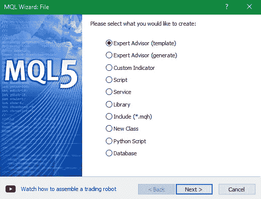
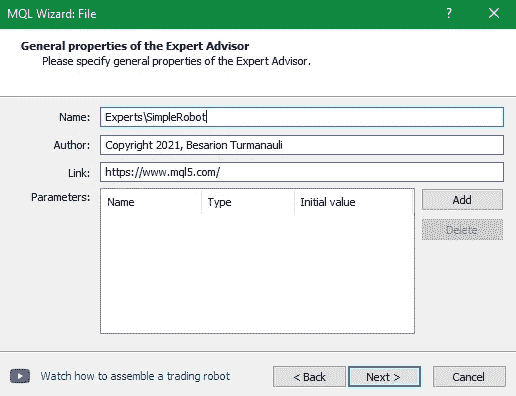
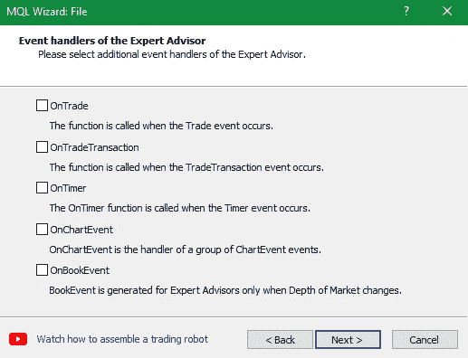
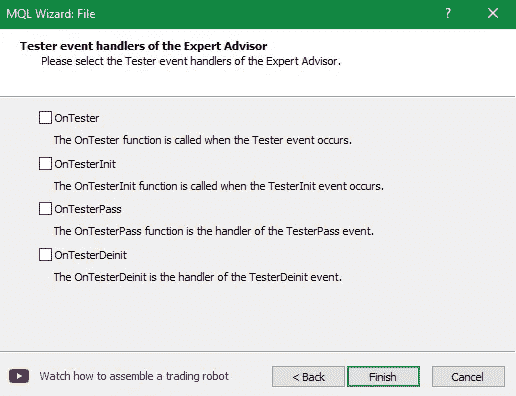
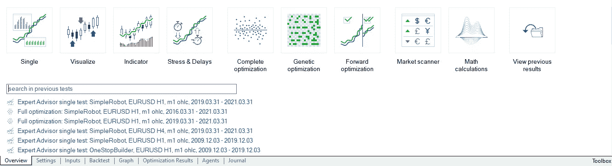
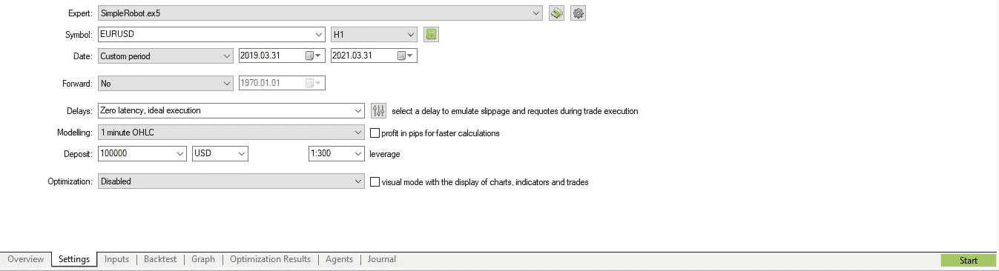
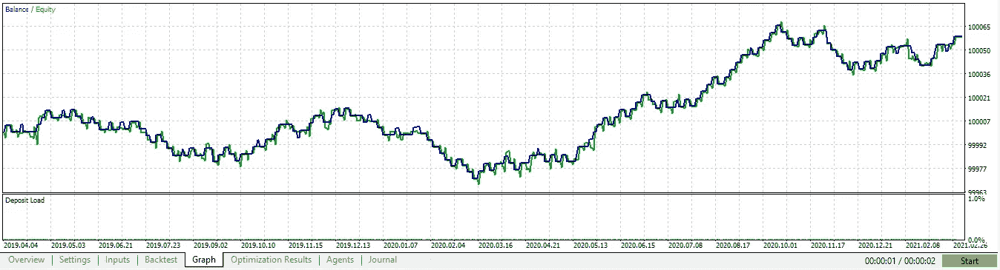

# 用 C#构建生成量化交易策略的人工智能(第 1 部分)

> 原文：<https://levelup.gitconnected.com/part-one-building-ai-for-generating-quant-trading-strategies-in-c-8cc2afb88955>

让我先问一个问题:你听说过 **Citadel LLC** 、**文艺复兴科技**、**两个适马**或者 **D. E. Shaw & Co.** 吗？如果你没有，我可以描述他们所做的最简单的方式是，这些公司创建自动化交易策略，又称数量策略，又称量化策略，又称算法策略，通过买卖不同的金融证券(货币，股票，指数，商品，债券，期权等)来管理投资者的资金，自动获利，无需人工干预。

在计算机出现之前，交易者通过分析图表，利用技术(历史价格数据)和基本面(宏观经济数据、重要市场事件、新闻等等)分析来预测未来的价格走势，低买高卖，一路获利，对那些知道自己在做什么的人来说，持续为投资者和自己赚钱相对容易。

1998 年美国证券交易委员会(SEC)授权电子交易所为计算机化的高频交易(HFT)敞开大门。交易员与投资者的区别在于，交易员依赖于短期预测，通常在一天内买卖同一种证券，持仓几个小时或几分钟。随着 HFT 越来越普及，交易员发现自己无法打败计算机，在瞬间做出更准确的交易决策，赚钱变得越来越难。

如果你非常清楚自己在做什么，当然也非常清楚自己所处的市场，选择长期(几天或几周)头寸或交易低流动性、高波动性的市场，如细价股、粉红单、奇异货币对或加密货币，手工交易在今天仍然是有利可图的。一个原因是，低流动性意味着更高的价差，更慢的订单执行速度，而计算机在流动性更高的市场上更有优势，在那里它们能够快速买卖，理想情况下，它们需要多少量就有多少量。

# 风险免责声明:

> 就本教程的目的而言，我不是一个合格的持牌投资顾问，也不提供个人投资建议，本文中提供的所有信息仅用于信息和教育目的。
> 
> 在做出任何和所有投资决定之前，进行自己的尽职调查并咨询有执照的财务顾问。任何投资、交易、投机或基于本文中的任何信息做出的决定，无论是明示的还是暗示的，都由您自己承担风险，无论是财务风险还是其他风险。
> 
> 交易(包括人工交易和算法交易)有很大的损失风险，并不适合所有人。金融证券的估值可能会波动，因此，你可能会失去比你原来的投资更多。季节性和地缘政治事件的影响已经被计入市场价格。
> 
> 杠杆交易意味着微小的市场波动将对你的交易账户产生巨大的影响，这可能对你不利，导致巨大的损失，也可能对你有利，导致巨大的收益。
> 
> 如果市场对你不利，你可能会遭受比你存入账户的金额更大的损失。

在你跳过免责声明之前，请理解，我实际上是指其中的每一个词，这是我希望你仔细考虑的事情，此外，人工智能很容易因为一些原因做出错误的决定，这些原因包括数据损坏或数量不足，手头任务的不正确方法或各种错误。

我个人在拿自己的钱冒险时会考虑这些原则，因为我知道我可能会因为各种意外或部分可预见的原因而失去它，不仅我会，而且我已经失去了。结果我学到了一两件事，但是我也为那次教育支付了实际的钱，然而，对你来说这个教程是免费的，让我们保持这种方式！

在我们建造一个可以制造交易机器人的人工智能(这是自动化/算法策略的另一个常用名称)之前，我们应该首先能够自己制造一个交易机器人，对吗？

为此，我们需要一个允许创建和使用自动化交易策略的交易平台或交易终端，一些最受欢迎的选择是:

*   **Metatrader 5** (机器人可以用 MQL5 语言创建，基于 C++)
*   **Metatrader 4** (机器人可以用 MQL4 语言创建，基于 C++)
*   **JForex** (机器人可以用 Java 创建，使用相关的库)
*   **NinjaTrader** ( NinjaScript 编程语言，基于 C#)
*   **互动经纪人'** **交易工作站** ( TWS API + Python、Java、C#、C++或 VB)
*   **trading view**(pine script 编程语言，类似 Python)

如果 C++的复杂性让你有点害怕，并且你已经偶然发现你需要大约 500 行代码来可靠地做一些用 C#、Visual Basic、Python 或 PHP 只用一行代码就能做的事情，不要担心，我是我所知道的最害怕 C++的人之一，我喜欢最大的生产力和简单性，尽管 MQL5 和 MQL4 基于 C++，但它们和 C#一样简单易用(如果不是更多的话)。

多年来，我已经为上述所有平台建立了几十个算法策略和指标，我从未发现过像 **Metatrader 5** 这样强大的交易平台，用于开发、测试和优化自动化交易策略，它给你无与伦比的精度和能力，远远超过你的需求，而且直观易用。

至于经纪人，我推荐 [Roboforex](http://www.roboforex.com/clients/promotions/welcome-program/?a=arag) ，它为客户免费提供 MT5 平台，你可以开设一个演示(纸上交易)账户，如果你符合下面列出的要求，你还可以从真实/真实账户的经纪人那里获得 30 美元作为礼物:

*   [开立账户](http://www.roboforex.com/clients/promotions/welcome-program/?a=arag)并存入 10 美元以验证您的支付方式(可随时提取)并获得 30 美元作为礼物
*   **利润可以无限制提取**
*   如果你交易了必要数量的手，你也可以提取 30 美元。

**可用市场:**股票(所有纽交所、纳斯达克、美国证券交易所股票+德国和中国上市公司)、股票差价合约(所有股票差价合约，*【美国上市股票每笔交易费 1.5 美元)*、指数、ETF、商品、金属、能源商品、加密货币、加密指数、外汇。

一旦你开了一个账户，从 [Roboforex](http://www.roboforex.com/clients/promotions/welcome-program/?a=arag) 网站下载 MetaTrader 5(或 MT5)并安装它。MT5 附带了 meta editor——一个用于开发自动化交易策略的 IDE，打开它，让我们直接从创建一个简单的策略开始:

到达`**File > New**`或`**CTRL+N**` 并选择`**Expert Advisor (template)**`，然后点击`**Next >**`:

对了，在这个平台里，交易机器人被称为**专家顾问**。

现在为你的机器人选择一个名字，然后点击`**Next > :**`

再次点击`Next >`:

点击`Finish.`

将生成一个起始源代码模板，看起来如下所示:

让我们包括用于打开/关闭交易、检索订单和位置信息的主要类:

B asic 概述:`**OnInit**`函数在机器人启动时调用一次，`**OnDeinit**`函数在机器人移除/停止时调用一次，`**OnTick**`函数在每次基础证券价格变化时调用。

现在让我们添加一个简单的交易逻辑:

点击 MetaEditor 中的`F7`或`Compile`按钮，即可编译策略(实际上还远未准备好，但我们可以在 Metatrader 5 中的历史价格数据上测试我们的交易逻辑)。

所以，让我们打开 Metatrader 5，转到`View > Strategy Tester`或`CTRL+R :`

点击`**Single**`并选择如下截图所示的所有内容，然后点击右下角的绿色`**start**` 按钮:

完成后，从`**Settings**`选项卡切换到`**Graph**`选项卡，以可视化利润曲线:

它并不完美，但现在没关系，我们会做得更好！

如果你想深入学习 MQL5 开发，你可以在这里找到优秀的[文档](https://www.mql5.com/en/docs)。然而，学习 MQL5 开发并不是本教程所必需的，因为我们只是在展示构建、改进、优化和验证交易策略的最佳实践，以便在人工智能算法中复制相同的步骤，使其能够独立完成所有事情。

在本教程的下一部分，我们将完善我们的策略，优化和前瞻性测试它，以确保它在不同的市场环境中是一致和可靠的。

如果你喜欢这篇文章，请点击那个按钮，这样更多的人将能够找到它！

你想知道我是做什么的吗？我是 Proxify Network 的高级软件开发人员。

现在 Proxify 正在寻找新的开发人员，所以我想在这里分享一些我的经历——与我在职业生涯中尝试的其他事情相比:
1️⃣友好和专业的 Proxify 团队以及他们对每个候选人的关注程度
2️⃣招聘过程非常简单，可以充分展示你的技能
3️⃣，最重要的是，Proxify 是寻找远程工作的理想方式，有无数的项目和公司可供选择。

在这里申请加入我在 Proxify:[https://bit.ly/3hd64mN](https://bit.ly/3hd64mN)

**你还想要额外的免费资料吗？**

【https://m.do.co/c/88f25eea9442】点击此链接注册，即可从数字海洋获得 100 美元的云积分

[**币安的所有交易终身享受 10%的折扣:**](https://www.binance.com/en/register?ref=P5O06MBF) 币安是世界上收费最低的加密货币交易所，支持迄今为止最多样的加密交易或投资方式:

*   [现货交易](https://www.binance.com/en/register?ref=P5O06MBF)；
*   [点对点(P2P)交易](https://www.binance.com/en/register?ref=P5O06MBF)；
*   [保证金(最高 10 倍杠杆)交易](https://www.binance.com/en/register?ref=P5O06MBF)；
*   [加密期货交易](https://www.binance.com/en/register?ref=P5O06MBF)；
*   [加密转换](https://www.binance.com/en/register?ref=P5O06MBF)及更多…

当你投资任何加密货币时，你可以通过允许保证金(杠杆)交易的借贷获得额外的无风险被动收入，它带有一个强大的[在线(web)平台](https://www.binance.com/en/register?ref=P5O06MBF)、 [Windows](https://www.binance.com/en/download?ref=P5O06MBF) 、 [Mac](https://www.binance.com/en/download?ref=P5O06MBF) 、 [Linux 软件](https://www.binance.com/en/download?ref=P5O06MBF)，以及面向软件开发者的 [Android](https://www.binance.com/en/download?ref=P5O06MBF) 和 [iOS 应用](https://www.binance.com/en/download?ref=P5O06MBF) + [币安 API](https://www.binance.com/en/download?ref=P5O06MBF) 。

[币安](https://www.binance.com/en/register?ref=P5O06MBF)不仅费用最低，而且是为数不多的支持交易 **Dogecoin** 的平台之一，就交易量和允许交易的加密货币而言，是世界上最大的加密交易所。

**存款选项包括:**

*   将任何上市加密货币直接加密存入您的币安钱包；
*   使用您的信用卡/借记卡购买加密货币；
*   通过银行转账(SWIFT 或 SEN)存入 35 种不同的法定货币。

> ***现在，当您从*** [***此链接***](https://www.binance.com/en/register?ref=P5O06MBF) ***注册时，您可以获得 10%的佣金返现。***

感谢您的参与，我希望能在教程的第二部分见到您:

 [## 用 C#构建生成量化交易策略的人工智能(第 2 部分)

### 这是系列教程的第二篇:构建自动生成 quant 交易策略的人工智能…

levelup.gitconnected.com](/build-ai-for-generating-quant-trading-strategies-in-c-part-2-87cef6fccc3c) 

祝您愉快！