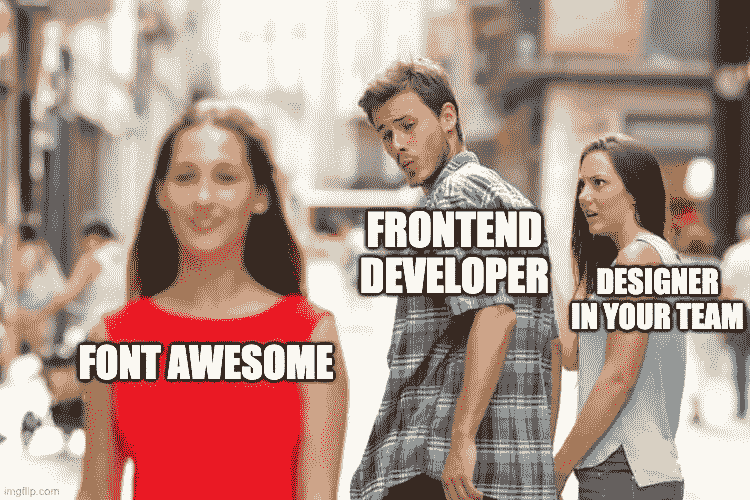
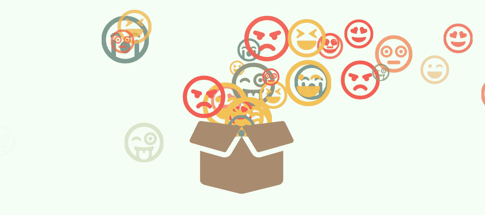
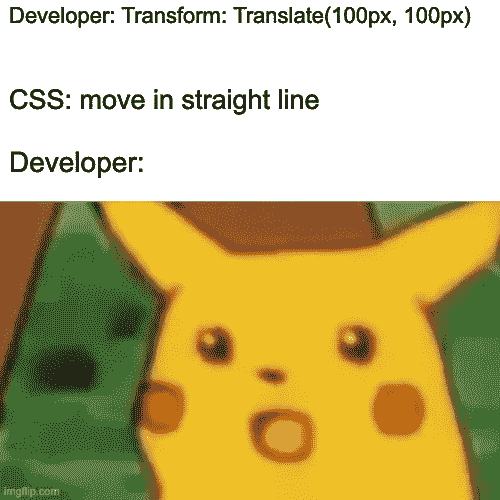
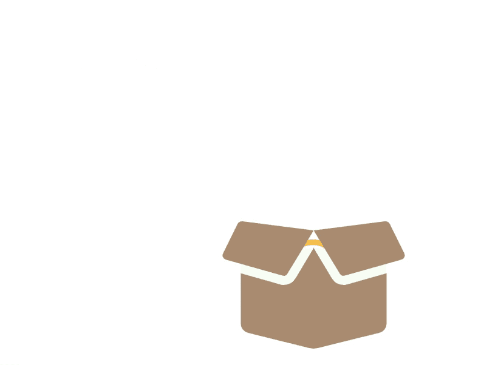
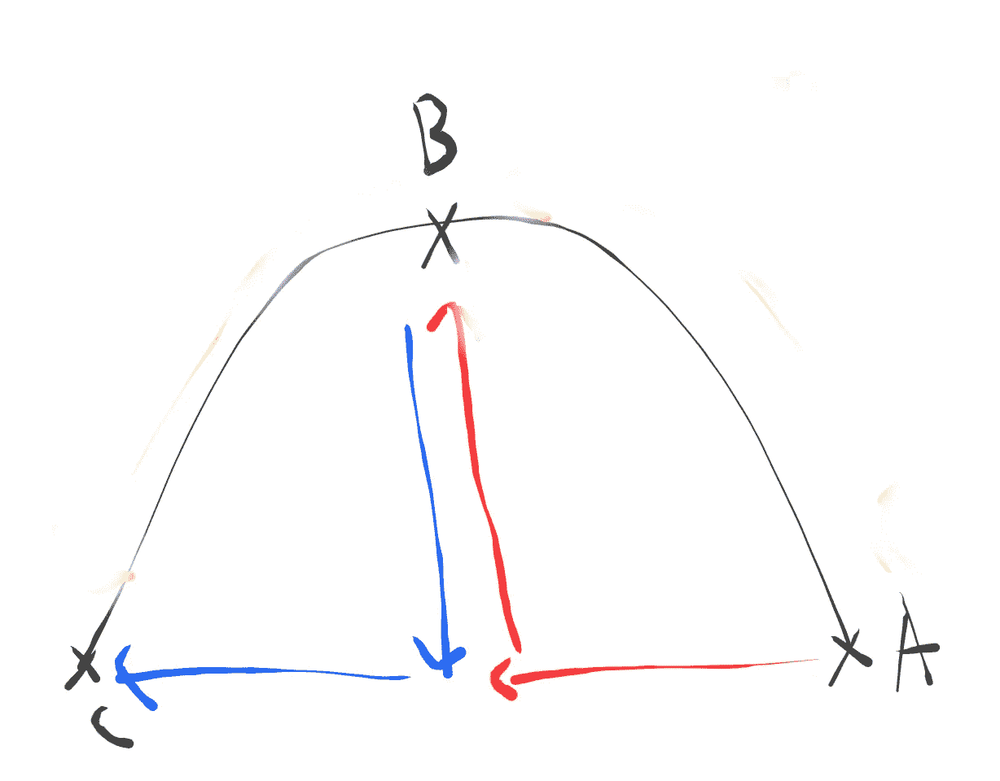
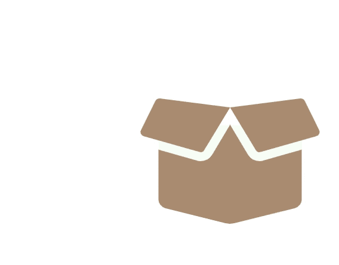
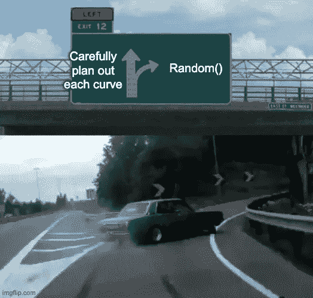
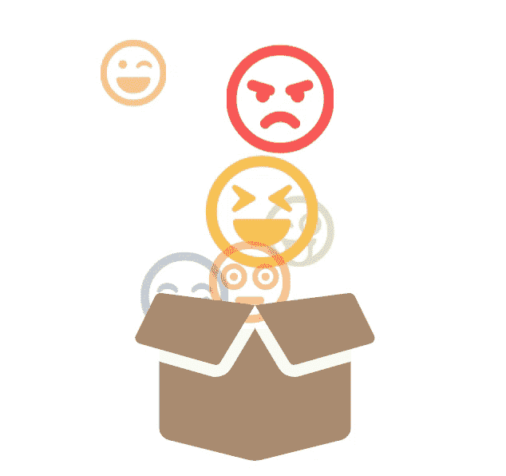
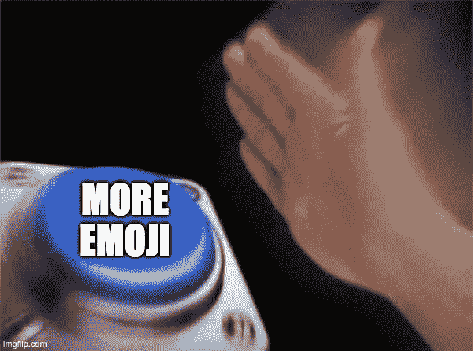

# 仅使用 CSS 的粒子喷泉效果(字体超赞动画系列第 1 部分)

> 原文：<https://levelup.gitconnected.com/particle-fountain-effect-with-css-only-font-awesome-animation-series-part-1-d68c4e9b43bd>

如何创建粒子喷泉效果的分步指南

# 内容

1.  介绍
2.  结果演示
3.  先决条件
4.  逐步指南
5.  下一步

# 介绍

你喜欢花哨的动画，并且总是想知道它们是如何完成的吗？你是否也想为你的 web 项目创造一些好的东西，但是不知道从哪里开始？

在这篇文章中(希望将来会有更多)，我将探索一些有趣的 CSS 动画模式，并提供一个指南来教你如何自己做。

我将使用字体-真棒图标资产。如果你对前端开发感兴趣，我打赌你已经听说过它了。使用字体图标很简单，只需导入样式并在代码中使用它们的图标类。

[](https://fontawesome.com/) [## 字体真棒

### 编辑描述

fontawesome.com](https://fontawesome.com/) 

也就是说，如果你在一个严肃的网络项目中，你可能希望使用专门的图标设计来匹配你的品牌/项目。你的设计师很可能会因为你在任何地方随意放置通用图标而杀了你。



但是说到我们的话题。对于这篇文章，我们将看看如何创建一个经典的粒子喷泉效果。

> 像这样引用通常是进一步的解释，如果你很着急，可以忽略它们

# 结果演示



我称之为“表情喷泉”

Codepen 演示:【https://codepen.io/josephwong2004/pen/yLYXpNw?editors=1100 

# 先决条件

我在这个练习中用了很多 SCSS。所以 CSS 预处理知识是必需的。

# **循序渐进指南**

**第一步:弄清楚如何做曲线动画**

尽管所有飞来飞去的表情符号乱七八糟，但这部动画的核心只是“曲线运动”。每个表情符号以曲线形式从盒子(0，0)移动到它的最终目的地(x，y)。

现在，我们肯定需要使用`transfrom: translate(x,y)`来制作我们的动画。但是如何让它以曲线运动呢？你可以考虑使用一个`cubic-bezier`函数，但是它只对动画的时间有影响，对运动的物理路径没有影响。CSS 总是以最短的路径从(0，0)移动到(x，y)，因此，**直线**。



话虽如此，`cubic-bezier`仍然是让这部作品成功的重要一环。为了实际制作线条曲线，我们需要将元素分成两部分，父容器和实际元素。我们将`transform: translateX()`应用于父元素，将`transform: translateY()`应用于实际元素，并赋予它们不同的计时函数(`ease in`和`ease out`)。如果你对这个工作原理感兴趣，可以看看下面的文章。作者非常详细地解释了它。(事实上我从中学会了如何制作曲线动画)

[](https://tobiasahlin.com/blog/curved-path-animations-in-css/) [## 使用分层动画在 CSS 中沿曲线路径移动

### CSS 动画和过渡对于从 A 点到 b 点的动画来说是很棒的。也就是说，如果你想制作动画…

tobiasahlin.com](https://tobiasahlin.com/blog/curved-path-animations-in-css/) 

有了这些知识，让我们放下表情符号:

HTML(记得导入字体-真棒):

```
<div class='container'>
  <!-- The box -->
  <span class='box-container'>
    <i class="box fas fa-box-open"></i>
  </span>
  <!-- The emoji -->
    <span class='emoji-container smile'>
      <span class='emoji'><i class="far fa-laugh-wink"></i></span>
    </span>
</div>
```

CSS:

```
// color
$red: #f94144;
$orange: #f3722c;
$yellow: #f9c74f;
$green: #90be6d;
$blue: #577590;
$brown: #b2967d;
$background: #f7fff7;
.container {
  display: flex;
  align-items: center;
  justify-content: center;
  height: 100vh;
  font-size: 48px;

  .box-container {
    position: absolute;
    font-size: 120px;
    color: $brown;
    z-index: 100;
    .box {
      display: flex;
      align-items: center;
      justify-content: center;
      &:after {
        content: '';
        position: absolute;
        width: 80%;
        height: 50%;
        z-index: -1;
        background-color: $background;
      }
    }
  }

    .emoji-container {
        display: flex;
        align-items: center;
        justify-content: center;
      animation: curve-x-axis 2s 0s ease-in infinite;
      &.smile {
        color: $yellow;
      }
      .emoji {
        position: absolute;
         animation: curve-y-axis 2s 0s ease-out infinite;
      }
    }}
[@keyframes](http://twitter.com/keyframes) curve-x-axis {
      to { 
        transform: translateX(-200px);
      }
   }

    [@keyframes](http://twitter.com/keyframes) curve-y-axis {
      to { 
        transform: translateY(-200px); 
      }
  }
```

这给了我们一个基本的曲线动画，如下所示:



然而，我们真正想要的是做出一条抛物线形状的线，我们的表情符号上升到高潮，然后在相反的一侧下降。为了做到这一点，我们需要给我们的动画关键帧添加一个“高潮”点:



此外，请注意，在从 A 到 B 的途中，为了使路径曲线符合我们的要求，y 轴必须比 x 轴移动得快。相反，在从 B 到 C 的途中，x 轴必须比 y 轴移动得快。因此，我们需要在关键帧中切换计时功能。

此外，为了使表情符号具有 3D 效果，我们可以使用字体大小属性来使其在动画中变大/变小。所以表情符号看起来会跳开或者朝向我们的观众。一旦离开盒子，表情符号也应该逐渐消失。

把所有的东西放在一起，让我们的动画变得更好:

```
// For constructing animation for curve line
[@mixin](http://twitter.com/mixin) curve-line-animation($xDisplacement, $yDisplacement, $uniqueIdentifier, $disappearAt: 85%, $initialSize: 48, $endSize: 24) {

  [@keyframes](http://twitter.com/keyframes) curve-x-axis-#{$uniqueIdentifier} {
      0% {
        opacity: 1;
        font-size: $initialSize + px;
        animation-timing-function: ease-in;
      }
      50% { 
        transform: translateX($xDisplacement + px);
        animation-timing-function: ease-out;
      }
      #{$disappearAt} {
        font-size: $endSize + px;
        opacity: 0;
      }
      100% { 
        transform: translateX($xDisplacement * 2 + px);
        opacity: 0;
      }
   }

    [@keyframes](http://twitter.com/keyframes) curve-y-axis-#{$uniqueIdentifier} {
      0% {
        animation-timing-function: ease-out;
      }
      50% { 
        transform: translateY($yDisplacement + px);
        animation-timing-function: ease-in;
      }
      100% { 
        transform: translateX(0px); 
      }
  }
}*** Only showing updating style ***.emoji-container {
      [@include](http://twitter.com/include) curve-line-animation(-100, -100, 11);
      animation: curve-x-axis-11 1.5s 0s ease-in infinite;

      .emoji {
         animation: curve-y-axis-11 1.5s 0s ease-out infinite;
      }
    }
```

> 解释:
> 
> 我使用 SCSS 混音来帮助创建关键帧。我们只需要对父 div 应用不透明度和字体大小。在这种情况下，x 轴动画。
> 
> 需要`uniqueIdentifier`，因为每个关键帧需要一个唯一的名称。我们稍后将添加更多的关键帧，这样会很有用。



相当不错！现在我们有一个，让我们添加更多。

**第二步:添加更多表情符号**

当然，现在你可以一条一条地添加你的表情符号曲线，并操纵每一条曲线如何从盒子中跳出。但是(对我来说)工作量太大了。所以，让我们用一个更聪明(也就是更懒惰)的方法。通过为每个表情符号生成随机数。



虽然这不值得你浪费时间，但还是很认真的

首先，让我们在 html 中添加更多的表情符号

```
<div class='set1'>
    <span class='emoji-container smile'>
      <span class='emoji'><i class="far fa-laugh-wink"></i></span>
    </span>
    <span class='emoji-container sad'>
      <span class='emoji'><i class="far fa-sad-cry"></i></span>
    </span>
    <span class='emoji-container angry'>
      <span class='emoji'><i class="far fa-angry"></i></span>
    </span>
    <span class='emoji-container love'>
      <span class='emoji'><i class="far fa-grin-hearts"></i></span>
    </span>
    <span class='emoji-container funny'>
      <span class='emoji'><i class="far fa-grin-tongue-wink"></i></span>
    </span>
    <span class='emoji-container laugh'>
      <span class='emoji'><i class="far fa-laugh-squint"></i></span>
    </span>
    <span class='emoji-container flush'>
      <span class='emoji'><i class="far fa-flushed"></i></span>
    </span>
  </div>
```

你可能会注意到，我们用“set1”来包装我们的表情符号。因为我们以后会添加更多。

让我们也修改一下我们的 CSS，这样我们就不需要重复写不同表情样式的代码了。

```
// Helper for adding animation in different emoji
[@mixin](http://twitter.com/mixin) emojiStyleHelper($identifier, $xDisplacement, $yDisplacement, $animationSpeed, $animationDelay, $color, $disappearAt: 85%, $initialSize: 48, $endSize: 24) {
      [@include](http://twitter.com/include) curve-line-animation($xDisplacement, $yDisplacement, $identifier, $disappearAt, $initialSize, $endSize);
      animation: curve-x-axis-#{$identifier} $animationSpeed $animationDelay infinite;
      color: $color;
      .emoji {
        animation: curve-y-axis-#{$identifier} $animationSpeed $animationDelay infinite;
      }
}// Helper for random number gen
[@function](http://twitter.com/function) r($min, $max) {
  $rand: random();
  $randomNum: $min + ($rand * (($max - $min)));
  [@return](http://twitter.com/return) $randomNum;
}.emoji-container {
    display: flex;
    align-items: center;
    justify-content: center;
    opacity: 0;
    .emoji { position: absolute; }
  }

    .set1 {
      $x-min: -100;
      $x-max: 100;
      $y-min: -50;
      $y-max: -200;
      $a-spd-min: 0.5;
      $a-spd-max: 1;
      $a-delay-min: 0;
      $a-delay-max: 1;
      $dis-pt-min: 70;
      $dis-pt-max: 85;
      $font-min: 12;
      $font-max: 84;.emoji-container {
        &.smile { [@include](http://twitter.com/include) emojiStyleHelper(11, r($x-min, $x-max), r($y-min, $y-max), r($a-spd-min, $a-spd-max) + s, r($a-delay-min, $a-delay-max) + s, $yellow, percentage(r($dis-pt-min, $dis-pt-max)), r($font-min, $font-max), r($font-min, $font-max)); }
        &.sad { [@include](http://twitter.com/include) emojiStyleHelper(12, r($x-min, $x-max), r($y-min, $y-max), r($a-spd-min, $a-spd-max) + s, r($a-delay-min, $a-delay-max) + s, $blue, percentage(r($dis-pt-min, $dis-pt-max)), r($font-min, $font-max), r($font-min, $font-max));  }
        &.angry { [@include](http://twitter.com/include) emojiStyleHelper(13, r($x-min, $x-max), r($y-min, $y-max), r($a-spd-min, $a-spd-max) + s, r($a-delay-min, $a-delay-max) + s, $red, percentage(r($dis-pt-min, $dis-pt-max)), r($font-min, $font-max), r($font-min, $font-max));  }
        &.love { [@include](http://twitter.com/include) emojiStyleHelper(14, r($x-min, $x-max), r($y-min, $y-max), r($a-spd-min, $a-spd-max) + s, r($a-delay-min, $a-delay-max) + s, $red, percentage(r($dis-pt-min, $dis-pt-max)), r($font-min, $font-max), r($font-min, $font-max));  }
        &.funny { [@include](http://twitter.com/include) emojiStyleHelper(15, r($x-min, $x-max), r($y-min, $y-max), r($a-spd-min, $a-spd-max) + s, r($a-delay-min, $a-delay-max) + s, $green, percentage(r($dis-pt-min, $dis-pt-max)), r($font-min, $font-max), r($font-min, $font-max));  }
        &.laugh { [@include](http://twitter.com/include) emojiStyleHelper(16, r($x-min, $x-max), r($y-min, $y-max), r($a-spd-min, $a-spd-max) + s, r($a-delay-min, $a-delay-max) + s, $yellow, percentage(r($dis-pt-min, $dis-pt-max)), r($font-min, $font-max), r($font-min, $font-max));  }
        &.flush { [@include](http://twitter.com/include) emojiStyleHelper(17, r($x-min, $x-max), r($y-min, $y-max), r($a-spd-min, $a-spd-max) + s, r($a-delay-min, $a-delay-max) + s, $orange, percentage(r($dis-pt-min, $dis-pt-max)), r($font-min, $font-max), r($font-min, $font-max));  }
      }
    }
```

> 解释:
> 
> 我知道，反正有点乱。我添加了`emojiStyleHelper`来帮我给`emoji-container`和`emoji`添加动画。而`[@function](http://twitter.com/function) r($min, $max)`用于返回最小值和最大值之间的随机数。
> 
> 你可以看到我声明了很多变量。`x/y` 是表情符号能走多远的界限，`a-spd/a-delay`分别是动画速度和延迟。`dis-pt-`是消失点，是表情容器变成`opacity: 0`的 50 到 100 之间的百分比。最后但同样重要的是，`font`是表情符号大小的界限
> 
> 添加了所有这些内容后，我们现在可以只用一行代码来声明样式:
> 
> `&.smile { [@include](http://twitter.com/include) emojiStyleHelper(11, r($x-min, $x-max), r($y-min, $y-max), r($a-spd-min, $a-spd-max) + s, r($a-delay-min, $a-delay-max) + s, $yellow, percentage(r($dis-pt-min, $dis-pt-max)), r($font-min, $font-max), r($font-min, $font-max)); }`



耶！现在我们有一些表情符号在运行。只有一件事要做…



**第三步:添加更多表情符号！**

为了让事情看起来更有趣，我们想让我们表情符号飞到任何地方。自然地，如果表情符号移动到更远的区域，我们需要给它更多的时间来这样做。

幸运的是，由于我们正在使用 mixin，并且已经在类`set1`中包装了表情符号，我们可以简单地添加另一个集合，然后为随机值定义新的边界变量。

```
<!-- Emojis set 2 -->
  <div class='set2'>
    <span class='emoji-container smile'>
      <span class='emoji'><i class="far fa-laugh-wink"></i></span>
    </span>
    <span class='emoji-container sad'>
      <span class='emoji'><i class="far fa-sad-cry"></i></span>
    </span>
    <span class='emoji-container angry'>
      <span class='emoji'><i class="far fa-angry"></i></span>
    </span>
    <span class='emoji-container love'>
      <span class='emoji'><i class="far fa-grin-hearts"></i></span>
    </span>
    <span class='emoji-container funny'>
      <span class='emoji'><i class="far fa-grin-tongue-wink"></i></span>
    </span>
    <span class='emoji-container laugh'>
      <span class='emoji'><i class="far fa-laugh-squint"></i></span>
    </span>
    <span class='emoji-container flush'>
      <span class='emoji'><i class="far fa-flushed"></i></span>
    </span>
  </div> <!-- Emojis set 3 -->
  <div class='set3'>
    <span class='emoji-container smile'>
      <span class='emoji'><i class="far fa-laugh-wink"></i></span>
    </span>
    <span class='emoji-container sad'>
      <span class='emoji'><i class="far fa-sad-cry"></i></span>
    </span>
    <span class='emoji-container angry'>
      <span class='emoji'><i class="far fa-angry"></i></span>
    </span>
    <span class='emoji-container love'>
      <span class='emoji'><i class="far fa-grin-hearts"></i></span>
    </span>
    <span class='emoji-container funny'>
      <span class='emoji'><i class="far fa-grin-tongue-wink"></i></span>
    </span>
    <span class='emoji-container laugh'>
      <span class='emoji'><i class="far fa-laugh-squint"></i></span>
    </span>
    <span class='emoji-container flush'>
      <span class='emoji'><i class="far fa-flushed"></i></span>
    </span>
  </div>
```

和 CSS:

```
.set2 {
      $x-min: 100;
      $x-max: 200;
      $y-min: -100;
      $y-max: -200;
      $a-spd-min: 1;
      $a-spd-max: 2;
      $a-delay-min: 0;
      $a-delay-max: 1;
      $dis-pt-min: 85;
      $dis-pt-max: 95;
      $font-min: 12;
      $font-max: 84;.emoji-container {
        &.smile { [@include](http://twitter.com/include) emojiStyleHelper(21, r($x-min, $x-max), r($y-min, $y-max), r($a-spd-min, $a-spd-max) + s, r($a-delay-min, $a-delay-max) + s, $yellow, percentage(r($dis-pt-min, $dis-pt-max)), r($font-min, $font-max), r($font-min, $font-max)); }
        &.sad { [@include](http://twitter.com/include) emojiStyleHelper(22, r($x-min, $x-max), r($y-min, $y-max), r($a-spd-min, $a-spd-max) + s, r($a-delay-min, $a-delay-max) + s, $blue, percentage(r($dis-pt-min, $dis-pt-max)), r($font-min, $font-max), r($font-min, $font-max));  }
        &.angry { [@include](http://twitter.com/include) emojiStyleHelper(23, r($x-min, $x-max), r($y-min, $y-max), r($a-spd-min, $a-spd-max) + s, r($a-delay-min, $a-delay-max) + s, $red, percentage(r($dis-pt-min, $dis-pt-max)), r($font-min, $font-max), r($font-min, $font-max));  }
        &.love { [@include](http://twitter.com/include) emojiStyleHelper(24, r($x-min, $x-max), r($y-min, $y-max), r($a-spd-min, $a-spd-max) + s, r($a-delay-min, $a-delay-max) + s, $red, percentage(r($dis-pt-min, $dis-pt-max)), r($font-min, $font-max), r($font-min, $font-max));  }
        &.funny { [@include](http://twitter.com/include) emojiStyleHelper(25, r($x-min, $x-max), r($y-min, $y-max), r($a-spd-min, $a-spd-max) + s, r($a-delay-min, $a-delay-max) + s, $green, percentage(r($dis-pt-min, $dis-pt-max)), r($font-min, $font-max), r($font-min, $font-max));  }
        &.laugh { [@include](http://twitter.com/include) emojiStyleHelper(26, r($x-min, $x-max), r($y-min, $y-max), r($a-spd-min, $a-spd-max) + s, r($a-delay-min, $a-delay-max) + s, $yellow, percentage(r($dis-pt-min, $dis-pt-max)), r($font-min, $font-max), r($font-min, $font-max));  }
        &.flush { [@include](http://twitter.com/include) emojiStyleHelper(27, r($x-min, $x-max), r($y-min, $y-max), r($a-spd-min, $a-spd-max) + s, r($a-delay-min, $a-delay-max) + s, $orange, percentage(r($dis-pt-min, $dis-pt-max)), r($font-min, $font-max), r($font-min, $font-max));  }
      }
    }

    .set3 {
      $x-min: -100;
      $x-max: -200;
      $y-min: -100;
      $y-max: -200;
      $a-spd-min: 1;
      $a-spd-max: 2;
      $a-delay-min: 0;
      $a-delay-max: 1;
      $dis-pt-min: 85;
      $dis-pt-max: 95;
      $font-min: 12;
      $font-max: 84;.emoji-container {
        &.smile { [@include](http://twitter.com/include) emojiStyleHelper(31, r($x-min, $x-max), r($y-min, $y-max), r($a-spd-min, $a-spd-max) + s, r($a-delay-min, $a-delay-max) + s, $yellow, percentage(r($dis-pt-min, $dis-pt-max)), r($font-min, $font-max), r($font-min, $font-max)); }
        &.sad { [@include](http://twitter.com/include) emojiStyleHelper(32, r($x-min, $x-max), r($y-min, $y-max), r($a-spd-min, $a-spd-max) + s, r($a-delay-min, $a-delay-max) + s, $blue, percentage(r($dis-pt-min, $dis-pt-max)), r($font-min, $font-max), r($font-min, $font-max));  }
        &.angry { [@include](http://twitter.com/include) emojiStyleHelper(33, r($x-min, $x-max), r($y-min, $y-max), r($a-spd-min, $a-spd-max) + s, r($a-delay-min, $a-delay-max) + s, $red, percentage(r($dis-pt-min, $dis-pt-max)), r($font-min, $font-max), r($font-min, $font-max));  }
        &.love { [@include](http://twitter.com/include) emojiStyleHelper(34, r($x-min, $x-max), r($y-min, $y-max), r($a-spd-min, $a-spd-max) + s, r($a-delay-min, $a-delay-max) + s, $red, percentage(r($dis-pt-min, $dis-pt-max)), r($font-min, $font-max), r($font-min, $font-max));  }
        &.funny { [@include](http://twitter.com/include) emojiStyleHelper(35, r($x-min, $x-max), r($y-min, $y-max), r($a-spd-min, $a-spd-max) + s, r($a-delay-min, $a-delay-max) + s, $green, percentage(r($dis-pt-min, $dis-pt-max)), r($font-min, $font-max), r($font-min, $font-max));  }
        &.laugh { [@include](http://twitter.com/include) emojiStyleHelper(36, r($x-min, $x-max), r($y-min, $y-max), r($a-spd-min, $a-spd-max) + s, r($a-delay-min, $a-delay-max) + s, $yellow, percentage(r($dis-pt-min, $dis-pt-max)), r($font-min, $font-max), r($font-min, $font-max));  }
        &.flush { [@include](http://twitter.com/include) emojiStyleHelper(37, r($x-min, $x-max), r($y-min, $y-max), r($a-spd-min, $a-spd-max) + s, r($a-delay-min, $a-delay-max) + s, $orange, percentage(r($dis-pt-min, $dis-pt-max)), r($font-min, $font-max), r($font-min, $font-max));  }
      }
    }
```

> 我一共加了 5 套，但是你懂的

最后但并非最不重要的，让我们给我们的盒子一点动画。我在这一点上变懒了，所以我用 animate.css 给它一个“弹跳”动画

 [## Animate.css

### 嘿！您的操作系统似乎禁用了动画，关闭了 Animate.css。从 3.7.0 版及更高版本 Animate.css…

daneden.github.io](https://daneden.github.io/animate.css/) 

眼熟吗？因为这是演示中的同一张照片

现在你知道了。一个表情喷泉使用字体-真棒图标。希望你喜欢！

# 下一步

好吧，现实点吧。我不使用 JS 的唯一原因是因为我在开始时说过它是一个只有 CSS 的动画。你应该**明确考虑**在你自己的项目中使用 JS。

CSS random 的一个问题是，当你把它赋给一个类时，这个类中的每个元素都会得到完全相同的随机值。所以如果你有很多元素，你需要分别声明很多 CSS。即使有 mixin，也会很快变得很乱。这同样适用于 HTML。

如果你使用框架或 web 组件，你可以使用组件压缩大量代码。这篇文章的目的不是提供这个问题的最佳解决方案，只是我如何处理它。欢迎留下评论，让我知道你的解决方案！