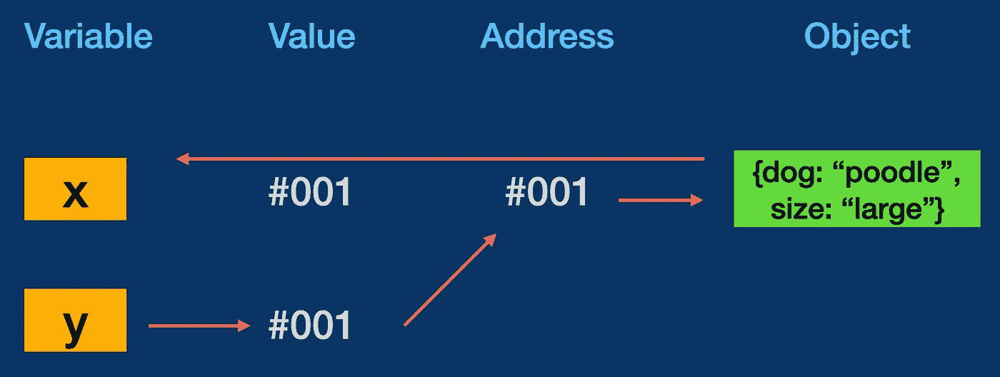

# JavaScript 中按值传递与按引用传递

> 原文：<https://levelup.gitconnected.com/pass-by-value-vs-pass-by-reference-in-javascript-31e79afe850a>

理解原始数据类型和对象在 JavaScript 中的行为

Glenn Carstens-Peters 在 Upsplash 上拍摄的照片

如果您是 JavaScript 新手，那么您可能已经遇到了这种语言提供的一些有趣的行为([展示 A](https://www.destroyallsoftware.com/talks/wat) )。起初，这些奇怪的怪癖可能看起来很可笑和令人沮丧，但我保证所有这些疯狂的背后都有一个方法。

依我拙见，最难克服的障碍之一是按值传递和按引用传递之间的区别。*为什么这个概念这么棘手？对于初学者来说，如果没有真正理解 JavaScript 如何与原始值和引用值交互，你肯定会走得很远。这可能会导致大量的错误，这些错误很难追踪，也很难修复。其次，这是一个会在技术面试中出现的概念，所以不理解它会被认为是对你不利的一面巨大的红旗。*

不要害怕，读者朋友！让教育开始吧…

## 原始数据类型

在 JavaScript 中，我们可以将数据类型分为两个不同的桶，原始数据类型和对象。

说明原始数据类型或值以及对象类型或引用值的图表

从 ES6 开始，JavaScript 中有六种原始数据类型:`string`、`number`、`boolean`、`undefined`、`null`和`symbol`。

原始数据类型通过值传递或复制**，并且是不可变的，这意味着现有的值不能像数组或对象那样改变。让我们看一下下面的代码，看看它是如何工作的。**

使用 jsbin.com 创建

这里我们创建了两个变量，`x = 10`和`y = x`。由于`10`是一个数字和一个原始值，当我们设置`y = x`时，我们实际上是在复制该值，即`10`，并将其分配给`y`。我们也可以使用下面的图表对此进行可视化。

如果我们要改变`x`的值，我们会看到`y`保持其值`10`。同样，这是因为原始值是由**复制的**，所以`y`的值独立于`x`的值。把它想象成复印一张照片。复印后，你就有了两张完全相同的照片:一张原件和一张复制品。如果你把原件切成两半，只有原件会被改动，而传真件将保持原样。

我们改写了 x 的值，但 y 保持不变

## 参考对象

另一方面，对象通过引用传递给**，并指向值在内存中的位置，而不是值本身。让我们在代码中看看这一点。**

变量 x 和 y 现在指向对象，而不是原始数据类型

在这个例子中，`x`现在是一个指向`{dog: "poodle"}`的对象。当我们创建变量`y`并为其赋值`x`时，我们现在能够进入`x`的各种属性，包括`dog`的值，即`"poodle"`。这似乎与原始值使用的逻辑完全相同，但是让我们看看下面的图表，看看细微但重要的区别。

x 和 y 都指向内存中的一个(虚构的)地址，该地址存储对该对象的引用

现在，这个图表看起来与我们的变量`x`和`y`持有原始数据类型时略有不同。在这个版本中，我们看到`x`和`y`的值都不是数据类型，但是**引用了内存中的一个地址**，实际上是同一个地址！现在让我们看看如果我们给`y`添加一个新的属性`size`会对`x`产生什么影响…

`x`仍然返回一个对象，但是现在它也有了一个额外的属性`size`！同样，这是因为`x`和`y`都指向同一个引用对象，所以对一个变量的任何改变，在另一个变量中都是可见的。

图表说明了 y 的变化如何更新与 x 共享的参考值

为了帮助我记住这个概念，我喜欢把参考值想象成一所房子，把变量想象成住在房子里的人。所有的居民(变量)可以说“我有一栋房子”并指向同一栋房子。如果一个居民决定把房子漆成黄色，那么所有的居民现在都有一个黄色的房子，因为它是共享的。

让我们再看一个包含各种引用对象例子。

在这段代码中，我们从包含属性`name`、`age`和`hobbies`的变量`person`开始。当我们将这个对象打印到控制台时，我们得到的正是我们所期望的——与我们刚刚创建的对象相同。

接下来，我们有一个名为`changePerson`的函数，它接受一个参数，做一些修改，然后返回一个对象。当我们创建变量`thirdPerson`时，我们通过将我们的原始对象`person`传递给它来调用`changePerson`函数。有趣的是，当我们再次打印到控制台`thirdPerson`和`person`时会发生什么。

注意`console.log(thirdPerson)`返回一个具有新属性的全新对象。现在看看`console.log(person)`返回什么。这类似于我们的原始对象，但是它包含了在我们的`changePerson`函数中引入的新属性值。

## 检查相等性

最后，让我们看看原始数据类型和引用对象如何使用等式操作符。

当谈到原始数据类型时，只要值相同，`=`符号的右边是什么并不重要。我们可以从上面的变量`a`和`b`中看到这一点，这两个变量的写法不同，但是当我们使用严格相等运算符`===`时，它们的值是相同的。

在第二个示例中，`dog`和`cat`的情况正好相反。虽然看起来它们包含相同的值，`['bark']`是一个数组，也是一个引用对象，这意味着`===`正在检查`dog`和`cat`是否对内存中的值有相同的引用。另一方面，`bird === dog`是真的，因为它们共享同一个引用对象。

狗和鸟共享相同的引用，而猫则不同，尽管它们有相同的数组

## 结论

我们对按值传递和按引用传递的介绍到此结束。在这个基础框架下，还可以涵盖更多的主题，包括引用被覆盖或丢失时会发生什么，如何复制引用以创建新对象，以及确保副本是深度副本，等等。我建议查看我在下面使用的资源，这些资源更详细地介绍了这些额外的主题。

感谢您的阅读！我自己相对来说是一个编码新手，所以如果你有任何意见，纠正，敌意和/或愿望，请在下面留下评论！

## 资源

下面是一些很棒的资源，可以帮助你理解在 JavaScript 中传递值和传递引用。

 [## JavaScript 数据类型和数据结构

### 所有的编程语言都有内置的数据结构，但是每种语言的数据结构都不一样。这个…

developer.mozilla.org](https://developer.mozilla.org/en-US/docs/Web/JavaScript/Data_structures)  [## 价值与参考——提升你的 JS:中级 JavaScript 综合指南

### 了解如何通过值复制一些数据类型，通过引用复制其他数据类型，以及这在我们编写代码时意味着什么。这个…

www.educative.io](https://www.educative.io/courses/step-up-your-js-a-comprehensive-guide-to-intermediate-javascript/7nAZrnYW9rG)  [## JavaScript 原语与参考值

### 摘要:在本教程中，您将了解原始值和参考值之间的差异。在 JavaScript 中，一个…

www.javascripttutorial.net](https://www.javascripttutorial.net/javascript-primitive-vs-reference-values/)