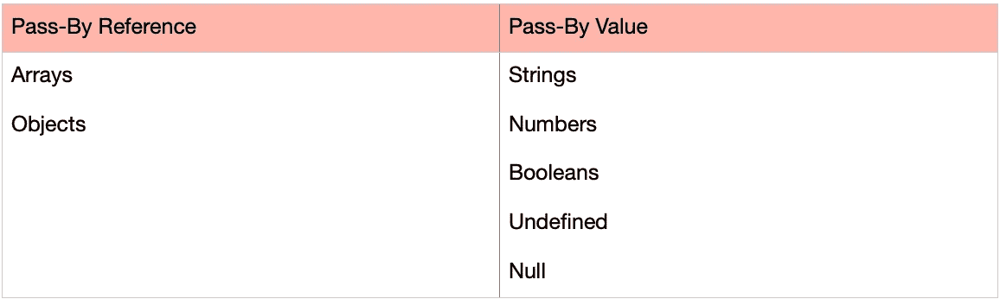

# JavaScript 中的传递值与传递引用

> 原文：<https://levelup.gitconnected.com/pass-by-value-vs-pass-by-reference-in-javascript-82fa8736c9f7>

[西格蒙德](https://unsplash.com/@sigmund?utm_source=unsplash&utm_medium=referral&utm_content=creditCopyText)在 [Unsplash](https://unsplash.com/s/photos/copy?utm_source=unsplash&utm_medium=referral&utm_content=creditCopyText) 上拍照

# 介绍

编程中我最喜欢的话题之一是理解按值传递和按引用传递。这是我在一次技术面试中提出的一个概念，如果你还不知道，你应该知道。

按引用传递和按值传递的区别在于，按值传递会在内存中创建一个新空间并复制一个值，而按引用传递则不会。引用传递不是复制，而是做听起来完全一样的事情；存储在内存中的值被引用。

*简记方式* : ***复杂*** *值为按引用传递，* ***原语*** *值为按值传递。*

# 按引用传递:

## 目标

首先，我将创建一个对象文本，并将其赋给变量`john`。该对象将包含简单的属性，如姓名、年龄和性别。让我们创建另一个名为`newJohn`的变量，并将其设置为等于`john`对象。

此时，您可能认为这是两个独立的对象，您现在可以以任何方式对其进行修改。

不要。！！！！

## **还记得我说过不做副本，会引用内存中的一个值吗？**

`newJohn`对象不是存储在`john`变量中的对象的副本。相反，变量`newJohn`引用原始的`john`对象。

这意味着如果你决定编辑`newJohn`对象(，例如将第 3 行`newJohn`的`name`属性改为`"Tom Doe"`，你实际上是在修改`john`对象！

正如您在第 16 行和第 19 行看到的，两个对象的`name`属性都有一个值`"Tom Doe"`。

## 数组

数组的工作方式与对象相同。

我们将得到与对象示例相同的结果。

我们将创建一个名为`john`的变量，并将其初始化为一个数组。然后我们将创建一个名为`newJohn`的新变量，并给它赋值`john`。

然而，当我们试图向存储在`newJohn`变量中的数组添加一个新项时，它也会影响到`john`数组。同样，这是因为我们只处理 ***的一个数组，而不是数组*** 的两个独立副本。变量`newJohn`引用了在变量`john`中初始化的同一个数组。

当处理按值传递的值时，情况并非如此。

# 传递值

与对象和数组不同，诸如数字或字符串之类的原始值实际上会创建一个副本。

这里，我们创建了一个变量`const num`，并给它赋值`25`。我们还将创建一个名为`passByValue`的函数，它接受一个参数，并在该参数上加 2。我们将传入的参数是`num`变量。

正如我们在引用传递中看到的，当我们试图改变`newJohn`中的对象时，我们实际上是引用了存储在变量`john`中的对象并改变了该对象。通过值传递，当我们将变量`num`传递给函数并返回`27`、*的值时，我们并没有改变*变量`num`的原始值。

这是因为当我们将`num`传递给函数时，它会创建一个副本，并在内存中给它自己的空间。

当我们在第 14 行`console.log(num)`时，我们仍然有我们原来的`25`。

**数值** `**const num**` **不变！**

# 结论

理解 PBV 和 PBR 是有帮助的，因为如果你正在写代码，你想设置一个变量等于另一个变量，或者在上面的例子中，把一个变量作为一个参数传入一个函数，你需要知道这个值是按值传递还是按引用传递。这将有助于您在处理数据时避免错误。