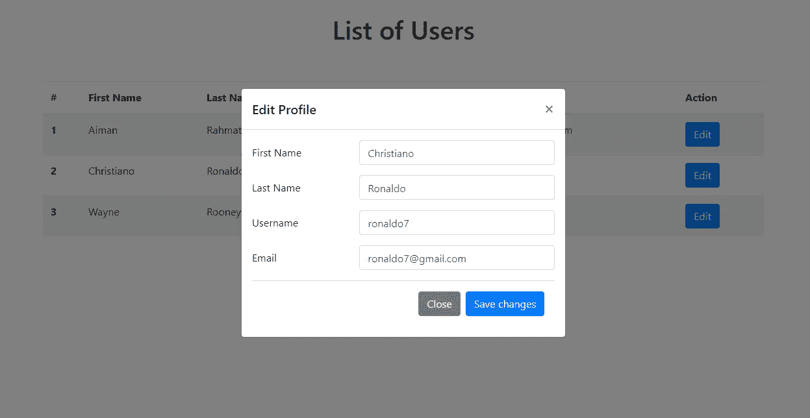
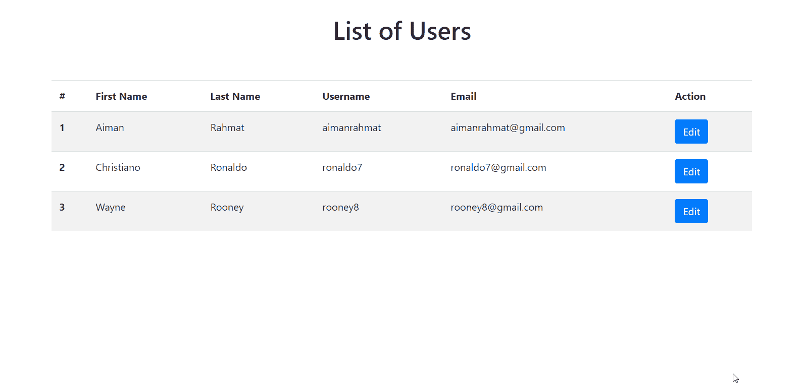
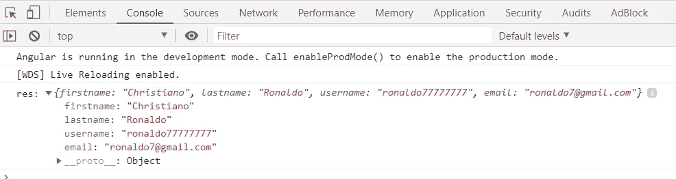

# 将数据传入角度为 8 的 Ng-Bootstrap 模式

> 原文：<https://levelup.gitconnected.com/pass-data-into-ng-bootstrap-modal-in-angular-8-65608361093a>

## 在弹出模式中编辑用户配置文件信息



以 Ng-Bootstrap 模式传递数据

在本教程中，我们将学习如何在 Angular 版本 8 中使用 Ng-Bootstrap 将数据传递给一个模态。

Ng-Bootrap 是 Bootstrap UI 组件的角度适应版本。通过使用 ng-bootstrap，我们可以轻松地将 bootstrap 库集成到我们的 Angular 项目中，并轻松地使用它的 UI 组件。

让我们开始构建我们的应用程序。

# 设置我们的应用程序

在运行以下命令之前，确保我们已经在环境中安装了 [Angular CLI](https://cli.angular.io/) 和 [Node JS](https://nodejs.org/en/) 。然后，运行下面的命令。

```
ng new modalApp
cd modalApp
```

接下来，通过以下方式安装 ng-bootstrap:

```
npm install @ng-bootstrap/ng-bootstrap --save
```

安装完成后，导入 **app.module.ts** 中的`NgbModule`和`ReacticeFormsModule`。稍后我们将在应用程序中使用反应式。

```
import { BrowserModule } from '@angular/platform-browser';
import { NgModule } from '@angular/core';
import { AppRoutingModule } from './app-routing.module';
import { AppComponent } from './app.component';
import { ReactiveFormsModule } from '@angular/forms';
import { NgbModule } from '@ng-bootstrap/ng-bootstrap';@NgModule({
  declarations: [
    AppComponent
  ],
  imports: [
    BrowserModule,
    AppRoutingModule,
    NgbModule,
    ReactiveFormsModule
  ],
  providers: [],
  bootstrap: [AppComponent]
})
export class AppModule { }
```

然后，通过运行以下命令安装引导程序:

```
npm install bootstrap --save
```

并在 **angular.json** 中导入下面的代码。

```
"styles": [
  "src/styles.scss",
  "node_modules/bootstrap/dist/css/bootstrap.min.css"
],
"scripts": []
```

我们不需要在应用程序中添加 **bootstrap.js** 或 **bootstrap.min.js** ，因为 ng-bootstrap 的目标是完全取代组件的 JavaScript 实现。我们也不应该包含其他依赖项，如 jQuery 或 popper.js。这是不必要的，可能会干扰 ng bootstrap 代码。

# 创建数据表

接下来，我们将添加一个数据表，它包含一个用户列表和一些细节，以及一个将触发弹出模式的编辑功能。更新下面的文件。

**app.component.html**

用户表有 6 列，包括用户详细信息——id、名字、姓氏、用户名、电子邮件和操作。

```
<div class="container">
 <div class="row">
  <div class="col-md-12 py-4 text-center">
   <h1>List of Users</h1>
  </div>
 </div>
 <div class="row justify-content-center">
  <div class="col-md-12 py-4">
   <table class="table table-striped">
    <thead>
     <tr>
      <th scope="col">#</th>
      <th scope="col">First Name</th>
      <th scope="col">Last Name</th>
      <th scope="col">Username</th>
      <th scope="col">Email</th>
      <th scope="col">Action</th>
     </tr>
    </thead> <tbody>
     <tr *ngFor="let user of userList">
      <th scope="row">{{ user.id }}</th>
      <td>{{ user.firstname }}</td>
      <td>{{ user.lastname }}</td>
      <td>{{ user.username }}</td>
      <td>{{ user.email }}</td>
      <td>
       <button type="button" class="btn btn-primary" (click)="openModal(editProfileModal, user)">Edit</button>
      </td>
     </tr>
    </tbody>
   </table>
  </div>
 </div>
</div><ng-template #editProfileModal let-modal>
 <div class="modal-header">
  <h5 class="modal-title" id="editProfileLabel">Edit Profile</h5>
  <button type="button" class="close" (click)="modal.dismiss()" aria-label="Close">
   <span aria-hidden="true">&times;</span>
  </button>
 </div>

 <div class="modal-body">
  <form [formGroup]="editProfileForm" (ngSubmit)="onSubmit()">
   <div class="form-group row">
    <label for="firstname" class="col-sm-4 col-form-label">First Name</label>
    <div class="col-sm-8">
     <input type="text" class="form-control" formControlName="firstname" id="firstname">
    </div>
   </div> <div class="form-group row">
    <label for="lastname" class="col-sm-4 col-form-label">Last Name</label>
    <div class="col-sm-8">
     <input type="text" class="form-control" formControlName="lastname" id="lastname">
    </div>
   </div> <div class="form-group row">
    <label for="username" class="col-sm-4 col-form-label">Username</label>
    <div class="col-sm-8">
     <input type="text" class="form-control" formControlName="username" id="username">
    </div>
   </div> <div class="form-group row">
    <label for="email" class="col-sm-4 col-form-label">Email</label>
    <div class="col-sm-8">
     <input type="email" class="form-control" formControlName="email" id="email">
    </div>
   </div> <div class="modal-footer">
    <button type="button" class="btn btn-secondary" (click)="modal.dismiss()">Close</button>
    <button type="submit" class="btn btn-primary">Save changes</button>
   </div>
  </form>
 </div>
</ng-template>
```

`#editProfileModal`是一个弹出模式，包含一个编辑用户详细信息的表单。

为了打开模态，我们使用带有两个参数的`openModal()`方法——**目标模态 id** 和**选择的用户**。

为了关闭模态，我们使用解散方法— `modal.dismiss()`。

**app.component.ts**

```
import { Component, OnInit } from '@angular/core';
import { FormGroup, FormBuilder } from '@angular/forms';
import { NgbModal } from '@ng-bootstrap/ng-bootstrap';@Component({
 selector: 'app-root',
 templateUrl: './app.component.html',
 styleUrls: ['./app.component.scss']
})export class AppComponent implements OnInit{
 title = 'modal2';
 editProfileForm: FormGroup; userList = [
 {
  id: "1",
  firstname: "Aiman",
  lastname: "Rahmat", 
  username: "aimanrahmat",
  email: "aimanrahmat@gmail.com"
 },
 {
  id: "2",
  firstname: "Christiano",
  lastname: "Ronaldo",
  username: "ronaldo7",
  email: "ronaldo7@gmail.com"
 },
 {
  id: "3",
  firstname: "Wayne",
  lastname: "Rooney",
  username: "rooney8",
  email: "rooney8@gmail.com"
 }]; constructor(private fb: FormBuilder, private modalService: NgbModal) {} ngOnInit() {
  this.editProfileForm = this.fb.group({
   firstname: [''],
   lastname: [''],
   username: [''],
   email: ['']
  });
 } openModal(targetModal, user) {
  this.modalService.open(targetModal, {
   centered: true,
   backdrop: 'static'
  });

  this.editProfileForm.patchValue({
   firstname: user.firstname,
   lastname: user.lastname,
   username: user.username,
   email: user.email
  });
 } onSubmit() {
  this.modalService.dismissAll();
  console.log("res:", this.editProfileForm.getRawValue());
 }
}
```

在`userList`中，我们有 3 个用户及其详细信息——id、名字、姓氏、用户名和电子邮件。

为了打开和关闭 ng 引导模式，我们使用一个名为[NGB model](https://ng-bootstrap.github.io/#/components/modal/api)的服务。你可以点击链接了解更多关于这项服务的信息。

`Static`为 back end，表示在模态外点击时模态不关闭。

当所选用户被发送到开始模式时，使用`patchValue`根据所选用户的详细信息设置`editProfileForm`的值。

这是最后的结局。我们可以看到，用户详细信息在模式中相应地被填充。



最后结局

尝试更改用户详细信息中的任何内容，然后单击“保存更改”。新的更改将显示在您的控制台日志中，如下图所示。



新变化

# 资源

1.  https://ng-bootstrap.github.io/#/getting-started