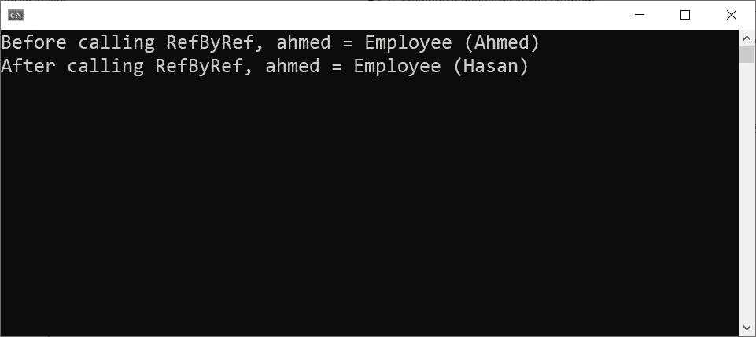

# 将参数传递给. NET C#方法

> 原文：<https://levelup.gitconnected.com/passing-parameters-to-a-net-c-method-388badb7c095>

## 回归基础

## 向. NET C#方法传递参数的不同方式。


由[本·怀特](https://unsplash.com/@benwhitephotography?utm_source=unsplash&utm_medium=referral&utm_content=creditCopyText)在 [Unsplash](https://unsplash.com/?utm_source=unsplash&utm_medium=referral&utm_content=creditCopyText) 上拍摄，由[艾哈迈德·塔里克](https://medium.com/@eng_ahmed.tarek)调整

这篇文章主要是关于定义传递一个参数给一个**的方法。NET C#** 方法，同时调用它。简单来说，就是关于著名的`Ref`和`Val`的事情。

我知道，我知道。你可能会说:

> 这是每个**都有的一个太基础的东西。NET C#** 开发者都知道。真的需要解释成一整篇文章吗？！！！

你这个问题的简短回答是:**是的**。我知道这看起来像你说的那样太简单了，但是我有我的理由。

在软件中，有很多基础知识需要学习，不幸的是，在花哨的框架和库的时代，年轻的开发人员往往会跳过这些基础知识，直接学习这些花哨的框架。

他们中的一些人可能知道基本规则，但他们不知道背后的故事或科学。这真的重要吗？是的，大多数时候这很重要。

此外，有一种事情你需要彻底地观察至少一次，然后你就可以知道你做了它来过你的生活。这个题目就是其中之一。

[](https://medium.com/subscribe/@eng_ahmed.tarek) [## 🔥订阅艾哈迈德的时事通讯🔥

### 订阅艾哈迈德的时事通讯📰直接获得最佳实践、教程、提示、技巧和许多其他很酷的东西…

medium.com](https://medium.com/subscribe/@eng_ahmed.tarek) 

照片由[马特·阿特兹](https://unsplash.com/@mattartz?utm_source=unsplash&utm_medium=referral&utm_content=creditCopyText)在 [Unsplash](https://unsplash.com/?utm_source=unsplash&utm_medium=referral&utm_content=creditCopyText) 上拍摄，由[艾哈迈德·塔雷克](https://medium.com/@eng_ahmed.tarek)调整

# 关键因素

当我们试图理解一个参数如何被发送到一个**时，有两个因素需要记住。NET C#** 方法。

这些因素是:

1.  参数类型
    值
    参考
2.  参数
    传值方式
    引用方式

因此，现在很明显，我们将有 4 种组合:

1.  逐值
2.  参考值
3.  按值引用
4.  引用引用


由[杰瑞米·贝赞格](https://unsplash.com/@jeremybezanger?utm_source=unsplash&utm_medium=referral&utm_content=creditCopyText)在 [Unsplash](https://unsplash.com/?utm_source=unsplash&utm_medium=referral&utm_content=creditCopyText) 上拍摄，由[艾哈迈德·塔雷克](https://medium.com/@eng_ahmed.tarek)调整

# 不同的类型如何储存在记忆中？

正如我们所说，我们有两种类型的参数；**值**和**参考值**。你需要知道的是，这两种类型在内存中的保存方式是不一样的。

简而言之，我们有两种类型的内存:堆栈

N 注:解释**栈**和**堆**的每一个微小细节都超出了本文的范围。这就是为什么我们只总结和关注本文主要范围所需的一小部分。

## 堆栈

堆栈**是存储**值**类型的地方。另外，**引用**类型(存储在堆中)的**地址(堆内存位置)**存储在**栈**中。**

所以，如果我们有:

```
int x = 1;
```

这将存储在堆栈中，如下所示。


**堆栈中存储的整数 x**。图片由[艾哈迈德·塔里克](https://medium.com/@eng_ahmed.tarek)拍摄

## 垃圾堆

**堆**是存储**引用**类型的地方。

所以如果我们有:

```
Employee x = new Employee();
```

这将存储在堆栈中，如下所示。


**存储在堆栈中的雇员 x(堆位置的地址)和堆(对象)**。图片由[艾哈迈德·塔里克](https://medium.com/@eng_ahmed.tarek)拍摄


由 [Unsplash](https://unsplash.com/?utm_source=unsplash&utm_medium=referral&utm_content=creditCopyText) 上 [Belinda Fewings](https://unsplash.com/@bel2000a?utm_source=unsplash&utm_medium=referral&utm_content=creditCopyText) 拍摄，由 [Ahmed Tarek](https://medium.com/@eng_ahmed.tarek) 调整

# 通过值或引用传递参数是什么意思？

这里有一条黄金法则要记住。简单有效。

## 传值

意味着在运行时，原始参数的一个**副本**将被传递给该方法。

## 传地址

意味着在运行时，传递给方法的原始参数将被传递给方法。

有什么区别吗？当然，这也是我们将在本文的下一部分讨论的内容。

话虽如此，现在让我们来分析向**传递参数的不同方式。NET C#** 方法。


**逐个值**，图像由 [Ahmed Tarek](https://medium.com/@eng_ahmed.tarek)

# 逐值

假设我们有:

正如您所看到的，`ValByVal`方法:
期望一个`int`作为输入参数，该参数是一个**值**类型

因此，可以保证`ValByVal`方法是**逐值**方法的候选方法。

所以，回到代码，在执行完第 5 行之后，我们会在内存中有这个。


**堆栈中存储的整数 x**。图片由[艾哈迈德·塔里克](https://medium.com/@eng_ahmed.tarek)拍摄

在**第 7 行**上，当调用`ValByVal`方法时，变量 **x** 的副本将被隐式创建并传递给该方法。姑且称这个文案**x’**。


**堆栈**中存储的整数 x 的副本。图片由[艾哈迈德·塔里克](https://medium.com/@eng_ahmed.tarek)拍摄

因此，在第**行第 15** 处，我们正在递增传入的参数，我们实际上是在递增 **x'** ，而不是 **x** 。

这将留给我们这个:


**x’增加 1 并存储在堆栈**中。图片来自[艾哈迈德·塔里克](https://medium.com/@eng_ahmed.tarek)

这意味着当我们回到第 8 行的`Main`方法时， **x** 的值仍然是 **1** 。

控制台上的结果如下所示:


**参考值**，图像由 [Ahmed Tarek](https://medium.com/@eng_ahmed.tarek) 生成

# 参考值

假设我们有:

如您所见，`ValByRef`方法:
\\\\\\\\\\\\\\\\\\\\\\\\\\\\\\\\\\\\\\\" T7 \\\\\\\\\\\\\\\\\\\\\\\\\\\\\\\\\\\\\\\\

因此，通过引用方式保证`ValByRef`方法是**值的候选。**

所以，回到代码，在执行完第 5 行之后，我们会在内存中有这个。


**堆栈中存储的整数 x**。图片由[艾哈迈德·塔里克](https://medium.com/@eng_ahmed.tarek)拍摄

在**第 7 行**上，当调用`ValByRef`方法时，原始变量 **x** 将被传递给该方法。


x '与 x 相同。图片由[艾哈迈德·塔里克](https://medium.com/@eng_ahmed.tarek)拍摄

因此，在第**行第 15** 处，我们正在递增传入的参数，实际上我们正在递增 **x** 。

这将留给我们这个:


**x 加 1，存入堆栈**。图片由[艾哈迈德·塔里克](https://medium.com/@eng_ahmed.tarek)拍摄

这意味着当我们回到第 8 行的**方法时， **x** 的值将会是 **2** 。**

控制台上的结果如下所示:


**按值引用**，图像由[艾哈迈德·塔里克](https://medium.com/@eng_ahmed.tarek)

# 按值引用

假设我们有:

如您所见，`RefByVal`方法:
期望一个`Employee` 作为输入参数，它是一个**引用**类型
发送的参数(参数类型前没有`ref`

因此，可以保证`RefByVal`方法是通过值方式引用**的候选方法。**

所以，回到代码，在执行完**第 10 行**之后，我们会在内存中有这个。


**x 正确存放在栈和堆中**。图片由[艾哈迈德·塔里克](https://medium.com/@eng_ahmed.tarek)拍摄

在**第 15** 行，当调用`RefByVal`方法时，变量 **x** 的副本将被隐式创建并传递给该方法。姑且称这个文案**x’**。

但是，这里值得一提的是，实际拷贝的，是**栈**中存储的 **x** 的值。该值是**堆**中存储实际**雇员** **对象**的内存位置的地址。

因此，我们最终会得到这样的结果:


**x’从 x 复制并存储在堆栈**中。图片由 [Ahmed Tarek](https://medium.com/@eng_ahmed.tarek) 提供

如您所见， **x'** 将保存与**堆**中存储实际**员工 X** 的内存位置相同的地址。这意味着**x’**也指的是同一个对象。

因此，在第**行第 25** 行，我们将雇员的名字更新为“Tarek ”,我们实际上是在更新最初传递给`RefByVal`方法的同一个对象`Employee ahmed`。

因此，这导致了这样的结果:


**员工 ahmed 更新为“Tarek”**。图片由[艾哈迈德·塔里克](https://medium.com/@eng_ahmed.tarek)拍摄

然后，在**第 26** 行，我们将**x’**自身设置为另一个新的`Employee`。这意味着一个新的**雇员**对象将被创建，存储在**堆**中，并且那个**堆**内存位置的地址将被存储在**堆栈**中的**x’**中。

因此，留给我们的是:


**x = Tarek，x' = Hasan** 。图片由[艾哈迈德·塔里克](https://medium.com/@eng_ahmed.tarek)拍摄

这意味着当我们回到第 17 行的`Main`方法时，`Employee ahmed`的名字的值将是 **Tarek** 。

控制台上的结果如下所示:


**引用引用**，图像由[艾哈迈德·塔里克](https://medium.com/@eng_ahmed.tarek)拍摄

# 引用引用

假设我们有:

正如您所看到的，`RefByRef`方法:
期望一个`Employee`作为输入参数，它是一个**引用**类型
。该参数期望由**引用**发送(在参数类型之前有一个`ref`

因此，可以保证`RefByRef`方法是**通过引用**方式引用的候选方法。

所以，回到代码，在执行完**第 10 行**之后，我们会在内存中有这个。


**x 正确存储在堆栈和堆中**。图片由[艾哈迈德·塔里克](https://medium.com/@eng_ahmed.tarek)拍摄

在**第 15 行**上，当调用`RefByRef`方法时，原始变量 **x** 将被传递给该方法。

因此，我们最终会得到这样的结果:


**x’与 x** 相同。图片由[艾哈迈德·塔里克](https://medium.com/@eng_ahmed.tarek)

因此，在第**行第 25** 行，我们将雇员的名字更新为“Tarek ”,我们实际上是在更新原来传递给`RefByRef`方法的同一个对象`Employee ahmed`。

因此，这导致了这样的结果:


**员工 ahmed 更新为“Tarek”**。图片由[艾哈迈德·塔里克](https://medium.com/@eng_ahmed.tarek)拍摄

然后，在**行 26** 上，我们将**x’**自身设置为另一个新的`Employee`。这意味着将创建一个新的**雇员**对象，存储在**堆**中，并且该**堆**内存位置的地址将存储在**堆栈**中的**x’**中。

但是， **x'** 其实是 **x** 。这意味着 **x** 的地址也将被更新为新地址。

因此，留给我们的是:


**x = x’=哈桑**。图片由[艾哈迈德·塔里克](https://medium.com/@eng_ahmed.tarek)拍摄

这意味着当我们回到第 17 行的`Main`方法时，`Employee ahmed`的名字的值将是 **Hasan** 。

控制台上的结果如下所示:



由 [Pietro Rampazzo](https://unsplash.com/@peterampazzo?utm_source=unsplash&utm_medium=referral&utm_content=creditCopyText) 在 [Unsplash](https://unsplash.com/?utm_source=unsplash&utm_medium=referral&utm_content=creditCopyText) 上拍摄，由 [Ahmed Tarek](https://medium.com/@eng_ahmed.tarek) 调整

# 最后的想法

我希望到现在为止，在调用**时正在发生的事情背后的故事。NET C#** 方法时传入的参数是清晰的。

如果你知道某人正开始他的**之旅。NET C#** 开发者，也许你可以和他分享这篇文章。这将有助于他想象实际发生的事情。


# 希望这些内容对你有用。如果您想支持:

如果您还不是**媒介**的会员，您可以使用 [**我的推荐链接**](https://medium.com/@eng_ahmed.tarek/membership) ，这样我可以从**媒介**中获得您的一部分费用，您无需支付任何额外费用。
▎订阅 [**我的简讯**](https://medium.com/subscribe/@eng_ahmed.tarek) 将最佳实践、教程、提示、技巧和许多其他很酷的东西直接发送到您的收件箱。


# 其他资源

这些是你可能会发现有用的其他资源。

[](/protecting-public-methods-from-illogical-calls-in-net-c-91fcbb8bee33) [## 保护公共方法免受不合逻辑的调用。NET C#

### 包含代码示例和解释的完整指南。

levelup.gitconnected.com](/protecting-public-methods-from-illogical-calls-in-net-c-91fcbb8bee33) [](/flagged-enumerations-how-to-represent-features-combinations-into-one-field-f32e46a0885) [## 标记枚举:如何在一个字段中表示特征组合

### 将[读、写、修改……]等功能及其组合表示到单个字段中。

levelup.gitconnected.com](/flagged-enumerations-how-to-represent-features-combinations-into-one-field-f32e46a0885) [](/what-is-caching-in-software-systems-cfa71c385bfc) [## 什么是软件系统中的缓存

### 软件系统中缓存的定义和最佳实践。

levelup.gitconnected.com](/what-is-caching-in-software-systems-cfa71c385bfc) 