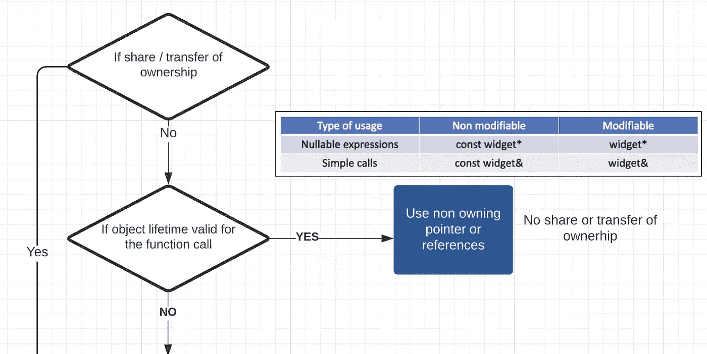
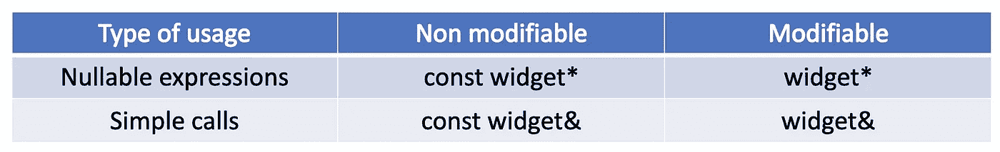
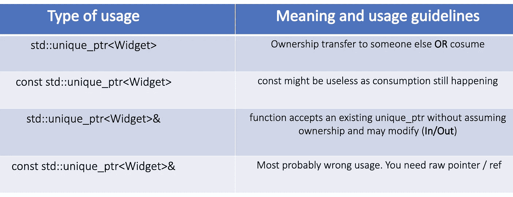
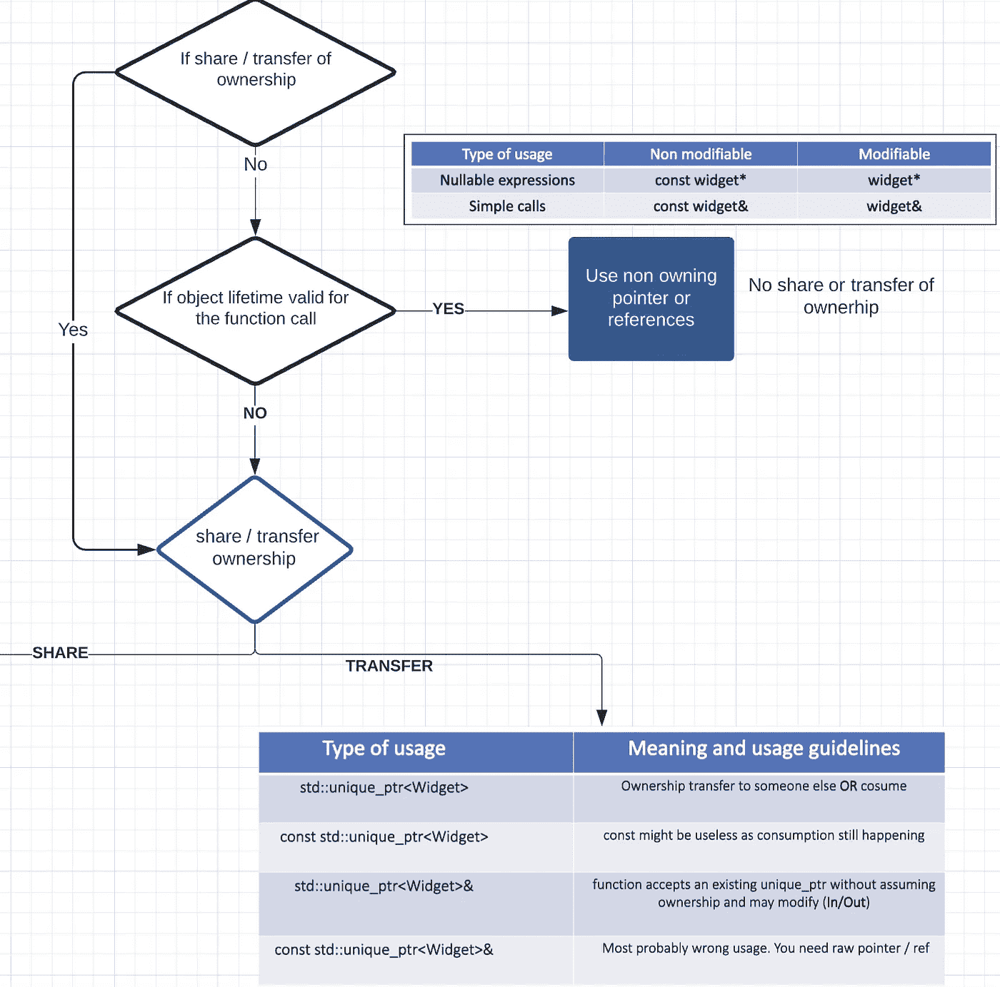
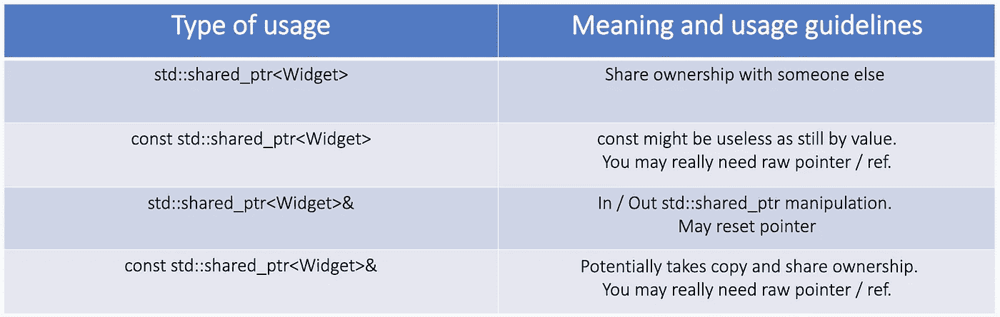
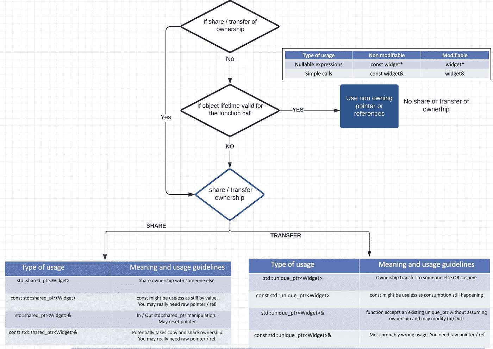

# 在 C++中传递智能指针

> 原文：<https://levelup.gitconnected.com/passing-smart-pointers-in-c-479775632443>

处理智能指针是任何 C++程序员的日常任务，当您希望获得最佳性能时，如何传递它们会变得很棘手。这里有一些提示和一般准则，可以在返回时将 shared_ptr 和 unique_ptr 作为函数参数传递。


> 和往常一样，除非你打算共享所有权，否则最好选择 unique_ptr 而不是 shared_ptr。

# 介绍

1.  总是问自己“我真的需要传递一个智能指针吗？”
2.  std::unique_ptr 用法
3.  std::shared_ptr 用法
4.  如何正确传递原始指针/引用？
5.  对于返回智能指针，规范是什么？

# 总是问自己“我真的需要传递一个智能指针吗？”

您应该始终评估将智能指针作为函数参数传递是否是您真正需要的。在大多数情况下，你只需要使用它并完成它。在这些情况下，获得一个原始指针并传递它总是好的。

现在，在我们继续之前，我必须告诉你**原始指针并不总是坏的**。正如我们将在本帖中读到的，它们在许多情况下非常有用。

## 指导方针

> 不要将智能指针作为函数参数传递，除非您想要使用或操作它，例如共享或转移所有权。
> 
> **更喜欢**通过不拥有的原始指针( ***** )或引用( **&** )传递对象。

## 理由和例子

```
void f( widget* );              
void f( widget& );
```

它们不知道调用者使用什么样的生存期策略，并且很好地观察了一个我们知道其生存期超过指针或引用生存期的对象。

这是限制性的，不容易提交。然后我们会看到并评估传递智能指针的最佳方式。



**第一步:了解你的一生** …全貌会越来越清晰:)

因此，如果我们对寿命有把握，应该遵循以下原则



**无股份或所有权转让时应遵循的指导方针和有效寿命**

# std::unique_ptr 用法

## `By value unique_ptr<type>`假设拥有一个`widget`

**理由:**这是表达消费功能的首选方式，也称为**“汇”**。

在文档和代码中以这种方式使用`unique_ptr`，很好地实施了函数调用的所有权转移(*表示一个“接收器”函数)*

比如——

```
void sink(unique_ptr<widget>); // takes ownership of the widget// whereasvoid uses(widget*);            // just uses the pointed object
```

下面是一个不好的例子—

```
void thinko(const unique_ptr<widget>&); // usually not what you want
```



**独特 _ptr 通过指引**

我们现在的指导方针是—



**第二步:了解您的转账情况** …更清晰的图片:)

## 指南:

> 使用 by-value **unique_ptr** 参数表示“sink”函数。*使用非常数****unique _ ptr&****参数只修改****unique _ ptr****。*

# std::shared_ptr 用法

## 仅当您共享所有权时，才通过值传递 shared_ptr

```
void f( shared_ptr<widget> );  // only when you want to retain
                               // object and share ownership
```

> 分享所有权是有代价的，所以要确保你真的打算付出这个代价。

在按值传递中，参数在进入函数时被复制(通常除非是临时的)，然后在函数退出时被销毁(总是)。

通过值传递 *shared_ptr* 意味着——
1)一个新的 ***shared_ptr*** 将被**复制构造。2)作为原子共享变量的引用计数增加。
3)***shared _ ptr***copy 在函数结束时被销毁。作为原子共享变量的引用计数减少。**

【相关帖子:[https://medium . com/pranayaggarwal 25/a-tale-of two-allocations-f 61 aa 0f 71 fc](https://medium.com/pranayaggarwal25/a-tale-of-two-allocations-f61aa0bf71fc)]

```
void f( const shared_ptr&<widget> );   // may share ownership
void f( shared_ptr&<widget> );         // may reset pointer
```

在特殊情况下，函数*可能*共享所有权，但不一定在给定的调用中复制其参数，然后传递一个 const-ref 以避免在不需要它的调用中复制。所以对于 ***shared_ptr*** 遵循这个——



**共享 _ptr 通过指引**

最后，我们在这里有完整的指导方针——



**第三步:最终指南图片**

# 如何正确传递原始指针/引用？

正如我们在上面所看到的，函数应该尽可能地向下传递原始指针和引用。

在调用树的顶部，从保持对象活动的智能指针获取原始指针或引用。您需要确保智能指针不会被无意中从下面的调用树中重置或重新分配。

**为了做到这一点，有时你需要获取一个智能指针的本地副本，它在函数和调用树的持续时间内牢牢地保持对象活动。**

考虑一下这段代码，以下内容应该不会通过代码审查:

```
// global (static or heap), or aliased local ...
shared_ptr<widget> g_p = ...;void my_code()
{
    // **BAD:** passing pointer or reference obtained from a non-local
    // smart pointer that could be inadvertently reset somewhere 
    // inside f or its callees
    f(*g_p);// **BAD:** same reason, just passing it as a "this" pointer
    g_p->func();
}
```

修复方法很简单——获取指针的本地副本来保存调用树的引用计数:

```
// global (static or heap), or aliased local ...
shared_ptr<widget> g_p = ...;void my_code()
{
    // **cheap:** 1 increment covers this entire function and call trees 
    auto pin = g_p;// **GOOD:** passing pointer or reference obtained from a local 
    // unaliased smart pointer
    f(*pin);// **GOOD:** same reason
    pin->func();
}
```

# 对于返回智能指针，规范是什么？

您应该遵循上面的相同逻辑:

> 如果调用者想要操作智能指针本身，则返回智能指针；如果调用者只需要底层对象的句柄，则返回原始指针/引用。

如果你真的需要从一个函数返回智能指针，放轻松，总是通过值返回*。那就是:*

```
std::unique_ptr<Object> getUnique();
std::shared_ptr<Object> getShared();
std::weak_ptr<Object>   getWeak();
```

这至少有三个很好的理由:

1.  **移动语义****——**智能指针由移动语义驱动:它们持有的动态分配的资源被四处移动，而不是被浪费地复制。
2.  **返回值优化(RVO)** 从 C++17 开始，标准保证了这一点。通过引用返回会禁止该快捷方式。
3.  **对象删除概率—** 通过引用返回`std::shared_ptr`不会正确地增加引用计数，这就带来了在错误的时间删除某些内容的风险，因为当对象超出另一个上下文的范围时，会导致对象被删除(可能是本地的)的风险。

多亏了 RVO。当返回一个`std::unique_ptr`时，你也不需要移动任何东西。

```
std::unique_ptr<Object> getUnique()
{
    std::unique_ptr<Object> p = std::make_unique<Object>();
    return p; 
    // also return std::make_unique<Object>();
}
```

# 参考

1.  [https://herbsutter . com/2013/06/05/gotw-91-solution-smart-pointer-parameters/](https://herbsutter.com/2013/06/05/gotw-91-solution-smart-pointer-parameters/)
2.  [http://isocpp . github . io/cppcore guidelines/cppcore guidelines # Rr-uniqueptrparam](http://isocpp.github.io/CppCoreGuidelines/CppCoreGuidelines#Rr-uniqueptrparam)
3.  [https://www . internal pointers . com/post/move-smart-pointers-and-out-functions-modern-c](https://www.internalpointers.com/post/move-smart-pointers-and-out-functions-modern-c)

感谢阅读这篇文章！欢迎留下你的评论，分享你的想法。请不吝赐教，改进这篇文章。
祝您愉快！

请随意给我买杯咖啡☕ => [这里](https://www.buymeacoffee.com/pranayagrawal)😊