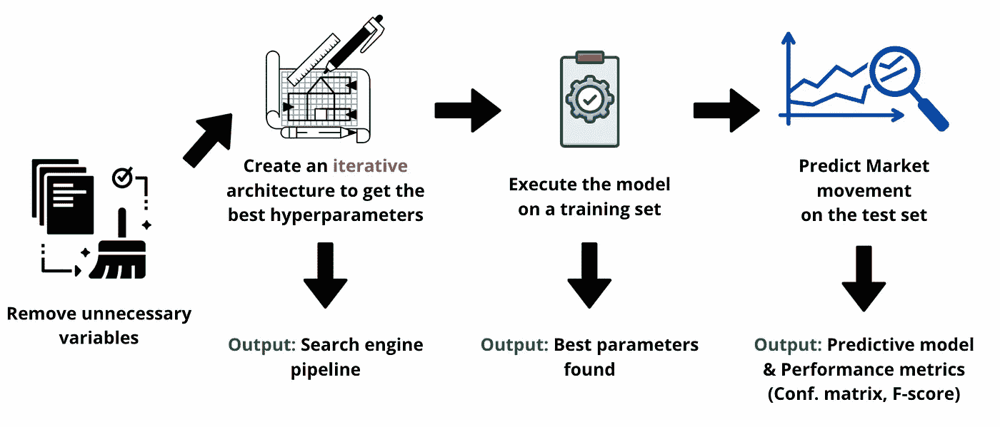

# 有盈利机器学习算法的被动收入(+22.07%)

> 原文：<https://levelup.gitconnected.com/passive-income-with-profitable-machine-learning-algorithm-7788e06c7618>

## 面向交易员和密码交易员的 Python

## 我如何使用网飞使用的机器学习算法将我的交易成功率提高了 22.0713%——第三部分

输出最终性能

T 他的这篇文章是关于如何使用机器学习和人工智能进行算法交易的系列文章和视频的第三部分**。**

本系列中涉及的模型在过去的六个月中得到了改进，目前用于我的交易机器人。这是一个适用于**日交易**的模型，也是为适应美国股票市场而设计的。(只是变量和概率的问题)。如果你想让它适应加密市场，你必须改变下面列出的一些超参数。

因此，让我们从之前看到的内容开始。但是首先，我强烈建议您看一看第一部分和第二部分(至少让 Python 代码和代码同步):

 [## Python 交易——我如何使用分类算法将我的胜率提高了 22.4%

### 网飞使用的一个错误的机器学习算法，以增加我的技术…

levelup.gitconnected.com](/python-for-trading-how-i-used-classification-algorithms-to-easily-enhance-my-winning-rate-by-22-4-6269167fbf93)  [## 我如何利用数学和人工智能将利润提高 22.4% —第二部分

### 网飞使用的一个错误的机器学习算法，像高频交易者一样交易。

levelup.gitconnected.com](/how-i-used-mathematics-and-ai-to-increase-my-profits-by-22-4-part2-89cd1443fa56) 

## 在上一篇文章中…

在上一篇文章中，我们首先介绍了 [**(网飞使用的)分类算法以及如何将它们用于交易目的**](/python-for-trading-how-i-used-classification-algorithms-to-easily-enhance-my-winning-rate-by-22-4-6269167fbf93) **。**

我们阐述了最大似然算法和通常的分类方法之间的区别。然后，我们定义了发展日内交易机器学习模型的路线图:

数据模型

我们定义了一种使用 yahoo finance API 获取实时市场数据的方法，我们选择了**一分钟的间隔**来保持在我们的**日交易**窗口中。

然后，我们通过多个步骤处理数据:

首先，**我们根据最敏感的交易指标**创建了多个变量。之后，我们**设置我们的信号**和**根据返回分类我们的输出**。最后，我们将数据分为训练数据集和测试数据集。

# 在这篇文章中

在第三部分中，我们将**开发我们的机器学习模型**，并通过**混淆矩阵**和 **F 值**测试模型的性能。并通过**观看**如何预测模型在实际市场条件下发挥作用来完成本文。

在开始之前，如果你想完全开始算法交易，我强烈推荐下面的课程:

 [## 2021 年:一天学会算法交易

### 你好，我是赛义德·赫萨尼。我一直在伦敦的多家银行担任数据科学家，是一名…

www.udemy.com](https://www.udemy.com/course/python-for-algorithmic-trading/?couponCode=LOVE_SEPTEMBER) 

开始吧！

# 模型部署

机器学习模型部署将分为三个部分。首先，定义我们的最优超参数。其次，根据这些参数创建 SVM 模型。第三，回测这个预测模型的性能。

但在开始之前，我们必须深入研究一下理论，以便理解所应用的策略和数学直觉。

## 理论

当你建立一个机器学习或人工智能模型时，最重要的挑战之一是向人工智能实例化正确的思维方式(数学上:建模)。

事实上，人工智能与 ARIMA 等常规预测模型之间的区别在于，计算机将根据情况创建定制模型。

> “没有人比机器更会建模”——扬·勒·库恩

我们的工作将是实例化计算机以正确的方式思考，并让它建立预测市场的最佳模型。这就是超参数出现的地方。

## 超参数

在科学文献中，四个主要参数用于支持向量模型: **C、γ、核**和**ε(但是ε主要用于 SVR 而不是 SVM)。**

****这些超参数之间的主要区别**是计算决策边界的**方式(也称为超平面，参见** [**第一部分**](/python-for-trading-how-i-used-classification-algorithms-to-easily-enhance-my-winning-rate-by-22-4-6269167fbf93) **)。****

**这些参数中的每一个都需要“调整”，我们需要定义一个特定的值。该值将决定拟合的程度。由于这些参数，人工智能将以某种方式思考和预测市场。**

**你可以想象，像一些按钮，你将调整，以获得最佳预测模型(或在这种情况下，**最佳超平面/决策边界**)。**

****

**如您所知，所用的拟合程度和超参数**对于获得可靠的市场预测**至关重要。但幸运的是，我们会找到一种方法让计算机自己找到最佳值。**

**为了大致了解，我们先从数学上快速看一下这三个参数的区别。**

## **差异 C、伽玛和内核**

****C 参数**将通过为每个错误分类的数据点添加惩罚来定义超平面(决策边界)。如果 **C 较大**，SVM 将**倾向于过拟合**，而如果 **C 较低**，模型将更加宽松，在许多情况下会给出更好的边界，但**倾向于过拟合**。下面的例子:**

****

**另一方面，gamma 将处理每个训练点的影响距离。它将通过最小化点与点之间的距离来创建微集群。低值 gamma 表示较大的相似性半径，这将导致更多的点被分组。对于高伽玛值，数据点需要彼此非常接近才能被认为在同一组(或类)中。下面的例子:**

****

**关于内核技巧，它将根据相似性度量来计算决策边界。虽然我们需要为其他人定义一个值，但我们必须指定用于内核的方程类型。主要有四种核:**线性**核、**多项式**核、 **Logistic/ Sigmoid** 核、**高斯/RBF** 核。**

**我们将使用的是基于高斯分布的，因为它更接近市场行为，这是一个真实的例子**。****

****但在开始编码和创建我们的人工智能之前，我们必须定义我们将如何处理我们的数据。****

# ****数据模型****

****如前所述，关键挑战之一将是找到我们的超参数的正确值，并让机器进行第二次预测。****

****但是不要担心，Scikit 有这样的工具。:)****

****我们将首先创建一个函数，通过迭代来测试参数**的不同值。一旦我们得到这个函数，我们将让机器选择最好的一个，使用一个名为 best_param_ **的函数。定义完成后，我们将根据这些值创建我们的 SVM 算法。********

**它看起来类似于:**

****

**数据模型**

**既然我们已经定义了我们的计划，让我们编码吧！**

# **模型开发**

## ****启动前****

**在开始之前，需要进行一些前一篇文章中没有做过的数据清理。我们将需要排除变量`Close`、`Signal`、`Time`、`High`、`Low`、`Volume`和`Ret`，因为算法不会在这些特征上被训练。接下来，我们将`Signal`分配给`y`，这是您将使用测试数据预测的输出变量。(视频教程中有更多解释)**

**现在我们可以开始为我们的人工智能模型设置超参数了。**

## **创建我们的超参数最优搜索函数**

**既然我们已经清理了数据集，我们将开始创建一个过程，通过迭代来找到 C 和 Gamma 的最佳值。提醒一下，从效率的角度来看，我们将使用`rbf`作为内核的单个条目，但是也可以随意测试其他选项。**

**为了通过迭代测试每个选项，我们将创建一个函数管道，以特定的顺序在训练数据上运行。并使用一个名为`RandomizedSearchCV`的 Scikit 函数来帮助我们运行管道。**

**该函数使用管道来执行后续步骤，并且“TimeSeriesSplit”为 2。它可以是大于 2 的任何值，但是为了运行得更快，我将时间序列除以 2 以提高效率。**

**既然我们已经创建了搜索最佳参数引擎函数，我们必须训练它来获得 C 和 Gamma 的最佳值。**

## **创建/训练模型并选择最佳输出🦾**

**为了完成这个任务，我们将首先在我们的随机搜索函数(名为`rcv`)中传递我们的训练数据集。然后对每个参数(C、gamma、kernel)使用函数`best_params_`让机器选择最佳值。然后，用引擎选择的最佳超参数实例化新的支持向量分类器函数。**

**尽管它看起来像野蛮人，但这只是一个要遵循的架构和流程问题。**

**机器选择的最佳参数如下:**

****

**现在我们的模型准备好了！让我们看看它在市场上的表现。**

# **预测市场**

**既然我们基于过去的数据来训练模型，我们将需要模型来预测我们的测试数据集中的信号。您可以使用测试数据进行预测，并将输出保存在名为“y_predict”的列表中。该列表将包含测试数据的信号预测值。**

## **保存预测**

**1.为了保存测试数据的预测 y 值，我们可以使用 split 将“y_predict”分配给“Pred_Signal”。
2。为了保存训练数据的预测 y 值，我们进行预测并以类似的方式保存它们。**

**因为该算法是在训练数据上训练的，所以它在该训练数据上的准确性预期比测试数据更好。您可以分别打印这两个文件来检查准确性。**

# **使用模型进行交易。**

**在评估交易模型之前，我们需要在测试数据集上检查算法的性能，并验证预测的准确性。为此，我们将生成混淆矩阵。(如果想要混淆矩阵和 F 分代码，在视频教程和脚本中有分享)。**

## **技术性能分析**

**在执行了下面视频中的代码行之后。这是我们的混淆矩阵和分类报告。**

****

**有趣的是，我们注意到预测并不完美，但算法可以避免做出错误的决定。事实上，在 42 分钟的“牛市”期间，算法从未建议卖出股票。在超过 38 分钟的卖出时间里，算法建议只在 2 分钟内买入。**

**但是现在，让我们将预测模型可视化。**

# **真实市场条件下的回溯测试**

**既然我们已经检查了性能并感到满意，我们可以看看运行中的预测算法了。*(视频中和文末分享的完整代码)。***

**你可以画出结果来形象化表现。**

**下面是我们的摆动交易算法的最终结果和性能的一个例子:**

****

**你可以访问下面的完整视频教程，如果你想在家里开发它，还有进一步的解释:**

**视频教程**

# **现场交易**

**既然我们已经对模型进行了回溯测试，并分析了模型的性能，我们将构建它来进行现场测试。在下一部分，我们将学习如何把我们的算法变成一个事件编码方法。**

**事实上，我们不能使用这个代码，因为它是现场交易。前一篇文章中学习的回溯测试代码是以**矢量格式**编写的。这意味着您以表格形式传递历史数据，并计算真实数据的信号和策略回报，以查看算法在实际条件下的反应。这就是你如何测试你的策略的有效性。**

**但是**实时交易需要以事件驱动的方式编码**。它将包括获取实时数据作为输入，生成交易信号并向经纪商下单。**

****

**在接下来的文章中，我们将更深入地研究事件驱动的格式代码。让交易机器人为我们运行。**

**如何创建你的事件驱动方法将在第四部分也是最后一部分讨论。最后一部分将在接下来的几周内发表，因为我花了很多时间来写这种类型的文章**。****

**所以，想在 [**上订阅**](https://lhessani-sajid.medium.com/subscribe) 或者 [**Youtube**](https://www.youtube.com/c/AlgorithmicTradingbySajid) 来获取更新。**

**我爱你们所有人。希望你喜欢这第三部；最后一部分会更加精彩。**

**快乐编码，**

**赛义德**

# **为了更进一步:**

# **来源:**

** [## 2021 年:一天学会算法交易

### 你好，我是赛义德·赫萨尼。我一直在伦敦的多家银行担任数据科学家，是一名…

www.udemy.com](https://www.udemy.com/course/python-for-algorithmic-trading/?couponCode=FIRST_MONTH) 

# 推荐内容

如果你想在这个领域更进一步，我可以推荐以下两个课程:

[金融市场的机器学习和深度学习](https://quantra.quantinsti.com/learning-track/machine-learning-deep-learning-in-financial-markets/?ref=sajidlhessani)

[人人算法交易](https://quantra.quantinsti.com/learning-track/algorithmic-trading-for-everyone/?ref=sajidlhessani)

[用机器学习回归交易](https://quantra.quantinsti.com/course/trading-with-machine-learning-regression/?ref=sajidlhessani)** 

# **完整的 Python 代码—第 3/3 部分**