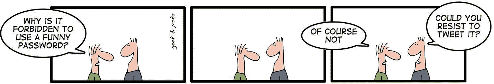

# 密码哈希😇

> 原文：<https://levelup.gitconnected.com/password-hashing-eb3b97684636>

## 准备好被黑吧


丹·列斐伏尔在 [Unsplash](https://unsplash.com?utm_source=medium&utm_medium=referral) 上的照片

软件被黑，数据泄露，数据被泄露。这不是罕见的例外，而是经常发生的。我们需要承认软件并不完美。这就是纵深防御概念发挥作用的地方。

> 深度防御意味着我们不依赖单一的安全机制，而是拥有多层安全机制。

密码哈希是深度防御的一个典型例子。如果我们的数据库是安全的，我们不需要密码散列。我们希望是这样，并尽可能地保护数据库，但我们为最坏的情况做准备。我们为攻击者获取我们用户的登录凭证做准备。

隐私的一个关键概念开始发挥作用:你不必担心你没有的数据。对于密码，我们不存储密码。甚至没有加密版本。我们存储一个散列版本。

这种方式的影响有望局限于我们的服务。我们需要告诉用户，他们的账户和数据可能已经暴露，但至少没有人会使用相同的用户名/密码组合登录他们的银行/亚马逊/社交账户。

# 哈希是什么？

哈希就像做饭。给定配方(哈希算法)和成分(密码)，您总是可以得到相同的结果。只要给出结果(散列)，就几乎不可能逆转这个过程(算出密码)。

有非加密哈希函数和加密哈希函数。加密的被设计成难以计算。这意味着它们需要大量的 CPU 能力/时间来应用。这是故意的。如果你需要几毫秒来应用它在你的(弱)服务器上，攻击者希望也需要相当长的时间来应用它在巨大的字典上数十亿次，以暴力破解加密帐户。


照片由[美国传统巧克力](https://unsplash.com/@americanheritagechocolate?utm_source=medium&utm_medium=referral)在 [Unsplash](https://unsplash.com?utm_source=medium&utm_medium=referral) 上拍摄

# 为什么它很重要

有太多的漏洞，很难跟踪这些漏洞。

*   **2012** : LinkedIn 泄露 650 万密码。密码已经过 SHA-1 哈希处理，没有加盐处理([来源](https://arstechnica.com/information-technology/2012/06/8-million-leaked-passwords-connected-to-linkedin/))。
*   **2013** : Adobe 泄露 1.3 亿密码([来源](https://www.theguardian.com/technology/2013/nov/07/adobe-password-leak-can-check))。密码是加密的，不是散列的。
*   **2016** : LinkedIn 遭到黑客攻击，使用了一种弱哈希算法([来源](https://www.zdnet.com/article/these-are-the-worst-passwords-from-the-linkedin-hack))
*   **2019**:120 万密码通过色情网站 Luscious 泄露([来源](https://www.forbes.com/sites/daveywinder/2019/08/20/popular-porn-site-breach-exposed-12-million-anonymous-user-profiles/#3c0cbe067039))
*   **2019** :脸书有数以亿计的明文密码([来源 1](https://about.fb.com/news/2019/03/keeping-passwords-secure/) ，[来源 2](https://www.nytimes.com/2019/03/21/technology/personaltech/facebook-passwords.html) )
*   **2019** : Zynga 泄露 1.7 亿密码([来源](https://www.theguardian.com/games/2019/dec/19/170m-passwords-stolen-in-zynga-words-with-friends-hack-monitor-says))。Zynga 使用哈希和加盐。

你可以看看你是否受到了 haveibeenpwned.com 的影响。

# 盐——因为哈希是不够的

当凭证被泄露时，它本质上是一个包含用户名和(希望是)散列密码的大表。如果您对所有密码应用相同的算法，您可以看到哪些用户具有相同的密码。额外的信息，如用户名、平台的用途或其他攻击(如网络钓鱼)可能会导致关于这些密码的信息。

为了对抗这种密码破解攻击，需要在密码中添加一个字符串。这个字符串是为每个用户随机生成的。该字符串与密码并排存储。使用该字符串的唯一原因是使相同的明文密码具有不同的哈希值。

# 我如何散列密码？

从密码中计算出一个可以存储的密钥现在变得更加复杂了:我们需要密码、散列函数、每个用户的随机 salt，有时甚至需要多轮散列。出错的可能性很大。此外，如何从一个哈希函数迁移到另一个哈希函数？随着硬件变得更好，你如何增加回合数？

你肯定不希望总是强迫用户输入新密码。您希望能够让用户随着时间迁移。

一个在 python[werkzeug](https://pypi.org/project/Werkzeug/)包中实现的密钥派生函数，像 [PBKDF2](https://en.wikipedia.org/wiki/PBKDF2) 一样计算难度可调，是你的朋友。这是一个接受密码，散列函数，盐，回合数的函数。它返回密钥。在大多数编程语言中，有两个函数:

```
generate_key(password, hash_function, salt_length) -> key
check_key(password, key)
```

举个例子:

```
>>> **from** werkzeug.security **import** generate_password_hash as gen_key
>>> key = **gen_key**("foobar", "pbkdf2:sha512:1000", salt_length=8)>>> key
'pbkdf2:sha512:1000**$**qc8Q9uqK**$**4f28daacb10dea6667e00c866607073b7a740817e8c4a267c1cedd05cf36cbdf609b14cf446d73d76819f37a3e0475160d444a4fab39526e72aca611960e4c77'>>> **from** werkzeug.security **import** check_password_hash as check_key
>>> **check_key**(key, "foobar")
True
```

您可以看到该方法的第一部分包含了该方法所需的所有参数。这意味着它很容易扩展。第二部分(由美元符号分隔)是盐的 8 个字符。然后是用给定的方法和 salt 散列的密码。

还有其他重要的衍生功能。最值得注意的是 [scrypt](https://en.wikipedia.org/wiki/Scrypt) ，它不仅被设计成对 CPU 要求很高，而且需要大量内存。对于 Python，passlib 提供了许多散列函数和密钥派生函数。不过好像不太流传([来源](https://github.com/pallets/werkzeug/issues/1917#issuecomment-710762497))。相反，您可以通过使用核心 Python 函数(如`[hashlib.scrypt](https://docs.python.org/3/library/hashlib.html#hashlib.scrypt)`)自己创建类似的东西。一个值得注意的密钥派生函数是 [Argon2](https://en.wikipedia.org/wiki/Argon2) 。

# 常见错误

让我们做一个清单。如果您是一名开发人员，我希望您可以勾选这些选项:

☑:我不会以纯文本格式存储密码。
☑我不加密密码。
☑我不使用非加密散列函数(例如 CRC-32，)
☑我不使用弱加密散列函数(例如 MD5，SHA-1)
☑我为每个用户使用不同的随机计算的 salt 来计算散列。

作为一个用户，我希望你能勾选以下几点:

☑:我不会重复使用密码。永远不会。
☑我不分享我的密码。☑我不使用弱密码。☑我确保我不会泄露我的秘密。☑:我知道网络钓鱼。(如果你不是——接下来会有一篇博文😀)

作为开发人员，您可以通过密码策略来防止用户犯一些错误。例如，强制输入至少 8 个字符，并在允许之前通过简单的字典攻击来运行密码。不过，我不会设置密码规则。 [XKCD 936](https://xkcd.com/936/) 解释了原因。



图片由 Oliver Widder ( [Geek 和 Poke](https://geekandpoke.typepad.com/geekandpoke/2009/08/post20-security.html) )提供

# 作为用户我能做什么？

作为用户，你应该**为不同的服务使用不同的密码**。密码也不应该非常脆弱(例如，可猜测的)。这种组合让我不可能只背。我只记得少数几个强密码。剩下的，我需要**使用一个密码管理器**。密码管理员也可以建议强密码。

强密码具有高熵。这意味着:

*   至少 8 个字符。还是安全一点，至少 10 个角色吧。
*   丰富的字符集(例如，大写和小写字母、数字、特殊字符)
*   不是字典里只有两三个单词的组合

您还可以定期**更改密码**。这将确保那些已经访问了一段时间而没有被注意到的人将再次被阻挡在外。

# 请参见

感觉就像是[汤姆·斯科特](https://en.wikipedia.org/wiki/Tom_Scott_(entertainer)) / [电脑爱好者](https://www.youtube.com/user/Computerphile)制作了一个视频，讲述了我想写的所有安全话题😄

# 下一步是什么？

在这个关于应用安全(AppSec)的系列文章中，我们已经解释了攻击者的一些技术😈以及防守队员的技术😇：

*   第 1 部分: [SQL 注入](https://medium.com/faun/sql-injections-e8bc9a14c95)😈
*   第二部分:[不要泄密](/leaking-secrets-240a3484cb80)😇
*   第 3 部分:[跨站点脚本(XSS)](/cross-site-scripting-xss-fd374ce71b2f) 😈
*   第 4 部分:[密码哈希](/password-hashing-eb3b97684636)😇
*   第五部分: [ZIP 炸弹](https://medium.com/bugbountywriteup/zip-bombs-30337a1b0112)😈
*   第六部分:[验证码](https://medium.com/plain-and-simple/captcha-500991bd90a3)😇
*   第七部分:[电子邮件欺骗](https://medium.com/bugbountywriteup/email-spoofing-9da8d33406bf)😈
*   第 8 部分:[软件组成分析](https://medium.com/python-in-plain-english/software-composition-analysis-sca-7e573214a98e) (SCA)😇

这即将到来:

*   CSRF😈
*   磁盘操作系统😈
*   凭据填充😈
*   密码劫持😈
*   单点登录😇
*   双因素认证😇
*   备份😇
*   磁盘加密😇

如果您对更多关于 AppSec / InfoSec 的文章感兴趣，请告诉我！