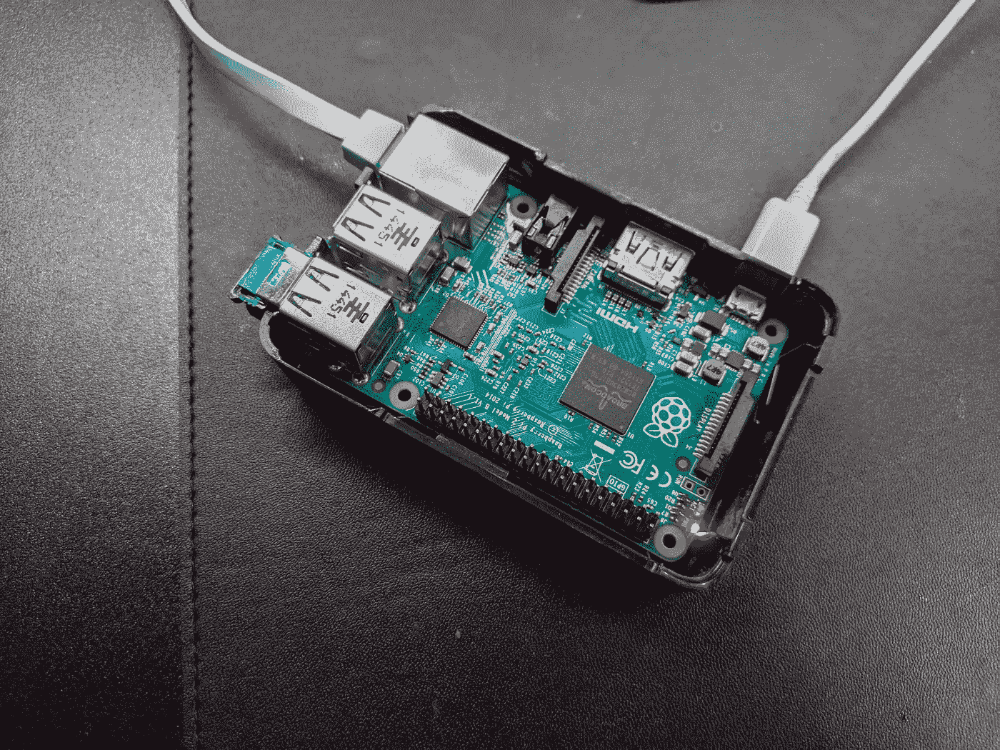
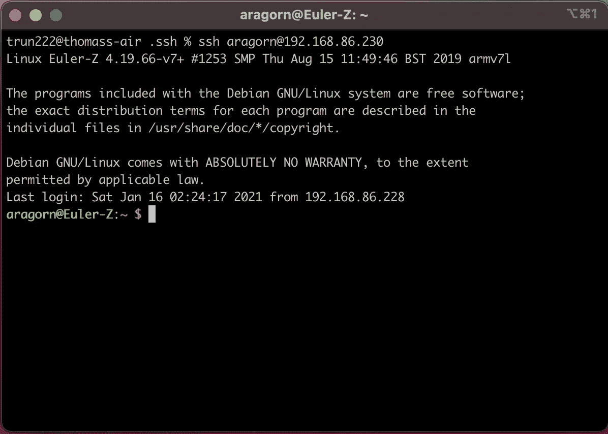
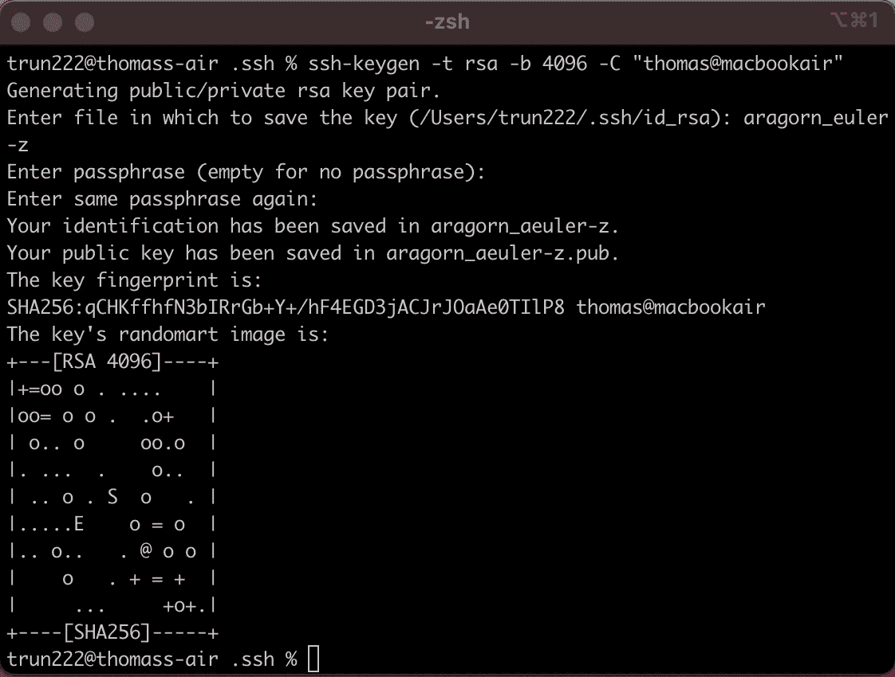
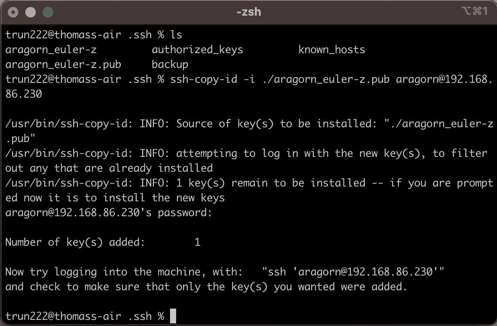
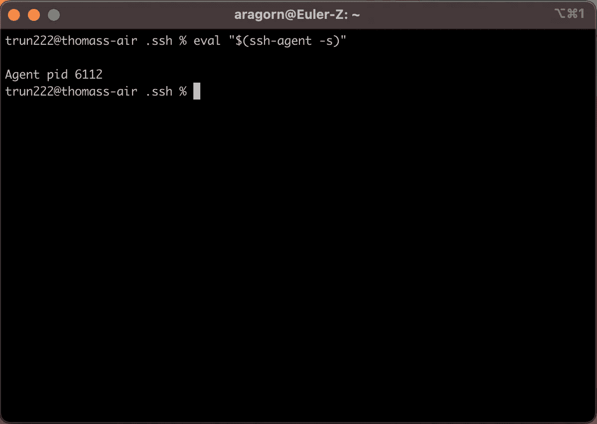
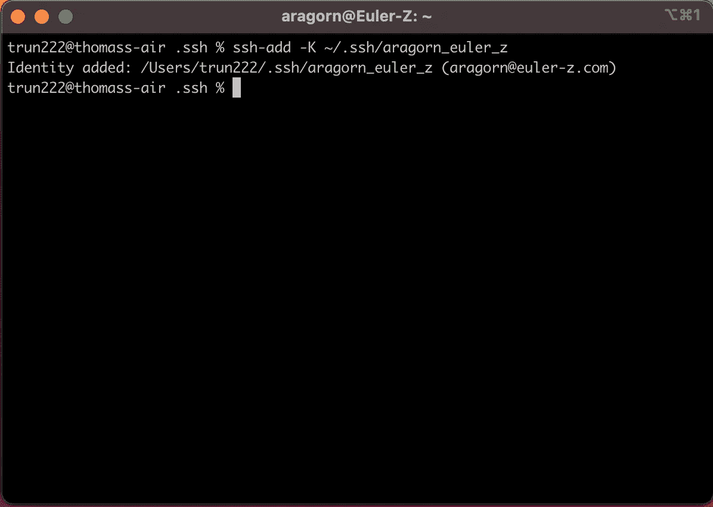

# Raspberry Pi 上的无密码 SSH

> 原文：<https://levelup.gitconnected.com/password-less-ssh-on-raspberry-pi-9295136afb32>

你所需要的是一台电脑和一个通过以太网电缆连接到网络的 Raspberry Pi，或者如果你使用的是 Raspberry Pi 3 或更旧版本，则使用 wifi 加密狗和 micro-USB 电源适配器。在我的下一篇文章中，我们将讨论如何通过电子 GUI 设置 Rsync 并连接到 Raspberry Pi，以及在两个设备之间同步文件。本文将作为安装指南。



树莓 Pi 3

## 在网络上寻找我的树莓派

有几种不同的方法可以找到您的树莓 Pi 的本地网络地址。如果你没有把它连接到显示器上，通常安装 *Nmap* 并在本地网络中搜索不同的主机及其相应的 IP 地址会更容易。

如果你运行的是 Ubuntu 或者 Debian，你可以安装 *Nmap*

```
sudo apt-get install nmap
```

要找到你的网络 IP 范围，你可以使用终端命令 *ifconfig* 。(注意:如果您将您的 Raspberry Pi 连接到一个监视器，您可以登录到它，并在 Pi 上运行这个命令，一旦您有了 Pi 的 ip 地址，就跳到生成 SSH 密钥)。

```
en0: flags=8863<UP,BROADCAST,SMART,RUNNING> mtu 1500
 options=400<CHANNEL_IO>
 ether 18:3e:ef:cb:ac:0f
 inet 192.168.86.228 netmask 0xffffff00 broadcast 192.168.86.255
 nd6 options=201<PERFORMNUD,DAD>
 media: autoselect
 status: active
```

我们关心的是 **inet 192.168.86.228** 。这是我的计算机的当前本地 IP 地址。对于 *Nmap* 扫描，您将使用前三个地址空间，但是对于第四个，您将把它设置为 0。这将确保 *Nmap* 扫描最终地址空间内的所有可能地址(查看在该特定网络地址空间下哪些设备连接到网络)。

```
nmap -sP 192.168.86.0/24
```

运行该命令后，您应该会看到在给定的网络地址空间下连接到您的网络的所有设备。下面是我得到的树莓派的结果。我现在有了 Raspberry Pi 的 IP 地址，并且能够通过 SSH 连接到它。

```
Nmap scan report for euler-z.lan (192.168.86.230)
```

## 在 Raspberry Pi 上配置 SSH

第一步是 SSH 到 Raspberry Pi。使用上面的 IP 和你的 Raspberry Pi 用户名。

```
ssh aragorn@192.168.86.230
```

系统将提示您输入密码。输入密码并成功连接后，您应该会看到一个类似下面截图的屏幕。



成功地 SSH 到树莓 Pi

我们现在将编辑本地 SSH 服务器，并添加或调整必要的配置设置，这样我们就可以连接到 Pi，而无需输入密码。

```
sudo vim /etc/ssh/sshd_config
```

在 *sshd_config* 文件中，我们需要确保相应地设置了以下设置。

```
PubkeyAuthentication yes
PasswordAuthentication yes
PermitEmptyPasswords no
```

*PubkeyAuthentication* 是一个重要的设置。我还包含了*密码认证*，以防您意外生成密钥并将其错误地添加到 Raspberry Pi 中，并通过关闭 SSH 会话将自己锁在外面。一般来说，一旦你设置好了一切，最好的做法是将*密码认证*设置为否，而使用你的 SSH 密钥来连接，因为这样更安全。将 *PermitEmptyPasswords* 设为 no 也是一个好主意，因为这将允许人们连接到您的 Raspberry Pi，而无需输入密码，并且如果他们是您本地网络的一部分，也无需任何其他安全措施。

现在我们已经更新了我们的设置，我们需要重启 Pi 的 SSH 服务器。

```
sudo /etc/init.d/ssh restart
```

一旦您的 Pi 的 SSH 服务器使用新的配置设置重启，您就可以继续生成 SSH 密钥并将其添加到 Raspberry Pi 中。

## 生成 SSH 密钥

在这一节中，我将带您了解如何在本地计算机上生成 SSH 密钥，以便您可以自动登录到您的 Raspberry Pi。



生成 SSH 密钥

您会注意到在上面的截图中*生成 SSH 密钥*我运行的第一个命令是

```
ssh-keygen -t rsa -b 4096 -C "thomas@macbookair"
```

*   -t 是要创建的密钥类型
*   -b 代表您希望 SSH 密钥的位数
*   -C 用于添加注释

*注意:使用-C 有助于输入用于生成密钥的计算机的名称，这样当密钥被添加到远程主机时，该名称在 *authorized_keys* 文件中可见。如果您有一个特定主机的多个 SSH 连接，它将帮助您识别哪个键与哪个客户机对应。

您将在下一步中注意到:

```
Enter file in which to save the key (/Users/trun222/.ssh/id_rsa): aragorn_euler-z
```

我选择将自动生成的 *id_rsa* 重命名为 *aragorn_euler-z* 。如果您有多个 SSH 连接和密钥。重要的是要通过重命名键来区分它们，不要覆盖现有的键。以密钥所连接的主机或服务来命名密钥会很有帮助。对于 aragorn_euler-z，aragorn 是我为无密码 SSH 设置的用户，euler-z 是主机。

对于密码短语

```
Enter passphrase (empty for no passphrase):
```

和密码短语确认

```
Enter same passphrase again:
```

只需点击**并输入**两次，然后将密码保留为空字符串。通过将密码保留为空字符串而不是输入密码，当您通过 SSH 连接到您的主机时，您将不必键入密码。


生成的 SSH 密钥

如果您在您的 *~/中生成 SSH 密钥之后执行一个 *ls* 命令。ssh* 目录中，您应该会看到新创建的 ssh 密钥。你会有类似*阿拉贡 _ 欧拉-z* 和*阿拉贡 _ 欧拉-z.pub* 的东西。关键的结尾是。pub 是您的公钥，不带扩展名的密钥是您的私钥。您不得将您的私钥从生成它的计算机上移走，并且您必须采取安全措施以确保其他人无法访问它。如果有人获得了您的私钥，他们就可以在您不知情的情况下连接到您的设备。另一方面，公钥可以安全地复制和移动到远程设备和服务。这就是为什么它被称为*公钥*的原因，因为它可以公开使用。



将 SSH 公钥复制到 Raspberry Pi

在为新设备生成和准备 SSH 密钥的最后一步中，我们复制新生成的 SSH 公钥，并使用 ssh-copy-id 命令将其添加到我们的 Raspberry Pi 中。这个命令使得向任何运行 Linux 的远程设备添加新的公钥变得容易。该命令将通过 SSH 登录到我们的新设备，并提示我们输入密码，在我们正确输入密码后，新的 SSH 公钥将在 *~/中附加到我们的 Raspberry Pi 上的 *authorized_keys* 文件中。ssh/authorized_keys* 。

只需键入:

```
ssh-copy-id -i ./aragorn_euler-z.pub aragorn@192.168.86.230
```

*   -i 是身份文件或新生成的 SSH 公钥***确保您没有复制您的私钥**
*   aragorn 是我登录的用户，192.168.86.230 是主机(Raspberry Pi)

该命令成功完成后，您可以继续下一步，我们将通过登录 Raspberry Pi 来测试新的 SSH 密钥。

# 无密码 SSH 工作流

既然您已经知道了您的 Raspberry Pi 的本地 IP 地址，并且已经生成了您的 SSH 密钥并将它们添加到 Pi 中，那么是时候启动 SSH 代理并测试登录到您的 Raspberry Pi，以确保我们已经正确地设置了一切。在我的下一篇文章中，一旦需要运行电子 Rsync GUI，我们将重用这个步骤。



启动 SSH 代理

上面的命令 *eval "$(ssh-agent -s)"* 将在您当前的终端会话中运行您的 ssh-agent(注意:如果您在 VSCode 或另一个编辑器中打开一个新的终端会话，您很可能需要重新执行这些步骤，因为执行上下文可能会丢失)。



将您生成的私钥添加到 SSH 代理中

*ssh-add -K ~/。ssh/aragorn_euler-z* 将我生成的 ssh 私有密钥添加到我的本地 ssh-agent 中。这样做是安全的，因为它是我的本地计算机，并且只在 ssh-agent 运行时存在。当执行 ssh 命令时，ssh 代理和 SSH 代理中存储的任何密钥都可能是主机的有效密钥。可以把它想象成一个钥匙圈，其中有许多不同主机的许多可能的密钥，但是只有一个密钥适用于特定的主机。


测试无密码登录

在您的 ssh-agent 正在运行并且您已经将您的 ssh 私有密钥添加到 ssh-agent 之后，是时候测试使用 SSH 连接到您的 Raspberry Pi 了。使用您从 *ifconfig* 或 *Nmap* 获得的 IP 地址，形成您的 SSH 命令，类似于上面的截图(注意:此时，如果您正确地遵循了前面的所有步骤，应该不会提示您输入 SSH 的密码)。

如果您可以登录，那么您已经正确地设置了无密码 SSH 登录流。在我的下一篇文章中，我们将重用其中的一些步骤，以便我们的 Rsync 客户端可以连接到 Raspberry Pi，而无需用户干预。

**来源**

*   SSH 密钥生成[https://docs . github . com/en/github/authenticating-to-github/generating-a-new-SSH-key-and-add-it-the-SSH-agent](https://docs.github.com/en/github/authenticating-to-github/generating-a-new-ssh-key-and-adding-it-to-the-ssh-agent)
*   将 SSH 密钥添加到服务器[https://www.ssh.com/ssh/copy-id](https://www.ssh.com/ssh/copy-id)
*   NMAP[https://vitux . com/find-devices-connected-to-your-network-with-nmap/](https://vitux.com/find-devices-connected-to-your-network-with-nmap/)