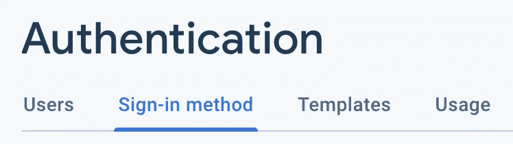
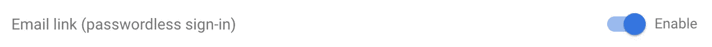
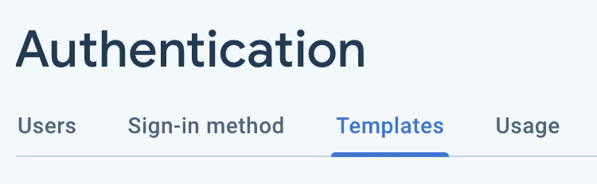

# 使用 Firebase 和 Vue.js 通过电子邮件链接进行无密码登录

> 原文：<https://levelup.gitconnected.com/passwordless-sign-in-via-email-link-with-firebase-and-vue-js-c59bda826049>


图片由 [kopcan](https://pixabay.com/de/users/kopcan-7573821/?utm_source=link-attribution&utm_medium=referral&utm_campaign=image&utm_content=3109879) 在 [Pixabay](https://pixabay.com/de/?utm_source=link-attribution&utm_medium=referral&utm_campaign=image&utm_content=3109879) 上拍摄

通过使用密码管理器，注册和登录变得很容易。虽然不是一直如此。有些网站限制长度或不允许某些字符。此外，自动填充并不总是有效，这需要我们到处复制和粘贴密码。

不是每个人都使用密码管理器。因此，多个站点使用相同的密码。或者写在纸上或作为数字笔记。

Medium 支持仅使用电子邮件地址登录。没有密码。在撰写本文时，[故障排除](https://help.medium.com/hc/en-us/articles/115004914788-Can-I-set-up-a-password-)提到它们不支持密码。

使用 Firebase 身份验证进行设置是可能的。



在**选项卡下**认证**中的**登录方式【启用**邮件链接**



在我们的 Vue.js 应用程序中，我们需要能够触发两个动作。首先将登录链接发送到用户输入的电子邮件地址。如果用户通过该链接打开应用程序，则让用户登录。

文章期望我们已经为我们的项目添加了 Firebase 依赖项和凭证。如果没有，我们在[文档](https://firebase.google.com/docs/web/setup)中找到设置。

至于发送链接，我们使用 Firebase 认证模块。

发送链接

运行该函数会将链接发送到带有参数的电子邮件。我们还需要存储用过的电子邮件，因为我们将在下一步中需要它。如果我们使用的是 [vuex](https://vuex.vuejs.org/) ，我们可以包装上面的函数。

确保我们存储电子邮件以备后用

除了使用 vuex 状态，我们还可以将它直接存储在 [localStorage](https://developer.mozilla.org/en-US/docs/Web/API/Window/localStorage) 或其他地方。

在`actionCodeSettings`中指定的路线中，我们需要处理用户通过电子邮件获得的链接。

该链接包含 **apiKey** 、用于识别请求的**一次性代码**以及在`actionCodeSettings`中指定的 **url**

```
https://appname.firebaseapp.com/__/auth/action?
**apiKey**=${APIKEY}&
**mode**=signIn&
**oobCode**=${OOBCODE}&
**continueUrl**=${URL}&
**lang**=en
```

在 Vue.js 生命周期的`created()`步骤中，我们可以检查当前的 url。使用`location.href`并将结果传递给`isSignInWithEmailLink`。如果是登录链接，我们让用户登录。

检查是否是登录链接后，登录用户

我们再次获得先前存储的`signInEmail`来与`signInWithEmailLink`一起使用。

在`created()`中有很多逻辑，我们应该在使其工作后将其提取到服务中。

登录作品。

这两个步骤:

*   向电子邮件发送链接
*   如果通过链接进入应用程序，则验证用户

就是所谓的幸福之路。

有些问题我们也应该处理。

## 用户使用不同于请求链接的浏览器打开链接

用户在 Chrome 上请求链接，然后用 Firefox 打开，这看起来像是桌面上的边缘情况，但在移动设备上可能会更常见。

如果我们使用二维码让用户使用应用程序。iOS 用户将使用相机应用程序扫描二维码。相机应用程序将打开 Safari。然后，用户使用他的 Gmail 地址请求电子邮件链接。如果安装了 Chrome，在 Gmail 应用程序中打开链接会打开 Chrome。但是我们已经在 Safari 中存储了`signInEmail`。即使我们有一个有效的链接，如果不再次提示用户输入电子邮件，登录是不可能的。

我们会向用户解释手头的问题。再次索要邮件。然后触发`signInWithEmailLink`。上面的代码需要修改，以检查它是否是一个有效的链接，以及`signInEmail`是否存在。

`created()`中的代码可以改为

要求用户提供电子邮件以继续链接

如果用户现在提供不同的电子邮件，这将导致错误。

## 登录链接已被使用

Firestore 将在第二次尝试使用该链接登录时提供代码为`auth/invalid-action-code`的错误。我们需要告诉用户再次尝试登录。该链接只有效一次。

## 包含登录链接的电子邮件不会到达

这个问题出现在一些邮件提供商身上。

解决方案是在**模板**选项卡下的**认证**中提供您自己的 SMTP 设置



我们将配置 Firebase 使用我们自己的邮件服务器。这不是一个大问题，因为我们可能已经有一个接收电子邮件的地址，我们的域名。

## 定制电子邮件模板

默认情况下，用于发送链接的邮件如下

```
Hello,We received a request to sign in to appname.com using this email address. If you want to sign in with your mail@mail.com account, click this link:[Sign in to appname.com](https://firebase.google.com/)If you did not request this link, you can safely ignore this email.Thanks,Your appname.com team
```

点击登录链接，您将进入上述`actionCodeSettings`中提供的添加了 url 参数的页面。

定制邮件是不可能避免滥用它的垃圾邮件。我们可以把内容替换成我们的广告，然后通过`sendSignInLinkToEmail`发送到我们认识的每一个电子邮件。Firebase 不希望这样。

要定制它，我们需要自己实现登录流程。

一些我们可能不想要的东西。以及我们首先使用 Firebase Auth 的原因。开始的时候上面的邮件应该就够了。