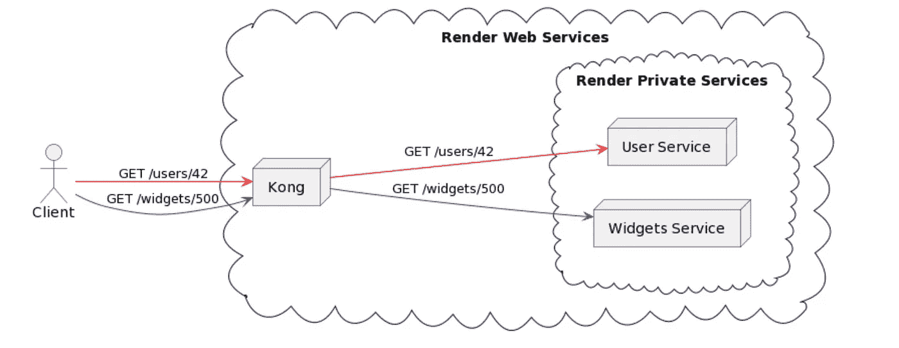
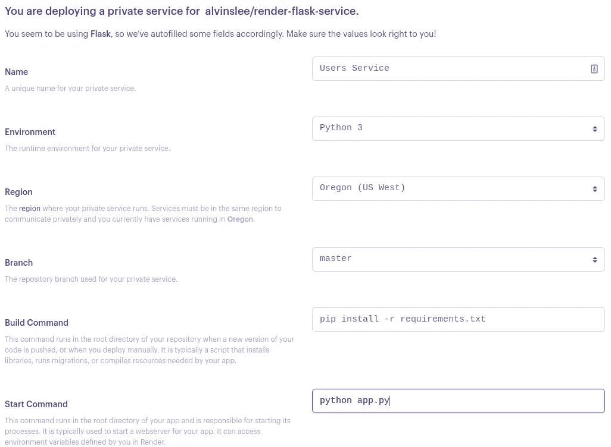
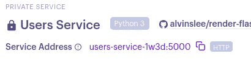
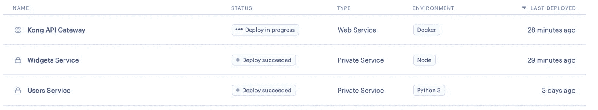

# 基于路径的路由在 Kong API 网关中的实现

> 原文：<https://levelup.gitconnected.com/path-based-routing-in-render-with-kong-api-gateway-4ad84f13058f>


照片由[米切尔罗](https://unsplash.com/@mitchel3uo?utm_source=unsplash&utm_medium=referral&utm_content=creditCopyText)在 [Unsplash](https://unsplash.com/s/photos/maze?utm_source=unsplash&utm_medium=referral&utm_content=creditCopyText)

## 咖啡店里的编码

## 部署微服务进行渲染时，使用基于路径的路由作为利用 API 网关的解决方案。

如果您正在构建一个微服务支持的应用程序，一个关键的好处是将您的应用程序的关注点分离到各个微服务上，每个微服务都有自己的能力来扩展和封装不同的功能。前端——表面上是在用户浏览器中运行的单页应用程序——将需要访问组成 web 应用程序的微服务。每项服务都可以直接进入公共网络，但这增加了安全隐患。

然而，API 网关允许一个集中层来处理认证、流量监控或请求和响应转换等问题。API 网关也是利用速率限制和缓存来提高应用程序的弹性和性能的好方法。

[Render](https://render.com/) 是一个一站式商店，用于直接从现有的 GitHub 或 GitLab repo 部署基于微服务的 web 应用。虽然 Render 提供了许多资源来支持微服务和数据库，但一个不可配置的元素是 API 网关——类似于 [AWS API 网关](https://docs.aws.amazon.com/apigateway/latest/developerguide/welcome.html)或 [Azure 应用网关](https://docs.microsoft.com/en-us/azure/application-gateway/overview)。尽管对 API 网关的访问不是一个带有 Render 的点击式附加组件，但仍然有可能安装并运行一个。

在本帖中，我们将介绍如何为基于路径的路由设置渲染，以便我们可以在微服务前使用 [Kong Gateway](https://konghq.com/kong/) 。让我们先简要概述一下我们的方法。

# 我们的小型项目概述

我们将使用 Render 部署两个简单的微服务后端。一个是 Python Flask 服务，另一个是基于 Express 构建的 Node.js 服务。



预期的最终结果如图 1 所示。我们将部署两个私有服务和一个 web 服务 Kong，它将接受请求并将其路由到这些私有服务。从客户的角度来看，他们似乎是在与单个应用程序进行交互。实际上，他们是在跨微服务生态系统请求资源。

## 部署为私有服务的微服务

Render 中主要有两种类型的服务部署: [web 服务](https://render.com/docs/web-services)和[私有服务](https://render.com/docs/private-services)。公共网络可以直接访问网络服务。另一方面，私有服务只能在渲染账户生态系统内的*私有云中使用。这是一件好事，因为它允许您更好地控制微服务生态系统内的安全性和访问。*

我们的两个微服务都将部署为私有服务。

## 部署为 web 服务的孔网关

Kong 是一个高性能、开源的 API 网关，在当今世界上许多最大的 web 应用程序中都有使用。虽然 API 网关有许多选择，但 Kong 的突出之处在于它与云和应用程序无关，具有高度可配置性，而且最重要的是速度快。

我们将把 Kong Gateway 部署为一个 web 服务，可通过公共 web 访问。Kong(只有 Kong)可以访问我们的两个私有微服务，我们将对其进行配置，以进行适当的请求路由。

# 使用 Render 部署微服务

让我们从设置和部署我们的两个微服务开始。

## 使用 Python 和 Flask 的“用户”微服务

Flask 是一个低门槛的 Python 服务框架。我们只需要一个 Python 文件就可以让一个最小的 API 在 Flask 上运行。该服务的代码可从 [GitHub](https://github.com/alvinslee/render-flask-service) 获得。下面的代码片段创建了一个带有`/users`端点的工作服务，它返回一个简单的 JSON 响应和状态代码:

```
from flask import Flask, jsonifyapp = Flask(__name__)@app.route("/users")def root():
    return jsonify({'userId': 42}), 200if __name__ == "__main__":
    app.run(host='0.0.0.0')
```

需要注意的一个重要细节是，为了让 Render 自动为您的服务公开正确的主机和端口，您必须**确保将您的应用程序绑定到** `**0.0.0.0**`和**，而不是** `localhost`或`127.0.0.1`。`0.0.0.0`和`127.0.0.1`的区别在于接受传入请求的范围。使用传统的回送地址`127.0.0.1`，只允许来自同一台机器的请求。`0.0.0.0`地址允许来自任何网络接口的请求和我们在这里需要的东西被 Render 拾取。

要在 Render 中将它部署为私有服务，首先单击 Render dashboard 中的 **New** 按钮，并使用 Flask 应用程序选择 git repo。设置服务**名称**和**开始**T21 命令。所有其他配置选项可以保留默认值。或者，您可以向您的存储库中添加一个`render.yaml`文件，配置如何部署这个服务。不过，在我们的演示中，我们将浏览用户界面。



Render 提供免费层，一直到企业级托管服务。选择一个符合你需求的。选择您希望部署的分支，并设置构建和启动命令。通常对于 Python 应用程序，构建应用程序只需要将所有适当的依赖项都准备好。我们可以通过运行`pip install -r requirements.txt`来实现。启动我们服务的命令是`python app.py`。

一旦您对您的选择感到满意，点击**创建私人服务**。几分钟后，您的服务将启动并运行！

请注意您私人服务的内部服务地址:



本例中，我们的服务地址是[http://users-service-1w3d:5000](http://users-service-1w3d:5000/)。请记住，这是一个私人服务，在我们的渲染帐户之外无法访问。

## Node.js 和 Express 的“Widgets”微服务

部署 Node.js 服务与部署 Python 服务几乎是一样的，尽管建立 Node.js 项目所需的代码更加复杂。我们构建了一个简单的“小部件服务”，端点在`/widgets`。这项服务的代码可以从 GitHub 获得。

将它部署为私有服务几乎与 Python Flask 服务一样。您将从渲染面板添加一个新的私有服务，并使用 UI 中的选项。构建和启动命令是需要密切关注的字段，以确保使用来自`package.json`文件的正确脚本来正确构建和启动应用程序。对于这个服务，build 命令需要安装所有的依赖项，然后构建分发包。这是通过依次使用两个命令来完成的，比如:`npm install && npm run build`。

双&符号意味着第一个命令必须在第二个命令开始之前成功完成。这也是如何在渲染表单中链接命令以在一个步骤中实现多个操作的示例。构建阶段完成后，我们可以使用 `npm run start:prd`脚本启动服务。同样，记住将你的应用程序绑定到`0.0.0.0`，以便 Render 自动知道如何在内部连接到它。该服务使用的端口和 IP 在`src/constants.ts`文件中定义，当前设置为`0.0.0.0:5001`。

## 设置孔网关

我们将把 Kong 部署为一个 web 服务，并将其配置为基于请求路径路由到我们的上游私有服务。Kong 通常与 PostgreSQL 之类的数据库一起设置，PostgreSQL 保存网关的配置数据。不过，还有一个更简单的设置，Kong 称之为“[无数据库声明式配置](https://docs.konghq.com/gateway/2.8.x/reference/db-less-and-declarative-config/)”在这种方法中，Kong 不需要数据库，配置在服务启动时加载并存储在其内存中。

下面是一个简单的配置文件(`kong.yaml`)，它将 Kong 配置为路由到我们的私有服务。我们所有与孔有关的文件都可以在 GitHub 上找到。

```
_format_version: "2.1"
_transform: trueservices:
- name: user-service
  url: http://users-service-1w3d:5000
  routes:
  - name: user-routes
    paths:
    - /user-service
- name: widget-service
  url: http://widgets-service:5001
  routes:
  - name: widget-routes
    paths:
    - /widget-service
```

需要前两行来指导 Kong 使用正确的版本以及如何使用这个配置。

`services`块详细描述了我们希望 Kong 将传入流量路由到的所有目的地，该路由基于在`paths`块中为每个服务设置的路径。您可以在这里看到服务列表包含了两个部署来呈现的私有服务的 URL。例如，我们的 web 服务(Kong)将监听对`/user-service`路径的请求，然后将该请求转发给`[http://users-service-1w3d:5000](http://users-service-1w3d:5000.)` [。](http://users-service-1w3d:5000.)

## 将孔部署在码头集装箱中

用 Render 来部署 Kong 会和我们的两个微服务有一点不同。我们需要将其部署为 web 服务，并在配置过程中使用自定义 Docker 应用程序选项。

下面的 Dockerfile 文件将提供一个 Kong 的无 DB 实例，它将从名为`kong.yaml`的文件中读取上面的静态配置。这将端口`8000`设置为孔监听传入请求的端口。如果您使用`EXPOSE 8000`，Render 将自动从 Docker 映像中选取该端口以用于该服务。

```
FROM kong:2.7.1-alpineCOPY kong.yaml /config/kong.yamlUSER rootENV KONG_PROXY_LISTEN 0.0.0.0:8000
ENV KONG_DATABASE off
ENV KONG_DECLARATIVE_CONFIG /config/kong.yaml
ENV PORT 8000EXPOSE 8000RUN kong start
```

在将您的存储库与 Kong Dockerfile 文件和配置文件连接起来之后，请确保您选择了一个至少具有 1GB RAM 和 1 个 CPU 的层。Kong 在共享 CPU 上利用有限的资源执行不稳定的操作。其余的默认配置可以保持不变。

部署后，您的渲染仪表板应包含三个服务:



一旦 Kong 成功部署，您可以使用`curl`或 [Postman](http://postman.io/) 来测试这个设置。发出以下请求，以确保分别正确路由到**用户**和**小部件**服务:

```
curl https://kong-gateway-lh8i.onrender.com/widget-service/widgets/10 -i -H "kong-debug: 1"
```

附加的`kong-debug`头告诉 Kong 向响应头添加一些调试信息。我们可以使用该信息来验证成功的设置。您应该会在响应中看到如下内容:

```
HTTP/2 200
content-type: application/json; charset=utf-8
kong-route-id: 8b2d449d-9589-5362-a2a1-3be5683a8f97
kong-route-name: widget-routes
kong-service-id: 6c8de697-474a-54cf-a59e-4ad086047749
kong-service-name: widget-service
via: kong/2.7.1
x-kong-proxy-latency: 61
x-kong-upstream-latency: 11
x-powered-by: Express{"widget":"10"}
```

请注意以 Kong 为前缀的标头，这些标头详细描述了用于将请求路由到适当的上游服务的路由和服务。

类似地，您可以使用以下命令测试**用户**服务路由:

```
curl https://kong-gateway-lh8i.onrender.com/user-service/users -i -H "kong-debug: 1"
```

# 结论

在本文中，我们探索了 Render 提供的云托管解决方案。具体来说，我们演示了如何将 Kong Gateway 部署为一个 web 服务，该服务处理到微服务的基于路径的路由，这些微服务被部署为私有服务。这种部署模式可以为微服务支持的应用程序的可伸缩和灵活的生产部署做好准备。