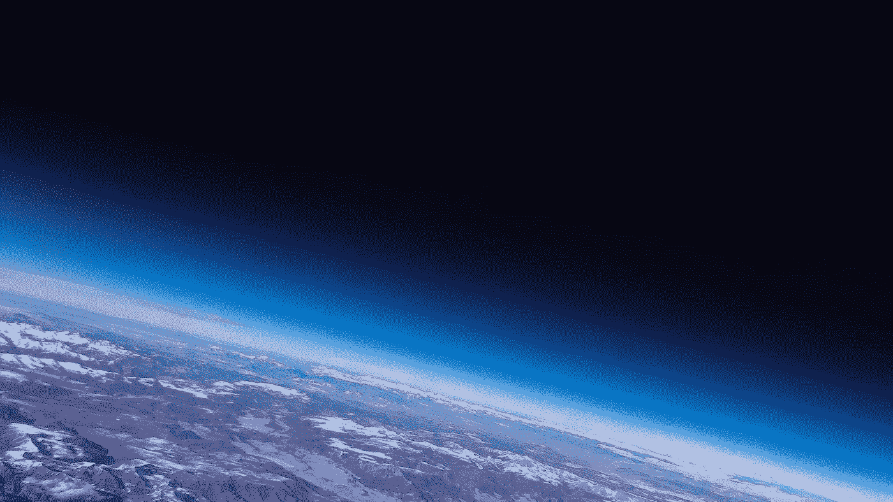
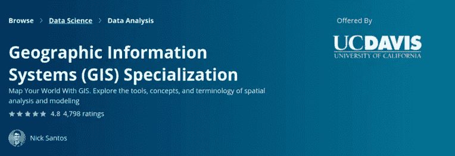
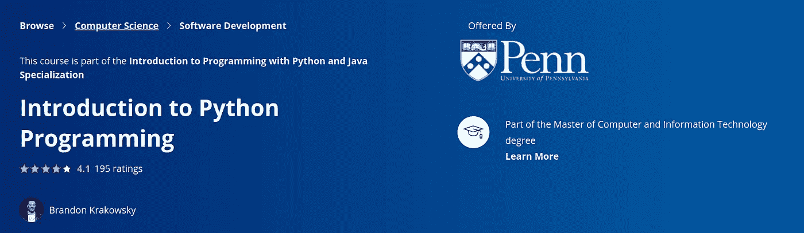
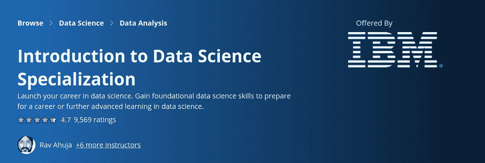
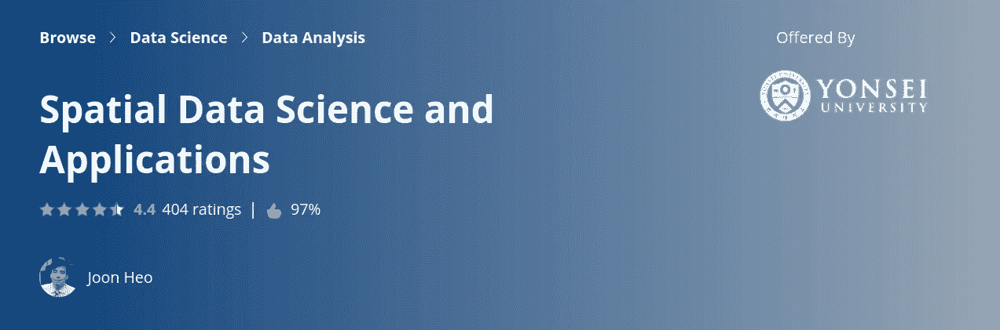
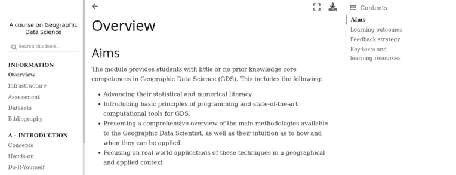
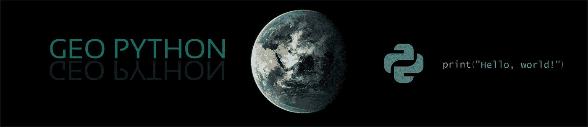

# 2021 年免费掌握地理空间数据科学的途径

> 原文：<https://levelup.gitconnected.com/pathway-to-master-geospatial-data-science-for-free-in-2021-2a206e635762>

## 在线课程、书籍和文档…

学习地理空间数据科学的需求越来越大，这不仅是因为基于位置的数据供应呈指数增长，还因为我们认识到许多问题都与位置/时间有关。以预测房价这一常见的数据科学问题为例。凭直觉，我们知道这样的任务需要很好地理解位置(即市中心的房价会比郊区的房价高)。



在 [Unsplash](https://unsplash.com?utm_source=medium&utm_medium=referral) 上 [ActionVance](https://unsplash.com/@actionvance?utm_source=medium&utm_medium=referral) 拍照

我们将把这些途径分解成 **4 个独立的部分**，从入门课程开始，一直到更高级和特定主题的在线课程。

```
**Table of Content** 1\. Introductory Level
2\. Intermediate Level
3\. Advanced Level
4\. Topic-specific
```

本课程的**目标**是让你具备处理地理空间数据科学的足够知识和技能，从数据采集到建模再到部署。所以事不宜迟，让我们开始我们的学习之旅吧！

# 入门水平

如果不首先了解地理空间领域的组成部分，你将无法掌握地理空间数据科学。

1.  [**【地理信息系统简介】(GIS**](https://www.coursera.org/specializations/gis) **)**

这个 Coursera 专业化将为您提供必要的技能和知识，开始与 GIS。它提供了几个子课程，涵盖的主题包括典型的 GIS **数据**格式、流行的 GIS **工具箱**、GIS **项目管理**，以及一些更流行的 GIS **应用**(例如环境分析、城市规划、打车业务分析)。



图片来自 coursera.org

[2。Python 编程简介](https://www.coursera.org/learn/python-programming-intro)

我们的大多数地理空间数据科学项目将使用 Python 编程语言。如果你还不熟悉，可以考虑参加 Coursera 的免费课程。



图片来自 coursera.org

[**3。数据科学导论**](https://www.coursera.org/specializations/introduction-data-science)

现在我们已经熟悉了 GIS 和 Python 编程的基础，我们需要学习其中的数据科学部分。有很多资源，但是我将推荐一个由 IBM 提供的与 GIS 相关应用程序密切相关的资源。

这个专业将教会你数据科学家的方法。它将涵盖数据科学家的思维方式和工具等主题。此外，您将熟悉具体的统计概念，以及如何在现实生活中处理数据问题。



图片来自 coursera.org

到目前为止，您已经对地理空间数据科学有了一些基本的概念。现在让我们转到中级水平。

# 中间的

这个组件的目的是**综合**或者说如何将我们的 GIS 和数据科学知识结合在一起。

**4。** [**空间数据科学**](https://www.coursera.org/learn/spatial-data-science)

本课程将向您介绍空间数据科学的基础知识，包括它的**为什么**和**什么**。随后，您将了解地理空间数据科学的主要内容，包括:

a.空间数据采集

b.空间数据库建设

c.面向大查询的拓扑和空间索引

d.空间统计:相关性、不确定性



图片来自 coursera.org

# 先进的

最后，路径的高级部分将**整合**你所有的知识和一些更流行的地理空间数据科学工具。这种高级课程要求至少对 GIS、Python 编程和数据科学工具包有很好的理解。

[**5a。地理数据科学**](https://darribas.org/gds_course/content/home.html) **(理论)**

本课程将让你接触到需要地理空间数据科学专业知识的现实世界问题。它将带您浏览一些更流行的 Python 库，如 gdal、geopandas 和 fleed。重点是**动手练习**，所以我建议你真的把手弄脏，对给你的任务做尽可能多的实验。



[**5b。地理数据科学**](https://geo-python.github.io/site/) **(编程)**

这个课程也和上面的课程相似，但是它给了你一个更实际的方法去操作**编程**部分。您可以选择其中任何一个，但是我建议浏览两个内容，让您对地理空间数据科学有一个更完整的了解。



图片来自 Geo Python

# 特定主题

既然我们已经结束了我们的学习之旅，请允许我介绍一些大家可能感兴趣的特定主题的课程。

[**可选 1:地理空间可视化**](https://www.coursera.org/projects/geospatial-bigdata-visualization-keplergl)

地理空间数据科学中的可视化是关键，因为大多数见解可以通过有效的插图更好地交流。

[**可选 2:卫星影像上的历史**](https://www.coursera.org/learn/human-spaceflight)

如果你曾经想知道卫星图像是什么，为什么，以及如何，那么这个课程可以是一个很好的和信息丰富的教训。

# **结论**

这篇文章为你提供了一条掌握地理空间数据科学的途径。这绝不是指令性的，我们鼓励你去发现适合你的途径。如果你有任何建议不在这个列表中，请在回复部分告诉我。快乐学习！

如果你喜欢这种帖子，请考虑订阅我的 [**电子邮件简讯**](https://tinyurl.com/2npw2fnz) ，在那里我会定期用简单的英语和漂亮的可视化语言总结编程技巧和人工智能研究论文。