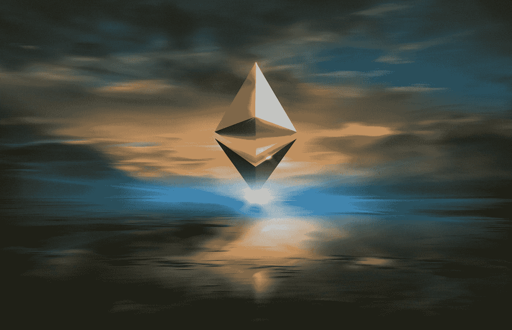

# 耐心是有回报的

> 原文：<https://levelup.gitconnected.com/patience-pays-b8d0ec62c509>

在生活中，爱，也是秘密

[Zoltan·塔斯](https://unsplash.com/@zoltantasi?utm_source=medium&utm_medium=referral)在 [Unsplash](https://unsplash.com?utm_source=medium&utm_medium=referral) 上的照片

我从来都不是一个有耐心的人。见鬼，我在纽约长大，设法比那里的人群走得更快——我绕过其他行人，就像他们站着不动一样。

那是我得癌症前的日子。从那以后，我慢了很多。我也变得更有耐心了。

癌症对此有所帮助。你不能催促医生。他们会让你等着，抱怨也没用。

虽然我从来没有希望得到癌症诊断，但学会耐心已经成为那片可怕乌云中的一线希望。

耐心不仅在生活和爱情中是一种美德，在投资方面也是如此。这一点最近在我身上得到了验证，因为在 6 月和 7 月，当我的密码组合沉入马桶时，我感到很冷。

我知道有人惊慌失措卖掉了。我也认识一些做了明智之举的人——他们沿着向下的斜坡继续买入。我做了一些，直到我用完了可消耗的现金。

然后我等着。耐心地。

这是我 20 多岁时做不到的事。但我学会了耐心。

而且，这是值得的。

crypto 将何去何从？我很想说“去月球！”实际上，我有点相信了。尽管我对新牛市的预测半信半疑。就在一个月前，这些人中的许多人还在预测厄运和悲观。他们从 0 到 60 的速度比 20 年的布加迪还快。

我比较保守一点。我不认为比特币会在这个周期达到 100 万美元。我可能是错的，但我认为 10 万美元到 15 万美元之间的范围更合理。

至于替代硬币…以太坊正在经历屋顶。伦敦硬分叉似乎是所有投资者的预期。我很高兴去年冬天我上了以太坊。对于那些还没有买入的人，我会尽可能逢低买入。我相信以太坊真的要去月球了。

其他硬币呢？我真的很喜欢波利贡、卡尔达诺、韦钱……有些人对 XRP，甚至是总督很感兴趣。

对于那些更注重安全性的人来说，如果你真的想要一份稳定的投资，你为什么要从事加密行业呢？甚至钻井公司的股票也可能更稳定。

然而，如果你不介意一些风险，但想减轻最糟糕的情况——将你的大部分加密投资放在比特币和以太坊上。仔细研究其他替代硬币。希望埃隆·马斯克不要再发推文让市场崩溃了。