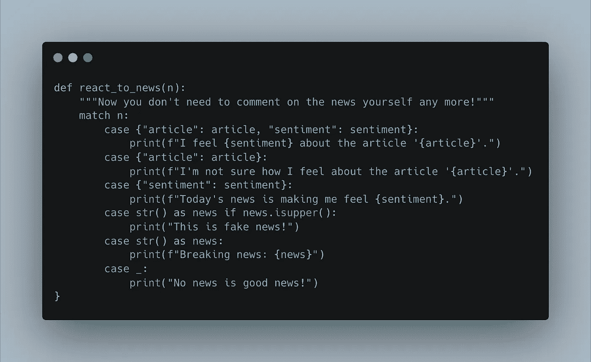
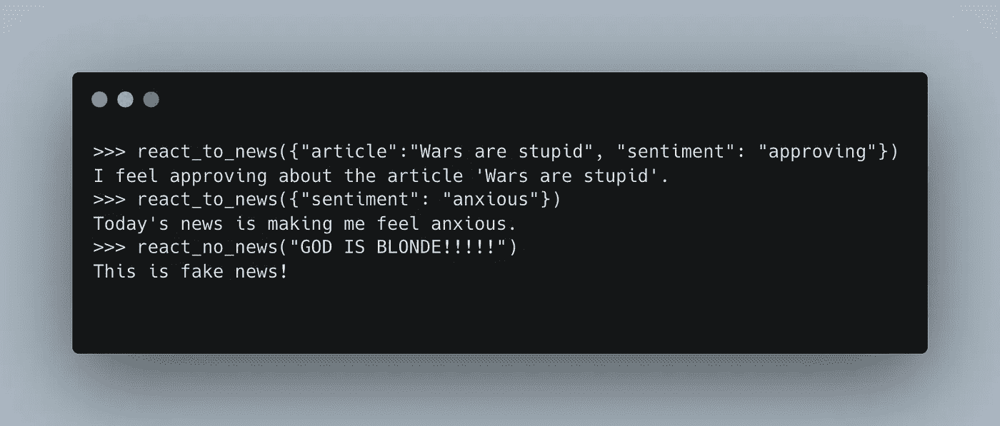
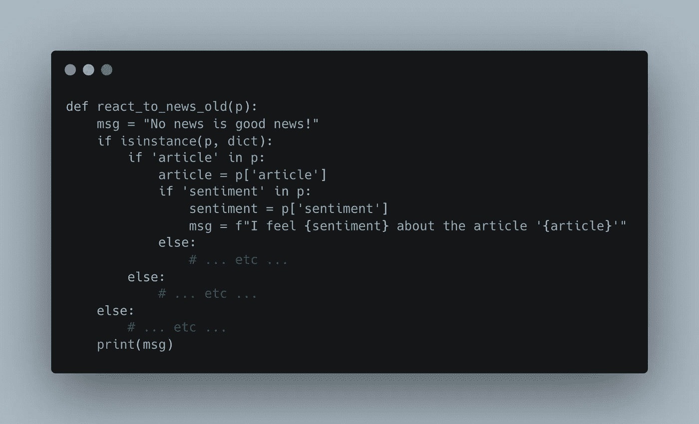
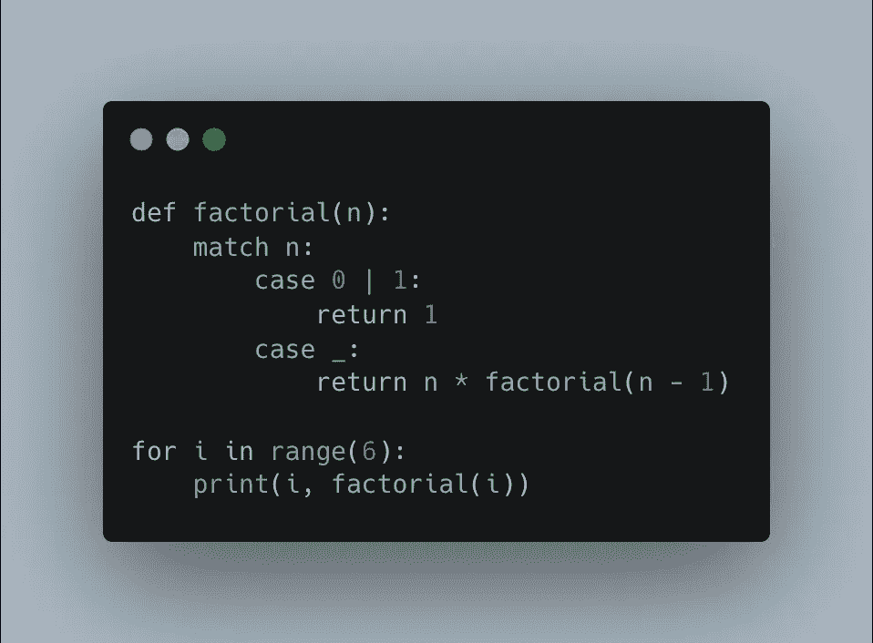

# 用 Python 做模式匹配简直是天才。原因如下

> 原文：<https://levelup.gitconnected.com/pattern-matching-with-python-is-genius-heres-why-86e57090f922>

## 解析数据有了新的好朋友


最后，Python 可以进行适当的模式匹配。

历经三十年的发展，Python 终于找到了一种优雅的方式来匹配一个值与许多可能条件中的一个。早就该这样了，但我们得到的是非常棒的。

模式匹配不仅过期了，因为其他语言早就有了。在 C 和 C++中，它被称为[开关/外壳结构](https://www.cprogramming.com/tutorial/c/lesson5.html)。在 Rust 里叫[模式匹配](https://doc.rust-lang.org/book/ch18-00-patterns.html)。

对于 Python 用户来说，这不仅仅是一种绕过丑陋的`if...elif...else`语句的方法。[所谓的结构模式匹配](https://peps.python.org/pep-0636/)，不仅仅帮助匹配文字字符串。您还可以使用它来处理精确的模式(因此得名)，方法是指定变量名、类型，甚至是您可能想要匹配的对象。

基本语法非常类似于 C 语言的 switch/case 语句。关键字`match`获取一个对象，根据一个或多个匹配模式对其进行测试，如果找到匹配模式，它就执行这种情况下需要的任何操作。

这里有一个基本的例子:



看到这有多美了吗？这种类型的语法正是函数式编程教科书所推荐的。另外一个例子是 [Python 变得越来越实用](https://towardsdatascience.com/why-developers-are-falling-in-love-with-functional-programming-13514df4048e)。

这段代码之所以如此有趣，是因为它基本上是`if`——伪装的语句。然而，它要优雅得多，因为它可以同时检查多个对象，如上面包含`article`和`sentiment`的示例所示。

万一像`article`或`sentiment`这样的部分或全部信息丢失，我们不需要依赖不确定的`else`语句。我们只是优雅地处理每个案子。

我们还可以检查类型，就像上面用`str()`做的那样，以及各种其他属性，包括字符串的`isupper()`。当然，也可以检查其他数据类型的其他属性。

除了我们使用字典的例子之外，您还可以将列表、元组、对象等放入模式匹配中。这与上面的例子非常相似。

您还可以使用 or 运算符`|`将多个案例组合在一起。这个的语法是`case ("a"|"b"|"c")`。

现在，让我们看看我们的例子是如何工作的:



如果我们想要同样漂亮的功能，但试图在没有新模式匹配的情况下生存，我们会得到以下结果:



为了完全公开，我懒得自己写这么难看的代码，所以我采用了来自[这篇优秀文章](https://www.inspiredpython.com/course/pattern-matching/mastering-structural-pattern-matching)的方法。此外，我甚至没有填充所有内容，因为我不想让你淹没在这样的代码中。

不用说，很明显，在这种情况下，新的`match`声明更容易使用和阅读。

一些批评家[指出](https://benhoyt.com/writings/python-pattern-matching/)然而`match`语句比某些`if...else`语句有更陡峭的学习曲线。这无疑是对的，但我要说，花 15 分钟的时间来掌握这一点是非常值得的，而不是花 30 分钟来编写维护性差的代码。

## 结构模式匹配的创造性应用

Python 模式匹配的批评者也指出，它可能没有太多的用例。

本质上，它适用于有许多不同的可能模式要匹配的场景，以及关于这些模式的许多细节非常重要的场景。过去解决这个问题的方法是通过冗长的嵌套表达式。

然而，在其他情况下，结构模式匹配是有用的:



我从这里的[偷了这个可爱的例子](https://python-course.eu/python-tutorial/structural-pattern-matching.php)。不过这是一件相当琐碎的事情，在`math`包中有一个内置函数。因此，您可以很容易地用下面的代码替换上面的代码:

```
import mathfor i in range(6):
    print(i, math.factorial(i))
```

这也比上面的代码快了大约 12 倍，至少在我的电脑上是这样。(它花了 0.13 秒，而当我试图在我的机器上计算`factorial(6)`时，上面的函数花了大约 1.5 秒。)

另一方面，通过难看的`if...else`语句定义阶乘函数也需要 1.5 秒。这表明——尽管这不是证据！——嵌套的`if...else`语句和`match`语句几乎一样快。

因此，当您在没有内置解决方案的地方定义函数时，您可能不会通过使用结构化模式匹配来降低代码速度。

## 关于令人敬畏的模式匹配的一句话

在 Python 中还有另一种方式可以进行模式匹配。从 3.7 版本开始，软件包`apm`，即 [Awesome Pattern Matching](https://pypi.org/project/awesome-pattern-matching/) 的缩写，一直在提供自己的方式来避开丑陋的代码片段，同时引入优秀的功能。

作者声称`apm`中还有一些内置模式匹配没有的功能；然而，这些用例似乎很少见。一个[深入的比较](https://github.com/scravy/awesome-pattern-matching/blob/main/docs/pep634_vs_different_apm_styles.py)揭示了大部分的语法差异。

我个人更喜欢内置模式匹配的语法。但是对于那些喜欢使用`apm`的人来说，你当然可以自由地使用它。

## 吹牛

模式匹配在 Python 中仍然是相当新的，但很可能许多开发人员会很快采用它。

这当然很容易声称，因为事实上这是一个社区非常需要的特性。但是这种说法不仅仅如此。与其他特征相比，结构模式匹配可能具有相对陡峭的学习曲线；然而，如果你对意大利面条式的代码过敏，这是非常值得的。).

它简洁，优雅，写起来很甜，易于阅读和维护。

人们还能期望什么呢？

*感谢* [*奥瑞尔·加滕*](https://orell-garten.medium.com) *启发了这个故事！*

*成为* [*中等会员*](https://arijoury.medium.com/membership) *获取我的全部内容。*

# 分级编码

感谢您成为我们社区的一员！在你离开之前:

*   👏为故事鼓掌，跟着作者走👉
*   📰查看[级编码出版物](https://levelup.gitconnected.com/?utm_source=pub&utm_medium=post)中的更多内容
*   🔔关注我们:[推特](https://twitter.com/gitconnected) | [LinkedIn](https://www.linkedin.com/company/gitconnected) | [时事通讯](https://newsletter.levelup.dev)

🚀👉 [**加入升级人才集体，找到一份惊艳的工作**](https://jobs.levelup.dev/talent/welcome?referral=true)