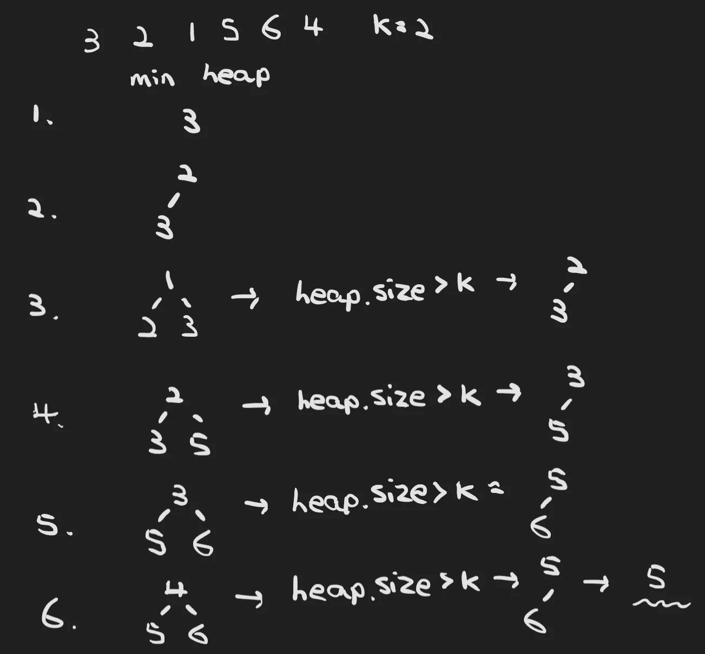
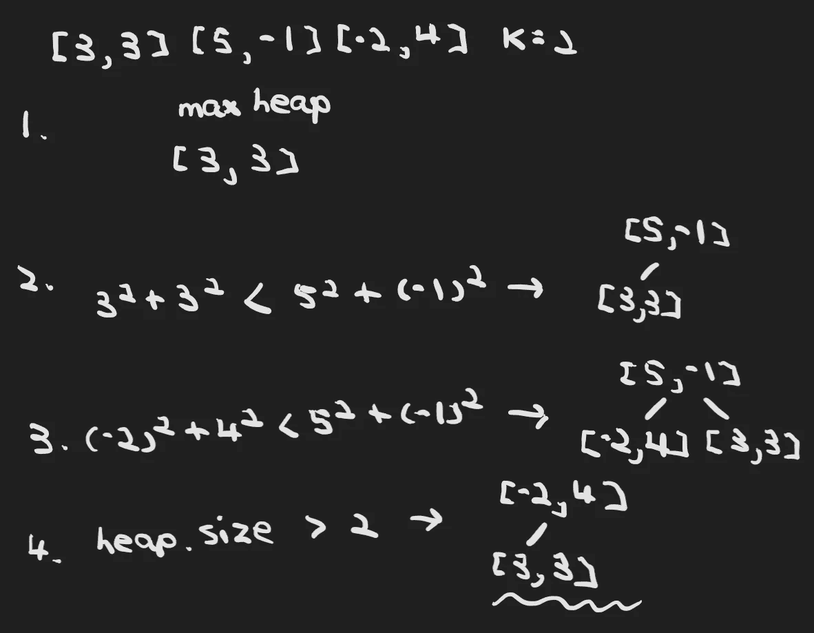

# 编码面试的模式——顶级“K”元素

> 原文：<https://levelup.gitconnected.com/patterns-for-coding-interviews-top-k-elements-1a1368c4cbf0>

## 通过学习算法模式赢得任何编码面试


劳伦·曼克在 [Unsplash](https://unsplash.com?utm_source=medium&utm_medium=referral) 上的照片

# 介绍

top K elements 模式是一种技术，旨在返回给定集合中给定数量的最频繁/最大/最小的元素。

解决前 K 个元素问题的关键数据结构是堆。作为最大堆和最小堆的特征，我们总能高效地得到最大和最小元素，即 O(logN)。

# 方法

让我们看一些例子。我们首先来看一个 LeetCode medium 问题— [数组](https://leetcode.com/problems/kth-largest-element-in-an-array)中的第 k 个最大元素。它要求我们在一组整数中找到给定数目的最大元素。

以下是一些例子:

```
Input: [3,2,1,5,6,4] and k = 2
Output: 5Input: [3,2,3,1,2,4,5,5,6] and k = 4
Output: 4
```

一个强力的解决方案是简单地对数组进行排序，并找出第 k 个位置的元素。但是，由于算法的排序功能，该方法将导致 O(NlogN)。

那么我们能不能提高这个算法的时间复杂度呢？

绝对的。我们可以维护一个 K 大小的堆，而不是分别排序和搜索，这样可以同时存储和排序访问过的元素。

但是我们应该使用什么样的堆呢？基本上最小堆和最大堆都能得到正确的解。这里我们将解释如何通过最小堆来解决这个问题。

决定了数据结构之后，我们现在可以进入主流程了。通过 top K elements 模式解决这个问题的想法是保持 min 堆的给定大小。

由于根元素在最小堆中总是最小的，如果堆的大小大于 K，根元素应该被丢弃，因为它是迄今为止第(K+1)个最大的元素。

因此，算法过程将类似于:

1.  遍历数组元素，并将它们放入一个 K 大小的最小堆中。如果堆的大小大于 K，弹出根元素。重复此过程，直到数组结束。
2.  返回最小堆的根元素，因为它是整个数组的第 k 个最大元素。

算法的可视化如下所示:



作者图片

现在我们可以轻松地编写代码实现了:

通过应用 top K elements 模式，我们可以将解的时间复杂度提高到 O(NlogK)，其中根元素的提取是 O(logK)，我们需要遍历整个数组。

接下来，我们要看看另一个 LeetCode 中值问题— [K 个离原点最近的点](https://leetcode.com/problems/k-closest-points-to-origin)。这与上面的问题有点不同，上面的问题要求我们找到 K 个最大的元素，而这个问题要求找到 K 个最小的元素。

以下是一些例子:

```
Input: points = [[1,3],[-2,2]], K = 1
Output: [[-2,2]]
Explanation: 
The distance between (1, 3) and the origin is sqrt(10).
The distance between (-2, 2) and the origin is sqrt(8).
Since sqrt(8) < sqrt(10), (-2, 2) is closer to the origin.
We only want the closest K = 1 points from the origin, so the answer is just [[-2,2]].Input: points = [[3,3],[5,-1],[-2,4]], K = 2
Output: [[3,3],[-2,4]]
```

像以前一样，我们都知道我们可以通过堆来解决问题，但是，我们应该使用哪种堆呢？

同样，对于前 k 个元素的问题，我们总是可以通过最大堆或最小堆来解决它们。这和他们处理问题的方式有点不同。对于这一个，我们将使用一个最大堆来展示如何处理 K 个最小的问题。

我们定义最大堆的方式也需要小心。这次我们不是直接比较每个整数，而是比较每个点到原点的距离。

所以我们的最大堆应该定义为:

```
PriorityQueue<int[]> maxHeap = new PriorityQueue<>((a, b) -> (b[0] * b[0] + b[1] * b[1]) - (a[0] * a[0] + a[1] * a[1]))
```

`(b[0] * b[0] + b[1] * b[1]) - (a[0] * a[0] + a[1] * a[1])`表示 b 到原点的距离和 a 到原点的距离的比较。

解决方案的其余部分将与上一个问题相同，我们将维护一个 K 大小的最大堆。这个堆中的元素将是离原点最近的 K 个点。所以这个过程会是这样的:

1.  遍历并将这些点插入到 max 堆中。如果最大堆大小超过 K，弹出根元素，因为它是到目前为止第(K+1)个最接近原点的点，我们不需要它。
2.  返回最终的最大堆作为结果。

可视化如下所示:



作者图片

因此，我们现在可以实现解决方案:

该算法的时间复杂度为 O(NlogK)，空间复杂度为 O(K)。

# 结论

最终，我们看到了两种 top K 元素问题分别由最小堆和最大堆解决。总之，顶部 K 元素模式可以分为两个步骤:

1.  决定你想要使用哪种堆。小心堆初始化，尤其是元素之间的比较方式。
2.  保持堆大小小于 K，如果大于 K，提取根元素。重复这个过程，直到结束。

# 相关问题

1.  [数组中第 k 个最大的元素](https://leetcode.com/problems/kth-largest-element-in-an-array)
2.  [BST 中第 k 个最小元素](https://leetcode.com/problems/kth-smallest-element-in-a-bst)
3.  [前 K 个频繁元素](https://leetcode.com/problems/top-k-frequent-elements)
4.  [按频率排序字符](https://leetcode.com/problems/sort-characters-by-frequency)
5.  [课程表三](https://leetcode.com/problems/course-schedule-iii)
6.  [找到 K 个最近的元素](https://leetcode.com/problems/find-k-closest-elements)
7.  [重组琴弦](https://leetcode.com/problems/reorganize-string)
8.  [最大频率叠加](https://leetcode.com/problems/maximum-frequency-stack)
9.  [K 个离原点最近的点](https://leetcode.com/problems/k-closest-points-to-origin)

# 参考

1.  [寻找编码面试:编码问题的模式](https://www.educative.io/courses/grokking-the-coding-interview)
2.  [leet code——全球领先的在线编程学习平台](https://leetcode.com/)