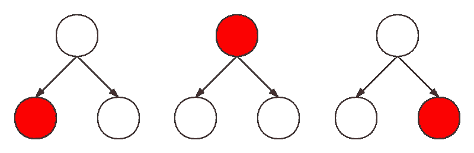

# 编码面试的模式——树形深度优先搜索

> 原文：<https://levelup.gitconnected.com/patterns-for-coding-interviews-tree-depth-first-search-9e567ae2b696>

## 通过学习算法模式赢得任何编码面试

由[诺德伍德主题](https://unsplash.com/@nordwood?utm_source=medium&utm_medium=referral)在 [Unsplash](https://unsplash.com?utm_source=medium&utm_medium=referral) 上拍摄的照片

# 介绍

树 DFS 模式是一种在树内搜索时应用 DFS 技术的算法。该模式的特点是在回溯之前尽可能远地遍历每个树分支。它可以以迭代或递归的方式实现。本文将主要集中讨论递归方法。

# 方法

在开始之前，让我们回忆一下三种遍历树的方法，它们是前序、按序和后序。它们的模板如下所示:

**前序遍历**:

作者图片

**有序遍历**:

作者图片

**后序遍历**:

请记住这三个问题，它们中的任何一个都可以解决大多数树 DFS 问题。

现在让我们开始吧。我们先来看看 Leetcode 简单问题[路径和](https://leetcode.com/problems/path-sum)作为热身。这个问题的主要目标是看是否有一条路径(根到叶)的和等于给定的数。下面提供了一个例子:

给出下面的二叉树和`sum = 22`，

返回 true，因为存在一条从根到叶的路径`5->4->11->2`，其总和为 22。

正如我们前面提到的，大多数树 DFS 问题可以通过按序、前序或后序遍历来解决。因此，解决这个问题的第一步是决定我们应该应用哪种遍历。

很明显，有序遍历是一种更合适的方式，因为路径包含从根到叶的节点，这是一种自顶向下的遍历。因此，算法过程将是这样的:

1.  查看当前节点是否是叶子，以及累积和(即路径和)是否等于我们的目标。
2.  递归计算左右子树的路径和。

实现如下:

你看到图案了吗？也许仅仅举一个例子是不够的。让我们试试一个高级的— [验证二叉查找树](https://leetcode.com/problems/validate-binary-search-tree)。这个问题要求我们确定一个二叉树是否是一个有效的 BST。参见下面的一些例子:

**例 1:**

**例 2:**

想想你在大脑里会怎么做。我相信大多数人会首先以根节点作为参考，并将其与左右子树中的节点进行比较。

永远记住解决树 DFS 问题的第一步是决定你想应用哪种遍历。上面说的思路很明显就是有序遍历(根→左→右)法。

现在我们可以深入这个算法的主要部分。注意 BST 的定义:

> 假设 BST 定义如下:
> -节点的左子树只包含键**小于节点键**的节点。
> -节点的右子树只包含键**大于节点键**的节点。
> -左右子树也必须是二分搜索法树。

如果只比较节点及其左右子树，而不比较左右子树，下面显示的情况将返回错误答案:

为了避免上面描述的情况，我们应该记录根节点的值，以便在每次遍历过程中进行比较。因此，实现如下所示:

# 结论

总之，树形 DFS 技术(递归)的过程可以分为如下几个步骤:

1.  确定哪种树遍历方法更适合解决问题。
2.  找出递归过程的基本情况(例如 root == null)。
3.  应用确定的遍历方法定义主(根)和子问题(左右子树)之间的关系。