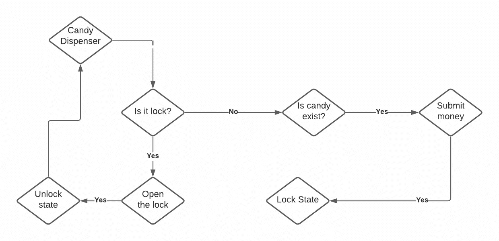

# 构建无任何突变的有状态程序的模式

> 原文：<https://levelup.gitconnected.com/patterns-for-constructing-stateful-programs-without-any-mutation-9c002407d050>



*原载于*[](https://edward-huang.com/scala/functional-programming/monad/programming/2020/12/21/must-know-patterns-for-constructing-stateful-programs-without-any-mutation/)**。**

*当开发一个应用程序时，在应用程序中有一些状态来检测程序执行的当前点通常是有用的。通常，我们希望在顺序数据流中操作，例如解析器、防火墙、通信协议或数据流。在其中一些操作中，先前计算的数据存储在某个变量(状态)中，并且通常会影响程序当前的执行决策。*

*我们可以称这些操作为有状态操作，其中程序先前的执行被延续到当前的实现。用程序状态和状态将会改变的语句来描述程序通常被用来将他们的编程范例称为命令式编程。*

*通常，我们可以使用变量来存储我们之前计算的值，以用于当前的计算。然而，您也可以用状态单子编写命令式编程。如果你不知道那是什么，看看我以前的文章[如何创建一个没有副作用的随机数发生器函数](https://edward-huang.com/scala/functional-programming/monad/programming/2020/08/16/how-to-create-a-random-number-generator-function-without-side-effects/)。*

*状态单子是一个简单的函数，它通过首先描述你的程序应该表现什么来帮助你构造一个有限状态机。然后，您可以插入您的初始状态，并期望在程序执行时获得最终结果和最终状态。*

*一个简单的值是:`S => (A,S)`其中函数接受`S`，即您的初始状态，并在用值`A`和新状态`S`计算初始状态后返回一个结果。例如，如果你想创建一个程序，用它相应的索引`zipWithIndex`压缩一个数组。创建该函数的常规方法需要一个 for 循环，该循环将遍历序列中的一个元素，并用索引压缩它——如下所示:*

*您也可以使用 State 将状态传递给函数。*

*我们首先实例化元组`(A, Int)`和`0`的空列表作为`foldLeft`中的第一个索引。然后在每次迭代中，我们调用`op`函数，创建一个元组和下一个索引元素。计算值将返回当前结果和下一个状态。我们将元组预先放置到元组的累积列表中，并将`nextI`与我们的`foldLeft`函数一起传递。我们只需要获得第一个元组，我们还需要反转列表，因为我们将元组预先放置到累积列表中。*

*如果我们有一个状态单子，我们也可以用一个`State`单子来实现。*

*我们首先遍历`List[State[Int, (A, Int)]]`到`State[Int, List[(A,Int)]]`。我们设置`State`单子以状态为索引，结果`A`将是`(A, Int)`。首先获取状态，`State.get[Int]`，然后将状态设置为`index + 1`。for-comprehension 的`yield`语句返回每个状态的结果。最后，我们实例化初始状态值，索引为 0，以执行程序。*

*在这篇文章中，我想深入探讨当我们想使用状态单子时的思考过程，并向您展示如何基于状态单子构造一个程序。*

*当我第一次尝试实现状态单子的概念来构造一个需要某种状态的程序时，我不知道如何解决这个问题。然而，在本文中，我将向您展示在解决这些问题时观察到的模式。*

# *跑步机器人*

*一个例子是，你需要创建一个机器人站在一个点上的游戏。会有一个指令列表和一个目的地。您将需要对机器人进行编程，以验证机器人是否根据用户给出的指令列表达到了目标。*

*让我们来定义这个函数:*

*`Int`的元组代表坐标。每条指令将从起点增加或减少 x 或 y 坐标。在指令结束时，我们可以检查机器人是否到达最终目的地。*

*让我们尝试使用状态单子来解决这个问题。我们需要创建一个机器人可以执行的动作操作来确定机器人的当前状态。*

*状态将是`startPoint`。*

*结果也将是一个`Int`的元组。*

```
*type RobotState = State[(Int,Int), (Int,Int)]*
```

*当指令执行完毕时，我们可以看到机器人在坐标中的位置。*

*让我们创建一个操作，在该操作中状态应该表现为:*

*该函数接收指令和机器人的当前坐标，并返回机器人的下一个坐标。*

*接下来，让我们在状态中执行函数。*

*我们得到当前坐标。然后，我们执行指令的动作。最后，我们在状态上设置新的坐标，并产生当前坐标。在这个场景中，`State[S,A]`中的`S`成为最终结果，`A`成为我们在执行程序时得到的历史或轨迹。*

# *邮购计算器*

*这里指的是 Cats 练习册，我们需要在其中实现一个后序计算器。*

```
*1 2 + 3 * // see 1, push onto stack
2 + 3 * // see 2, push onto stack
+ 3 * // see +, pop 1 and 2 off of stack,
// push (1 + 2) = 3 in their place
3 3 * // see 3, push onto stack
3 * // see 3, push onto stack
* // see *, pop 3 and 3 off of stack,
// push (3 * 3) = 9 in their place*
```

*我们可以使用一个链表来实现一个栈。我们可以让状态单子中的`S`成为堆栈。*

*的算法是这样的:*

*   *检查当前令牌是否为数字；如果是一个数字，就把它压入堆栈*
*   *如果它不是一个数字，那么从堆栈中弹出两个值，用操作符应用操作数，并将其推回堆栈。*

*因此，让我们用转换函数来分解整个流程。我们知道我们将循环遍历所有的令牌并做一些转换。在这个过程结束时，我们将到达堆栈的顶部。*

*让我们实现转换函数:*

*然后我们给出一个令牌列表，我们要解析它们:*

*在这种情况下，既然我们不使用`A`状态单子。我们可以用`modify`来修改所有的状态，然后得到栈头。*

*让我们看一个更复杂的问题，使用模拟简单玩家分配的有限状态自动机来分配玩家。*

# *玩家分配*

*一个最好的例子就是创建一个有限状态机，在这里你给程序不同的指令，然后得到程序的最终结果。*

*假设你需要设计一个游戏，其中 n 个玩家根据某种标准从 n 个点的集合中被分配 n 个点。*

*你想迭代点数并交替分配分数给 n 个玩家。因此，给定一个分数和玩家数量的列表，您将返回玩家的地图和分配给这些玩家的分数。*

*我们如何解决这个问题？*

*我将向你介绍我将如何解决这个问题的过程。*

*我们可以先创建一个状态为`Map[Int, Vector[Int]]`的状态单子。然后，我们需要考虑我们对分数列表的每次遍历的操作。*

*当我们遍历分数列表时，如何知道分数分配给哪个玩家？*

*我们知道，如果我们想通过每个玩家来分配分数，我们可以用玩家总数来修改当前索引，以给玩家`A`打分`A`。因此，在遍历链表的同时，我们还需要知道当前遍历的是什么索引。*

*让我们创建一个`op`函数，它接受该序列的索引、分数、先前的地图值和玩家总数，并返回玩家将为其赋值的新地图值。*

*然后，我们需要定义我们的状态单子。我们知道状态会是一个`Map[Int, Vector[Int]]`。结果会怎样？*

*结果可以是当前索引。因此，我们可以创建一个状态单子，返回一个新的`Map`赋值和下一个迭代的索引值。*

*现在我们已经创建了我们的操作和状态定义，我们终于可以实现`assignedN`了。我们来实现`assignedN`。*

*这就是我们意识到需要将索引作为一个状态来检索它的地方。让我们创建一个包含`Map`和`currIndex`的`StatePlayer`案例类。然后，稍后我们检索`Map`而不是下一个玩家。*

*然后，我们可以尝试重构`op`函数来调用收到的一个`Player`来代替:*

*之后，我们可以通过使用新的`State`定义来尝试实现`assignedN`:*

*你现在可能会看到这个模式，我们在`lstOfScore`上再次使用了`traverse`。然而，我们想只使用`State.modify`的`modify`状态，这将返回一个`State[Player, Unit]`。我们想在`lstOfScore`上使用`traverse`的原因是启用了遍历来将`List[State[Player,Unit]]`转到`State[Player, List[Unit]]`并应用列表中的所有状态。然后我们得到`Player`最后一次修改的状态。*

*在我们构造了我们的程序之后，我们为我们的程序提供了空状态— `Players(Map.empty[Int,Vector[Int]], 0)`。*

*大多数实现命令式程序的有限状态自动机类型的程序都是以这种模式执行的。在这种情况下，我们不需要给定状态单子的结果。因此，我们使用`modify`，因为 modify 是`get`和`set`的组合，不返回任何产品。*

*事实上，我后来注意到，这个操作经常被使用，它可以被抽象，它通常被称为`mapAccum`:*

# *结论*

*用命令式编程实现状态单子有时会很棘手。然而，通过创建几个程序，我们可以找到一种模式，以一种纯函数的方式生成命令式代码。*

*我们通常使用当前状态，计算下一个状态，设置它，并产生一些值。*

*我希望这篇文章对开始使用状态单子创建命令式程序和以纯函数方式实现算法有用。*

***感谢阅读！如果你喜欢这篇文章，请随意订阅我的时事通讯中的**[](https://edward-huang.com/subscribe/)****以获得关于科技职业的文章、有趣的链接和内容的通知！*****

***你可以关注我，也可以在[媒体](https://medium.com/@edwardgunawan880)上关注我，以获得更多类似的帖子。***