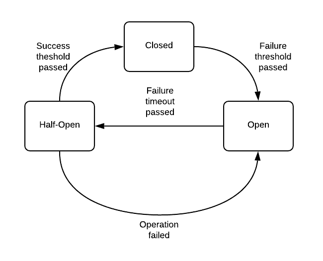
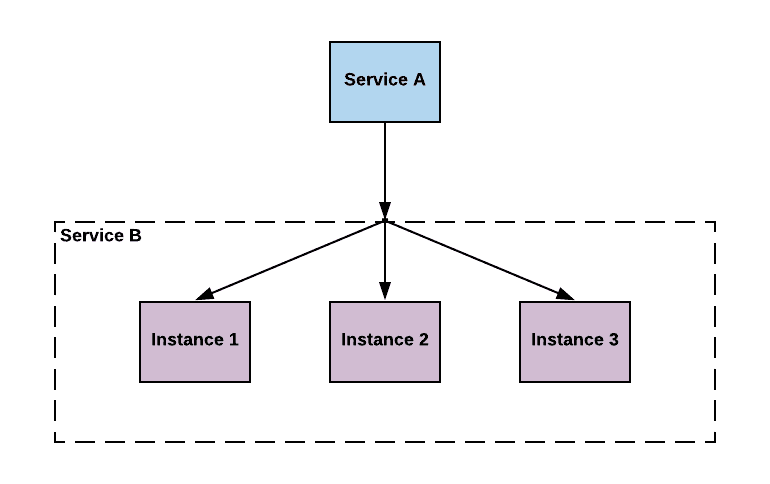

# 弹性分布式系统的模式

> 原文：<https://levelup.gitconnected.com/patterns-for-resilient-distributed-systems-750063996ee3>

## 爆炸半径

## 超时、重试、断路器等等…

我们都想与有弹性的系统一起工作，并创造出有弹性的系统。当事情出错时，我们的用户往往会很快注意到，事情变得……*令人兴奋*。没有人希望凌晨 3 点打电话说产量下降时肾上腺素激增，但几乎每个人在职业生涯的某个阶段都经历过这种情况。

可靠性通常被看作是判断软件系统质量的一个方面，也是为之奋斗的最终目标。有趣的是，这也是最容易衡量、跟踪和报告的方法之一。管理良好的系统应该有停机时间的记录，以及平均故障间隔时间、平均恢复时间等 KPI。我们使用这些度量标准已经很多年了，事实上我在大学的时候第一次意识到它们，不是在学习软件系统的时候，而是在学习电子学的时候。所以这些都不是新的，已经被很好的理解和记录了。在复杂的软件系统中，系统可靠性的很大一部分来自于组成系统的元素的弹性，包括基础设施和代码。

当然，所有这些可靠性和弹性是一个巨大的主题，远远超出了一篇中型文章的范围！因此，在这里，我们将特别关注软件系统中的“爆炸半径”概念，一些在确保我们创建的软件的弹性方面特别有用的设计概念。

## 了解爆炸半径

如果我们要讨论软件系统的弹性，我们需要看看“爆炸半径”的概念。

让我们从最简单的现实系统开始——一个经典的整体系统。这里我们有一个可执行文件和该可执行文件所依赖的一个数据库。为了便于讨论，假设它们也运行在同一个服务器上。我们的爆炸半径非常大。

*   如果我们失去了服务器，我们就完了。没有人能做任何事情。
*   同样，如果我们失去了整体的可执行文件，我们就完了。
*   如果我们失去了数据库，也许系统*的一些非常简单的功能*可能会工作，也就是说，那些不依赖于数据库的功能。但实际上我们也完蛋了。

所以我们可以看到，巨石通常有一个非常宽的爆炸半径，显然不是理想的！分布式系统，例如微服务风格的解决方案，能对此有所帮助吗？

正如软件系统世界中的许多问题一样，答案不是简单的是或否。想象一个分布式电子商务网站，提供库存控制、订单管理和愿望清单服务。如果我们构建得很好，并且具有低耦合和高内聚，那么如果我们失去了愿望列表服务，它应该不会对下订单或管理库存产生影响。我们已经利用了分布式系统的本质，将我们的爆炸半径减少到一个非常非常小的特征集，这正是我们想要的。

问题是，没有免费的午餐，分布式系统不能保证增加可靠性和弹性。如果不理解分布式系统的“分布式”元素所带来的挑战，转向这种模式会使事情变得更糟。不陷入这个陷阱的关键是以最小化爆炸半径的方式来设计我们的服务。我们需要最小化“关键服务”,这些服务是大量依赖服务的单点故障，我们需要仔细考虑耦合和内聚性。

其次，分布式体系结构将我们置于一个有一大堆新的潜在问题的世界——古怪的网络连接、古怪的服务(一些是第一方的，一些是第三方的)；和多个数据库。遗憾的是，这些挑战在开始使用分布式系统时很容易被忽略，因为它们通常不是整体架构的问题。它们也不一定是显而易见的问题，直到您开始给生产系统增加负担，而解决这些问题既昂贵又耗时。

幸运的是，有一些我们熟悉的设计模式可以帮助我们从一开始就把事情做好。

# 弹性模式

我们将在这里介绍的模式主要关注分布式架构引入的进程间通信所带来的挑战。无论是 REST、gRPC 还是任何其他形式的 API，我们现在都有多个应用程序在运行并相互通信，以实现一个共同的目标。

这种分布引入了新的故障点，我们不应该假设—即使在托管云环境中—我们有一个完全可靠的网络。我们还需要仔细考虑，如果我们所依赖的服务不可用，或者不可靠并表现出短暂的故障，会发生什么。在所有这些情况下，我们需要理解可用的模式和技术，以便尽可能地构建最具弹性的系统。

## 超时设定

超时模式可能是分布式软件中部署的最简单、最常见的弹性模式。它的目的是在一段时间后失败请求，这意味着我们不会以代码和资源被锁定而结束，等待永远不会到来的响应。好消息是，几乎每个用于分布式系统内通信的库中都包含了某种形式的默认超时，因此我们通常可以“免费”获得这一功能，只需要专注于如何处理故障。当然，我们还应该考虑将超时调整到合理的值

## 添加条目

所以，我们已经在系统中实现了超时，所以现在我们没有代码因为网络中的短暂故障而无法响应请求；或者，我们的某项服务出现了一些问题，这意味着偶尔会有一定比例的请求由于暂时性错误而失败。

我们可以忍受这些错误；捕获它们，记录它们，然后拒绝更广泛的请求。这样做的问题是，我们创造了糟糕的用户体验，不稳定的性能最终会惹恼我们的用户，并产生更广泛的问题。

如果我们真的遇到了暂时的错误，那么实施重试这些失败的策略可能足以解决绝大多数问题。通过这样做，我们改善了用户体验。

我们要仔细考虑的一件事是为重试部署的策略。

*   我们是对每个错误进行重试，还是只对一个子集进行重试——例如，只对数据库中的网络和超时错误进行重试，而不是对*永远不会*工作的“坏数据”进行重试？
*   我们重试的速度有多快？在某些情况下，我们可能希望一看到故障就重试，在其他情况下，我们可能会考虑一个修复“回退”期，在其他情况下，我们可能需要更复杂的东西，如指数回退。
*   我们重试多少次？我们有一个极限，还是我们无限期地尝试？

决定重试的策略是至关重要的，在解决瞬态问题的同时不使系统的其他元素过载之间找到平衡。当然，我们可以使用一些模式来帮助解决这个问题，这就是断路器可以帮助我们的地方。

## 断路器(或者，快速失效，故意)

等等，现在怎么办？为什么在一篇关于构建弹性系统的文章中，我们会谈到*故意*拒绝请求？

断路器通常用于帮助服务从故障状态中恢复，方法是卸载服务的请求，直到服务恢复正常。

> 断路器模式的目的不同于重试模式。重试模式使应用程序能够在期望成功的情况下重试操作。断路器模式防止应用程序执行可能失败的操作。应用程序可以通过使用重试模式来结合这两种模式，以通过断路器调用操作。然而，重试逻辑应该对断路器返回的任何异常敏感，并且如果断路器指示故障不是瞬时的，则放弃重试尝试。
> 
> - **迈克尔·尼加德**，[发布吧！](https://pragprog.com/book/mnee/release-it)”

基本的断路器模式包括客户端跟踪对它们所依赖的服务的失败请求。如果失败计数或取决于策略的比率超过一个阈值，服务将立即开始在一段时间内拒绝请求，而不发出请求。这种卸载有望为依赖关系提供恢复时间，因此在卸载期结束时，服务将再次开始发出请求。

断路器有许多细节可以微调，以确定在任何给定情况下部署的确切策略

*   断路器可以基于绝对故障计数或一段时间内的故障率
*   在卸载期之后，断路器可以开始逐渐增加对目标服务的请求数量，或者立即使其完全投入服务

断路器通常被构建为基于状态机的代理，以三种基本状态之一运行:关闭，其中请求被直接发送到接收方服务；在呼叫立即失败的地方打开；和半开式，在这种情况下，电话样本被发送给接收者，以评估其在没有淹没电话的风险的情况下做出响应的能力。

典型的断路器状态机

在上图中，我们可以看到典型断路器的状态和状态转换。请注意，在这种情况下，如何使用超时从开放状态(即所有请求都失败)转换到半开状态。当断路器打开时，我们在一段时间内使所有请求失败，之后，在完全关闭断路器或回到完全打开状态之前，我们使用减少的请求量来测试被调用的服务。

## 防水壁

舱壁模式的概念是从造船建筑中借用的，在造船建筑中，使用防水舱壁对空间进行细分。这里的理论是，一个单独的区域可能会被淹没，但隔板阻挡了水流，确保整个区域不会被淹没。

在软件中，我们可以通过让多个服务实例彼此隔离运行来实现类似的东西，这样单个实例失败不会影响其他实例的可用性。这样，我们可能会在一段时间内以降低的容量结束运行，但我们不会停机。

下图显示了我们如何使用一个服务实例的集群来实现这一点，该服务实例在我们用来路由流量的某种形式的负载平衡器之后进行逻辑分组。

使用负载平衡的隔板模式示例

这种模式依赖于我们能够轻松地部署和隔离我们的服务实例。这些可能是运行在独立主机或容器上的虚拟机的理想实例，它们非常适合这个角色。对于那些使用过 Kubernetes 的读者来说，这种模式应该很熟悉，因为它直接映射到该平台的副本集和服务概念。

我们可以通过使用智能负载平衡器和健康检查来进一步增强上面显示的隔板模式。通过这样做，负载平衡器可以知道后端实例的状态，并自动绕过失败的实例，以确保请求只被定向到最有可能为请求提供服务的健康实例。

## 退路

回退模式旨在作为一种机制来优雅地处理来自我们已经研究过的模式的失败请求。在许多情况下，我们可以通过*回退到*提供较少功能的替代功能来处理这些故障；这里的目标是减少功能完全丧失的影响。例如，我们可能仍然可以提供只读视图，但是我们失去了进行更新的能力。

在系统出现问题时，回退对于维护一定水平的功能非常有用。然而，我们确实需要确保回退所提供的功能比它所回退的功能具有更低的复杂性(即，更不可能自己失败)。

## 结论

这里介绍的模式只是一个开始，每种模式都有更多的细节，每种模式都有不同的版本，我们无法在一篇文章中全面介绍。实现它们也有不同的方式——通过代码实现它们的各种语言的模块和库，到完整的“服务网状”实现，如 Istio 和 Linkerd，允许它们通过配置来实现。

我希望，如果你从这篇文章中得到什么，那就是分布式系统带来了分布式挑战。重要的是，我们不要低估这些，我们要确保我们有知识、理解和工具包来最好地处理它们。