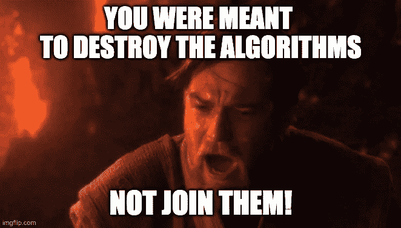
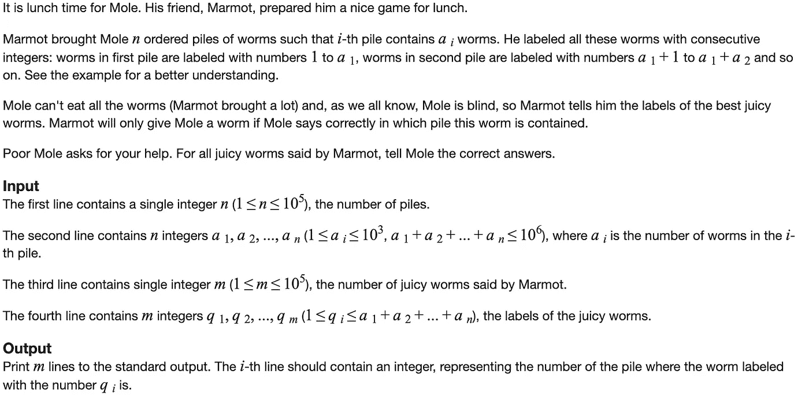
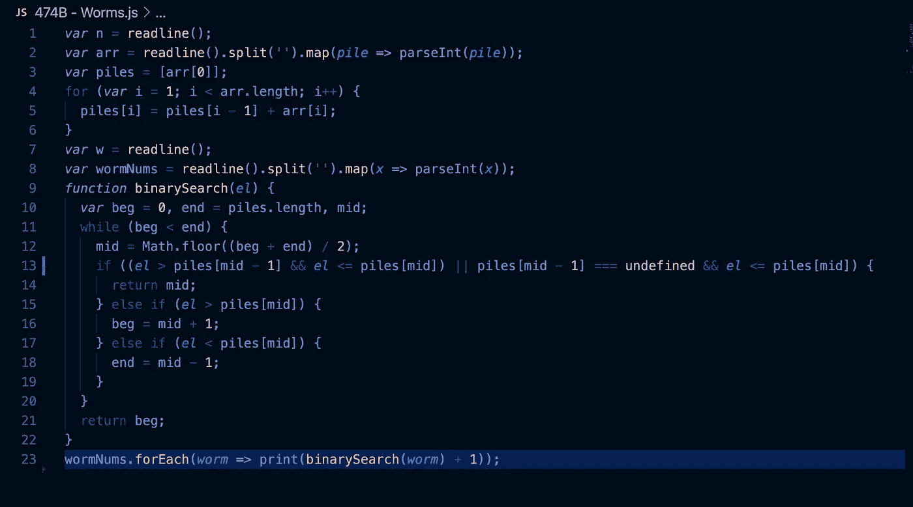
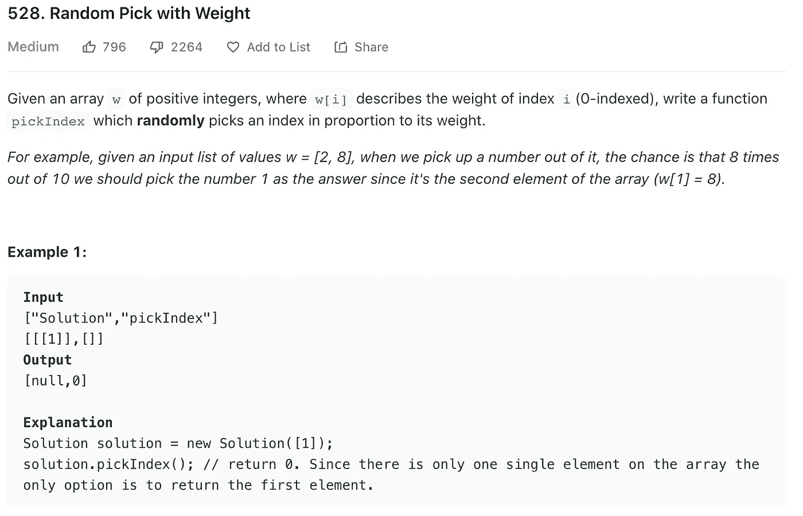
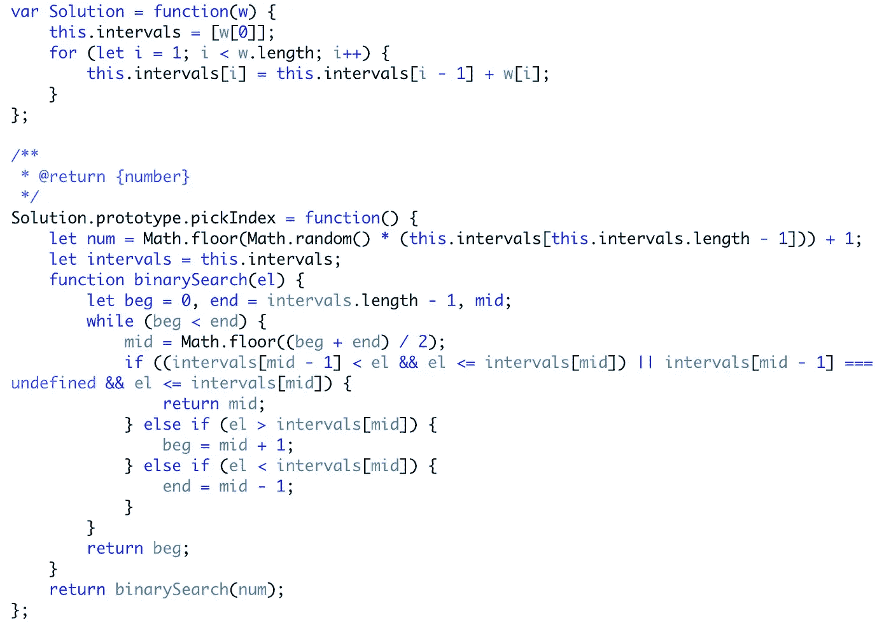
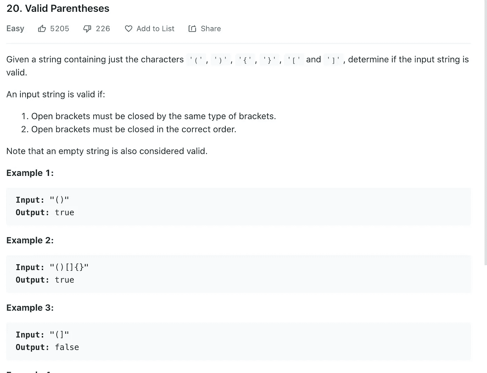
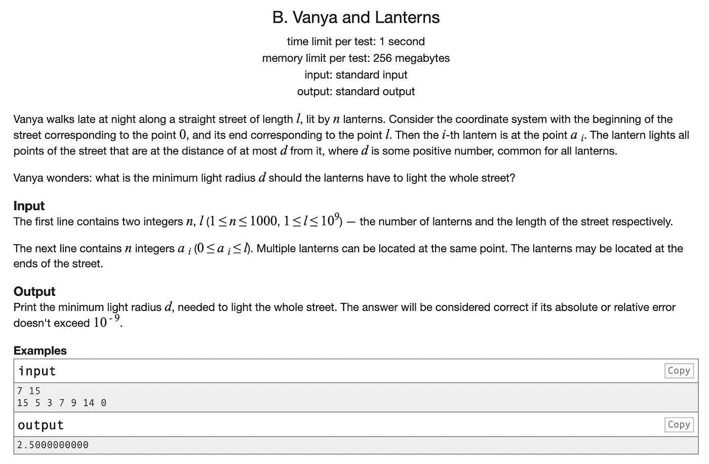
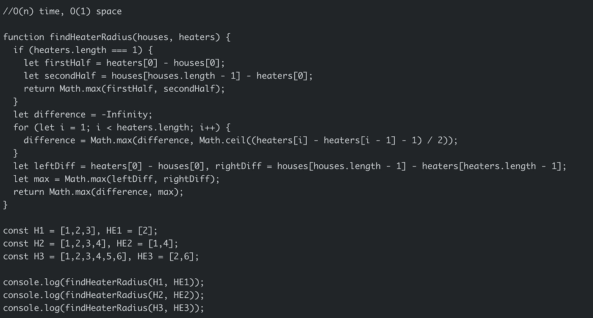
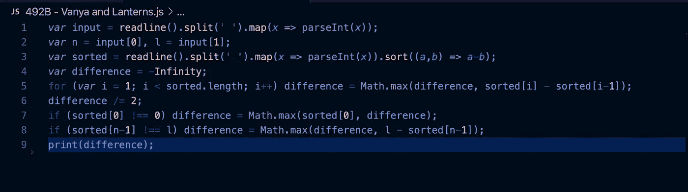

# 算法设计中的模式

> 原文：<https://levelup.gitconnected.com/patterns-in-algorithm-design-17b327167c5e>

*焦躁不可，因有* ***韵&故*** *以此癫狂！*



为面试和你在实现算法上的虔诚而感到紧张？别担心，我是来给你新希望的。

算法是我们这个世界的面包和黄油，在技术面试中，它们非常重要！事实上，如果你没有很好地掌握数据结构和算法，你就不能指望在技术面试中走得远。许多人认为他们是招聘过程中不必要的祸害，并认为这些技能不能转化为实际的软件开发。虽然算法确实没有包含软件工程的所有内容，但我把它们视为我技能组合中的另一个工具。当你需要应用算法分析来设计系统和扩展它们时，这个工具就变得必要了。这并不总是意味着采用某种复杂的方式编写代码，而是要意识到，如果可以在 O(n)时间内完成，那么嵌套的 for 循环可能不是从 100，000 个元素的列表中获取信息的最佳方式。这些权衡对你的代码的性能有真正的影响。从我的经验来看，在广泛研究算法(从破解编码面试到 Leetcode 的一切)之后，我发现我的代码更加简洁明了。我在解决问题的时候，也会花很多时间去阅读和理解别人的解决方案。在这个过程中，我可能已经从数百种其他人的编码风格中挑选了最好的部分。

既然我已经解释了为什么学习数据结构和算法是重要的，我想用这篇文章的剩余部分来谈论一些算法模式和实例，在这些算法模式和实例中，我个人能够解决问题是因为我在头脑中开发了这些模式。让我们从解决问题时可以利用的一些基本模式开始:

1.  **频率计数模式** —您可以使用一个对象/贴图来收集一个值及其频率，这对于比较多条数据的算法非常有用。这种模式让我们在处理字符串/数组时避免了 O(n)时间复杂度。
2.  **多指针模式** —你可以保存指向数组不同部分的变量。拥有多个指针有助于避免 O(n)时间复杂度，例如，如果你想从一个有序数组中的一对数字计算一个目标和。你可以在数组的开头和结尾都有一个指针，你可以在每次迭代时移动指针。这将把时间复杂度降低到 O(n)。
3.  **滑动窗口模式** —包括从一个位置到另一个位置从一个数组或数字创建一个窗口。根据特定条件，车窗将增大或减小车窗。这对于跟踪数据子集很有用。
4.  **分而治之** —你取一个较大的数据集，比如一个数组，把它分成较小的块，然后重复这个过程。使用这种技术的最流行的算法之一是二分搜索法，在每次迭代中你将数据集减半。然而，二分搜索法只处理一组经过排序的数据。时间复杂度是 O(logN ),因为你每次都减半( *log in Big O 表示法同意以 2 为基数)。*

我将讨论三个例子，在这些例子中，我能够使用我在头脑中建立的模式来快速识别和解决问题。

我遇到的第一个例子是 Leetcode 六月每日挑战中的一个问题:随机选择权重。这个问题给了我一种“代码的味道”,这是理所当然的，因为我最近在 CodeForces 上用同样的技术做了另一个问题:二分搜索法！

CodeForces 问题如下:



当您意识到单个蠕虫的索引是按顺序排列的，因此是“排序的”时，这个问题就变得简单了。一旦你意识到这一点，你可以调整你的二分搜索法来检查它在搜索中的索引范围。我的解决方案的代码如下:



原谅 var，Codeforces 已经过时了:)

Leetcode 问题如下:



使用 math . floor(math . random()* arr . length)来创建一个从列表中返回随机元素的函数非常简单。然而，在加权方面的加入使问题变得更加困难。我开始意识到，类似于蠕虫问题，我可以用范围来表示各个元素的权重，并使用二分搜索法！利用这些知识，我能够很快想出一个解决方案。



我注意到一个模式的第二个例子是最近在彭博的一次面试(没有得到工作机会🙁，但我通过了所有技术轮次)。在这个问题上，我的面试官说:“我向你保证，这个字符串中的所有括号都是平衡的。”这立即引起了我的注意，我的蜘蛛感官尖叫着“栈！堆栈！堆栈！”这个问题有点类似于我最近做的一个问题，我应该根据括号返回一个字符串是否有效:



我在面试中遇到的问题会给出类似的输入/输出

***input = "he{co(d)e}s "，output = 'd'***

我遇到的问题要求我在“最深层次”返回字符串最深层是嵌套括号的最深层。我为这种方法提出的解决方案是基于我不必担心不平衡的括号。这意味着我可以使用堆栈来跟踪左括号和右括号，并在遍历字符串时记录不同级别的字符串(将它们存储在 map 中)。如果我没有在面试一开始就意识到这一点，我可能不会这么快就想出一个解决方案。

第三个例子是我今天实际做的一个问题，我成功地发现了一个模式(可能是这个问题最终让我站起来写了这个主题)。问题如下:

冬天来了！你在比赛期间的第一项工作是设计一个标准的加热器，具有固定的取暖半径，为所有的房子供暖。现在，给你房子和加热器在一条水平线上的位置，找出加热器的最小半径，这样所有的房子都可以被这些加热器覆盖。因此，您的输入将分别是房屋和加热器的位置，而您的预期输出将是加热器的最小半径标准。

**注:**

1.  给你的房子和加热器的数量是非负数，不会超过 25000。
2.  给你的房子和取暖器的位置是非负的，不会超过 10⁹.
3.  只要房子在加热器的温暖半径范围内，它就能被加热。
4.  所有的加热器都遵循你的半径标准，温暖的半径是一样的。

**例一:**

```
Input: [1,2,3],[2]
Output: 1
Explanation: The only heater was placed in the position 2, and if we use the radius 1 standard, then all the houses can be warmed.
```

**例 2:**

```
Input: [1,2,3,4],[1,4]
Output: 1
Explanation: The two heater was placed in the position 1 and 4\. We need to use radius 1 standard, then all the houses can be warmed.
```

这个问题让我想起了我在 CodeForces 上做过的一个问题，你必须根据街道上灯笼发出的光的半径来确保街道得到适当的照明。问题如下:



加热器问题基本上与提灯问题相同，因为它们具有相同的基本要求(获得最小半径，以便加热所有房屋/照亮整条街道)。您可以在下面看到上述问题的相应解决方案:



目前就这些，如果你一直对自己的进步感到怀疑/绝望，我希望这篇文章能帮助激励你。如果你学习和练习基于不同类别的算法，如排序、动态规划、字符串、图形、设计等。，你会发现你提高的更快。此外，使用本文中的技术将为您解决问题打下良好的基础。请继续学习，并意识到隧道尽头有光！

*敬请关注数据结构&算法系列的后续文章！*

*(还有，我在找工作！有工程师职位空缺吗？请联系 https://www.linkedin.com/in/hassan-b-malik/*[](https://www.linkedin.com/in/hassan-b-malik/)**)**