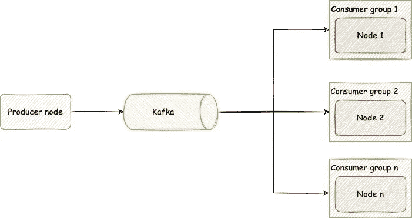
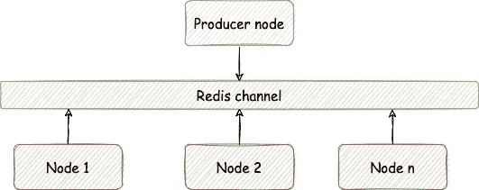
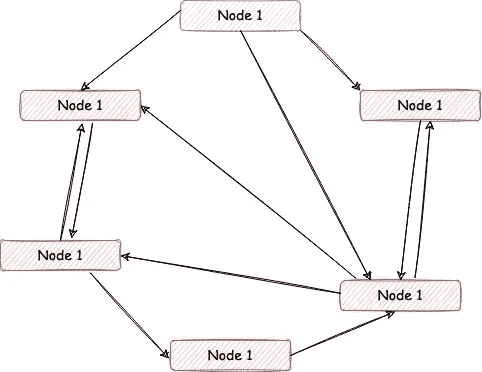

# 分布式系统中节点间通信的模式

> 原文：<https://levelup.gitconnected.com/patterns-of-inter-node-communication-in-distributed-systems-da76f33796ea>

图片来源:由 fullvector / Freepik 设计

在分布式环境中，您的应用程序运行在一个**多节点**设置中，经常会有节点需要相互通信或在它们之间传递消息的需求。在这篇博客中，我们将讨论一些解决分布式系统中节点间通信问题的**实用方法**。

> 请注意，这不可能是一个详尽的模式列表。这个博客将涵盖一些我个人能想到的实用模式/方法。可能还有其他我完全不知道的模式。

# 问题定义

让我们来看一个非常常见的场景，在节点上有一个**内存缓存**。*(节点可以是裸机服务器、虚拟机、Kubernetes Pod 等任何东西，它只是运行服务的一些计算能力)。*我的意思是，我们没有使用分布式缓存，如 Redis、Memcached，而是将一些数据直接存储在节点的 RAM 上，这样所有节点都维护着某些数据的隔离的**本地副本**。现在进行了一个 API 调用来更新该特定数据，收到该 API 调用的节点接受了请求，并在数据库中进行了必要的更新。现在，这个接收节点知道缓存需要被**无效**，它可以很容易地使本地缓存无效。但是其余的节点呢？他们还必须使缓存中的过时数据无效，对吗？但是这些节点怎么知道，信号是什么？我猜想此时接收节点需要某种方式将失效消息传递给所有其他节点，以便它们也更新它们的本地缓存。

这不仅限于缓存失效，还可能有很多其他类似的情况。因此，让我们尝试为跨节点的消息传输找到一个通用的解决方案，剩下的就交给特定的用例吧。

# 潜在的解决方案

看完这个问题后，我可以想到 3 种解决方案。其中，两个稍微清晰，一个完全是实验性的。

1.  使用 Kafka、RabbitMQ 等技术的基于消息队列的扇出消息交换解决方案。
2.  使用 Redis 的简单**发布/订阅**解决方案。
3.  基于**八卦协议**的解决方案。

前两个，我有一些模糊的视觉，但第三个对我来说完全是理论上的。

# 基于消息队列的扇出交换

扇出交换机类似于**消息广播系统**。您向交易所发送一条消息，然后它向多个消费者广播相同的消息。如果您不知道什么是消息交换，可以把它想象成系统中的一个点，所有传入的消息都到达这个点，然后根据一些规则被路由到各自的目的地。

因此将有一个**消息交换**，其中接收更新数据呼叫的节点(从现在起将被称为生产者节点)将发布通知消息。所有其他节点将通过某种方式连接到该特定扇出交换机。并且当扇出交换机广播消息时，所有节点将获得由生产者节点发送的消息。

这也可以通过各种技术来实现。实际实现显然会有所不同，但概念是相同的。一个节点向扇出交换机发送消息，交换机以扇出方式向所有连接的用户广播该消息。

让我们看看如何通过使用 Kafka 或 RabbitMQ 来实现这一点。这可以通过使用当今几乎所有的消息队列系统来实现。

## 使用卡夫卡

构建 Kafka 扇出设置可能是这样的。你只需要把所有的节点放在不同的**消费群、**中，这样无论什么时候有消息发布到一个主题，所有的节点都会分别得到消息。但是您必须确保所有的消费者组中只有一个消费者/一个节点。它的工作方式是，当你在任何话题上发布一条信息时，它会被不同的消费者阅读。Kafka 会跟踪任何特定消费者阅读的最后一条消息，这样就不会有消息被多次消费。所以现在这种跟踪是在消费者群体的基础上进行的。因此，如果在一个消费者组中有 3 个消费者，并且有一条 id 为“message-11100”的消息，只要这 3 个消费者中的一个阅读了该消息，该消息将被标记为该特定消费者组的已读，而其他 2 个节点将不会收到该消息。但问题是，由于这种跟踪是在使用者组的基础上进行的，如果存在其他使用者组，这些使用者组中的一个节点仍然有资格读取“message-11100”。因此，我们利用这一特性，在每个消费者组中只放置一个节点，这样所有节点现在都可以读取相同的消息，它们不再是竞争的消费者。

我知道如果你不了解卡夫卡，这可能有点令人难以接受，所以请在这里随意了解更多关于卡夫卡的基础知识。

## 使用 RabbitMQ

图片来源:RabbitMQ 博客

RabbitMQ 对**扇出交换**有本地支持。其中发送到扇出交换机的消息实际上被广播到所有连接的队列。所以这个设置非常简单。我们首先创建一个扇出交换，并在这个扇出交换上为每个节点创建一个队列。现在设置变成这样，我们有一个扇出交换，即 fan_ex_1，我们有成对的节点和队列，我们有由 node_1 订阅的 q_1，由 node_2 订阅的 q_2，等等。所以当任何一个节点在 fan_ex_1 上放一个消息，那么 q_1，q_2 …q_n 每个人都收到该消息，这意味着所有节点也收到该消息。同样的，如果你不太了解 RabbitMQ，可以在这里随意阅读更多[。](https://www.cloudamqp.com/blog/part4-rabbitmq-for-beginners-exchanges-routing-keys-bindings.html)

# 使用 Redis 发布/订阅

Redis 可能是分布式系统的瑞士刀，毫不奇怪，我们可以利用 Redis 发布/订阅来构建一个简单的类似**消息总线**的系统。

这将再次出现在类似的行上。我们有一个**发布者**，它发布消息，是我们的生产者节点。发布者将这条消息发布到一个 Redis " **channel** "上，这里类似于一条消息总线，就像一条源源不断的数据流。然后我们有消费者，他们订阅了这个通道，所以每当这个通道中有新消息时，所有的消费者都会得到一个**回调**，然后他们可以处理那个消息。正如您所看到的，生产者节点推送通知，因为所有其他节点都订阅了该特定的通知通道，所以每个人都会收到关于该新消息的 ping。这可能是所有解决方案中最简单的，但是如果你想了解更多关于 Redis 发布/订阅的信息，请查看他们的文档[这里](https://redis.io/topics/pubsub)。

> 还有一种技术 **Redis 服务器辅助的客户端缓存**，它也可以在这里工作。因为我对这个解决方案很满意，所以没有在这方面做太多探索。但是你可以在这里阅读更多关于这个的内容。

# 八卦协议

> 对于这个特定的缓存失效用例来说，这是一个错误的选择。但我是在探索之后才发现的。如果您已经了解了 gossip，请随意跳过这一部分，但是如果您想了解一点 Gossip 协议以及为什么它不适合这个用例，请留下来。

这无疑是最有趣、最复杂、最耗时的选项，因此我最想构建它😝

因此，gossip 是一种网络协议/算法，其中多个节点形成一个 gossip 集群，集群中的所有节点通过定期共享**心跳** /元数据来了解所有其他节点。当我们必须将消息传播到集群中的所有节点时，生产者节点将随机选择一个节点来传递消息。然后接收节点再次将该消息发送到某个其他随机节点，这将继续下去。因此，消息最终到达所有其他节点。Cassandra、Consul 等流行技术使用流言来形成集群。点击阅读更多关于八卦协议[的信息。](https://www.educative.io/edpresso/what-is-gossip-protocol)

想法是生产者将初始化消息链，然后所有节点最终将得到它。但是如果我走这条路，那么系统需要是高度幂等的。这些节点会定期在其他节点之间共享所有元数据，因此尽管其他节点会收到缓存失效消息，但它会继续共享这些元数据。即使我可以稍微调整一下算法，让这些通知类型的消息被读取，然后删除，这样该消息就不会被重新共享，那么我也不能保证该消息最多被发送一次。这就产生了经典的等幂问题。所有这些都清楚地表明，对于这个特殊的问题，这个选项是一个错误的选择，但是我确实学到了一些关于流言蜚语的东西。

> 尽管 Gossip 不适合这个特定用例的解决方案，但它仍然是节点间通信的一个很好的选择。

# 选择设计

现在我们已经了解了所有的方法，让我们看看我选择了哪一个，为什么。

流言蜚语的方法不适合用例。那么基于队列的方法还是基于 Redis 的方法呢？Redis 是最简单的，对我的系统来说需要的基础工作最少。所以我选择了 Redis 发布/订阅解决方案。但是如果您已经将 Kafka/ RabbitMQ 集成到您的服务中，并且有一个非常了解这些技术的团队，那么基于队列的方法可能是您的最佳选择。如果给我所有的时间来构建它，我可能也会选择扇出解决方案，因为这是一个稍微更有弹性、更健壮的解决方案。

今天就到这里，谢谢大家的阅读！

> *我是 Aritra Das，我是一名开发人员，我非常喜欢构建复杂的分布式系统。如有任何与科技相关的问题，请随时联系我*[*Linkedin*](https://www.linkedin.com/in/dev-aritra/)*或*[*Twitter*](https://twitter.com/aritra__das)*。*
> 
> *快乐学习……*