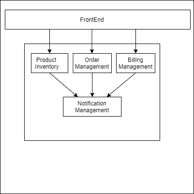
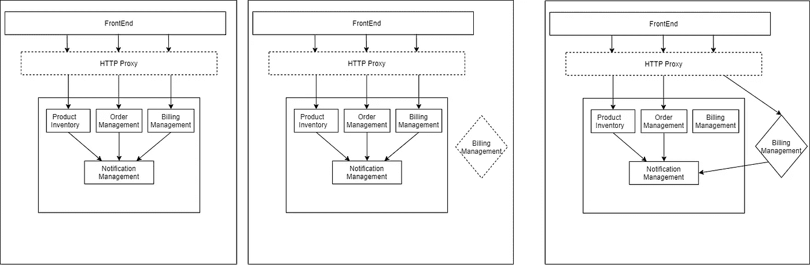
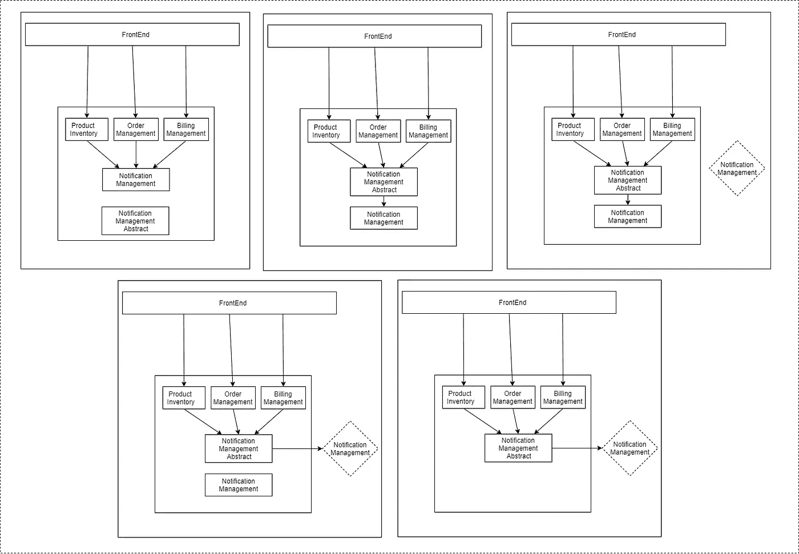
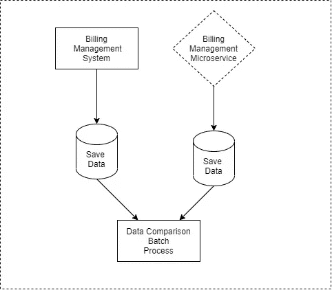
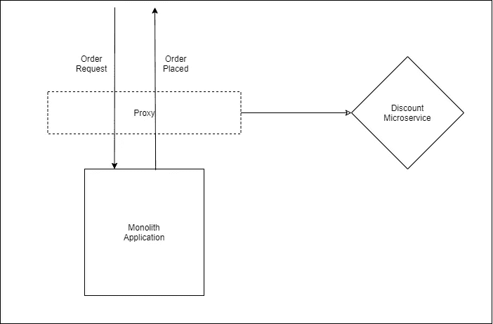

# 将您的 monolith 迁移到微服务之前需要了解的模式

> 原文：<https://levelup.gitconnected.com/patterns-to-know-before-migrating-your-monolith-to-microservices-72fcbcc7846e>

[万花筒](https://unsplash.com/@kaleidico?utm_source=unsplash&utm_medium=referral&utm_content=creditCopyText)在 [Unsplash](https://unsplash.com/s/photos/migration?utm_source=unsplash&utm_medium=referral&utm_content=creditCopyText) 上拍摄的照片

当正确实施时，微服务提供了许多优于整体服务的优势。许多组织希望将他们的 monolith 应用程序代码改为微服务代码。事实证明，迁移到微服务并不容易。你要问的第一个问题是，你真的需要微服务吗？通过使用模块化整体结构，可以容易地解决整体结构的许多问题。一旦你确定你想要微服务，你就必须制定一个计划将 monolith 转化为微服务。有一些模式可以帮助您创建所需的计划。

在我们进入实际的模式来划分一个整体之前，让我们来谈谈什么是不应该做的。

# 不要做大爆炸重写

大爆炸重写，顾名思义，我们必须在微服务中重写整个 monolith 的代码，并一次性将其部署到生产中。马丁·福勒曾经正确地说过:

> 《生活大爆炸》唯一能保证的就是一场大爆炸！

大爆炸重写总是危险的。大爆炸重写需要花费大量的时间来开发，因为你必须对一个整体应用程序中的所有东西进行编码。此外，在微服务架构的开发过程中，您必须冻结您的 monolith 的进一步开发，因为 monolith 中所做的每个更改都必须在微服务中完成。对于大多数公司来说，冻结应用程序开发可能是危险的，因为他们必须根据业务环境的变化进行调整。

对于一个组织来说，从整体逐渐转移到微服务总是更好的。有一些设计模式可以帮助你从 monolith 逐渐过渡到微服务架构。

# 扼杀者无花果

扼杀者无花果是马丁·福勒提出的一种模式。扼杀者无花果的灵感来自于真实的无花果，从寄主树的顶端树枝开始变小。无花果的根开始向地面生长。慢慢地，它的根会到达地面，并继续生长，甚至在此过程中杀死宿主树。同样，在软件领域，我们将根据这种模式围绕单个整体应用构建微服务。我们将不断在系统中增加更多的微服务，最终有一天会取代整个 monolith 系统。

在扼杀者 Fig 中，我们在现有的 monolith 的边缘创建新的服务。我说的整块石头的边缘是什么意思？我们举个例子来理解。

图 1:单片应用程序

在图 1 中，你可以看到我们有一个整体应用程序。现在，在上图中，产品库存、订单管理和账单管理模块位于应用程序的边缘。通知管理有来自应用程序内部的多个入站呼叫。因此，我们不能从外部应用程序将所有入站呼叫重定向到通知管理。我们还有另一种将通知管理转移到微服务的模式，我们将在后面讨论。

假设我们想将计费管理迁移到微服务。我们可以使用以下步骤将整体迁移到微服务。

1.  *插入代理:*除非您已经有一个代理，否则我们需要部署另一个 HTTP 代理。在步骤 1 中，我们有一个 HTTP 代理，它将所有调用直接重定向到整体应用程序。通过引入 HTTP 代理，您还可以知道网络上的任何附加希望是否会延迟 API 调用。如果延迟很大，那么您必须停止迁移，在继续迁移之前先改善您的网络。
2.  *部署微服务:*在第 2 步中，您将只在生产中部署微服务。我们的微服务上不会有任何直播流量。在第二步中，我们将测试我们的微服务是否工作正常。
3.  *重定向流量:*在第 3 步中，我们将把实际流量从 HTTP 代理重定向到我们新的微服务。如果有问题，我们可以通过更改 HTTP 代理来轻松回滚。

所有步骤也显示在图 2 中。

# 抽象分支

当你必须提取一个其他模块所依赖的模块时，那么抽象分支模式会很有用。假设在前面的示例中，我们想要将通知管理转换为微服务。在这种情况下，我们将使用抽象分支。我们需要执行以下步骤来提取一个模块。

1.  *创造抽象。你需要围绕你要替换的模块创建抽象。*
2.  *更改现有功能的客户端以使用新的抽象:*您需要重构旧代码，以便旧实现实现在步骤 1 中创建的抽象。
3.  *创建新的实现。*您需要为功能创建一个新的微服务实施，并将其部署到生产环境中，然后运行一些测试。
4.  *开关实现。一旦你运行了一些测试，你有了一些信心，那么你就可以切换到一个新的代码。*
5.  *清理。*一旦你的微服务启动并运行，最好清理旧代码库并移除旧模块。如果你愿意，你也可以去掉抽象。在许多情况下，您之前创建的抽象可能只是改进了您的代码库，在这些情况下，保留它完全没问题。

为了更好地理解整个过程，请参考图 3。

图 3:通过抽象进行分支

抽象分支可以用在很多地方。它总是建议尽可能使用扼杀者图而不是抽象分支。一旦你确定你不能用陌生的 Fig 替换你的微服务的某个部分，因为它在你的微服务中，那么就应该考虑抽象的分支。

# **并行运行**

无论你做了多少测试，仍然有可能出现错误。当你在迁移一个关键系统时，你不能把任何东西留给运气。在这种情况下，并行运行模式会很有帮助。在这种模式中，我们将在生产中部署我们新开发的微服务和 monolith。我们将让数据从两个系统中流出。整体系统最初将是真理的唯一来源。我们将比较新开发的微服务与整体服务的结果。如果我们发现任何不匹配，我们将在我们的微服务应用中修复它。一段时间后，当我们对我们的新微服务系统有足够的信心时，我们可以从 monolith 中退役功能，并使微服务成为唯一的真理来源。

在前面的例子中，假设我们想将计费管理从 monolith 迁移到 microservice。在这种情况下，我们将开发一个微服务，并将相同的流量发送到我们的新微服务。在一天结束时，我们可以对任何批处理作业进行比较，看遗留系统和新系统生成的账单是否相同。一旦我们有了信心，我们可以停止从整块的计费系统。我们也有一些开源库，比如 Github 的科学家库，可以帮助你更好地实现这个模式。

图 4:并行运行模式

当你的功能已经存在于整块石头中时，到这里为止所经历的模式是有用的。让我们想象你必须增加新的功能。也许让我们说，你想在每次成功购买后，通过电子邮件向用户发送折扣券，供下次购买时使用。很简单，您可以从 monolith 的订单模块添加新代码来调用新创建的折扣微服务。但是如果你没有密码呢？假设您正在使用另一家供应商的解决方案，或者正在使用一些 SAAS，那么您还能实现它吗？接下来我们将要看到的两种模式正是为这种情况量身定制的。

# **装修合作方**

这种模式的灵感来自于我们已经知道并喜爱的一种模式，装饰者模式。在这种情况下，就像扼杀者模式一样，我们必须引入一个代理。我们将让调用通过代理传递到 monolith，基于 monolith 的响应，代理将调用我们新创建的微服务。

图 5:装饰合作者

图 5 展示了装饰者合作者的工作。只有当微服务所需的所有数据都已经出现在请求或响应中时，才应该使用这种模式。如果数据不存在，那么我们新创建的微服务将不得不与 monolith 的数据库连接。它将把我们新的微服务与 monolith 的数据库结合起来，这从来都不是一个好主意。

# 更改数据捕获模式

在这种模式中，我们将对数据库中发生的变化做出反应。比方说，我们想为系统中创建的每个客户创建一张会员卡。在这种情况下，我们可以监听客户表中的变化。一旦我们检测到一个新客户在客户表中创建了 n，我们就可以调用忠诚度微服务。忠诚度微服务然后可以向客户发放忠诚度卡，并向他们发送详细的电子邮件。有多种方法可以用来监听数据库中的变化。您可以使用触发器，也可以使用数据库的事务日志。您也可以编写一个过程，在几分钟后触发，并检查数据库中的任何更改。

# **结论**

如果实施得当，微服务可以提供许多优势。将您的 monolith 应用程序转换为微服务不会在一天或一周内发生。人们还应该记住，转换到微服务不是一场比赛，而是一场缓慢的马拉松。这需要很大的耐心，并且必须做出好的架构决策。

在本文中，我们讨论了一些您可以使用的模式。大多数情况下，您必须选择多种模式来将您的 monolith 应用程序完全转换为微服务。最后，我只是建议，在迁移到微服务之前，花点时间想清楚您将使用的策略，最终会有回报的。

# 参考资料:

 [## bliki:奇异应用

### 当辛迪和我去澳大利亚的时候，我们在昆士兰海岸的雨林里呆了一段时间。一个自然的…

martinfowler.com](https://martinfowler.com/bliki/StranglerFigApplication.html)  [## bliki:branchbayabstraction

### “抽象分支”是一种以渐进的方式对软件系统进行大规模变更的技术，它允许…

martinfowler.com](https://martinfowler.com/bliki/BranchByAbstraction.html)