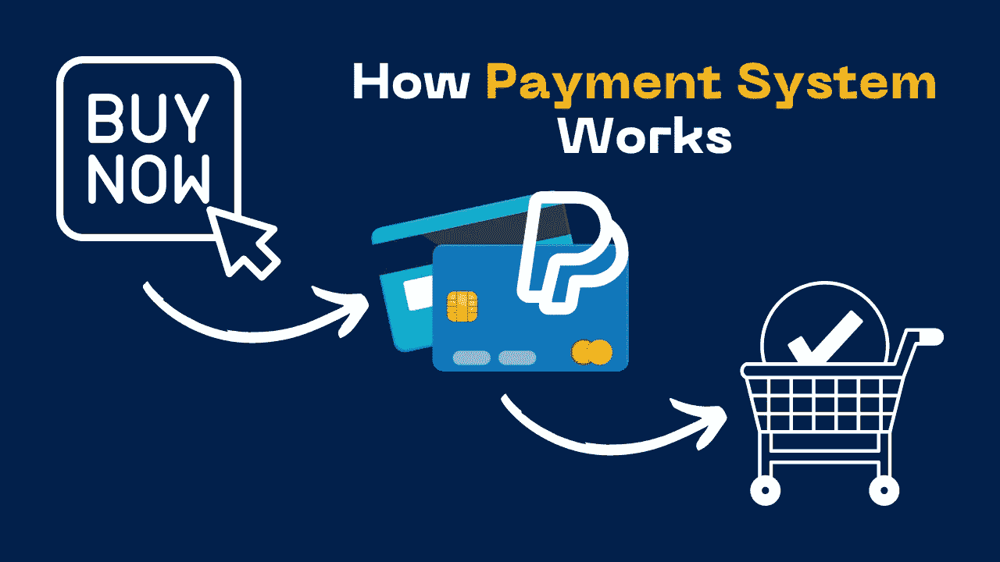
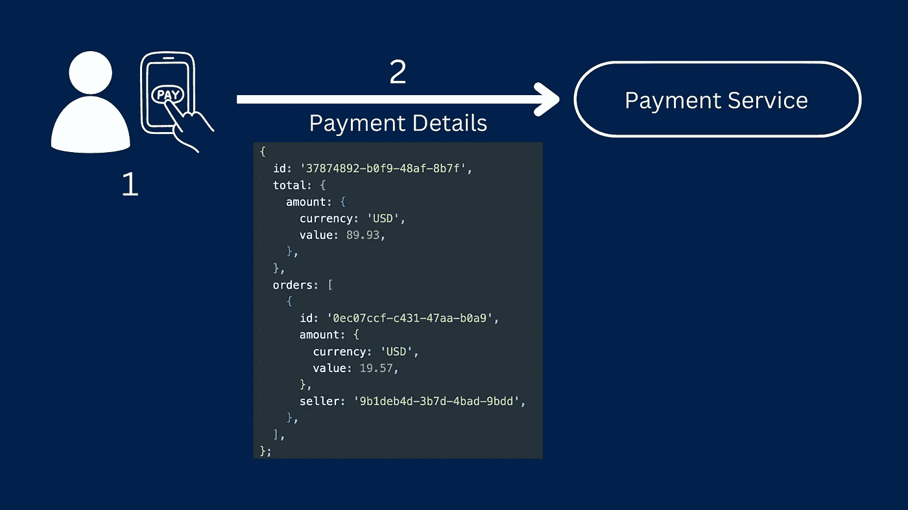
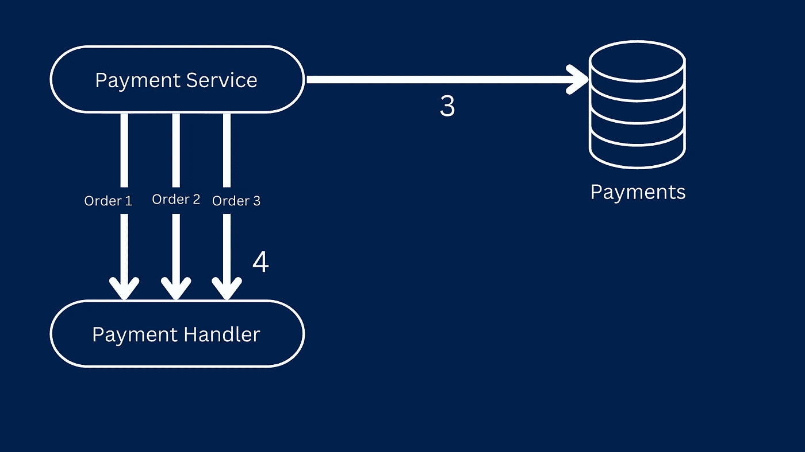
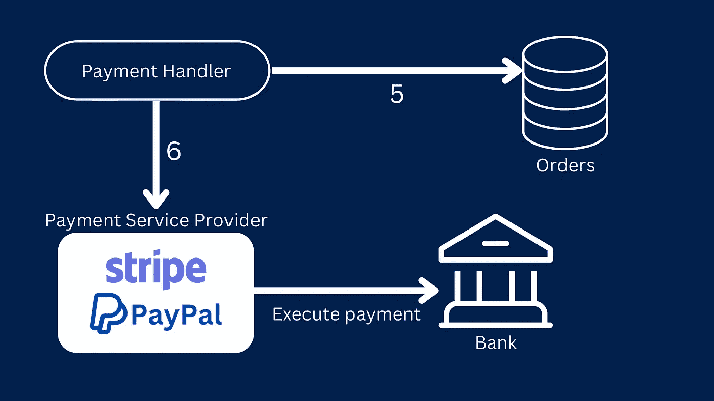
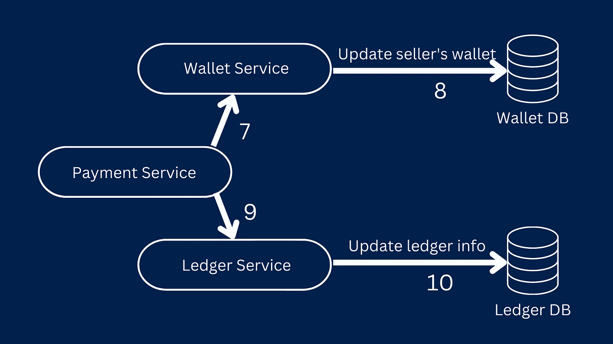

# 简化的支付系统

> 原文：<https://levelup.gitconnected.com/payment-system-simplified-c26117f2da1b>



# 介绍

你有没有想过，当用户从网上市场订购商品并点击支付按钮时会发生什么？整个支付交易过程在短短几秒钟内无缝完成，但很多事情都在幕后进行。

在这篇文章中，我们将探索在你点击任何购物网站上的支付按钮后发生在幕后的支付过程。

# 该过程

1.  用户点击支付按钮后，将创建一个新的**支付细节**对象，其中包含订单的所有信息。

一个非常简单的**支付细节**看起来像这样，有支付 id、总支付金额和订单列表，每个订单包含订单 id、订单金额、卖家 id 等信息。

```
{
  id: '37874892-b0f9-48af-8b7f',
  total: {
    amount: {
      currency: 'USD',
      value: 89.93,
    },
  },
  orders: [
    {
      id: '0ec07ccf-c431-47aa-b0a9',
      amount: {
        currency: 'USD',
        value: 19.57,
      },
      seller: '9b1deb4d-3b7d-4bad-9bdd',
      ...
    },
    ...
  ],
  ...
};
```

2.接下来，**支付细节**对象被发送到**支付服务**，该服务处理网站上的所有订单和支付。



支付细节被发送到支付服务

3.首先，**支付服务**会将此支付存储在**支付数据库**中

4.然后，它为每个订单分别调用一个**支付处理程序**服务



支付服务将支付细节存储在数据库中，并调用支付处理服务

5.**付款处理器**将该订单存储在**订单数据库**中

6.它调用**支付服务提供商**，如 PayPal 或 Stripe，执行信用卡支付



支付处理程序将订单存储在订单数据库中，并调用 PSP 来执行支付

7.现在支付已经成功执行，**支付服务**调用**钱包服务**

8.**钱包服务**通过添加订单支付金额来更新卖家的钱包余额(在**钱包数据库**中)

9.最后，**支付服务**将调用**总账服务**

10.它会将分类帐信息附加到**分类帐数据库**



支付服务调用钱包和分类帐服务来更新余额

# 摘要

这就是简化的支付流程。

过去需要几天的付款过程现在处理得更快了，通常，最多需要 2 个工作日才能完成付款并出现在卖家的银行账户中，这也有助于买家快速收到订单。

感谢您阅读并关注每周开发文章。

# 分级编码

感谢您成为我们社区的一员！在你离开之前:

*   👏为故事鼓掌，跟着作者走👉
*   📰查看[级编码出版物](https://levelup.gitconnected.com/?utm_source=pub&utm_medium=post)中的更多内容
*   🔔关注我们:[推特](https://twitter.com/gitconnected) | [LinkedIn](https://www.linkedin.com/company/gitconnected) | [时事通讯](https://newsletter.levelup.dev)

🚀👉 [**加入升级人才集体，找到一份惊艳的工作**](https://jobs.levelup.dev/talent/welcome?referral=true)