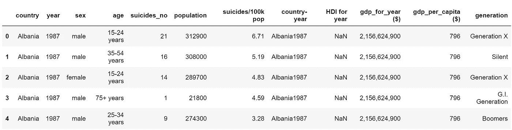
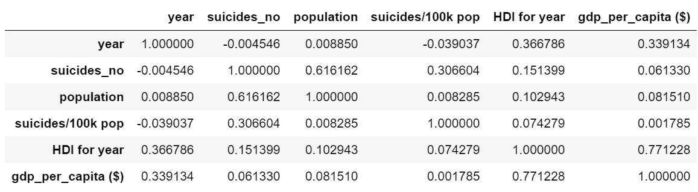
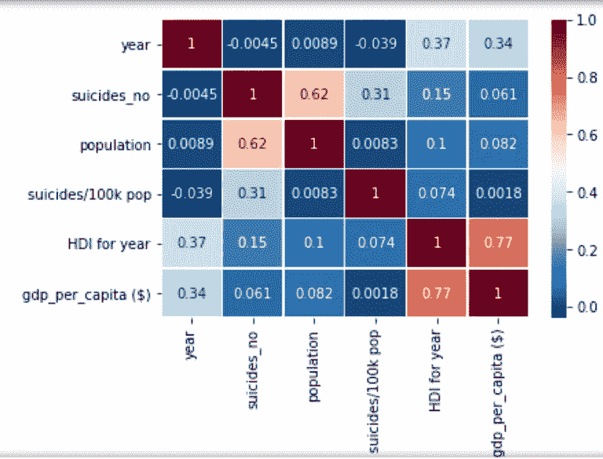

# 与 Python 相关的皮尔逊系数

> 原文：<https://levelup.gitconnected.com/pearson-coefficient-of-correlation-using-pandas-ca68ce678c04>

作为一名数据科学家，这对我来说是一个非常令人兴奋的领域，因为它有助于揭示数据集中变量之间复杂而未知的关系。

我将直接讨论如何在 Python 中使用皮尔逊 r 系数来实现这一点。

Python 是一种令人惊叹的数据分析语言，主要是因为以数据为中心的 Python 包的奇妙生态系统。Pandas*就是其中的一个软件包，它使得导入和分析数据变得更加容易。*

# ***dataframe.corr()解释***

*Pandas `**dataframe.corr()**`用于查找数据帧中所有列的成对相关性。*

> *任何`na`值都被自动排除。*
> 
> *dataframe 中的任何非数字数据类型列都将被忽略。*

*dataframe.corr 参数:`**dataframe.corr(method='',min_periods=1)**`*

*`method` : `*{‘pearson’, ‘kendall’, ‘spearman’}*` *或可调用**

*   *皮尔森:标准相关系数— [点击此处了解更多信息](https://medium.com/@joseph.magiya/pearson-coefficient-of-correlation-explained-369991d93404)*
*   *肯德尔:肯德尔τ相关系数*
*   *斯皮尔曼:斯皮尔曼等级相关*

*`min_periods` : *int，可选**

*   *每对列获得有效结果所需的最小观察次数。这目前仅适用于 pearson 和 spearman 相关性*

# *让我们来点实际的吧！*

> *因为我们在实践中学习*

*首先，我们导入我们需要的包:*

```
*import numpy as np
import pandas as pd
import matplotlib.pyplot as plt
import seaborn as sb*
```

*现在我们需要一些数据。为此，我选择了一个简单但有趣的数据集，这是我在 Kaggle 上看到的。你可以在这里阅读并下载[。](https://www.kaggle.com/russellyates88/suicide-rates-overview-1985-to-2016)*

*让我们读取数据并将其放入数据帧中。*

```
*SuicideRate = pd.read_csv("suicide-rates-overview-1985-to-2016.csv")*
```

*如果你想浏览一下 Python 上的数据，看看里面有什么数据。*

```
*SuicideRate.head()*
```

**

*DateFrame.head()*

# ***计算皮尔逊相关系数***

*我们将使用`method = ‘pearson’`表示`dataframe.cor` r，因为我们想要计算皮尔逊相关系数。那我们就打印出来！*

```
*pearsoncorr = SuicideRate.corr(method='pearson')pearsoncorr*
```

**

*DateFrame.corr(method='pearson ')*

*这很好，但是数据中有大量的变量会很快使解释变得更加耗时。*

*这就是我在熊猫中导入 seaborn 包的原因:*

```
*import seaborn as sb*
```

> *快速描述 Seaborn 是一个用于可视化数据的 python 库。它建立在 matplotlib 之上，并与 T2 熊猫数据结构紧密结合。*

*为了使这个看起来更漂亮，更容易解释，在计算皮尔逊相关系数后添加这个。*

```
*sb.heatmap(pearsoncorr, 
            xticklabels=pearsoncorr.columns,
            yticklabels=pearsoncorr.columns,
            cmap='RdBu_r',
            annot=True,
            linewidth=0.5)*
```

# ***结果和解释***

**

*皮尔逊 corr 的热图*

*系数接近 1 意味着两个变量之间有很强的正相关性。在我们的例子中，栗色显示了很强的相关性。对角线是变量之间的相关性——所以它们显然是 1。*

*看着这个我们可以很快发现:*

*   *人类发展指数与人均国内生产总值密切相关。*
*   *人口数量与自杀人数也有很强的相关性。这是我们所期望的，对吗？人口越多，自杀人数就越多，反之亦然。*

# ***结论***

*在对数据进行任何类型的分析之前，关联变量将节省数据忍者的时间。在我看来，这更像是对数据的 x 光透视。在任何项目中执行这种关联都是关键——您可能会发现一些有用的东西，也可能会一无所获，不管是哪种情况，您都会对数据有所了解！*

*您还可以查看:*

*   *[皮尔逊相关系数解释道。](https://medium.com/@joseph.magiya/pearson-coefficient-of-correlation-explained-369991d93404)*
*   *[肯德尔等级相关性— python](https://medium.com/@joseph.magiya/kendall-rank-correlation-python-19524cb0e9a0)*
*   *[肯德尔秩相关解释。](https://medium.com/@joseph.magiya/kendall-rank-correlation-explained-dee01d99c535)*
*   *[我的个人资料了解更多数据](https://medium.com/@joseph.magiya)*