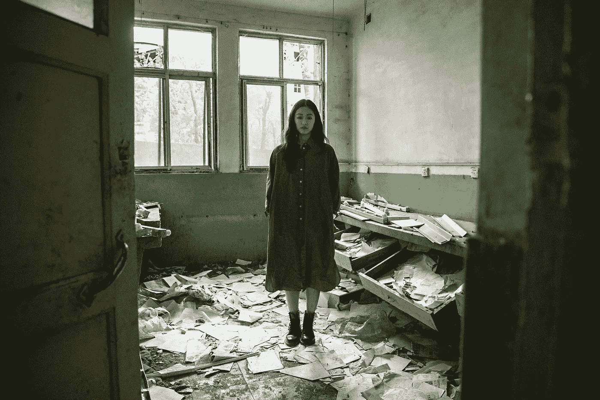

# 仍然使用比特币的人就像一名日本士兵，永远不知道二战已经结束。

> 原文：<https://levelup.gitconnected.com/people-still-in-bitcoin-are-like-the-one-japanese-soldier-that-never-found-out-ww2-was-over-b7cc30fcccb8>

你会明白为什么它描述了比特币 Maxi 的，即使你想，比特币也不太可能永远被废黜。

[动态王](https://unsplash.com/@dynamicwang?utm_source=unsplash&utm_medium=referral&utm_content=creditCopyText)在[上拍照](https://unsplash.com/s/photos/doomsday?utm_source=unsplash&utm_medium=referral&utm_content=creditCopyText)

小野田博夫是一名陆军情报官员，他参加了第二次世界大战，并在 1945 年战争结束时拒绝投降。

他在菲律宾躲藏了 29 年，直到他的前指挥官不得不回来解除他的职务。

人们多次试图让小野田相信战争已经真正结束，但他对事业的奉献和他被欺骗的信念使他没有投降。

他第一次听说战争结束是在战争结束的时候。

1945 年，他看到当地岛民留下的一张传单，上面写着日本已经投降。

纸条上写着:

> “战争于 8 月 15 日结束。从山上下来！”

小野田不相信传单，认为这是盟军为了欺骗他而制造的宣传。

对他来说，战争不可能结束。

嗯，确实是。

虽然我找不到词语来描述小野田的英勇、天真或妄想的努力，但他对自己深信不疑的事业表现出了难以置信的纪律性。

虽然我绝不会把购买数字货币的人与战争英雄联系起来，但比特币制造者在谈到他们的数字代币时，会单独表达这种部落思维。

全球超过 4800 万人拥有由电脑支持的比特币。

你愿意就把我射下来(原谅双关)，但我相信比特币永远不会归零。

即使你想，你也不能阻止它。

就像说服 4800 万小野田从山上下来一样。

这永远不会发生。如果是的话，你最好给我一个更好的选择。

# 比特币是一种社会建构，是一种虚构的价值来源，就像小野田的忠诚一样。

有许多人类创造的有价值的社会结构的例子。

人类历史上最成功的是黄金，然后是金钱。

黄金的价值最终是一种社会建构。它很有价值，因为我们都同意它过去是，将来也是。

黄金的吸引力和金属品质、稀缺性以及从地下提取的难度只会增加价值感。

在一个日益数字化的世界里，比特币解决了黄金的大部分问题。

*   比特币的便携性很高。
*   不需要仓储费
*   经久耐用
*   包容世界各地的每一个人
*   不可复制，不可复制。
*   这也比开采黄金对环境更有利

人们需要注意的一点是，比特币最大的优势是它的网络采用。

忘掉技术吧，这很重要。所有的新技术都是。

有人评论称比特币是区块链的美国在线，但我不予理会。

因为一旦这项技术被网络采用，这是最难创造的东西，它就很难被废黜。

几乎不可能。

这就是为什么顶级社交媒体应用几乎没有竞争对手。

多年来，Twitter 一直是社交媒体应用的雅虎。尽管如此，没有人在乎，因为使用该应用程序的用户网络已经成为社交媒体巨头最重要的支持者。

# 比特币是一个不投降的人的网络。

泰勒·文克莱沃斯和他的兄弟卡梅隆是世界上最大的比特币持有者之一，据报道拥有 70，000 个比特币。他们也对社交网络和加密货币的网络效应略知一二。

> 泰勒·文克莱沃斯:
> 
> “我们习惯了社交网络，但意识到比特币是一个货币网络；你第一次可以像发电子邮件一样在互联网上传递价值”
> 
> “当你意识到金钱是最伟大的社交网络——比特币是第一个互联网货币，它是最伟大的社交网络。”

泰勒说，他试图扼杀比特币的想法，但他努力解释为什么它不能长期运行。

他还表示，人们正以同样的愤世嫉俗的眼光看待比特币，就像他们看待社交媒体公司的价值主张时一样。

他们没有正确识别它的价值。

> 泰勒·文克莱沃斯:
> 
> “人们对社交媒体平台的担忧与比特币一样。你应该像看待脸书早期那样看待比特币。”
> 
> “谷歌尝试了社交媒体，它被称为 Buzz，它彻底失败了。
> 
> 社交媒体平台不仅需要网络效应，而且用户成为平台最突出的拥护者。
> 
> 他们不想离开，因为没有人愿意把他们的照片在十个不同的网络上上传十次。"

他说，当人们选择一个网络时，他们有意识地和下意识地试图扼杀所有其他的想法，因为他们不想要开销。

# 现在超过 50%的比特币地址处于亏损状态。

对投资者来说，比特币的现状一点也不乐观。

我还能听到个人理财专家戴夫·拉姆齐(Dave Ramsay)和十位阅读了我的比特币博客并评论说“比特币将归零”的人的“我早就告诉过你”在我耳边响亮地响起。

我会给你机会的。这是数据。

从人们第一次购买比特币时起，仅超过 51%，即总共 4790 万个地址中的 2460 万个，低于他们投资的购买价格。呸。

根据链上数据，45%是利润，所有未实现的收益。与此同时，未偿还的 4%大约处于盈亏平衡状态。

根据 IntoTheBlock 的数据，这对于加密熊市来说是正常的，尽管按固定价格计算的损失更多，因为比特币的价格呈指数级上涨。

IntoTheBlock 的研究负责人 Lucas Outumuro 认为，如果你看看以前的熊市周期，就会发现更多的痛苦。

2019 年 1 月，55%的比特币地址投资下跌，触底 3200 美元。

三个月后，牛市开始了。

2015 年，62%的比特币地址因投资而下跌。

过去的结果不是未来的标志，但它们确实押韵。2015 年和 2019 年是经济上的重要时期。

现在，FTX 的连锁反应正在让整个市场下沉，还有创纪录的通货膨胀、欧洲战争和生活成本危机等宏观经济问题。

现在情况完全不同了。他们更坏。

# 最后的想法。

比特币在媒体上被贬得一文不值，但股市和房价也是如此。

外面很艰难。

只是钱而已。这不是战争，所以我举的小野田博夫的例子有点牵强。

你不得不承认，小野田的行为介于妄想和成为一个为自己信仰的事业而战的英雄之间，这就是为什么它完全描述了比特币最大化。

他的指挥官的命令让小野田博夫在山上呆了很长时间，并在战前对他说了这些。

> “绝对禁止你死于自己的手。可能需要三年，可能需要五年，但无论发生什么，我们都会回来找你。”

你几乎可以说，这就是我们对比特币的看法——等待下一波应用浪潮的到来。

毫无疑问，这不是英雄主义，也可能是妄想，但这也可能是我们一生中最不可思议的机会。

时间会证明一切。

*如果你想在 Web3 上阅读更多我的观点，请考虑成为会员。你的会员费直接支持你读的作家。如果你用我的链接* [*注册，我会赚一小笔佣金。点击这里*](https://medium.com/@jayden_levitt/membership) *。*

*本文仅供参考；不应将其视为财务、税务或法律建议。在做出任何重大的财务决定之前，你可以咨询财务专家。*