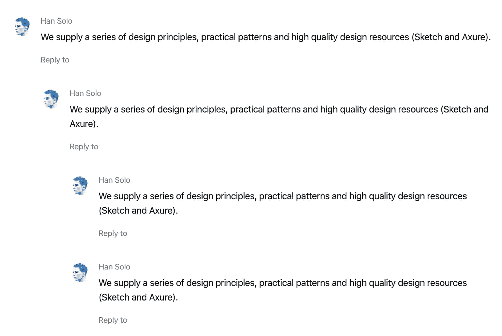
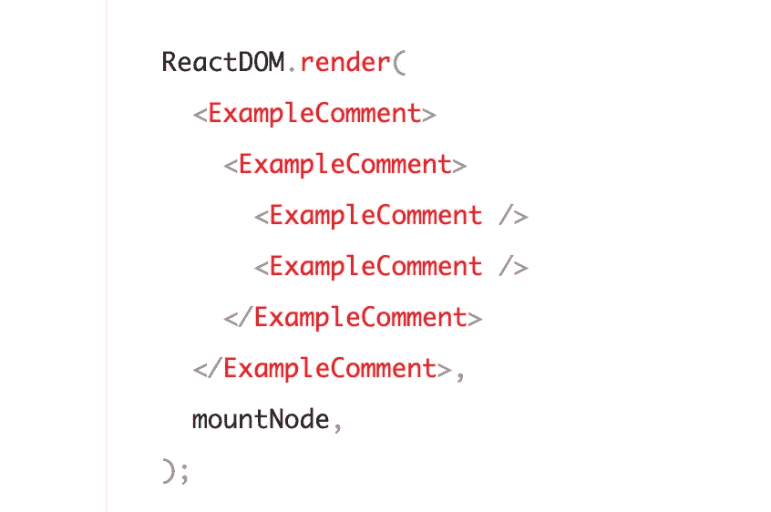
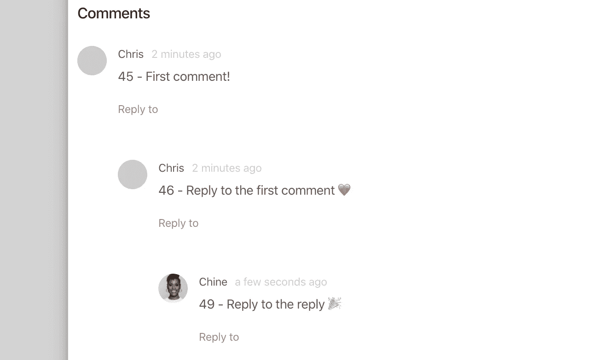

# 根据我最后的评论:在 React/Rails 应用程序中创建回复线程

> 原文：<https://levelup.gitconnected.com/per-my-last-comment-creating-reply-threads-in-your-react-rails-app-d8334a00dfa1>


我最近一直在为我正在构建的社区论坛 web 应用程序添加更多功能，并发现自己希望让用户能够对帖子添加评论。在引入回复和线程响应的概念之前，这似乎是一个非常简单的任务。然后 Rails 模型和 React 组件呈现变得有点棘手。这篇文章将带您了解我的全栈实现，后端使用 Rails，前端使用 React，组件样式使用 Ant Design。我们开始吧🎉！

## 设置这些模型

你需要做的第一件事是设计出你的模型。对于这个功能，我有一个**帖子**、**用户**和**评论**模型。帖子和用户都有很多评论，一个评论属于一个帖子。

```
class Post < ApplicationRecord
  has_many :comments, dependent: :destroy
endclass User < ApplicationRecord
  has_many :comments, dependent: :destroy
endclass Comment < ApplicationRecord
  belongs_to :post
  belongs_to :user
end
```

❗️Curious 关于那个**依赖::摧毁**选项？它确保如果这个帖子或用户被删除，他们的评论也会被删除。关于**依赖**选项的实现，请阅读 Rails 文档[这里的](https://guides.rubyonrails.org/association_basics.html#dependent)。

## 创建回复关系

接下来，我们需要定义*回复*的关系。这实质上是在两个注释之间创建了一个**自连接**关系。在这种情况下，一个评论可以有很多回复，但是一个回复应该只属于一个评论。根据 has_many/belongs_to，一个评论可以有多个回复(或子评论)，一个回复(或子评论)必须属于一个评论(或父评论)。

为了建立这种关系，我们需要在 comments 表上存储一个外键，该外键引用原始评论的主键。我选择将我的列命名为 parent_id。如果注释表中的记录具有 parent_id 的值，则表明它是对主键与 parent_id 匹配的注释的回复。或者，如果记录没有 parent_id 的值，则推断这是顶级注释(或原始注释)。

```
| id | text                 | user_id | post_id | parent_id**------------------------------------------------------------**|  1 | 'original comment'   |  3      | 12      | null|  2 | 'reply to comment 1' |  6      | 12      | 1|  3 | 'reply to the reply' |  3      | 12      | 2
```

注意，第二条记录是第一条注释的子记录，也是第三条注释的父记录🤯。

既然数据库设置正确，我们需要更新我们的**评论**模型来反映评论之间的关系。为此，我们将告诉 ActiveRecord 在 comments 表上创建一个自连接，并将其引用到 parent_id 外键。

```
class Comment < ApplicationRecord
  belongs_to :post
  belongs_to :user belongs_to :parent, class_name: 'Comment', optional: true
  has_many :replies, class_name: 'Comment', foreign_key: :parent_id, dependent: :destroyend
```

让我们一个论点一个论点地分析这里发生的事情:

1.  首先，我们在 Comment 类上创建一个实例变量 **parent** 。默认情况下，ActiveRecord 将使用这个名称和 append _id，并将其用作 SQL 连接的外键。所以实际上，我们都在创建实例方法*和*来创建 parent_id 上的连接。
2.  第二，默认情况下，ActiveRecord 将从第一个参数中查找具有复数名称的表。由于没有父表，我们需要通过指定 class_name 来覆盖这个默认行为。这里我们告诉 ActiveRecord 将外键与 comments 表上的主键相关联。
3.  最后，我们允许这种关系是可选的。原因是注释可能没有父级。记住，一个评论可以有很多回复，也可以属于一个父评论。如果我们不包含可选的:true 参数，我们将*只有*能够创建回复，而不能创建顶级父项(即原始评论)😨。

当设置回复的 has_many 端时，我们经历了相同的步骤，只有一个例外➡️，我们必须显式地指定外键来进行连接，因为没有 reply_id 列，也不应该有。孩子应该记录这段关系，而不是父母。这意味着 parent_id 应该存储在回复中。你现在当然知道了，但只是想再确认一下😉。

❗️Pro-tip:，在继续前进之前，一定要测试你的人际关系！我总是告诉我的学生:在你建立了你的关系之后，跳进 **rails 控制台**并使用一些实例来确保你得到了你想要的数据。

当我在一个 post 实例上调用`#comments`时，我现在能够在一个数组中获得所有的评论和回复。这是预期的结果。我们将在下一节讨论如何以嵌套格式显示这些注释。

接下来，您需要设置 Rails 路线和控制器动作。我不打算在这里深入讨论，因为我不想让它变得太长，而且设置应该非常简单。很高兴在评论区回答这方面的问题！

## 使用 React 和 Ant 设计进行渲染

让我们来谈谈 React 组件！现在我们已经有了我们想要的数据，是时候以一种对用户有意义的方式显示它了。这意味着 React 组件相互嵌套。对于样式，我将使用 Ant 设计库——特别是[注释组件](https://ant.design/components/comment/)。

现在，为了渲染这个:



我们必须将父组件包装在其子组件上，如下所示:



我的第一个问题是:我们如何知道嵌套评论的深度？出于我的应用程序的目的，我选择不限制嵌套回复的数量(为了可读性，我可能会在以后更新)。我确信这个问题可以迭代解决，但是我决定采用*递归*。

我创建了 CommentsContainer 组件。在这里，我可以访问特定帖子的评论数组，并通过映射来呈现每个帖子的 MyComment 组件。

首先，我过滤掉顶级父注释(即 parent_id 值为空的注释)并映射到数组上，为每个注释呈现我的自定义 MyComment 组件。这个注释组件需要接受一个注释对象和完整的注释数组，作为下一步工作的道具:

```
getParentComments().map(c => <MyComment *key*={c.id} *comment*={c} *allComments*={comments} />)
```

真正的动作发生在 MyComment 组件中。使用传入的 comment 和 allComments 属性，我进行过滤以确定这个特定的注释是否有任何子元素。

```
childComments = () => {
  const { comment, allComments } = this.props
  return allComments.filter(c => c.parent_id === comment.id)
}
```

在 MyComment 的 return 语句中，我调用 Ant Design Comment 组件。在 JSX 之间，我映射从 childComments 方法调用返回的数组，并再次递归调用 MyComment:

```
<AntComment
  *author*={<p>{comment.user.name}</p>}
  *content*={<p>{comment.text}</p>}
  *datetime*={displayPostDate(comment.created_at)}
>
  {
    this.childComments().map(c => (
      <MyComment
        *key*={c.id}
        *comment*={c}
        *allComments*={allComments}
      />
    ))
  }
</AntComment>
```

当 childComments 方法返回一个空数组时，递归调用停止(或到达一个基本用例)。在这种情况下，嵌套在 AntComment 组件中的内容是空的。下面是最终的重构代码:

结果是注释按照我想要的顺序嵌套在各自的父注释下:



希望这有帮助！请让我知道你对我下面的实现的想法，和/或如果有任何事情我可以更好地澄清或深入探讨。编码快乐，❤️人！

**更新:**我最终将 Comment.js 转换成一个类组件来处理回复，但是我想分享一下函数式方法，因为它用最少的代码展示了主要的解决方案。