# 利用 Jenkins CI、多分支管道和 autostatus 插件完善 Github 上的公关流程

> 原文：<https://levelup.gitconnected.com/perfect-pr-process-on-github-with-jenkins-ci-multi-branch-pipeline-and-autostatus-plugin-33e1805dc619>


[https://www.jenkins.io/artwork/](https://www.jenkins.io/artwork/)

作为[Cloudify.co](https://cloudify.co/)的 DevOps 工程师，我正在基于 Kubernetes 和 Jenkins 构建一个新的 CI/CD 管道，我还将工作从 CircleCi 迁移到 Jenkins，我喜欢 CircleCI 的一个特点是管道每个阶段返回到 Github 上的 Pull 请求的状态。

这是它看起来的样子

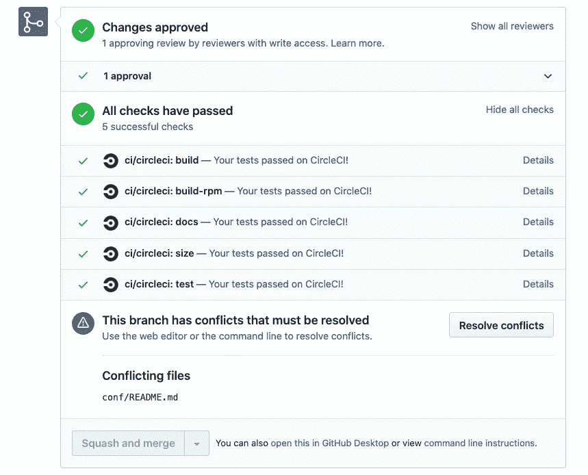

如您所见，对于每个阶段:**build | build-rpm | docs size | test**circle ci 返回 status，表示每个阶段的状态。

看起来不错，但是如何用多分支管道在 Jenkins 中实现这种行为呢？

为了找到这些问题的答案，我想出了这个解决方案，我将在本帖中展示。

不要误会我的意思，我发现了不同的帖子，关于如何直接使用 GitHub API 或通过插件如 [githubnotify-](https://www.jenkins.io/doc/pipeline/steps/pipeline-githubnotify-step/) step 来做这件事，但你需要为管道的每个阶段/步骤手动添加它，这很好，但远非完美。

# 我们开始吧

在这篇文章中，我将向你展示如何配置 Jenkins、Github 和不同的插件来美化你在 Github 上的 PR (Pull Request)过程和使用 Jenkins CI。

# 詹金斯是什么？

> *Jenkins 是一款独立的开源自动化服务器，可用于自动化与构建、测试、交付或部署软件相关的各种任务。*[*https://jenkins.io/doc/*](https://jenkins.io/doc/)

# 什么是多分支管道？

> ****多分支管道*** *项目类型使您可以为同一项目的不同分支实现不同的 Jenkinsfiles。在多分支管道项目中，Jenkins 自动发现、管理和执行源代码控制中包含* `*Jenkinsfile*` *的分支的管道。**
> 
> *这消除了手动创建和管理管道的需要。*
> 
> *[*https://www.jenkins.io/doc/book/pipeline/multibranch/*](https://www.jenkins.io/doc/book/pipeline/multibranch/)*

# *什么是 Github autostatus 插件？*

> **该插件自动发送任何管道作业中所有阶段的状态通知。您可以配置插件将状态信息发送到:**
> 
> **Github，从 PR 页面查看每个阶段的构建状态**
> 
> **任何管道作业的 InfluxDb 或 StatsD(用于自动监控构建健康状况)**
> 
> *[T3【https://plugins.jenkins.io/github-autostatus/】T5](https://plugins.jenkins.io/github-autostatus/)*

# *先决条件*

*Kubernetes 集群必须安装舵杆和舵杆。*

# *将 Jenkins 安装到您的 Kubernetes 集群*

*在我的例子中，它是一个 EKS 集群，带有 Kubernetes 版本 1.15*

***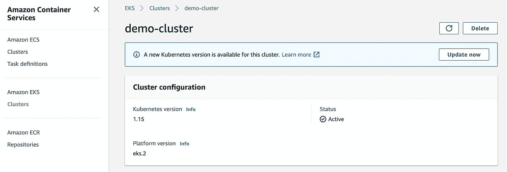*

*出于演示目的，您可以使用 eksctl 实用程序在 AWS 上快速创建 EKS 集群*

```
*$ eksctl create cluster \
  --version 1.15 \
  --region us-west-2 \
  --node-type t3.medium \
  --nodes 1 \
  --nodes-min 1 \
  --nodes-max 1 \
  --name demo-cluster \*
```

> *[*https://eksctl.io/*](https://eksctl.io/)*

*这篇文章的目的不是创建 Kubernetes 集群，所以我不会把重点放在这上面。(如果你感兴趣，你可以写在评论中，我会单独就这个话题写一篇文章)*

# *使用 helm 在 Kubernetes 集群上安装 Jenkins*

```
*$ kubectl create ns jenkins
$ helm install jenkins stable/jenkins --set master.serviceType=LoadBalancer --namespace jenkins*
```

*我将使用 Jenkins helm chart 将其安装到 EKS 集群*

*[https://github.com/helm/charts/tree/master/stable/jenkins](https://github.com/helm/charts/tree/master/stable/jenkins)*

*我使用-set master . service type = Load balancer flag 在 AWS 上创建一个指向 Jenkins 的负载平衡器，这样 Jenkins 将是公开可用的，我们可以使用 Github webhook 在每次推送时向 Jenkins 发送 post 请求。*

*使用“kubectl get services”获取您创建的负载平衡器/公共 IP 的域名*

***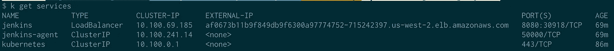*

> **Helm 是 Kubernetes* 的包经理*
> 
> *[*https://helm.sh/*](https://helm.sh/)*

# *使用 Jenkins 多分支管道创建存储库*

*出于演示目的，我将使用一个简单的 python(Flask)应用程序和一个测试和 Jenkinsfile，我还使用了 [Jenkins Kubernetes 插件](https://github.com/jenkinsci/kubernetes-plugin)*

```
*pipeline {
  agent {
    kubernetes {
      label 'ci'
      defaultContainer 'jnlp'
      yamlFile 'build-pod.yaml'
    }
  }
  stages {
    stage('Build') {
      steps {
        echo 'BRANCH NAME: ' + env.BRANCH_NAME
        echo sh(returnStdout: true, script: 'env')

        container('python') {
          sh 'pip install -r requirements.txt'
        }
      }
    }
    stage('Run Unit Tests') {
      steps {
        echo 'CHANGE_ID: ' + env.CHANGE_ID
        container('python') {
          catchError(buildResult: 'SUCCESS', stageResult: 'FAILURE') {
            sh 'python test.py'
          }
        }   
      }
    }
    stage('Run RPMS') {
      steps {
        echo 'ALL ENV:'
        echo sh(returnStdout: true, script: 'env')
        container('python') {
          catchError(buildResult: 'SUCCESS', stageResult: 'FAILURE') {
            sh "exit 1"
          }
        }   
      }
    }
    stage('Run flake8') {
      steps {
        echo 'CHANGE_URL: ' + env.CHANGE_URL
        container('python') {
          sh 'echo "Run flake8"'
        }   
      }
    }
    stage('Check for compatability with python 3') {
      steps {
        echo 'CHANGE_TITLE: ' + env.CHANGE_TITLE
        catchError(buildResult: 'SUCCESS', stageResult: 'FAILURE') {
          sh "exit 1"
        }
      }
    }
  }
}*
```

*我故意让“运行 RPMS”和“检查与 python 3 的兼容性”这两个阶段失败，来看看在收到插件通知后，在拉请求中会是什么样子。*

> **你可以在这里找到所有的代码**
> 
> *[*https://github.com/cloudify-cosmo/jenkins-example*](https://github.com/cloudify-cosmo/jenkins-example)*

# *将 webhook 添加到 Github*

*转到 GitHub 存储库中的 settings 选项卡，添加 webhook*

*[https://github . com/cloud ify-cosmo/Jenkins-example/settings/hooks](https://github.com/cloudify-cosmo/jenkins-example/settings/hooks)*

*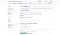**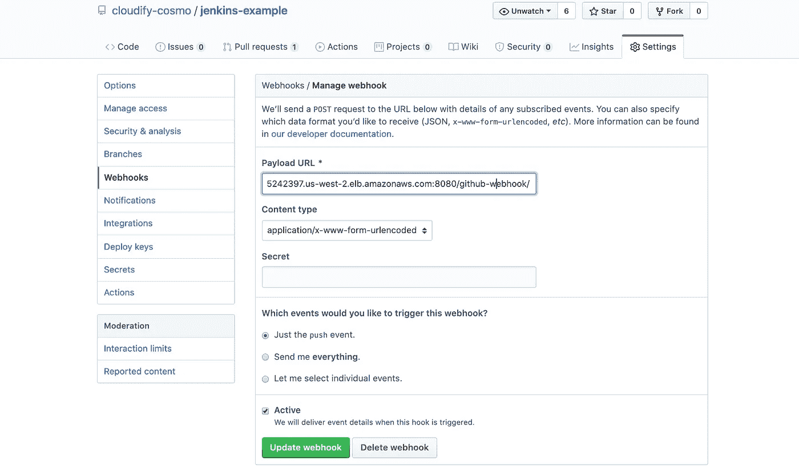*

*我这里的 webhook 是:[http://af 0673 b 11 b 9 f 849 db 9 f 6300 a 97774752-715242397 . us-west-2 . elb . Amazon AWS . com:8080/github-web hook/](http://af0673b11b9f849db9f6300a97774752-715242397.us-west-2.elb.amazonaws.com:8080/github-webhook/)*

*[af 0673 b 11 b 9 f 849 db 9 f 6300 a 97774752–715242397 . us-west-2 . elb . Amazon aws . com:8080](http://af0673b11b9f849db9f6300a97774752-715242397.us-west-2.elb.amazonaws.com:8080/github-webhook/)是您在 AWS 中创建的负载平衡器自动生成的域名，指向 Jenkins*

# *安装 github-autostatus 插件*

*转到 Jenkins ->管理 Jenkins ->管理插件->可用*

*并在不重启的情况下安装插件*

***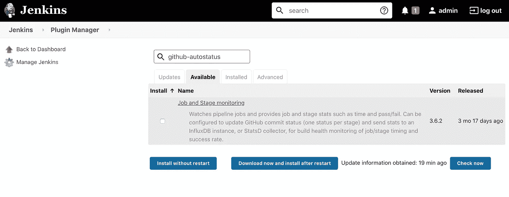*

# *创建多分支管道作业*

*Jenkins →新项目*

*选择多分支管道*

*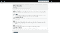**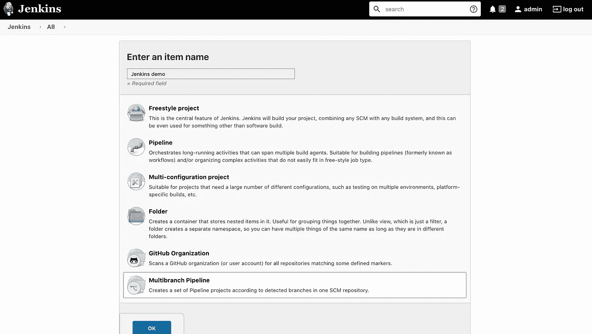*

*配置作业:在“分支源代码”中选择 Github，添加存储库 URL(如果您的存储库是私有的，您需要在 Jenkins 中创建凭证来访问存储库)。*

*建议使用 Github 创建和使用凭证。*

*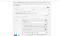**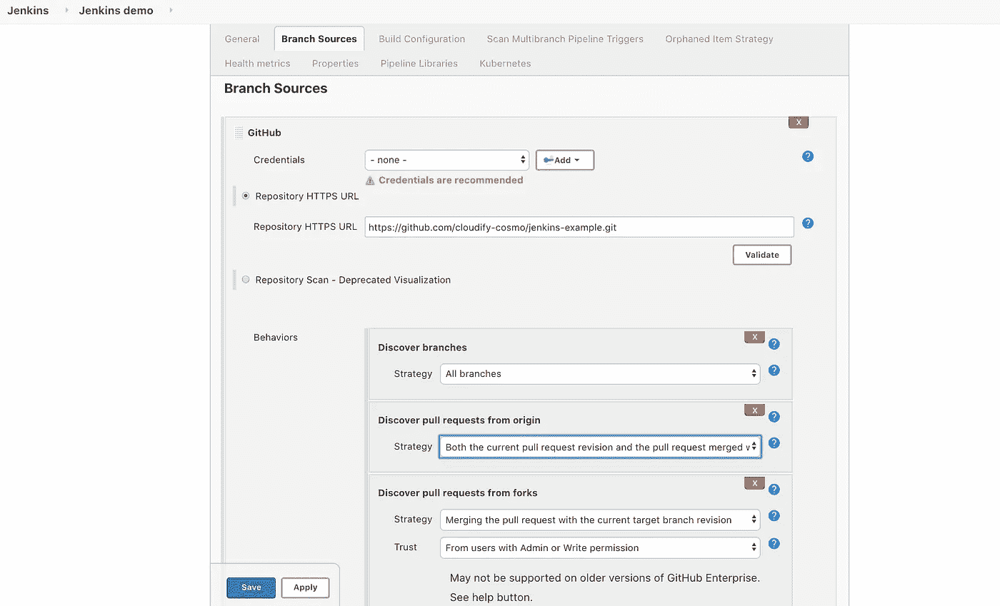*

*然后，如果需要的话，将扫描存储库并执行构建。*

# *检查 Github 和 Jenkins job 之间的集成*

*让我们创建一个新的分支，并在我们的存储库中打开 PR*

*然后检查 webhook 交付，您必须看到最近的交付*

*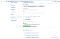**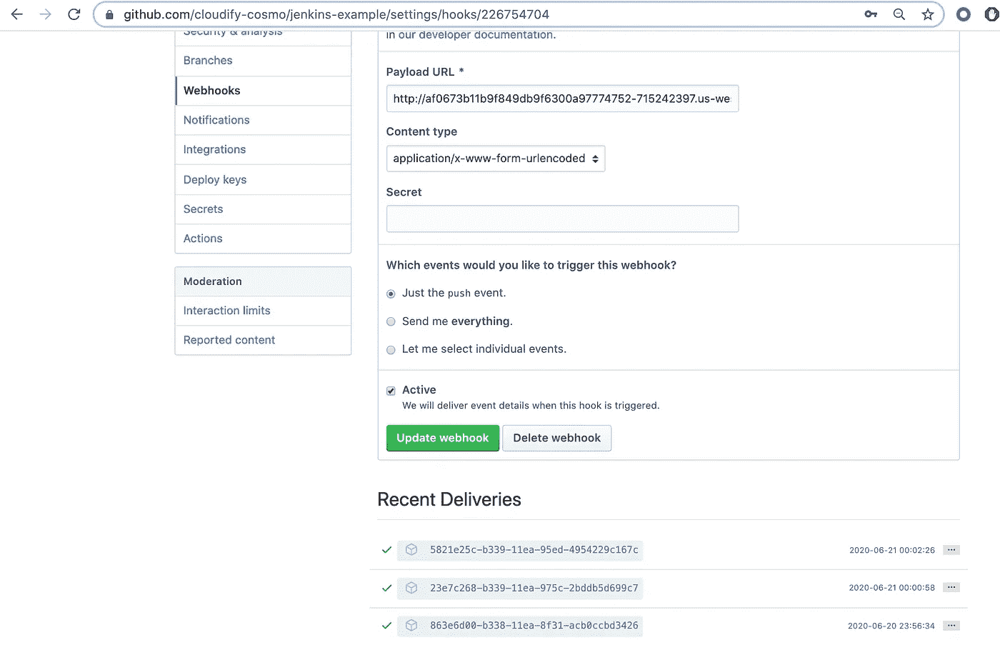*

*然后去你在詹金斯的工作->多分支管道事件*

*您必须在日志中看到通知已收到*

*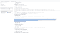**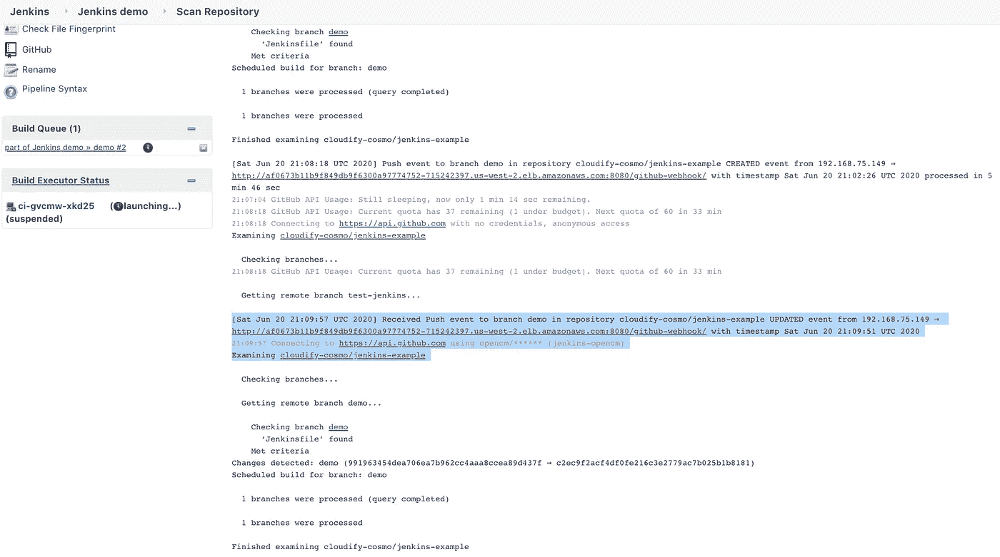*

*最后，你必须在你的公关中看到类似的东西*

*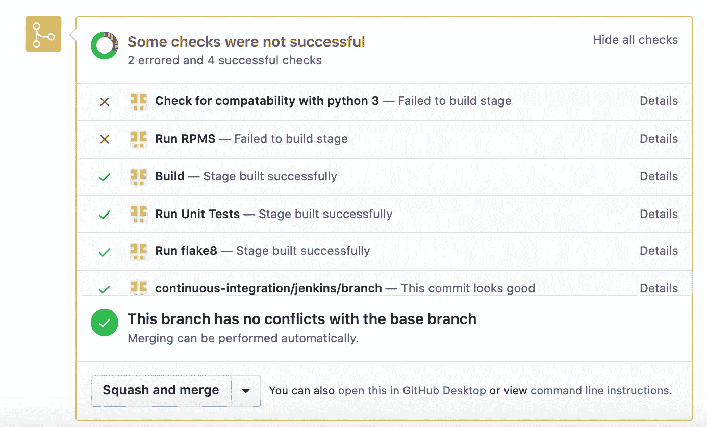*

*你也可以在我的博客中读到:【https://igorzhivilo.com/ *