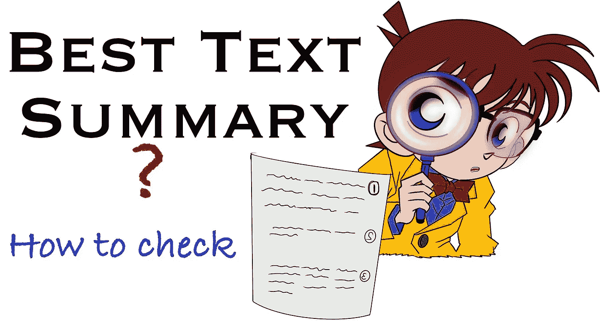
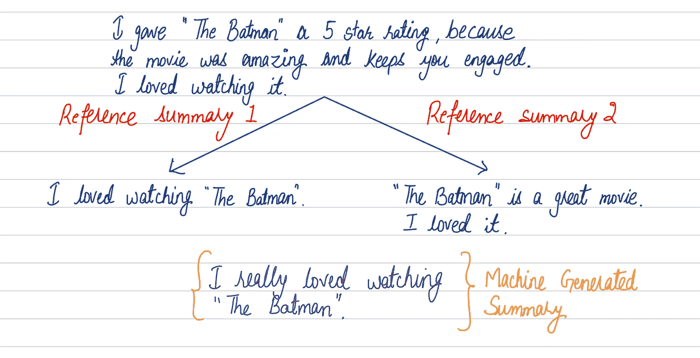
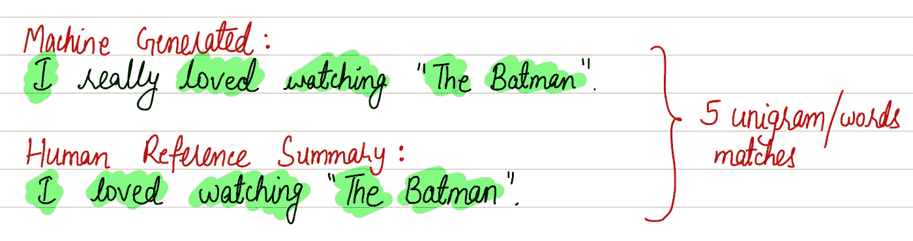
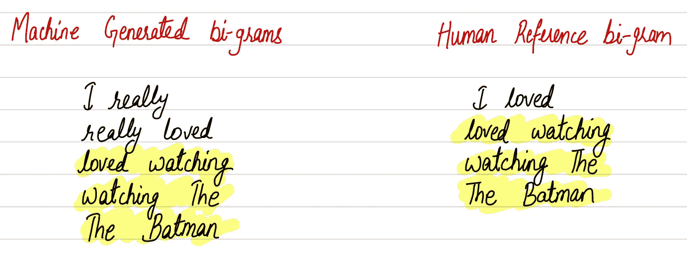
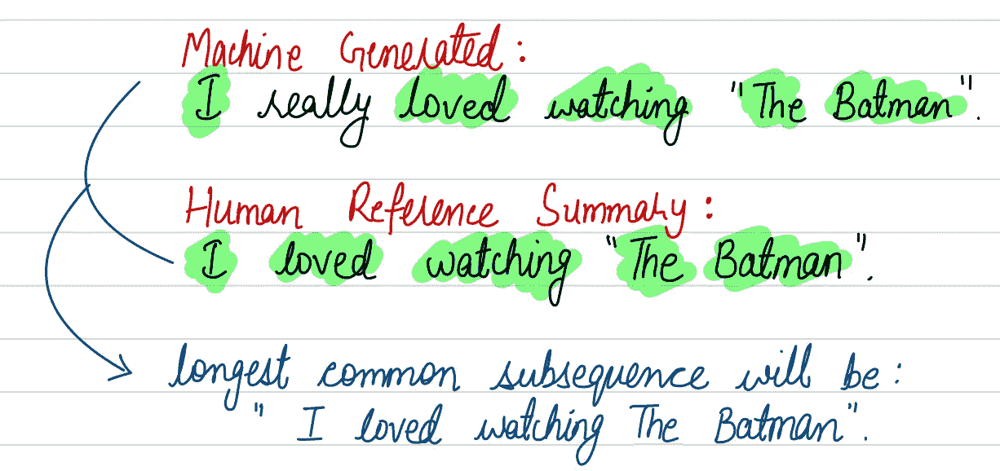

# 基于 ROUGE 评分的文本摘要生成模型的性能分析

> 原文：<https://levelup.gitconnected.com/performance-analysis-of-text-summary-generation-models-using-rouge-score-72e4a8418df6>

## 如何评价文本摘要模型的性能

封面艺术:寻找给定文本的最佳摘要。(来源:图片由作者提供)

对于大多数自然语言处理任务，我们使用最广泛和标准的度量标准，如准确性或 f1 分数。然而，对于文本摘要和文本翻译任务，这些度量在描述模型的性能方面不是很有帮助，因为这些度量不能直接用于文本序列来评估生成的摘要或机器翻译系统的输出的质量。因此，我们需要一个可以用来评估这些算法生成的摘要的指标。有几个性能指标来评估这种用例的性能，例如双语评估替角(蓝色)和面向回忆的替角(红色)。在这篇文章中，我们将只涉及胭脂分数。

# 什么是胭脂度量？

ROUGE 是一组用于评估文本自动摘要和机器翻译的指标[1]。ROUGE 度量标准有几种变体；然而，它们背后的基本思想是给一个摘要分配一个单一的数字分数，告诉我们它与一个或多个参考摘要相比有多好[2]。

例如，在图 1 所示的例子中，我们有一个电影“蝙蝠侠”的电影评论和一个模型生成的摘要。如果我们将生成的摘要与参考人类摘要进行比较，我们可以看到该模型表现良好，只有几个字的差异。

图一。机器生成的摘要和相应参考摘要的示例。(来源:图片由作者提供)

# 衡量生成的摘要的质量

ROUGE 将生成的摘要的 n 元语法与引用的 n 元语法进行比较。有几种类型的胭脂度量，如胭脂-1、胭脂-2、胭脂-1 等。

为了理解摘要是如何生成的，让我们看一下图 2 中的例句。

图二。文本的机器生成和人工参考摘要。(来源:图片由作者提供)

## 胭脂-1

它比较机器生成的摘要和人类参考摘要之间的单字。对于 ROUGE-1 指标，我们有单独的召回率和精确度。

ROUGE-1 recall 是匹配的单词数(在机器生成的摘要和人类参考摘要中)与参考中的单词数的比率。因此，对于图 2 中的例子，ROUGE-1 召回是 5/5 = 1。现在出现了一个问题，只用胭脂-1 召回就够了吗？答案是否定的！！！

如果机器生成的总结如下:
*我真的真的真的真的很喜欢看《蝙蝠侠》*

在这种情况下，我们也将得到 ROUGE-1 召回为 1。它有一个完美的回忆，但总结很糟糕。因此，我们也需要精确。

ROUGE-1 precision 是匹配的字数与摘要中的字数之比。因此，对于图 2 中的示例，ROUGE-1 精度为 5/6 = 0.83。

最后，我们计算两者的调和平均值，也称为 f1 分数。*f1-得分= (2 x 精确 x 召回)/(精确+召回)*

图 3。每台机器生成的二元图和人工参考摘要。(来源:图片由作者提供)

## 胭脂-2

对于 ROUGE-2，我们使用二元语法来代替一元语法。这里，我们也计算精度和召回率。考虑图 2 中提到的类似例子。首先，如图 3 所示，我们创建了二元语法，并使用与 ROUGE-1 相同的公式来计算精度和召回率。

ROUGE-2 recall 是匹配的二元语法的数量与引用中的二元语法的数量之比。因此，对于图 2 中的例子，ROUGE-2 的召回率是 3/4 = 0.75。类似地，ROUGE-2 精度是匹配的二元语法的数量与生成的摘要中的二元语法的数量之比。因此，对于图 2 中的示例，ROUGE-2 精度为 3/5 = 0.60。

图 4。机器生成和人类参考摘要之间的最长公共子序列(LCS)。(来源:图片由作者提供)

## **胭脂-L**

ROUGE-L 不比较 n-grams；而是将每个摘要视为一个单词序列，然后寻找最长的公共子序列(LCS)。图 4 显示了机器生成的参考摘要和人工参考摘要之间的 LCS。

ROUGE-2 召回率是 LCS 长度与参考摘要字数的比值。因此，对于图 2 中的例子，ROUGE-L 召回是 5/5 = 1。类似地，ROUGE-L 精度是 LCS 的长度与生成的摘要中的字数之比。因此，对于图 2 中的示例，ROUGE-L 精度为 5/6 = 0.83。

与 ROUGE-1 和 ROUGE-2 相比，使用 ROUGE-L 的优势在于它不依赖于连续的 n 元语法匹配，并且它倾向于更准确地捕捉句子结构。

# 结论

这篇文章提到需要 ROUGE 度量来评估文本摘要模型的性能。此外，还举例讨论了三种不同类型的 ROUGE 度量。

# 参考

1.  赛。林。" Rouge:一个自动评估摘要的包."在*文本摘要分支*，第 74–81 页。2004.
2.  页（page 的缩写）Singh，P. Chhikara 和 J. Singh，“一种用于摘录文本摘要的集成方法”，2020 年信息技术和工程新兴趋势国际会议(ic-ETITE)，2020 年，第 1–7 页。