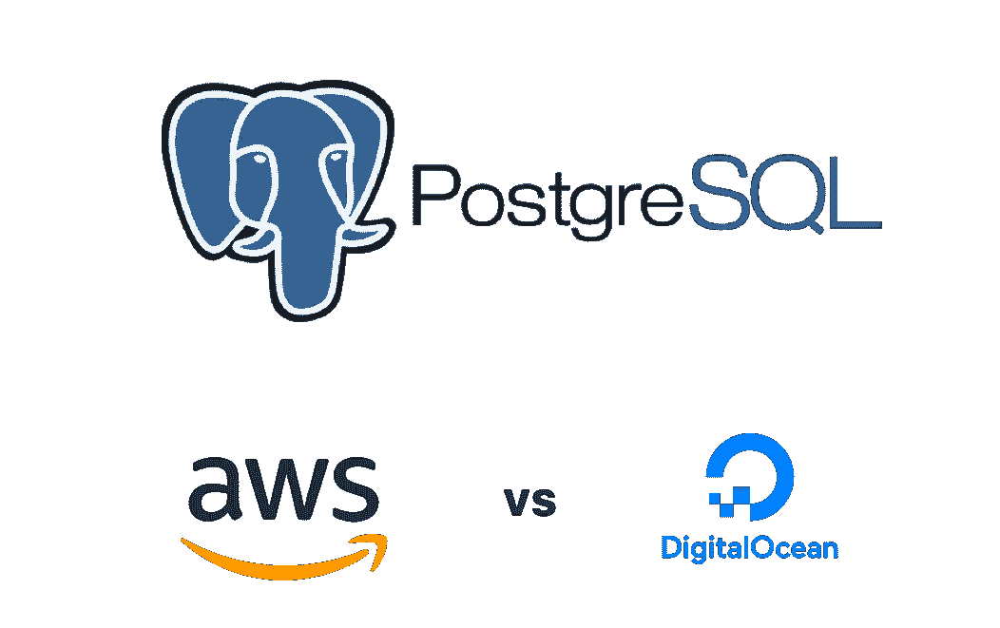

# 数据库性能比较:AWS RDS Postgres 与数字海洋 Postgres

> 原文：<https://levelup.gitconnected.com/performance-aws-rds-postgres-vs-digital-ocean-postgres-8c2500197f1c>



当 Digital Ocean 宣布提供托管 Postgres 数据库服务时，我想回答这个问题:

**如果我把我的 Postgres 实例从 AWS 切换到 Digital Ocean，我的应用程序的性能会提高吗？**

我在 Medtally.com 工作，这是一个数据驱动的医疗社区。因为 Medtally 上的几乎每个页面都需要新数据，所以数据库的速度对于为用户提供快速体验至关重要。


Medtally 上的示例页面。每个页面请求都从 Postgres 数据库中提取数据。

# **测试设置:**

**AWS:** Postgres 11 (2 个 vCPUs，4GB RAM，40GB 存储，AWS us-west-1，68.4 美元/月)

**数字海洋:** Postgres 11 (2 个 vCPUs，4GB RAM，38GB 存储，SFO2，60 美元/月)

**应用托管:** Zeit Now v1 (SFO，AWS us-west-1)

**应用堆栈:** Express.js，React.js，Next.js ( [阅读我关于使用 Next.js 构建的技巧](/6-tips-using-next-js-for-your-next-web-app-e3f056fa46?source=friends_link&sk=03f988ac7259a65191d3eaf752dbc370))

**潜伏期:**

*   app→AWS:0 毫秒
*   app →数字海洋:2ms

**自定义优化:**无。两个数据库实例都用相同的数据进行了开箱测试。

# **如何衡量绩效:**

**方法一:**

为了尽可能接近真实世界地测量性能，我跟踪了为我们流行的健康状况页面获取数据所需的一个常见查询的响应时间([示例](https://medtally.com/condition/ulcerative-colitis))。这种方法测量了查询执行时间和网络。

我使用 Node.js' `perf_hooks` API 并记录了结果。

示例用法:

```
*const* { performance } = require('perf_hooks');*const* t0 = performance.now(); //start timerconst data = await fetchDataFromDB(id);*const* t1 = performance.now(); //end timerconst responseTime = t1 - t0 //responsetime in ms
```

**方法二:**

我在一个复杂的查询上运行了`explain analyze`,注意到了不同之处。这个方法只测量了执行时间。

# **结果:**

**方法一:查询执行+网络(2000 个样本)**

平均响应时间:

*   自动气象站:145 毫秒
*   数字海洋:233 毫秒

平均响应时间:

*   AWS:63 毫秒
*   数字海洋:164 毫秒

**方法二:** `**explain analyze**` **对复杂查询的结果(20 个样本):**

*   自动气象站:230 毫秒
*   数字海洋:345 毫秒

数字海洋的响应时间(查询执行+网络)平均延长 60%，中位数延长 160%。使用`explain analyze`的结果相当一致；数字海洋慢了 50%。

这款应用在点击时也明显感觉变慢了。Medtally 应用程序可以在短短 150 毫秒内加载页面。增加 100 毫秒将意味着慢 66%，这是一个显著的差异。

我很惊讶。我预计性能会更接近，因为两个数据库具有相同的 CPU 数量、RAM 大小和磁盘大小。

**AWS 更快的一些可能原因:**

*   AWS Postgres 实例在延迟方面具有优势，因为它与应用程序托管在同一个物理数据中心(AWS us-west-1，即旧金山)。然而，如测试设置所示，这种优势只有 2ms。
*   AWS Postgres 只是使用了更快的硬件(CPU、RAM、SSD)。
*   AWS 的默认优化恰好更适合我的用例。
*   数字海洋的托管 Postgres 服务是新的，该公司需要更多的时间来优化其性能。与数字海洋不到一年的时间相比，AWS RDS 已经服务了 9 年。

# 返回 AWS RDS

我将坚持使用 AWS RDS，直到数字海洋改进其性能。

除了性能问题，我真的很喜欢使用数字海洋。UI/UX 远远优于 AWS，文档也是如此。我对它的未来寄予厚望，我们可以在托管云数据库领域进行更多的竞争。

话虽如此，Medtally.com[又开始使用 AWS RDS 了。](https://medtally.com)

跟我来:https://joelei.substack.com/