# 性能:FImageLoading。SVG.Forms vs Xamarin。表单.图像

> 原文：<https://levelup.gitconnected.com/performance-ffimageloading-svg-forms-vs-xamarin-forms-image-cf47801dfbf6>

你使用 SVG 图像吗？在这篇文章中，我将比较 FFImageLoading。Svg.Forms vs Xamarin。形式。形象表现。


我喜欢这个插件。因为它非常容易使用，可能每个 Xamarin 开发人员都知道它，它有像转换和缓存这样的内置特性。因此，对于嵌入式 SVG 图像，答案可能是显而易见的:[f image loading。Svg.Forms](https://github.com/luberda-molinet/FFImageLoading/wiki/SVG-support) 。然而，将我们可爱的插件用于嵌入式矢量图形是个好主意吗？所以让我们通过比较 FImageLoading 来检查一下。Svg.Forms vs Xamarin。形式。形象表现。

# 我们为什么需要它？

有很多事情会让一个移动应用用户不开心。问题可能是由后端，错误，糟糕的用户界面/UX，或者…性能。不像后端或 UI/UX 可能会超出移动开发者的控制，移动应用的性能是我们的责任，是我们必须关心的事情。当谈到页面之间的导航时，用户最讨厌的问题可能是页面渲染速度。让我们想象一个用户按下按钮导航到另一个页面。用户最不希望看到的就是无响应或延迟。这就是为什么牢记性能并遵循良好实践非常重要。但是，有一个不明显的东西会显著影响页面渲染速度——图像和图标的渲染速度。

# 如何测量 FImageLoading？Svg.Forms vs Xamarin。形式。形象表现？

为了测量性能，我将把 SVG 图像添加到一个 [ContentPage](https://docs.microsoft.com/en-us/xamarin/xamarin-forms/user-interface/controls/pages) 中，以测量页面渲染器创建和页面内容可见之间的时间。之后，将测量两种平台(iOS 和 Android)和两种方法(Xamarin)的页面加载时间。Forms.Image 和 FImageLoading。很容易看出哪种方式更快。

# 准备

我会用 Visual Studio 2019 for Mac 作为 IDE。我也会用两台物理设备来进行测量: **iPhone SE2 (2020)** 和**三星 A5 2017** 。图像也是需要的。于是我从网上弄了 15 个路标的 SVG 图片。

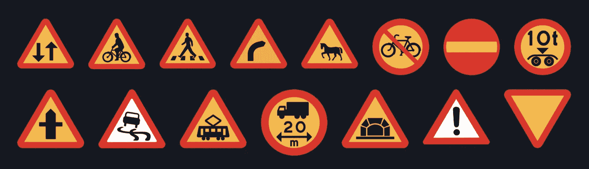

要显示的图像

# 第一步。创建应用程序

现在让我们创建一个空白的 Xamarin。窗体应用程序，并向其中再添加一个带有导航的页面。为了在屏幕上显示测量的时间，需要一些标签。最后，让我们安装[f image loading。将图像控件添加到 StackLayout 中。](https://www.nuget.org/packages/Xamarin.FFImageLoading.Svg.Forms)

```
using Xamarin.Forms;  namespace _2_SVG_XFImage_vs_FFImageLoading 
{
     public partial class App : Application
     {
         public App()
         {
             InitializeComponent();
             MainPage = new NavigationPage(new MainPage());
         }
     }
 }<ContentPage
     x:Class="_2_SVG_XFImage_vs_FFImageLoading.MainPage"

     xmlns:x="http://schemas.microsoft.com/winfx/2009/xaml">     <Button
         Clicked="OnButtonClicked"
         Text="Navigate to Images Page"
         VerticalOptions="Center" />
</ContentPage>using System;
using _SVG_XFImage_vs_FFImageLoading;
using Xamarin.Forms;namespace _2_SVG_XFImage_vs_FFImageLoading
{
     public partial class MainPage : ContentPage
     {
         public MainPage()
         {
             InitializeComponent();
         }         private async void OnButtonClicked(Object sender, EventArgs e)
         {
             await Navigation.PushAsync(new ImagesPage());
         }
     }
}
```

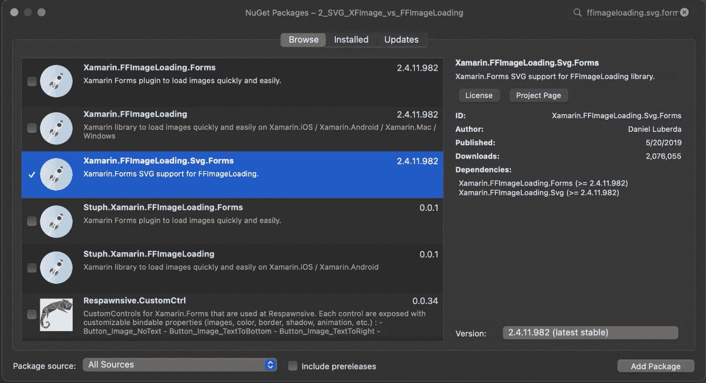

加入 Xamarin。FImageLoading.Svg.Forms 插件到共享项目

```
<ContentPage
     x:Class="_SVG_XFImage_vs_FFImageLoading.ImagesPage"

     xmlns:x="http://schemas.microsoft.com/winfx/2009/xaml"
     xmlns:ffSvg="clr-namespace:FFImageLoading.Svg.Forms;assembly=FFImageLoading.Svg.Forms">
     <ContentPage.Resources>
         <ResourceDictionary>
             <Style TargetType="ffSvg:SvgCachedImage">
                 <Setter Property="Aspect" Value="AspectFit" />
             </Style>
         </ResourceDictionary>
     </ContentPage.Resources>
      <ScrollView>
         <StackLayout Spacing="10">
             <Label
                 x:Name="measuredTimeLabel"
                 FontSize="Large"
                 HorizontalOptions="Center" />
             <ffSvg:SvgCachedImage
                 Source="resource://arrowuparrowdownsign.svg" />
             <ffSvg:SvgCachedImage
                 Source="resource://bicyclesroadsign.svg" />
             <ffSvg:SvgCachedImage
                 Source="resource://crossingsign.svg" />
             <ffSvg:SvgCachedImage
                 Source="resource://dangerousbend.svg" />
             <ffSvg:SvgCachedImage
                 Source="resource://horsesroadsign.svg" />
             <ffSvg:SvgCachedImage
                 Source="resource://nobicycles.svg" />
             <ffSvg:SvgCachedImage
                 Source="resource://noentry.svg" />
             <ffSvg:SvgCachedImage
                 Source="resource://payloadsign.svg" />
             <ffSvg:SvgCachedImage
                 Source="resource://roadlayoutsign.svg" />
             <ffSvg:SvgCachedImage
                 Source="resource://roadsignslippery.svg" />
             <ffSvg:SvgCachedImage
                 Source="resource://tramroadsign.svg" />
             <ffSvg:SvgCachedImage
                 Source="resource://trucksign.svg" />
             <ffSvg:SvgCachedImage
                 Source="resource://tunnelroadsign.svg" />
             <ffSvg:SvgCachedImage
                 Source="resource://warningsign.svg" />
             <ffSvg:SvgCachedImage
                 Source="resource://yieldroadsign.svg" />
         </StackLayout>
     </ScrollView>
</ContentPage>using System; using Xamarin.Forms;namespace _SVG_XFImage_vs_FFImageLoading
{
     public partial class ImagesPage : ContentPage
     {
         public ImagesPage()
         {
             InitializeComponent();
         }         public void SetMeasuredTime(TimeSpan measuredTime)
         {
             measuredTimeLabel.Text = $"Measured time is {(int)measuredTime.TotalMilliseconds}ms";
         }
     }
}
```

# 第二步。添加 ImagePage iOS 渲染器

现在让我们为 ImagesPage 创建一个自定义渲染器。总渲染时间将在渲染创建和 ViewDidAppear 调用之间进行测量。为此，我向 _startTime 字段写入了一个时间戳，并覆盖了 ViewDidAppear 方法。不要忘记使用 [ExportRenderer 属性](https://docs.microsoft.com/en-us/xamarin/xamarin-forms/app-fundamentals/custom-renderer/introduction#creating-a-custom-renderer-class)正确注册渲染器。在覆盖了 ViewDidAppear 方法之后，就可以使用上一步中的 SetMeasuredTime 方法来计算时间并将其显示在显示器上了。

```
using System;
using _2_SVG_XFImage_vs_FFImageLoading.iOS.Renderers;
using _SVG_XFImage_vs_FFImageLoading;
using Xamarin.Forms;
using Xamarin.Forms.Platform.iOS;[assembly: ExportRenderer(typeof(ImagesPage), typeof(ImagesPageRenderer))]
namespace _2_SVG_XFImage_vs_FFImageLoading.iOS.Renderers
{
     public class ImagesPageRenderer : PageRenderer
     {
         private ImagesPage _imagesPage;
         private TimeSpan _startTime;
         public ImagesPageRenderer() : base()
         {
             _startTime = DateTime.Now.TimeOfDay;
         }

         protected override void OnElementChanged(VisualElementChangedEventArgs e)
         {
             base.OnElementChanged(e);
             if (e.NewElement is ImagesPage imagesPage)
             {
                 _imagesPage = imagesPage;
             }
         }
         public override void ViewDidAppear(bool animated)
         {
             base.ViewDidAppear(animated);
             _imagesPage.SetMeasuredTime(DateTime.Now.TimeOfDay - _startTime);
         }
     }
}
```

# 第三步。添加 ImagePage Android 渲染器

现在让我们为 ImagesPage 创建一个自定义渲染器。总渲染时间将在渲染创建和 ViewDidAppear 调用之间进行测量。为此，我向 _startTime 字段写入了一个时间戳，并覆盖了 ViewDidAppear 方法。不要忘记使用 [ExportRenderer 属性](https://docs.microsoft.com/en-us/xamarin/xamarin-forms/app-fundamentals/custom-renderer/introduction#creating-a-custom-renderer-class)正确注册渲染器。在覆盖了 ViewDidAppear 方法之后，就可以使用上一步中的 SetMeasuredTime 方法来计算时间并将其显示在显示器上了。

```
using System;
using _2_SVG_XFImage_vs_FFImageLoading.iOS.Renderers;
using _SVG_XFImage_vs_FFImageLoading;
using Xamarin.Forms;
using Xamarin.Forms.Platform.iOS;[assembly: ExportRenderer(typeof(ImagesPage), typeof(ImagesPageRenderer))]namespace _2_SVG_XFImage_vs_FFImageLoading.iOS.Renderers
{
     public class ImagesPageRenderer : PageRenderer
     {
         private ImagesPage _imagesPage;
         private TimeSpan _startTime;         public ImagesPageRenderer() : base()
         {
             _startTime = DateTime.Now.TimeOfDay;
         }         protected override void OnElementChanged(VisualElementChangedEventArgs e)
         {
             base.OnElementChanged(e);             if (e.NewElement is ImagesPage imagesPage)
             {
                 _imagesPage = imagesPage;
             }
         }         public override void ViewDidAppear(bool animated)
         {
             base.ViewDidAppear(animated);             _imagesPage.SetMeasuredTime(DateTime.Now.TimeOfDay - _startTime);
         }
     }
}
```

# 第三步。添加 ImagePage Android 渲染器

android 渲染器的一般思想是相同的:测量渲染创建和页面渲染后立即调用某个本机 API 之间的时间。然而，Android 没有特殊的本机回调或事件来指示视图是否完全出现。在谷歌搜索了一番后，我找到了一个使用 *OnGlobalLayoutListener* 的建议。

```
using System;
using _2_SVG_XFImage_vs_FFImageLoading.Droid.Renderers;
using _SVG_XFImage_vs_FFImageLoading;
using Android.Content;
using Xamarin.Forms;
using Xamarin.Forms.Platform.Android;
using static Android.Views.ViewTreeObserver;[assembly: ExportRenderer(typeof(ImagesPage), typeof(ImagesPageRenderer))]
namespace _2_SVG_XFImage_vs_FFImageLoading.Droid.Renderers
{
     public class ImagesPageRenderer : PageRenderer, IOnGlobalLayoutListener
     {
         private ImagesPage _imagesPage;
         private TimeSpan _startTime;         public ImagesPageRenderer(Context context) : base(context)
         {
             _startTime = DateTime.Now.TimeOfDay;
         }         protected override void OnElementChanged(ElementChangedEventArgs<Page> e)
         {
             base.OnElementChanged(e);             if (e.NewElement is ImagesPage imagesPage)
             {
                 _imagesPage = imagesPage;
                 ViewTreeObserver.AddOnGlobalLayoutListener(this);
             }
         }         public void OnGlobalLayout()
         {
             ViewTreeObserver.RemoveOnGlobalLayoutListener(this);
             _imagesPage.SetMeasuredTime(DateTime.Now.TimeOfDay - _startTime);
         }
     }
}
```

# 图像加载方式的测量

在共享项目中创建一个“资源”文件夹，并将 SVG 图像添加到该文件夹中。不要忘记为每个图像资源的“构建动作”属性设置“嵌入资源”值。

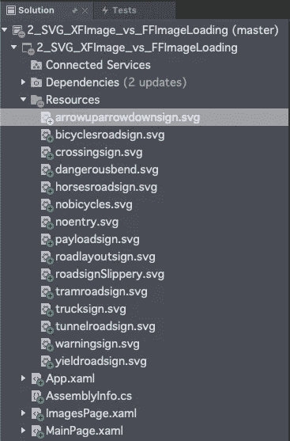

15 幅图像在资源文件夹中

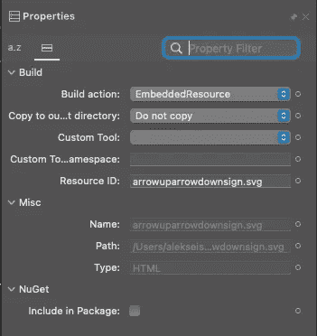

设置嵌入式资源构建操作和资源 ID

一切准备就绪，可以发射了。我得到的结果在下面的截图上。

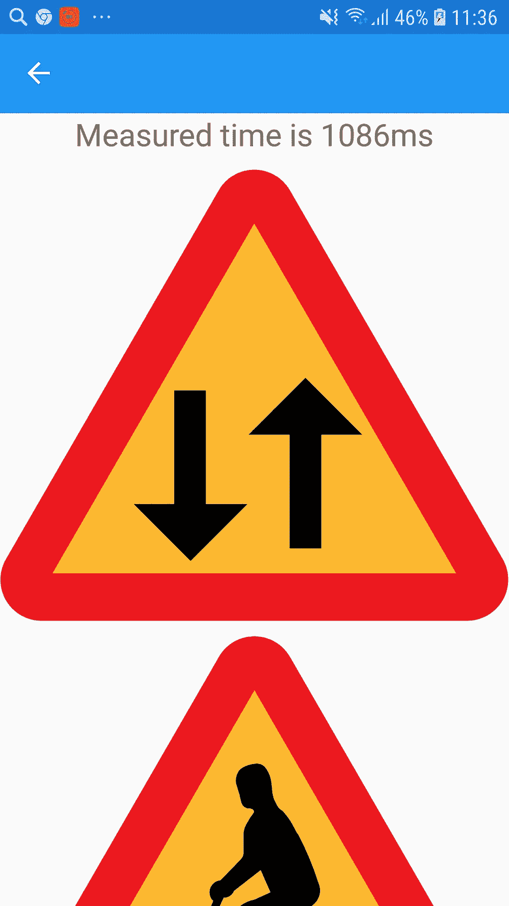

f 图像加载测量结果。iPhone SE2020(左)，三星 A5 2017(右)

# Xamarin 内置方式的测量
步骤 1。将 SVG 图像添加到 iOS 项目

虽然从 iOS 13 开始 iOS 就支持 SVG 图片了，但是无论是 Rider IDE 还是 Visual Studio IDE，由于某种原因仍然不允许添加 SVG 图片。然而，我的上一篇文章中提到了一个解决方法。[阅读它，了解如何将 SVG 图像资源添加到 iOS 项目](/how-to-svg-as-an-ios-image-asset-in-xamarin-8bcb9d7f901a)。

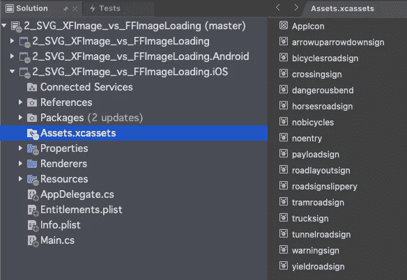

SVG iOS 资产

# 第二步。添加 Android 矢量图像

在 Android 平台上显示 SVG 图像的原生方式是将 SVG 图像转换为 Android VectorDrawable XML。幸运的是，这种转换真的很容易。我通常用 https://svg2vector.com 的[和 T4 的](https://svg2vector.com/)[。所以在转换之后，我将 XML 添加到 Android 项目的 Resources/drawable 文件夹中。请记住:iOS 资产和 Android drawable 的图像名称必须相同。](https://svg2vector.com/)

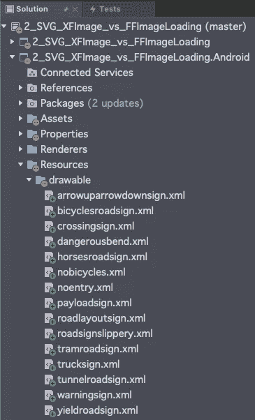

Android drawables

# 第三步。修改表单项目

因为我们不再需要 SvgCachedImage 控件，为了让实验更加清晰，我移除了 FFImageLoading。Svg.Forms 从项目中获取。

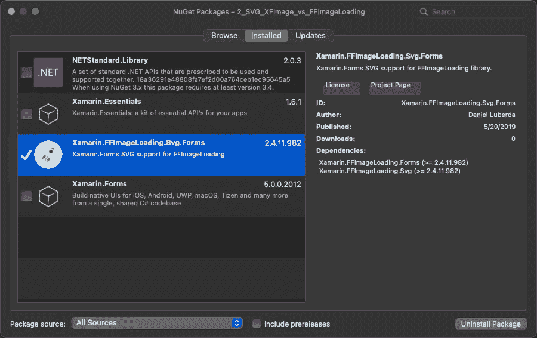

卸载 FFImageLoading NuGet

现在我需要修改 ImagesPage.xaml，如下所示。

```
<ContentPage
     x:Class="_SVG_XFImage_vs_FFImageLoading.ImagesPage"

     xmlns:x="http://schemas.microsoft.com/winfx/2009/xaml">
     <ContentPage.Resources>
         <ResourceDictionary>
             <Style TargetType="Image">
                 <Setter Property="Aspect" Value="AspectFit" />
             </Style>
         </ResourceDictionary>
     </ContentPage.Resources>     <ScrollView>
         <StackLayout Spacing="10">
             <Label
                 x:Name="measuredTimeLabel"
                 FontSize="Large"
                 HorizontalOptions="Center" />
             <Image Source="arrowuparrowdownsign" />
             <Image Source="bicyclesroadsign" />
             <Image Source="crossingsign" />
             <Image Source="dangerousbend" />
             <Image Source="horsesroadsign" />
             <Image Source="nobicycles" />
             <Image Source="noentry" />
             <Image Source="payloadsign" />
             <Image Source="roadlayoutsign" />
             <Image Source="roadsignslippery" />
             <Image Source="tramroadsign" />
             <Image Source="trucksign" />
             <Image Source="tunnelroadsign" />
             <Image Source="warningsign" />
             <Image Source="yieldroadsign" />
         </StackLayout>
     </ScrollView>
</ContentPage>
```

# 第四步。尺寸

现在，我们准备再次启动应用程序并查看结果。附注:我从设备中移除了应用程序的一个先前版本，并为整个解决方案调用了“构建->全部清理”。

结果:

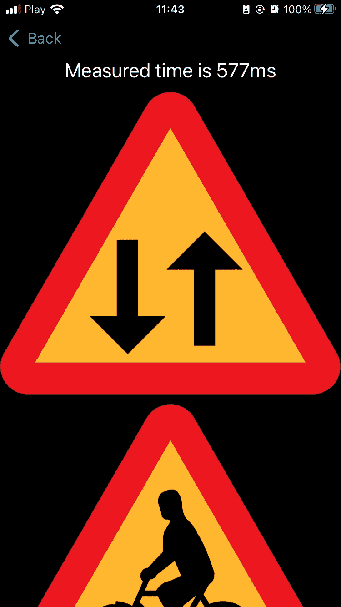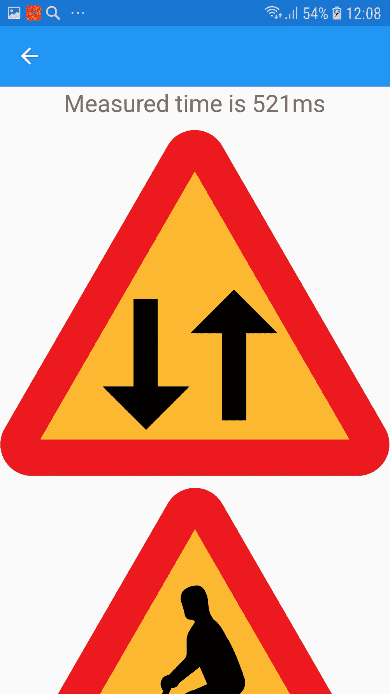

Xamarin。表格。图像测量结果。iPhone SE2020(左)，三星 A5 2017(右)

# 结论

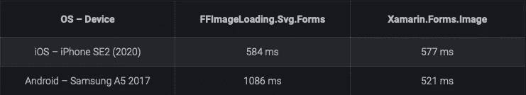

比较结果

如你所见，在 iPhone 的情况下，几乎没有什么不同。然而，Xamarin。当使用 Android 矢量可绘制图像时，图像控制方法要快两倍以上。当我之前在其他设备上比较这两种方法时，结果是一样的:在 iPhone 8 上没有显著差异，但 Xamarin 有显著差异。谷歌 Pixel 5 的图像处理速度快了两倍。

如你所见，虽然 FImageLoading。Svg.Forms 是一个很棒且易于使用的插件，当性能很重要时，最好不要将它用于嵌入式矢量图形。

谢谢你，祝你愉快🙂

# 将 SVG 转换为 VactorDrawable XML 的工具

安卓工作室指南—[https://developer . Android . com/Studio/write/vector-asset-Studio # SVG](https://developer.android.com/studio/write/vector-asset-studio#svg)
[https://svg2vector.com](https://svg2vector.com/)
[https://inloop.github.io/svg2android/](https://inloop.github.io/svg2android/)