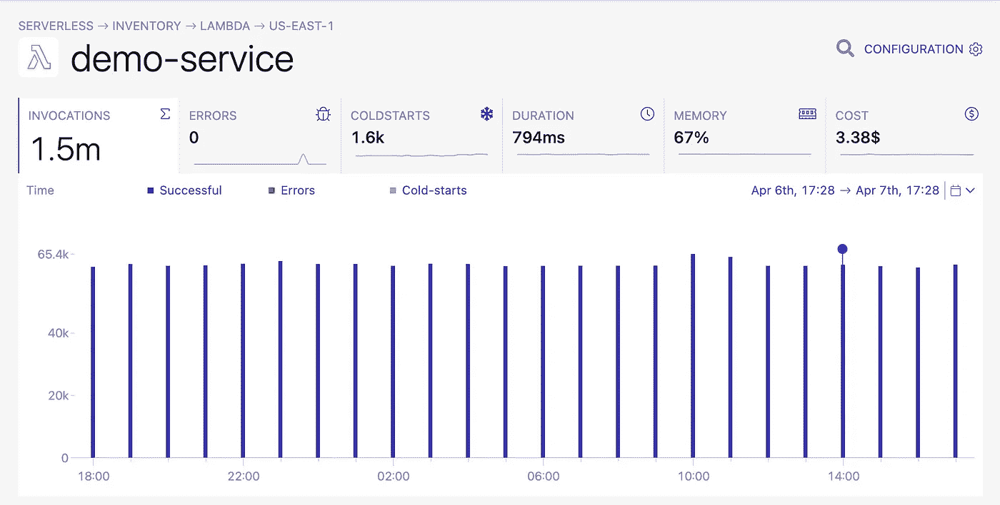
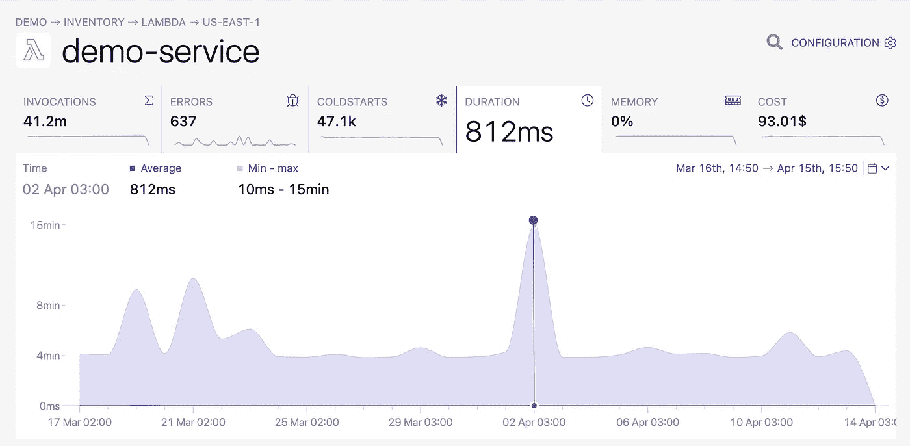
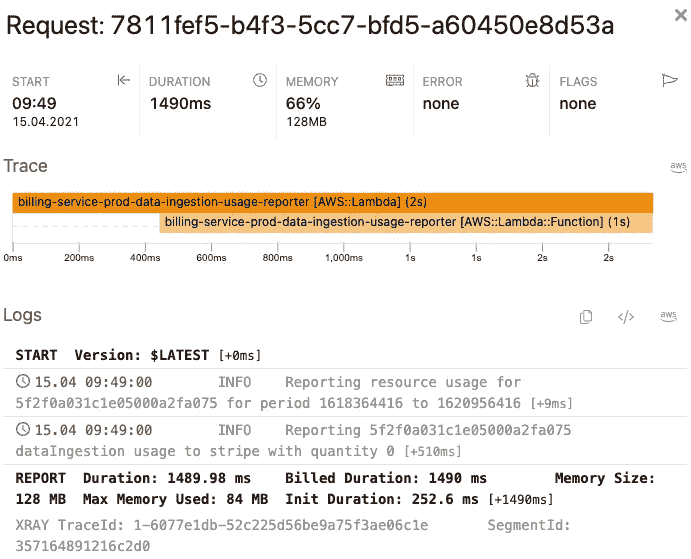

# AWS Lambda 的性能监控

> 原文：<https://levelup.gitconnected.com/performance-monitoring-for-aws-lambda-6d9eefb21716>

监控 Lambda 函数的性能可能看起来微不足道，但是一旦数据集变大，**就越来越难以理解用户如何体验系统**。

作为一名开发人员，你通常**关心系统的延迟和成本**。一个好的可观察性工具的特性应该与此相一致，同时还能让你任意询问关于你的系统的问题，以**找出问题的范围和原因**。

让我们详细说明应该如何进行性能监控，并找出 Lambda 函数性能问题的根本原因。

# Lambda 函数的性能监控

让我们**从你应该在 Lambda 函数中监控什么**开始。

一般来说，有两个方面——用户体验和系统成本。用户体验通常归结为服务的**可用性、延迟和功能集**，而运营服务的成本对于确保企业的盈利能力非常重要。

> 在分布式体系结构中，要监控的表面区域变得更大，性能和成本的变化经常会被忽略。

导致无服务器应用**更难监控的因素之一是分析服务**的设置开销。在大多数无服务器的情况下，要监控的单元要多得多，生命周期短，监控代理直接增加了延迟和成本。

这种服务的好处是，默认情况下，**它们让自己变得可以被观察到。**

可观察性并不意味着你有可视性；这意味着系统发出的数据可以让我们了解外部发生的事情。这是我们构建 Dashbird 的核心原则。

## 观察 Lambda 函数的开销

根据度量标准的不同，**跨所有功能或针对每个资源单独观察它可能是有意义的**。例如，对于系统的总成本，在帐户级别上密切关注它，只有当该指标经历重大变化时，深入到功能级别才有意义。

## 监控函数的延迟

**大型数据集可能会扭曲延迟结果**，从而很难注意到重要的面向用户的功能何时开始需要更长时间来执行。关注延迟的一个好方法是**构建一个包含所有关键任务功能**的定制仪表板，并观察异常值。一旦您检测到某个函数花费的时间比预期的长，您就可以深入到详细的指标。

## 详细的统计数据

**在大型数据集中，平均指标通常隐藏了无关的数据点**，使得无法检测到一些用户经历了明显更长的响应时间。对于开发人员来说，面临 SLA 并不罕见，它要求 99%的请求在一秒钟内完成。像这样的需求是好的，因为它是可操作的和容易测量的——这就是详细的度量标准发挥作用的地方。

# 调试性能问题

当您检测到应用程序有问题时，其原因可能并不明显。

执行缓慢是由于[冷启动](https://dashbird.io/knowledge-base/aws-lambda/cold-starts/)造成的吗？该函数是否调用了响应缓慢的服务？你能通过增加内存来加快执行速度吗，或者只是花费更多的钱而影响很小？让我们一次回答一个问题。

# 等待冷启动

您可以绘制出冷启动的时间图，并将冷启动的延迟与热调用进行比较。如果冷启动是问题所在，可以用不同的方法解决。

尝试减少部署包的大小可以加快冷启动的速度，因为 Lambda 服务必须在从冷状态启动您的功能之前将它们下载到。

如果你通过记录你的用户行为来了解你的访问模式，你可以为 Lambda 函数购买[提供的并发](https://dashbird.io/blog/aws-lambda-provisioned-concurrency/)来延长冷启动时间。

最后，提高函数的内存也将增加它的 CPU 分配，这反过来也可以减少冷启动延迟。

# 等待慢速服务

少数 Lambda 函数独立完成所有工作；大多数情况下，您的函数调用一个或多个其他服务，反过来，必须等待它们。一些服务呼叫是否被延长？

为了进行分解，[为函数](https://dashbird.io/docs/quickstart/enable-x-ray/)启用 X 射线跟踪，Dashbird 会将请求与 X 射线跟踪联系起来，**向您显示每个请求花费的确切时间**。在特定服务调用前后注销事件包括时间戳，这意味着您可以稍后测量调用之间的时间。Dashbird 需要大约 5 分钟来设置，之后您将全面了解您的无服务器应用程序，并可以开始故障排除、搜索日志和[立即接收预配置的警报](https://dashbird.io/failure-detection/)。

当您发现哪些服务调用很慢时，您可以进一步调查。

这只是一个很贵的电话，而且你不能改变它吗？**调用后停止 Lambda，稍后当服务完成其工作时**启动新的 Lambda。对于总是需要更长时间才能完成的服务调用，在 Lambda 调用中等待是一种不好的做法，因为您将为服务调用和等待 Lambda 付费。**缓存对慢速服务调用的响应也是一个解决方案**。

通常情况下，您的服务电话做的比需要的多，您可以减少它。过滤掉你不需要的数据或者尝试**将多个调用批处理成一个**。

# 一般要求高的功能

如果您认为您的函数通常对性能要求很高，**您可以提高内存速度来加快执行**。AWS Lambda 中的内存分配也会影响 CPU 分配，因此即使您的函数受 CPU 限制，这种配置更改也可以提高性能。

这主要是一个基于试错的改进流程，当添加更多内存时速度不再增加时，可能会有一个最佳点。使用[Lambda 功率调整工具](https://github.com/alexcasalboni/aws-lambda-power-tuning)来找出最适合您的功能的配置。

# 结论

尽管无服务器带来了监控和可见性方面的新挑战，但正确的工具和开发实践可以轻松帮助您克服操作和管理问题。代理的必要性日益恶化，因为仅仅由服务本身发出的数据就可以获得大量的信息。