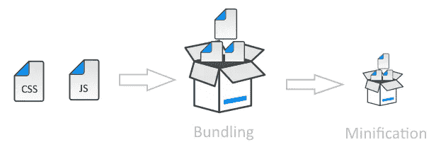

# React 中的性能优化技术

> 原文：<https://levelup.gitconnected.com/performance-optimization-techniques-in-react-31dee64c3b5>


React 在内部使用了许多技术来最小化更新 UI 所需的 DOM 操作的数量。

然而，任何应用程序，无论是在 React 还是任何其他前端框架中开发，其性能最终都会下降。

开发人员必须了解 React 的工作原理及其组件生命周期。如果我们能够正确理解这些概念，我们可以获得很多性能改进。这可以通过组件渲染的**测量**和**优化**、**如何**和**何时**来实现。

除此之外，还有许多其他方法可以提高 React 应用程序的速度。基于我团队的经验，我写下几点我认为对优化有帮助的内容。

请注意，这个列表并不详尽，它只涵盖了几个方面。还有许多其他技术可以用来提高性能。

# 使用生产版本

这是一个非常基本的技术，我相信每个人都在这样做。不过，值得一提的是。在向用户部署我们的应用程序时，我们应该使用缩小的生产版本。


# 捆绑和缩小

对于任何 React SPA，我们可以将所有 JavaScript 代码捆绑在一个小文件中。只要我们的应用程序很小，这就很好。

然而，一旦它开始增长，在一个文件中管理所有的 JS 代码就变得很乏味，代码也很难理解。此外，将这个大文件发送到浏览器本身将是一个非常耗时的过程。因此，我们需要使用某种机制将我们的应用程序分成多个文件，并在需要时将它们提交给浏览器。

如果我们使用的是 ***Webpack*** ，我们可以利用它的代码分割功能将我们的应用程序代码转换成多个“块”文件。

有两种类型的拆分:资源拆分和按需代码拆分。

利用 ***资源拆分*** ，我们可以将资源内容拆分成多个文件。例如，使用 *CommonsChunkPlugin* ，我们可以将公共代码(比如所有外部库)提取到一个自己的“chunk”文件中。

使用*ExtractTextWebpackPlugin*，您可以将所有 CSS 代码提取到一个单独的 CSS 文件中。这种拆分将在两个方面有所帮助。

*   它有助于浏览器缓存那些变化不太频繁的资源。
*   这也将有助于浏览器利用并行下载来潜在地减少加载时间。

*Webpack* 另一个值得注意的特点是 ***按需代码拆分*** 。我们可以用它将代码分割成可以按需加载的块。

这可以保持初始下载量较小，从而减少加载应用程序的时间。然后，当应用程序需要时，浏览器可以按需下载其他代码块。



# 使用时，不要使用数组索引作为键。地图()

假设我们想要呈现一个列表，如果我们没有设置任何键，我们将在控制台看到下面的警告。

```
Warning: Each child in an array or iterator should have a unique “key” prop.
```

为了解决这个问题，很多时候我们只是简单地将循环的`index`值作为子元素的`key`值传入。

```
{todos.map((todo, index) =>
  <Todo
    {...todo}
    key={index}
  />
)}
```

它看起来很干净，完成了任务。它去掉了警告，这才是真正的问题，对吗？然而，真正的危险还在前面。

> 它可能会破坏我们的应用程序并显示错误的数据…！

[索引作为键是一个反模式](https://medium.com/@robinpokorny/index-as-a-key-is-an-anti-pattern-e0349aece318)。

为什么，因为 T2 是 React 用来标识 DOM 元素的唯一东西。当我们从列表中推送或移除任何项目时，如果键与之前相同，React 会假设 DOM 元素表示相同的组件。但是自从更新发生后，情况就不再是这样了。

使用一个惟一的属性作为键总是明智的，或者如果它不存在，那么我们可以使用`[shortid](https://www.npmjs.com/package/shortid)` npm 包来生成一个惟一的键。

```
var shortid **=** require('shortid');function createNewTodo(text) {
  return {
    completed: false,
    id: shortid.generate(),
    text
  }
}
```

然而，这里需要注意的重要一点是，在许多情况下，我们可以安全地使用索引作为键。

*   列表和项目是静态的，它们不会被计算，也不会改变
*   列表中的项目没有 id
*   列表不会被重新排序或过滤

当*所有这些条件*都满足时，我们**可以安全地使用索引作为关键字**。

# 在 DOM 元素上散布道具

我们通常将属性分散到元素中，以避免手动编写每个属性。

然而，当我们将 props 扩展到一个 DOM 元素中时，我们冒了添加未知 HTML 属性的风险，这是不必要的，也是一种不好的做法。

让我们举一个例子

```
const Spread = () => <div hero="superman" />
```

我们得到的消息如下所示，因为`hero`属性对于 div 元素无效。

```
Unknown props 'hero' on <div> tag. Remove this prop from the element
```

在上面的例子中，很容易发现我们不正确地传递了什么，并删除它。然而，在 spread 操作符的情况下，我们不能像下面的例子那样控制所有的属性从父类中传递什么。

```
const Spread = props => <div {...props} />
```

因此建议不要散布道具，而是设置特定的属性。

```
const SpecificAttribute = props => 
      <div specificAttr={props.specificAttr} />
```

# 仅在必要和要求时更新组件

每当任何组件的属性或状态改变时，React 都会检查它是否需要更新实际的 DOM。

这是通过比较现有的呈现组件和新返回的组件来实现的。如果它们相同，React 什么也不做，否则它将基于新组件更新 DOM。


React 只更新改变的 DOM 节点，不会重新渲染整个页面。然而，可能是单个渲染需要时间，我们不想在所有情况下都更新节点。

为了解决这个问题，我们可以覆盖生命周期函数`shouldComponentUpdate` ，它会在重新渲染过程开始前自动触发。我们可以覆盖它的默认实现，根据我们的场景返回 false。

我们也可以使用`React.PureComponent`而不是更新`shouldComponentUpdate()`。然而，我将把这留给开发者他们想要使用哪一个。

# 不可变数据结构

如果我们想使用`React.PureComponent`来自动检查复杂的状态变化，我们需要使用不可变的数据结构。它不是一种架构或设计模式，它更像是一种编写代码的方式。

建立不可变数据结构包括创建需要更新的对象的副本，而不是更新同一个对象本身。

这样，我们可以简化对象协调的过程来检测变化。然而，我们应该记住，它也有限制，我们不能改变不可变的数据一旦它被创建。

好处:

*   没有副作用
*   不可变数据对象更容易创建、测试和使用
*   有助于防止时间耦合，这是一种代码在某种程度上依赖于时间的耦合
*   帮助我们编写可以用来快速检查状态是否有更新的逻辑，而不用递归地检查数据

我们可以使用下面的库，它们提供了一组不可变的数据结构。

*   [**不变性助手**](https://github.com/kolodny/immutability-helper) **:** 这是一个在不改变源代码的情况下对数据副本进行变异的好库。
*   [**immutable . js**](https://facebook.github.io/immutable-js/)**:**这是我最喜欢的库，因为它提供了很多持久不变的数据结构，包括:List、Stack、Map、OrderedMap、Set、OrderedSet 和 Record。
*   [**无缝不可变**](https://github.com/rtfeldman/seamless-immutable) **:** 不可变 JavaScript 数据结构的库，向后兼容普通数组和对象。
*   [**React-copy-write**](https://github.com/aweary/react-copy-write)**:**一个不可变的 React 状态管理库，有一个简单的可变 API，记忆化的选择器，结构共享。

# 摘要

微调任何 React 应用程序的主要关键在于确保组件只在绝对需要时更新。

此外，不用说，我们需要确保性能优化应该是一个常规的优先事项，而不是把它留到最后。

最后，如果我们进行任何与性能相关的更改，我们需要在更改前后运行基准分析，以查看是否有任何改进。

我们仍有许多方法或领域可以优化性能。然而，为了简洁起见，我没有在一篇文章中包括所有这些内容。我将尝试在以后文章中包括所有这些内容。

暂时就这样了。编码快乐！