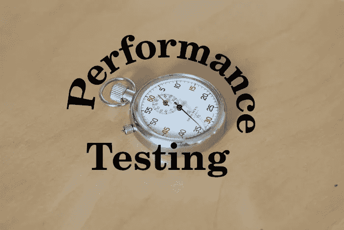
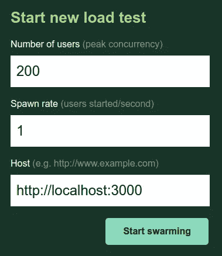
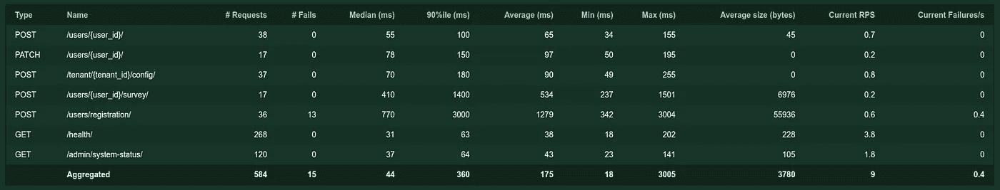
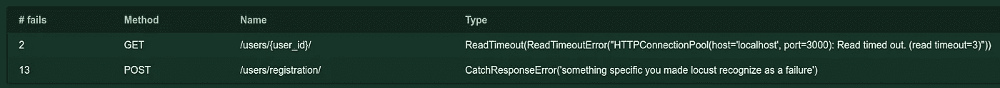
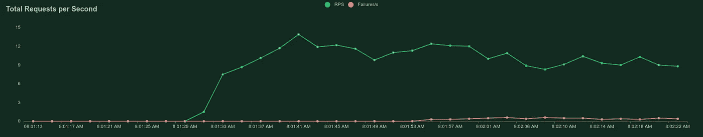
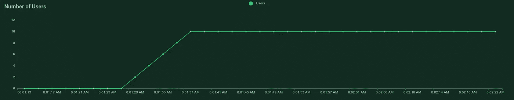
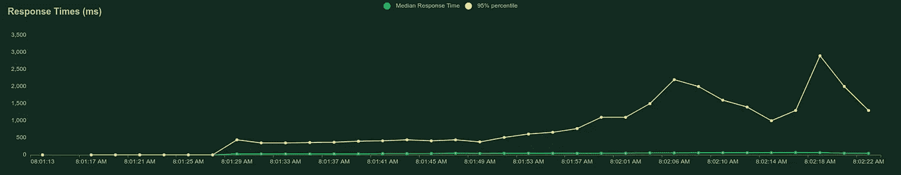
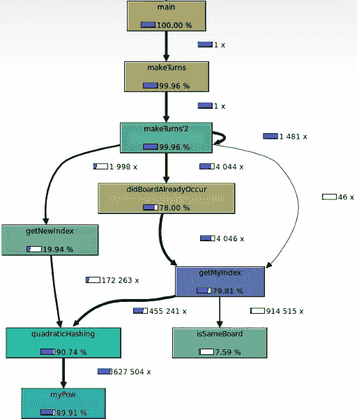

# Web 服务的性能测试

> 原文：<https://levelup.gitconnected.com/performance-testing-for-web-services-b51fffa3bd24>

## 它是什么，要考虑的方面，以及可以使用的工具



彼得·约斯特在 [Unsplash](https://unsplash.com?utm_source=medium&utm_medium=referral) 上的照片

我们都希望软件是可靠的，并且使用最少的资源。那些是非功能性的需求，它们需要被测试。在本文中，我们主要关注 web 服务。这意味着最低能耗或移动网络使用等要求无关紧要。

阅读完本文后，您将对涉及性能测试的主题有一个基本的了解，并知道一些可用于测试 web 服务的工具。

# 我们对哪些性能方面感兴趣？

我们可能对性能的三个不同方面感兴趣。根据您感兴趣的内容，您会看到不同的指标。

*   **速度**:页面加载速度有多快？对于速度，您可以查看页面呈现时间、API 的响应时间或较大文件传输的吞吐量。
*   **稳定性**:系统运转是否正常？为了稳定，你会看到错误率。
*   **可扩展性**:如果用户数量翻倍，我们需要增加哪些资源，增加多少？对于可伸缩性，您将查看不同负载下的资源利用率。

# 哪些资源可能是瓶颈？

如果您想找到 web 服务的瓶颈，我会查看:

*   **数据库负载**:我们发送给数据库的请求量是否合理？请求本身执行起来快吗？
*   **内存使用峰值**:有什么繁重的事情需要计算吗？这是如何衡量的？
*   **硬件**:我听说过网卡是一个限制因素的情况([例子](https://stackoverflow.com/questions/1209706/whats-the-maximum-number-of-http-connections-i-can-have-open-in-one-windows-ser#comment23076980_1209888))，尽管这对于云托管的机器来说可能不是什么问题。
*   **CPU** :当 CPU 利用率过高时，一切都会分崩离析。
*   **磁盘空间**:日志文件或生成的文件可能会在长时间运行后终止服务。
*   **连接**:HTTP 连接/ DB 连接可能有一个最大数量。对于 Postgres，[最大连接数是 100](https://www.postgresql.org/docs/current/runtime-config-connection.html#GUC-MAX-CONNECTIONS) 。nginx 工人通常被限制在 500 个并发连接([来源](https://www.nginx.com/blog/tuning-nginx/))。

# 性能测试类型

既然我们知道潜在的问题是什么，我们应该谈谈常见的[性能测试类型](https://en.wikipedia.org/wiki/Software_performance_testing)。最常见的有*负载测试*、*压力测试*和*浸泡测试*。

## 负载测试

负载测试的目的是查看被测系统在**预期**负载下的行为。你不想打破这里的系统，但你想有一个负载，你可能会在“高峰时间”。在预期的负载下，应用程序是否能够如预期的那样运行？

想象一个医院或机场，你在那里做紧急测试，但是人们知道这将是一个测试。你仍然想在测试中得到一个高的，但不是完全不合理的高人数。

## 压力测试

在负载测试之后，我们知道系统在预期负载下的行为。让我们打破东西。当我们在**极端负载**下测试应用程序，以查看事情何时/何地/如何发生时，我们称之为*压力测试*。

系统在负载下是否稳定？用户看到失败了吗？系统的上限在哪里？系统的极限在哪里？系统出现故障后会恢复吗？当它失败时，是仅仅系统的可用性受到影响还是它的正确性也受到影响？

## 浸泡测试

浸泡测试试图回答系统如何在较长时间内运行的问题。我们想确认系统在很长一段时间内是可靠的。

浸泡测试中可能出错并被发现的事情:

*   数据库连接耗尽
*   意外重启
*   资源泄漏，例如内存泄漏
*   使系统膨胀的日志或其他文件

# 负载曲线


艾萨克·史密斯在 [Unsplash](https://unsplash.com?utm_source=medium&utm_medium=referral) 上拍摄的照片

将性能测试环境中的 web 服务想象成一个街道系统。人们想从 A 地到 b 地，他们需要穿过几条街道。有些有 5 条车道，有些只有一条。一些允许他们以 130 公里/小时(80 英里/小时)的速度行驶，另一些只允许 50 公里/小时(30 英里/小时)。根据时间的不同，可能会出现拥堵。如果有一个瓶颈，在那里你可以开得很快，你很可能不需要等待别人通过它。但是道路系统中的人越多，一些人需要等待的机会就越高。

道路系统是你的网络服务。瓶颈可能是阻塞的资源调用，例如高事务隔离级别下的数据库事务。速度是事务执行的速度。

# 测试工具


图为[托德·夸肯布什](https://unsplash.com/@toddquackenbush?utm_source=medium&utm_medium=referral)在 [Unsplash](https://unsplash.com?utm_source=medium&utm_medium=referral)

有大量的性能测试和分析工具。我只简单提几个我过去用过的(Apache ab，Locust)或者想用的(Apache JMeter，EatX，K6)。

## 阿帕奇 JMeter

Apache JMeter 是一个基于协议的负载测试工具。JMeter 模拟流量和并发用户。它看起来像蝗虫，但更多的是 f

## 阿帕奇 ab

Apache ab 是一个 HTTP 服务器基准测试工具。因此，它比 Apache JMeter 覆盖的系统要少得多——只是 HTTP 服务器。我很确定 HTTP 服务器在大多数时候都不是问题。

## 压力和资源限制

如果您想了解系统在达到资源限制时的表现，您可以人为地减少应用程序拥有的资源，或者对系统施加[压力](https://linux.die.net/man/1/stress)。

## 蝗虫

蝗虫是一个性能测试工具，它让你定义发送 HTTP 请求的 web 用户。Locust 自动测量响应时间并指示失败/成功。你可以通过一个简单的用 Python 执行的`locustfile.py`来实现。看起来是这样的:

```
from locust import HttpUser, task, betweenclass QuickstartUser(HttpUser):
    wait_time = between(1, 2) def on_start(self):
        self.client.post(
            "/login",
            json={"username": "foo", "password": "bar"},
        ) @task
    def hello_world(self):
        self.client.get("/hello")
        self.client.get("/world") @task(3)
    def view_item(self):
        for item_id in range(10):
            self.client.get(
                f"/item?id={item_id}", name="/item"
            )
```

在带有`locustfile.py`的文件夹中执行`locust`会启动一个本地 web 服务器，这样您就可以通过浏览器与 Locust 进行交互。

当您启动 Locust 时，您可以指定您想要生成多少用户，以及用户应该以多快的速度生成(“孵化”):



马丁·托马斯截图

你首先会注意到的是统计数据。对于每个端点，您可以看到针对该端点的请求数量。Locust 测量失败的请求数量、响应时间和响应大小。从响应时间来看，它显示了最小值、中值、平均值、90%和最大值。



马丁·托马斯截图

在这个例子中，您可以看到`/users/registration`端点失败了几次。它还具有相当高的响应时间——对于最大值和 90%ile 都是如此。由于最小响应时间非常短，这可能表明该端点遇到了瓶颈。

接下来，我们应该看看失败之处:



马丁·托马斯截图

Locust 让你通过`response.failure('failure message')`定义特定的消息，并在这里显示给你。它还抓住了更普遍的问题。

看图表可以帮助你确定转折点



随着用户数量和请求数量的增加，需要几秒钟的时间，直到响应时间也增加。

## K6

[K6](https://k6.io/) 是一个负载测试工具。您可以将性能测试编写为 JavaScript 文件。你可以用 Chrome 插件和[记录使用情况，并在 Grafana](https://grafana.com/grafana/dashboards/2587) 中可视化结果。它看起来超级灵活，我期待着使用它😀

# 深入研究性能问题


由[塞巴斯蒂安·赫尔曼](https://unsplash.com/@officestock?utm_source=medium&utm_medium=referral)在 [Unsplash](https://unsplash.com?utm_source=medium&utm_medium=referral) 上拍摄的照片

当我们在测试运行中发现性能问题时，我们也想对此做些什么。我们想确定问题的来源，以便解决问题。以下是我过去发现的一些有用的工具和技术

## 计数查询

ORM 很神奇，但它可能很容易遇到[(n+1)-问题](https://stackoverflow.com/q/97197/562769)。如果您为这些部分编写单元测试，并测试执行的 SQL 查询的数量，这很容易发现。

## 线性微服务级联

如果你使用一个服务，而这个服务又使用另一个服务，而另一个服务又使用另一个服务…那么，你得到了所有的加载时间的总和。这是一个架构问题。这可能需要大量的重写或大量的缓存

## 测量内存使用情况

在研究机器学习/数据科学主题时，有时我需要在生产系统中乘以大型矩阵。为了放松心情，我用 valgrind 测量了峰值内存使用量，并用 kcachegrind 或 Python 世界中的 [memory_profiler](https://pypi.org/project/memory-profiler/) 对其进行了可视化。这些工具被称为“内存分析器”，它们可以显示各种信息，包括如下调用图:



kcachegrind 创建的调用图

[设置资源限制](https://docs.python.org/3/library/resource.html#resource.setrlimit)人为地降低也曾经帮助我确定哪里内存成为问题。

## 前端性能

我见过有人使用[谷歌灯塔](https://en.wikipedia.org/wiki/Google_Lighthouse)来寻找前端的性能问题:

[](https://developers.google.com/web/updates/2018/05/lighthouse) [## 使用 Lighthouse 提高页面加载性能| Web

### Lighthouse 是一个提高网站质量的自动化工具。你给它一个网址，它提供一个列表…

developers.google.com](https://developers.google.com/web/updates/2018/05/lighthouse) 

它通常从 Chrome 开发工具运行，但是你也可以[将 Lighthouse 集成到你的 CI](https://github.com/GoogleChrome/lighthouse-ci) 中并自动运行它！

## 数据库加速

您可能会遇到需要提高数据库速度的情况。不要担心，这里有 8 个你可以尝试的提示:

[](https://betterprogramming.pub/8-techniques-to-speed-up-your-database-292754ff7739) [## 提高数据库速度的 8 种技术

### “如果一切似乎都在掌控之中，那你走得还不够快”

better 编程. pub](https://betterprogramming.pub/8-techniques-to-speed-up-your-database-292754ff7739) 

# 我们支持多少用户？

这是每个 web 服务都需要回答的问题。在给出数字之前，您需要了解以下内容:

*   **现实场景**:虚拟用户的行为和真实用户足够相似吗？
*   **超时**:请求什么时候算失败？3 秒的响应时间还可以吗？300 秒响应时间可以吗？门槛在哪里？
*   **最大失败率**:你愿意接受多少次失败？将它作为一个比率，例如“过去 5 分钟内的故障”，使您能够运行浸泡测试。

# 摘要

您已经了解了负载测试、压力测试和浸泡测试之间的区别。您知道，不仅速度很重要，故障和恢复也很重要。你知道你可以使用 Apache JMeter，Locust，或者 K6 来开始。让我们开始实验吧！