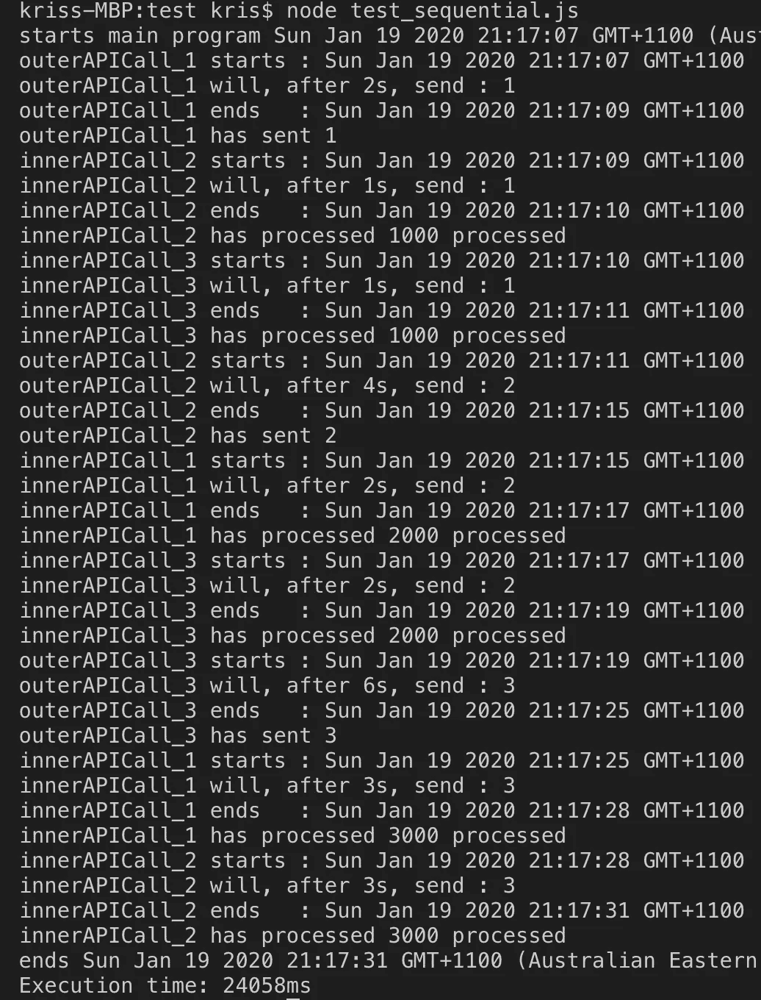
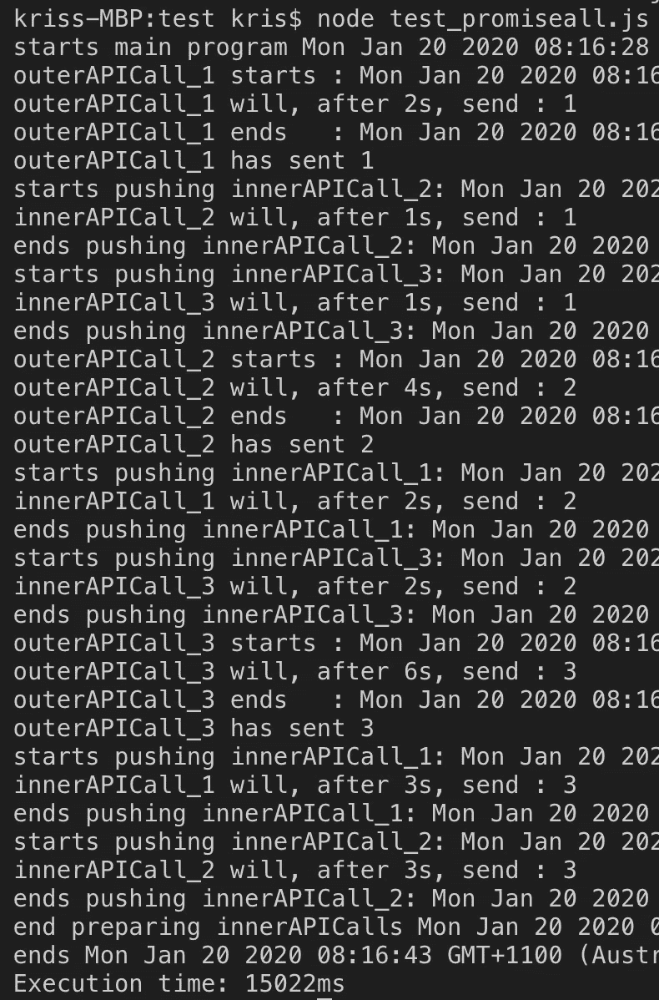
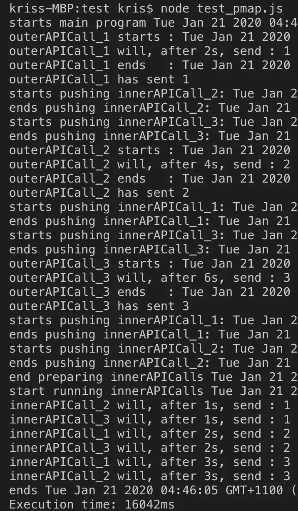

# 逐步并行执行 Node.js 应用程序的性能调优

> 原文：<https://levelup.gitconnected.com/performance-tuning-of-node-js-application-with-parallel-execution-step-by-step-5954a64ec1ad>

## Javascript 技巧

## 使用承诺的快速指南。All()和 P-Map 来提高 javascript 中多循环异步调用的性能


由[威利安·贾斯登·德·瓦斯康塞洛斯](https://unsplash.com/@willianjusten?utm_source=medium&utm_medium=referral)在 [Unsplash](https://unsplash.com?utm_source=medium&utm_medium=referral) 上拍摄的照片

# **背景**

async/await 表达式通常用于处理 JavaScript 中的异步操作，因为它比 callback 和 then()模式有许多优势。await 表达式是以最简单的方式处理异步函数的理想选择。然而，如果处理不当，这种简单性有时也会导致问题。在这里，我想分享我最近从我的一个项目中学到的一个有趣的经验，并展示我们可以从中得出什么样的最佳实践。

故事从一个缓慢但必不可少的过程开始，该过程每 30 分钟运行一次，从不同的服务收集必要的数据并将其同步到前端客户页面。但是，随着时间的推移，同步过程本身大约需要一个小时才能完成。因此，我们迫切需要解决性能问题。

经过一些调查和检查日志，找到了如下有问题的代码:

我们可以看到，最有可能的原因是这里有两个循环，外部循环调用 API getDeparturePorts 来获取端口信息，内部循环使用端口来获取与端口和区域相关的所有航班数据。每个 API 调用都将通过 HTTP 请求传递给第三方服务，这肯定会导致网络出现一定的延迟。然而，由于这里典型的 await 用法，每次我们调用`getDeparturePorts()`时，我们都必须暂停以遍历`queryFlight`调用，并按顺序等待它们一个接一个地完成。

因此，不难想到，如果所有 await/async 调用都不是当场调用/创建的，而是存储在一个列表中，以后再调用/创建并立即等待，那么所有承诺逐一解决所需的时间将会最小化，只需要最耗时的承诺。为了验证假设，我做了以下实验。

# 重现问题:用本地代码和更通用的模式模拟问题

## **使用 Promise 和 SetTimeout()模拟具有网络延迟的 APIs】**

大多数人都是已经做出的承诺的消费者。然而，在这里我们必须创建我们自己的承诺，在这种情况下，模拟通常需要一些延迟的 API 调用。(`**you can skip this part if you are familiar with Promise/SetTimeout() already,but as a step-by-step tutorial, I'd like to include this.**`)

让我们检查一下语法，从头开始创建一个简单的承诺:

```
return new Promise(function(resolve, reject) { // do something about intervalInnerAPICall resolve(intervalInnerAPICall)});
```

现在我们需要模拟我们承诺中的网络延迟。在 javascript 中创建延迟的一个非常典型的方法是使用 setTimeout()，但是它不是异步调用。

SetTimeout()接受以下 3 个参数:

1.  要运行的函数或对别处定义的函数的引用。
2.  一个数字，表示在执行代码之前等待的时间间隔，以毫秒为单位(1000 毫秒等于 1 秒)。
3.  值，表示运行时要传递给函数的任何参数。

所以现在代码修改为:

```
return new Promise(function(resolve, reject) { // after intervalOuterAPICAll seconds, will resolve the value of intervalInnerAPICall and return it as a new promise setTimeout(resolve, intervalOuterAPICall * 1000, intervalInnerAPICall);});
```

让我们添加一些描述作为输出

```
return new Promise(function(resolve, reject) { console.log("Func outerAPICall will, after " +  intervalOuterAPICall + "s, send : " + intervalInnerAPICall) setTimeout(resolve, intervalOuterAPICall * 1000, intervalInnerAPICall);});
```

现在，将它放入我们的 API 调用函数中，并将 API 调用命名为 outerAPICall，这意味着 API 调用位于第一个/外部循环中。所以现在已经创建了一个名为 outerAPICAll 的函数来模拟外部循环中远程服务的 API 调用！

该函数将打印出每个 API 调用的描述，并在将其特定值传递给内部 API 调用模拟之前等待特定的时间。完整的代码如下所示:

外部 API 调用

同样，内部 API 调用如下所示

内部 API 调用

## **用我们刚刚嘲笑过的 API 调用复制这个问题**

现在我们把它们放在一起，用更高的抽象来模拟我们的问题。

模拟我们问题的主要代码

根据我们的代码，我们可以计算出所有的调用，包括内部调用和外部调用，都是按顺序执行的，理论上花费的时间应该是(1+2+3) **2+2** (1+2+3)=24s

让我们运行测试，看看我们是否重现了这个问题。

```
node test_sequential.js
```



正好 24 秒，记住数字以后对比。因此，我们为顺序异步调用创建了模拟。现在来看看怎么改进吧。

# **第一种解决方案:带承诺并行执行。All()**

**要知道 await 函数是在用 await 关键字声明时被当场调用的，这一点很重要，**因此，要延迟函数的运行，一个简单的方法是将带有正确参数的函数存储到一个列表中，并在存储了所有带参数的函数之后使用 await 函数。

```
let output = await innerAPICall(j, valueReturnedByOuterAPICall)
```

会变成

```
let innerAPICalls = []
innerAPICalls.push(innerAPICall(j, valueReturnedByOuterAPICall))// later
await Promise.all(innerAPICalls)
```

因此，我们可以对 innerAPICalls 使用一个片/列表，并将调用放入列表中，但不要对它们使用 await。

所以代码变成了

with promise.all()

现在，我们终于有了一个 innerAPICalls 的列表，所以我们可以同时触发它们**并等待所有调用返回，完成这个操作所需的时间将等于最耗时的时间——假设在我们的实验案例中，内部调用是 3s，加上不可避免的花费在 3 次外部调用上的时间，总时间预计为 3+ 2*(1+2+3) = 15s。**

**让我们看看结果**

****

**维奥拉。时间从 24 秒缩短到 15 秒，这正是我们所期待的！我们很容易知道，实际上，**内环的元素越多，性能的提高就越显著**。**

# ****最终解决方案:p-map****

**然而，我们的解决方案存在一些缺陷。**

**首先，原始行为是继续内部 API 调用，不管内部循环中单个 API 调用的任何失败，但是承诺。All()将在第一次失败时返回，并完全放弃所有剩下的调用，因此看起来至少是有希望的。AllSettled()是比承诺更好的选择。全部()在此。**

**第二，在现实世界中，上述解决方案的真正致命问题是服务资源总是有限的。如果列表最终变得如此之长，假设总共有数千个内部 API 调用，如果所有调用都被同时触发，那么并行 API 调用的沉重负载将会破坏网络资源和远程服务。显然，我们需要并行运行我们的 API 调用，但是我们需要将并发的数量控制在我们的服务能够承受的水平。换句话说，我们必须限制并行执行的数量。**

**那么怎么做呢？我的答案是 [p-map](https://www.npmjs.com/package/p-map) ，一个用作承诺的 npm 包。AllSelttled()，但是有一个可配置的并发线程限制。**

**要使用它，只需运行以下命令来安装它:**

```
npm install -g p-map
```

**P-map 需要 4 个参数，第一个是参数列表，包含用于异步函数的参数，第二个是我们想要运行的函数(在映射器中)，第三个是并发数，第四个是不管任何拒绝是否继续执行，因此在我们的例子中，它被设置为 false 以确保它将运行所有调用。**

**所以我们必须创建一个列表来存储要传递给 innerAPICall 函数的参数，并将参数列表作为实函数 innerAPICall()的映射器的参数进行传递。完整的代码如下(并发设置为 5):**

**用 p-map 重构的代码**

**我们再来看看结果:**

****

**我们可以看到它比承诺的要慢。All()方法，但它仍然比我们正常的旧代码快得多。事实上，如果我们将并发设置为 1 或大于 10，我们可以得到与旧代码或承诺完全一样的结果。所有()代码。**

# ****现实世界中的结果****

**我在我们的代码中实现了这个想法，时间从 50 分钟显著减少到 16 分钟，在我们的产品系统中并发度为 10。多么大的进步啊！**

# ****我们应该学习什么****

**1.在 javascript 中看到一些多循环操作，内循环等待外循环的输出是很正常的。第一眼看到时，很自然地直接使用 await，然后像一段同步代码那样按顺序执行它们。然而，**现在我们应该记住，如果可能的话，所有这种情况实际上都应该转换成并行执行代码。****

**2.保证。所有()在理论上都是好的，但在实践中却很成问题，因为服务的资源是有限的。因此，为了不破坏所有的套接字，我们必须设置并行执行的限制，在这个意义上，p-map 是 promise.all()的一个非常有效的替代解决方案。**

**3.为了获得最佳的性能结果、安全性和稳定性，请始终尝试收集函数或收集函数的参数，并在稍后的时间点用 await 一起声明它们。**

**4.这里无法下载[的源代码。](https://github.com/thyxkris/test)**