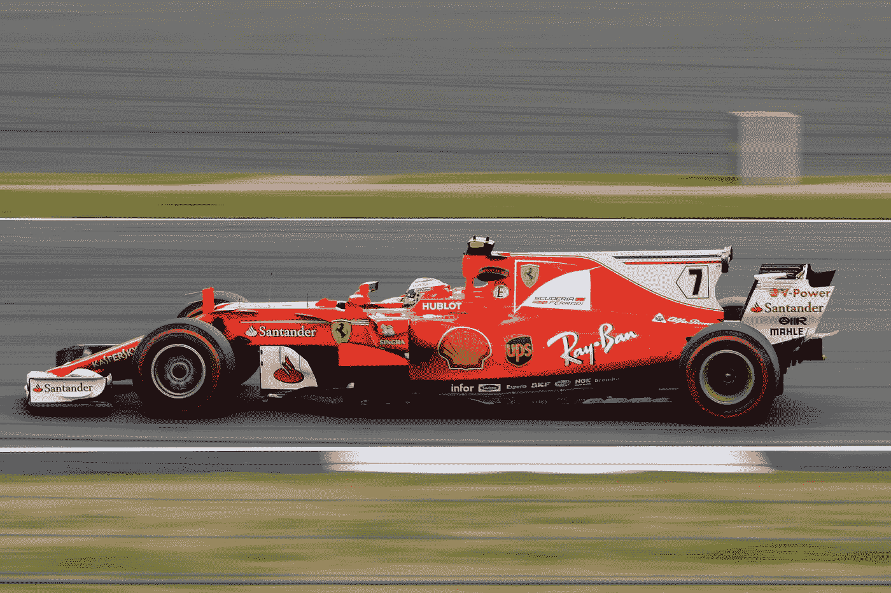

# 高性能 JavaScript 最佳实践

> 原文：<https://levelup.gitconnected.com/performant-javascript-best-practices-c5a49a357e46>


照片由[陈以桐](https://unsplash.com/@ja5on?utm_source=medium&utm_medium=referral)在 [Unsplash](https://unsplash.com?utm_source=medium&utm_medium=referral) 上拍摄

像任何程序一样，如果我们不小心编写代码，JavaScript 程序会变得很慢很快。

在本文中，我们将研究一些编写快速 JavaScript 程序的最佳实践。

# 减少宿主对象和用户浏览器的 DOM 操作

DOM 操作很慢。我们做得越多，速度就越慢。因为 DOM 操作是同步的，所以每个动作都是一次一个地完成的，程序的其余部分也是如此。

因此，我们应该尽量减少我们正在做的 DOM 操作的数量。

DOM 可以通过加载 CSS 和 JavaScript 来屏蔽。然而，图像不会阻塞渲染，所以它们不会阻碍页面的加载。

然而，我们仍然希望最小化图像的尺寸。

使用 Google PageSpeed Insights 可以检测到渲染阻塞 JavaScript 代码，它会告诉我们有多少段渲染阻塞 JavaScript 代码。

任何内联 CSS 都会阻碍整个页面的呈现。它们是分散在我们的页面中带有`style`属性的样式。

我们应该将它们都移动到它们自己的样式表中，在`style`标签中，在 body 元素下面。

CSS 应该被连接和缩小，以减少要加载的样式表的数量和它们的大小。

我们也可以通过媒体查询将`link`标签标记为非渲染阻塞。例如，我们可以编写以下代码来实现这一点:

```
<link href="portrait.css" rel="stylesheet" media="orientation:portrait">
```

以便它仅在页面以纵向显示时加载。

我们应该将样式操作移出 JavaScript，并将样式放入 CSS，方法是将样式放在样式表文件中它们自己的类中。

例如，我们可以编写以下代码在 CSS 文件中添加一个类:

```
.highlight {
  background-color: red;
}
```

然后我们可以添加一个带有`classList`对象的类，如下所示:

```
const p = document.querySelector('p');
p.classList.add('highlight');
```

我们将 p 元素 DOM 对象设置为自己的常量，这样我们就可以缓存它并在任何地方重用它，然后我们调用`classList.add`向它添加`hightlight`类。

如果我们不再需要它，我们也可以删除它。这样，我们就不必在 JavaScript 代码中进行大量不必要的 DOM 操作。

如果我们有其他脚本不依赖的脚本，我们可以异步加载，这样它们就不会阻塞其他脚本的加载。

我们只是将`async`放在我们的脚本标签中，这样我们就可以异步加载我们的脚本，如下所示:

```
<script async src="script.js"></script>
```

现在`script.js`将在后台加载，而不是在前台。

我们还可以通过使用`defer`指令来推迟脚本的加载。但是，它保证了脚本在页面上的指定顺序。

如果我们希望我们的脚本一个接一个地加载，而不阻止其他东西的加载，这是一个更好的选择。

在将代码投入生产之前，缩小脚本也是一项必须完成的任务。为此，我们使用 Webpack 和 Parcel 这样的模块捆绑器，它们可以创建一个项目，然后自动为我们构建它们。

另外，像 Vue 和 Angular 这样的框架命令行工具也可以自动缩减代码。

# 尽量减少我们的应用程序使用的依赖项的数量

我们应该尽量减少我们使用的脚本和库的数量。未使用的依赖项也应该删除。

例如，如果我们使用 Lodash 方法进行数组操作，那么我们可以用原生的 JavaScript 数组方法来代替它们，这也一样好。

一旦我们移除了依赖，我们应该从`package.json`中移除它们，并运行`npm prune`来从我们的系统中移除依赖。



照片由[蒂姆·凯里](https://unsplash.com/@baudy?utm_source=medium&utm_medium=referral)在 [Unsplash](https://unsplash.com?utm_source=medium&utm_medium=referral) 上拍摄

# 糟糕的事件处理

如果事件处理代码很复杂，那么它们总是很慢。我们可以通过减少调用堆栈的深度来提高性能。

这意味着我们调用尽可能少的函数。如果我们在事件处理程序中操作样式，尽可能把所有东西都放在 CSS 样式表中。

尽一切努力减少调用功能，比如使用`**`操作符而不是调用`Math.pow`。

# 结论

我们应该减少依赖项的数量，如果可能的话，以异步方式加载它们。

此外，我们应该减少代码中的 CSS 并将它们移到自己的样式表中。

我们还可以添加媒体查询，这样样式表就不会到处加载。

最后，我们应该减少代码中调用的函数数量。