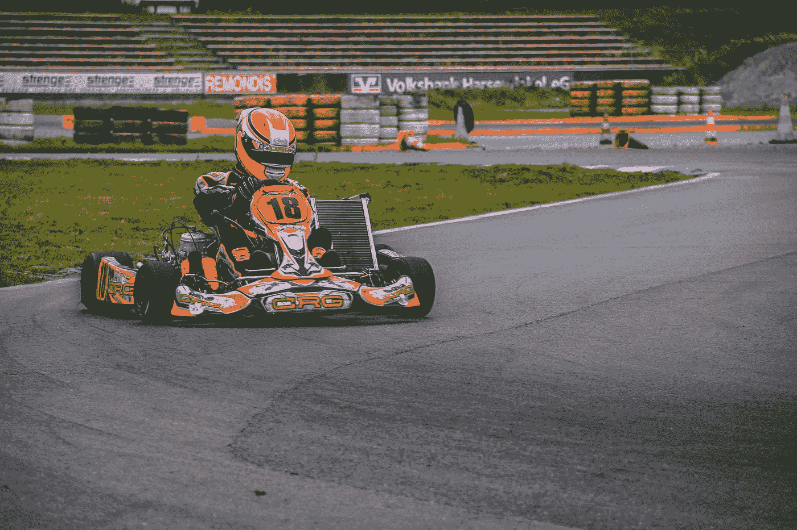

# 性能 JavaScript —事件和范围

> 原文：<https://levelup.gitconnected.com/performant-javascript-events-and-scopes-4443b227bb8f>



由 [Appic](https://unsplash.com/@appictech?utm_source=medium&utm_medium=referral) 在 [Unsplash](https://unsplash.com?utm_source=medium&utm_medium=referral) 上拍摄的照片

像任何程序一样，如果我们不小心编写代码，JavaScript 程序会变得很慢很快。

在本文中，我们将研究鼠标事件处理的改进和以更快的方式处理数据。

# 将 C `lick`替换为 M `ouseup`

在`click`之前触发了`mouseup`事件，它通过确保用户快速连续点击几次鼠标时不会错过交互来提高性能。

因此，鼠标点击会得到更快的响应，因为`mouseup`事件不会被跳过，如果它们被快速连续触发的话。

# 使用引用类型

每次传递给新函数时，都会复制基本类型值。顾名思义，引用是作为引用传递给函数的，这要轻量得多。

因为引用类型的数据不会到处复制，所以使用的内存更少。此外，只有当我们指定要复制某些东西时，才会运行较少的复制操作。

# 使用本地范围

将数据封装到类中可以让我们将所有东西都保存在局部范围内，也就是类的实例。

因此，当我们有许多具有相同类型数据的对象时，我们应该使用类并从它们创建对象。

例如，我们可以编写下面的类来封装其中的一些成员:

```
class Person {
  constructor(name) {
    this.name = name;
  }
}
```

在上面的代码中，我们有`this.name`，它是从该类创建的任何对象的一部分。

使用`this`阻止我们遍历作用域链，一直到全局作用域。

遍历到全局范围是一个昂贵的操作，如果我们创建许多具有相同类型数据并使用相同类型方法的对象，我们可以通过将相关数据封装在一个`class`中来最小化这个操作。

其他种类的封装包括模块，它只能引用模块内的数据，除非我们从另一个模块导入它。

这也减少了遍历代码文件中不同范围的负担。

例如，我们可以使用如下模块:

`module.js`

```
export const foo = 1;
export const bar = 2;
```

`index.js`

```
import { foo } from "./module";
console.log(foo);
```

在上面的代码中，我们只导入了从`module.js`模块引用的`foo`。

这意味着只有我们想在另一个模块中使用的成员才必须被导入。所以我们的程序不需要遍历所有的脚本来找到我们引用的全局变量。

我们直接进入模块，检索我们所拥有的值。


照片由 [Shahzin Shajid](https://unsplash.com/@shahzin_2903?utm_source=medium&utm_medium=referral) 在 [Unsplash](https://unsplash.com?utm_source=medium&utm_medium=referral) 上拍摄

# 偏爱本机函数和构造

自从 ES5 发布以来，JavaScript 已经改进了很多。ES6 引入了许多新特性，比如 spread 和 rest 操作符、析构、模板字符串等。

它们都是很棒的语法糖，可以取代我们必须从 Lodash 等库中获得的功能。

此外，我们有数组和字符串方法，它们肯定可以替换那些库中现有的方法。

Lodash 有类似于`map`、`filter`和`every`的方法，这些方法都可以被普通的 JavaScript 替代。

如果需要进行 DOM 操作，可以使用`document.querySelector`、`querySelectorAll`等内置的 DOM 操作方法。，轻松获取 DOM 元素。

然后我们可以使用类列表 API，以及类似`getAttribute`、`setAttribute`等方法。来操纵大教堂。

# 节流和去抖

如果我们预计频繁的用户交互会频繁地需要调用事件处理程序，那么我们应该减少事件处理程序调用的次数，这样我们就可以停止多次调用这些方法。

同样，我们应该控制向服务器发出的 HTTP 请求的数量，这样我们就不会使我们自己或其他人的服务器过载。

限制设置一段时间内的最大操作数。

我们还应该谴责我们的行为，以便事件处理程序只在延迟之后才被调用。这确保了没有人会用太多的事件处理程序调用来淹没我们的应用程序。

事件处理程序调用的开销很大，所以我们应该尽量减少调用它们的次数。

# 结论

我们不应该坚持使用局部范围的东西，而不是全局范围的。

此外，节流和去抖动操作也很重要，这样我们的应用就不会过载。

最后，引用类型比基本类型好，因为它们总是在内存中引用相同的东西，除非显式地创建或复制了一个新项。