# 使用 Python、NumPy 和 Pandas 对新冠肺炎数据集执行数据分析

> 原文：<https://levelup.gitconnected.com/performing-data-analytics-on-the-covid-19-dataset-using-python-numpy-and-pandas-bdfc352c61e9>


由 [Unsplash](https://unsplash.com?utm_source=medium&utm_medium=referral) 上的[融合医学动画](https://unsplash.com/@fusion_medical_animation?utm_source=medium&utm_medium=referral)拍摄的照片

在本文中，我将利用位于[https://www . ka ggle . com/sudalairajkumar/Novel-Corona-Virus-2019-Dataset](https://www.kaggle.com/sudalairajkumar/novel-corona-virus-2019-dataset)的**小说电晕病毒 2019 数据集**，进行一些数据分析。

特别是，我将使用 Jupyter 笔记本，以及 Python、NumPy 和 Pandas。

该数据集由几个文件组成:

*   **covid_19_data.csv** —包含每个国家所有各州/省的观察结果列表。它包含对确诊、死亡和恢复病例的观察。
*   **covid 19 _ line _ list _ data . CSV**—包含病例的详细列表，包括位置、症状、医院就诊以及信息来源等细节。
*   **covid 19 _ open _ line _ list . CSV**—类似于之前的文件(**covid 19 _ line _ list _ data . CSV**)。
*   **time _ series _ covid _ 19 _ confirmed _ US**—美国所有确诊病例的详细分类。包含位置、城市和州等详细信息。
*   **time _ series _ covid _ 19 _ deaths _ US . CSV**—美国所有死亡病例的详细分类。包含位置、城市和州等详细信息。
*   **time _ series _ covid _ 19 _ confirmed . CSV**—包含全球所有国家的所有确诊病例列表。它列出了每个国家的省/州，以及每个位置的地理位置。
*   **time _ series _ covid _ 19 _ deaths . CSV**—包含世界上所有国家的所有死亡病例列表。它列出了每个国家的省/州，以及每个位置的地理位置。
*   **time _ series _ covid _ 19 _ recovered . CSV**—包含全球所有国家/地区的所有已恢复病例列表。它列出了每个国家的省/州，以及每个位置的地理位置。

在这篇文章中，我有兴趣探究受新冠肺炎影响的每个国家的各种统计数据。因此，我对这三个 CSV 文件特别感兴趣:

*   **时间序列 _covid_19_confirmed.csv**
*   **时间序列 _ covid _ 19 _ 死亡人数. csv**
*   **time _ series _ covid _ 19 _ recovered . CSV**

> 事实上，我也可以使用 **covid_19_data.csv 文件**，因为它方便地将所有确诊、康复和死亡病例合并在一个文件中。不幸的是，它不包含每个位置的纬度和经度(我想用它在地图上标出)。因此，我决定使用 3 个单独的 CSV 文件。

此时，使用 Excel 打开上述 CVS 文件并浏览每个文件中的各个列是一个好主意。

# **导入包**

对于所有项目，首先要做的是导入相关的模块和包:

```
import pandas as pd
import numpy as np
```

# 加载 CSV 文件

对于这篇文章，我使用的数据集的日期是 2020 年 5 月 26 日**。**

> 对于您自己的实验，我建议您下载最新的数据集并跟随。

因此，我将 CSV 文件保存在名为“**数据集—2020 年 5 月 26 日**”的文件夹下。

我们现在不要将 CSV 文件加载到 Pandas 数据帧中:

```
dataset_path   = "./Dataset - 26 May 2020/"df_conf      = pd.read_csv(dataset_path + 
               "time_series_covid_19_confirmed.csv")
df_death     = pd.read_csv(dataset_path + 
               "time_series_covid_19_deaths.csv")
df_recovered = pd.read_csv(dataset_path + 
               "time_series_covid_19_recovered.csv")print(df_conf.shape)
print(df_death.shape)
print(df_recovered.shape)
```

观察每个数据帧的形状:

```
(266, 129)
(266, 129)
(253, 129)
```

此时，请注意 **df_recovered** 数据帧的形状与其他两个不同。让我们进一步挖掘，看看为什么它的行数比其他两个少。

让我们看看 **df_conf** 数据帧是什么样子的:

```
df_conf
```

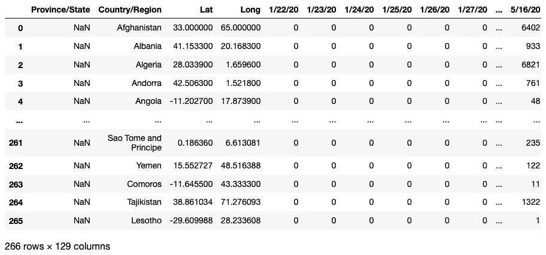

# 排序和查看数据帧

现在让我们按照**省/州**和**国家/地区**对数据帧进行排序:

```
df_conf = df_conf.sort_values(
    by=['Province/State','Country/Region'])
df_conf = df_conf.reset_index(drop=True)df_death = df_death.sort_values(
    by=['Province/State','Country/Region'])
df_death = df_death.reset_index(drop=True)df_recovered = df_recovered.sort_values(
    by=['Province/State','Country/Region'])
df_recovered = df_recovered.reset_index(drop=True)
```

让我们快速看一下数据帧的样子。

```
df_conf
```

您将看到以下内容:

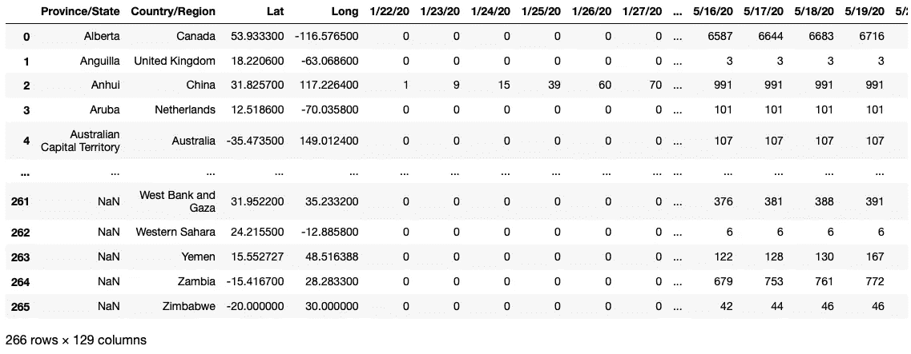

其他两个数据帧( **df_death** 和 **df_recovered** )看起来相似。请注意以下事项—每个报告案例的日期都存储在列中。从第 4 列开始，它列出了每天报告的案例—*2020 年 1 月 22 日*、*2020 年 1 月 23 日*等等。在我们的分析中，我们需要将所有这些日期转换成一列，另一列表示每天的实际数字。但在此之前，让我们比较三个数据帧，看看它们是否包含相同的行:

```
# check if two dfs columns are the same
print(df_conf[["Province/State","Country/Region"]].equals(
      df_death[["Province/State","Country/Region"]]))
'''
True
'''print(df_conf[["Province/State","Country/Region"]].equals(
      df_recovered[["Province/State","Country/Region"]]))
'''
False
'''
```

从上面的输出中可以看到， **df_conf** 和 **df_death** dataframes 包含两列相同的项目，即**省/州**和**国家/地区**。但是，它们不同于 **df_recovered** 数据帧。

原因是因为**time _ series _ covid _ 19 _ recovered . csv**将*加拿大*记录为一个国家，而另外两个 CSV 文件记录*加拿大*及其各个州:

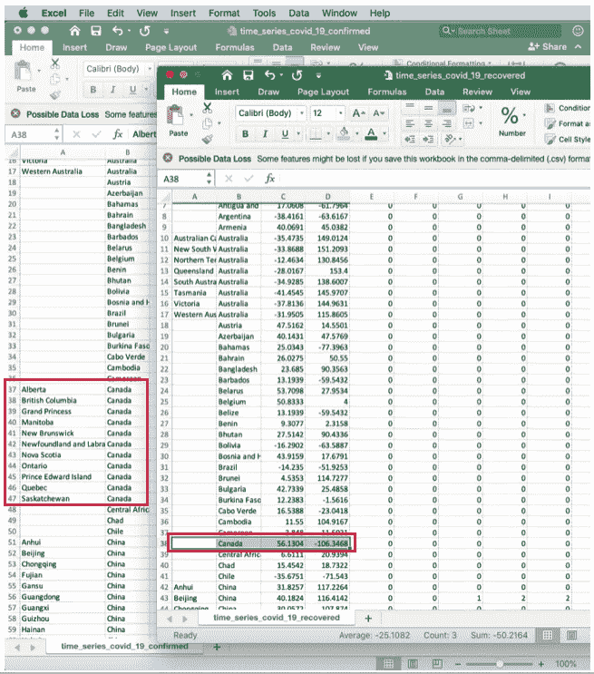

出于这个原因(为了使本文简单起见)，我将省略已恢复案例的数据集(**time _ series _ covid _ 19 _ recovered . CSV**)。

# 提取包含日期和时间的列的名称

现在让我们提取 CSV 文件中记录的各种日期:

```
dates_conf = df_conf.columns[4:]
dates_death = df_death.columns[4:]print(dates_conf)
print(dates_death)# make sure the dates are all the same for the 2 dfs
if dates_conf.equals(dates_death): 
    print("Dates are the same")
```

您应该会看到以下输出:

```
Index(['1/22/20', '1/23/20', '1/24/20', '1/25/20', '1/26/20', '1/27/20',
       '1/28/20', '1/29/20', '1/30/20', '1/31/20',
       ...
       '5/16/20', '5/17/20', '5/18/20', '5/19/20', '5/20/20', '5/21/20',
       '5/22/20', '5/23/20', '5/24/20', '5/25/20'],
      dtype='object', length=125)Index(['1/22/20', '1/23/20', '1/24/20', '1/25/20', '1/26/20', '1/27/20',
       '1/28/20', '1/29/20', '1/30/20', '1/31/20',
       ...
       '5/16/20', '5/17/20', '5/18/20', '5/19/20', '5/20/20', '5/21/20',
       '5/22/20', '5/23/20', '5/24/20', '5/25/20'],
      dtype='object', length=125)
Dates are the same
```

# 将数据帧从宽格式取消透视为长格式

我现在想取消数据帧的透视，这样日期就不再用列来表示了。相反，日期应该存储为新列下的值，比如说 **Date** 。病例数(**确诊**、**死亡**)应该保存为相应的一栏，比如说**确诊**、**死亡**。为此，我可以使用 **melt()** 函数:

```
df_conf_melted = df_conf.melt(id_vars=['Province/State', 
                              'Country/Region', 'Lat', 'Long'], 
                              value_vars=dates_conf, 
                              var_name='Date',
                              value_name='Confirmed')df_death_melted = df_death.melt(id_vars=['Province/State', 
                                'Country/Region', 'Lat', 'Long'],                                
                                value_vars=dates_death,
                                var_name='Date', 
                                value_name='Deaths')
```

# 查看未透视的数据帧

您现在可以查看未透视的数据帧。让我们先从 **df_conf_melted** 开始:

```
df_conf_melted
```

您将看到以下内容:

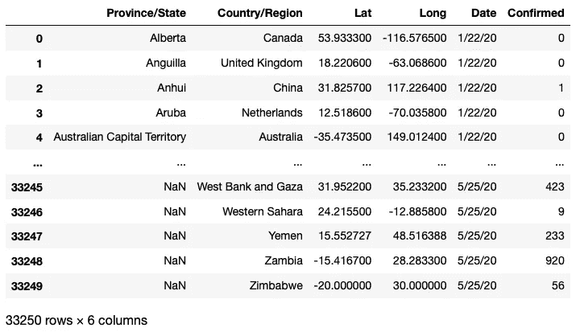

然后，我们来看看 **df_death_melted** :

```
df_death_melted
```

您将看到以下内容:

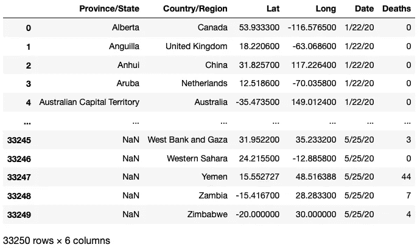

只是为了确保两个数据帧具有相同的形状:

```
print(df_conf_melted.shape)
print(df_death_melted.shape)
'''
(33250, 6)
(33250, 6)
'''
```

# 将所有非透视数据帧合并成一个数据帧

现在，我想将这两个独立的数据帧合并为一个数据帧，以便将来更容易执行分析:

```
df_combined = pd.concat([df_conf_melted, 
                         df_death_melted["Deaths"]], 
                         axis = 1, 
                         sort = False)
df_combined
```

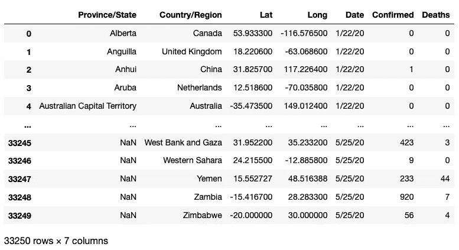

在这种情况下，计算相对于确诊病例数的死亡百分比是有用的:

```
df_combined["Percentage"] = 
    df_combined["Deaths"]/df_combined["Confirmed"]df_combined
```

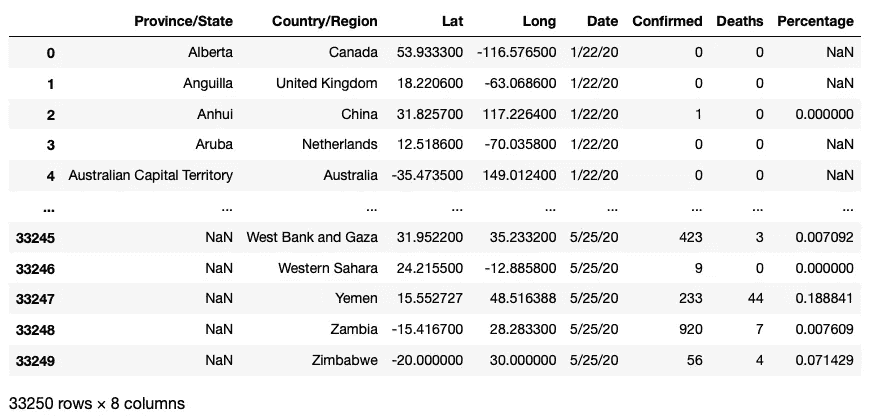

因为有些单元格是 NaNs(由被零除引起)，所以用 0 替换它们很重要:

```
df_combined.fillna(0, inplace=True)df_combined
```

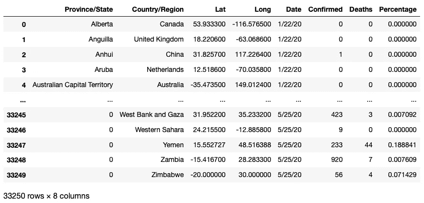

检查数据帧中各列的数据类型非常有用:

```
df_combined.dtypes
'''
Province/State     object
Country/Region     object
Lat               float64
Long              float64
Date               object
Confirmed           int64
Deaths              int64
Percentage        float64
'''
```

特别是对象类型中的**日期**列(即字符串)。

# 将日期列更改为日期时间格式

我们需要将日期列转换成 **datetime.date** 格式，以便稍后我们可以基于日期执行排序。

```
import datetimedef format_time(datetime_str):    
    d = datetime.datetime.strptime(datetime_str, '%m/%d/%y')    
    return d.date()df_combined["Date"] = df_combined["Date"].apply(format_time)
df_combined
```

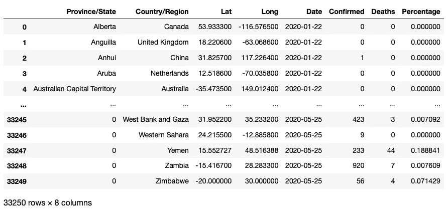

# 显示每日确诊和死亡病例数

现在，数据帧已经合并为一个，并经过了大量清理，我们可以开始执行一些分析，以便从数据帧中获取一些有用的信息。

让我们从显示每日确诊和死亡病例数开始:

```
grouped_by_date = df_combined.groupby("Date")
for date, group in grouped_by_date:
    print("==========")
    print(date)
    print("==========")
    print(group[["Province/State","Country/Region", "Confirmed", 
        "Deaths"]])
```

您现在将看到每天的确诊和死亡病例数:

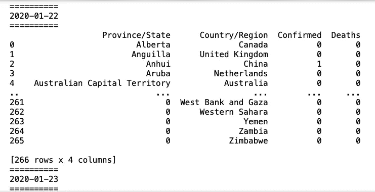

# 显示每个国家每天确诊和死亡的总人数

之前的结果显示了每个国家每个省/州的数量。如果您只想知道每个国家的总数，您可以执行汇总:

```
df_daily = df_combined.groupby(["Date","Country/Region"]).aggregate(
    {'Confirmed': 'sum', 'Deaths': 'sum'})df_daily
```

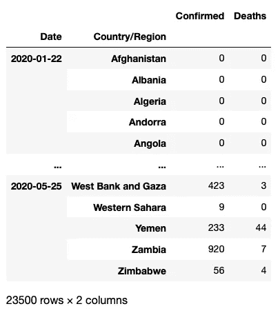

# 获取特定一天的数据

如果你想得到某一天的数字，你可以使用 **loc[]** 索引器:

```
df_day = df_daily.loc[**format_time('3/22/20')**]df_day
```

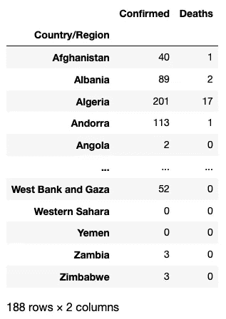

# 获取特定国家特定日期的数据

您还可以检索特定国家的号码:

```
df_day_country = df_daily.loc[(**format_time('5/22/20')**,**'US'**)]
df_day_country
'''
Confirmed    1600937
Deaths         95979
Name: (2020-05-22, US), dtype: int64
'''
```

# 显示最近一天的数据

要获取最近一天的数字，首先获取数据帧中的最后一个日期，然后使用它提取该日期的数据:

```
# get the most recent date
most_recent_date = df_combined['Date'].max()
print(most_recent_date)
'''
2020-05-25
'''# get all the data on the most recent date
df_most_recent = df_daily.loc[most_recent_date,:]
df_most_recent
```

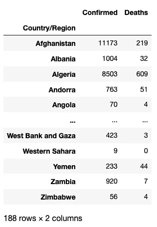

# 确诊病例最多的 10 个国家

要获得确诊病例最多的 10 个国家，按**确诊**列对 **df_most_recent** 数据框进行排序，然后显示前 10 行:

```
df_most_confirmed_recent_sorted = 
    df_most_recent.sort_values(by="Confirmed", ascending=False)df_most_confirmed_recent_sorted.head(10)
```

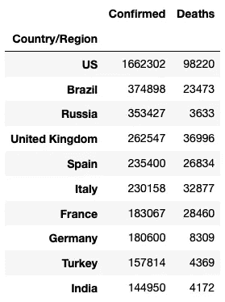

# 显示特定国家的最新数字

您可以使用 **input()** 功能要求用户输入他/她想知道的国家:

```
df_most_recent[df_most_recent.index == 
    input("Enter the country name: ")]
```

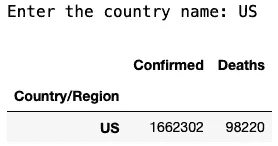

# 报告死亡人数最多的 10 个国家

要获得报告死亡人数最多的 10 个国家，首先使用**死亡人数**列对 **df_most_recent** 数据帧进行排序。然后，过滤掉那些没有死亡报告的国家。最后，显示前 10 行:

```
df_most_deaths_recent_sorted = 
    df_most_recent.sort_values(by="Deaths", ascending=False)df_most_deaths_recent_sorted = 
    df_most_deaths_recent_sorted[
        df_most_deaths_recent_sorted.Deaths>0]df_most_deaths_recent_sorted.head(10)
```

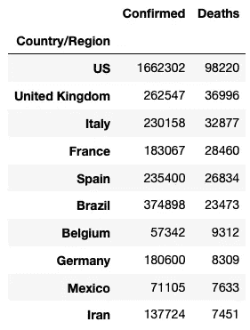

# 显示 Mainland China 的最新数据

早在新冠肺炎早期，中国相当多的省份都受到了感染。所以看看中国各省的数据会很有趣:

```
# get all the rows for Mainland China
df_combined_china = 
    df_combined[df_combined['Country/Region'] == "China"]# using the china dataframe, group by date and province
df_combined_china_date = 
    df_combined_china.groupby(["Date","Province/State"]).aggregate(
        {'Confirmed': 'sum', 'Deaths': 'sum'})# find the data for the most recent date
df_combined_china_most_recent = 
    df_combined_china_date.loc[most_recent_date,:]df_combined_china_most_recent
```

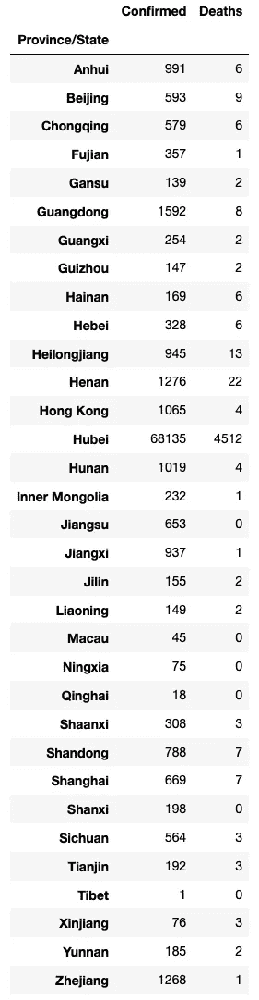

# 显示中国确诊病例最多的 10 个省份

要获得中国确诊病例最多的前 10 个省份，请按**确诊**列对**df _ combined _ China _ most _ recent**数据帧进行排序，并返回其前 10 行:

```
df_combined_china_most_recent_sorted = 
    df_combined_china_most_recent.sort_values(by="Confirmed",                                                                                
        ascending=False).head(10)df_combined_china_most_recent_sorted
```

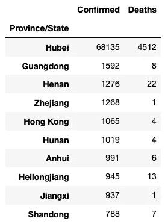

如你所见，**湖北**是中国受灾最严重的省份。

> 新冠肺炎的爆发首先是在武汉(武汉是中华人民共和国湖北省的省会城市)发现的。

# 摘要

这就是本文的全部内容。我希望这篇文章对您有用，并帮助您开始使用 Python 进行数据分析。在下一篇文章中，我将向您展示如何使用 **matplotlib** 库在新冠肺炎数据集上执行可视化。回头见！

这篇文章的第二部分已经完成。

[](https://weimenglee.medium.com/membership) [## 加入媒介与我的介绍链接-李伟孟

### 作为一个媒体会员，你的会员费的一部分会给你阅读的作家，你可以完全接触到每一个故事…

weimenglee.medium.com](https://weimenglee.medium.com/membership)