# 使用新冠肺炎数据集执行数据可视化

> 原文：<https://levelup.gitconnected.com/performing-data-visualization-using-the-covid-19-dataset-47c441747c43>

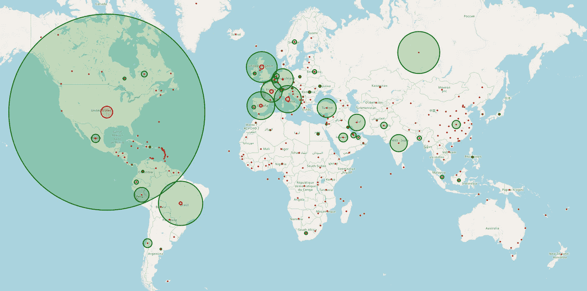

想象新冠肺炎在世界地图上的影响

在我的上一篇文章“[使用 Python、NumPy 和 Pandas](https://medium.com/@weimenglee/performing-data-analytics-on-the-covid-19-dataset-using-python-numpy-and-pandas-bdfc352c61e9) 对新冠肺炎数据集执行数据分析”中，我向您介绍了在 Convid-19 数据集上执行数据分析的步骤。本文是那篇文章的延续，这一次您将学习如何创建漂亮的视觉效果来讲述您之前完成的结果。

> 如果您还没有阅读上一篇文章，请现在阅读，因为本文中使用的一些数据框架是基于那篇文章的。

# 显示每个国家确诊和死亡病例的条形图

您要绘制的第一个图形是一系列描绘每个国家确诊和死亡病例总数的条形图:

```
import matplotlib.pyplot as plt
%matplotlib inlineplt.style.use('ggplot')
plt.rcParams["figure.figsize"] = (12,7)for country, df_country in df_daily.groupby(level=1):    
    dates = list(df_country.index.get_level_values('Date'))
    confirmed = list(df_country.Confirmed)
    deaths = list(df_country.Deaths) plt.bar(dates, confirmed, color='lightblue', 
        label="Total Number of Confirmed Cases")
    plt.bar(dates, deaths, color='red',
        label="Total Number of Deaths Reported")
    plt.xlabel("Dates")
    plt.ylabel("Number of people")
    plt.title(country)
    plt.legend()
    plt.show()
```

> 我在这里使用的绘图库是 **matplotlib** 。

它将为所有不同的国家生成条形图。下面是第一个:

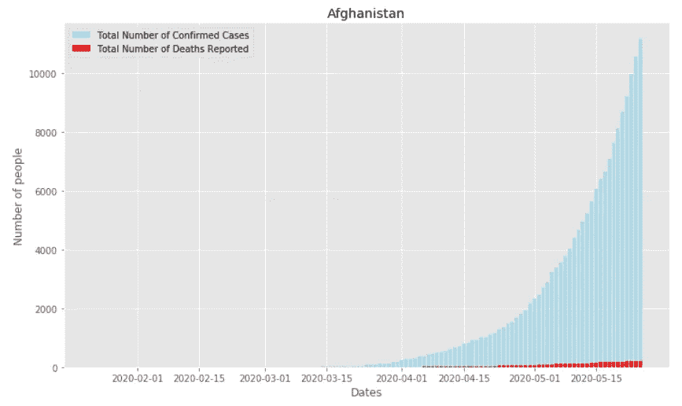

正如你所看到的，浅蓝色条代表每天确诊的病例数，而红色条代表死亡人数。这是我们的图表:

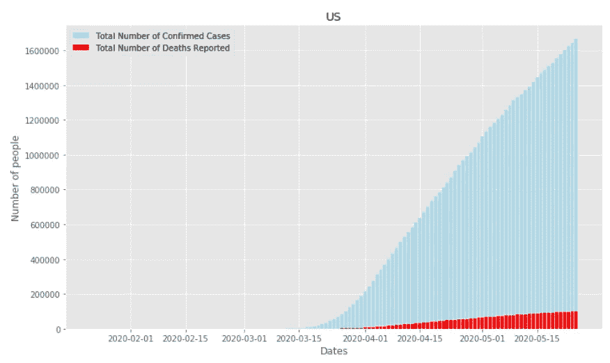

> 请注意，每天的病例数是累积的。所以你总是会看到趋势在上升(如果没有新的病例，顶多是持平)。

对于与确诊病例相比死亡人数较低的国家，您将真正看到非常微小的红色条(如果有的话)。新加坡就是这样一个例子:

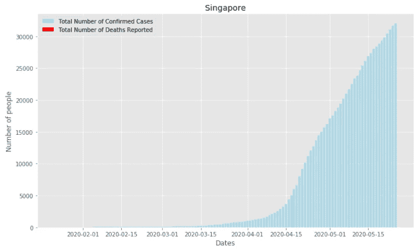

另一方面，英国的死亡率相对较高:

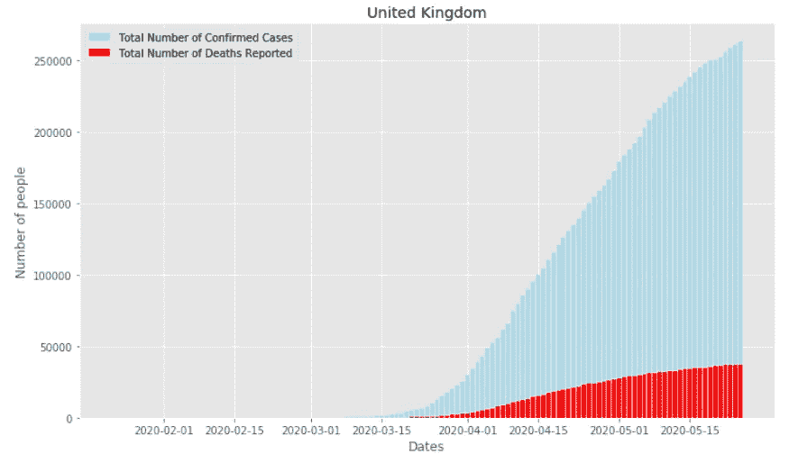

# 创建饼图

我想创建的下一个视觉效果是一个饼图。为此，我定义了一个名为 **plot_pie(df，column，title)** 的函数。它接受 3 个参数—数据帧、数据帧中使用的列名和饼图的标题:

```
def plot_pie(df, column, title):
    labels = list(df.index)
    sizes = list(df[column])
    explode = [0 for n in range(10)]

    with plt.style.context(
        { "axes.prop_cycle" : plt.cycler("color", 
        plt.cm.tab20c.colors)}):
        fig1, ax1 = plt.subplots() ax1.pie(sizes, 
                explode=explode, 
                labels=labels, 
                autopct='%1.2f%%', 
                shadow=False, 
                startangle=0)
        ax1.axis('equal')  # Equal aspect ratio ensures that pie is 
                           # drawn as a circle. plt.legend()
        plt.title(title)

    centre_circle = plt.Circle((0,0),0.70,fc='white')
    fig = plt.gcf()
    fig.gca().add_artist(centre_circle) plt.show()
```

# 显示前 10 个确认国家的分布

为了直观显示确诊病例最多的 10 个国家的分布情况，让我们绘制一个饼图:

```
top10_countries_confirmed = df_most_confirmed_recent_sorted.head(10)plot_pie(top10_countries_confirmed, 
         "Confirmed", 
         "Top 10 Confirmed Countries")
```

您将看到以下内容。你可以看到，在前 10 个国家中，美国有近一半的确诊病例。

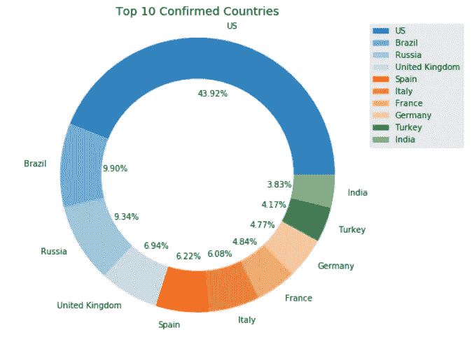

# 中国确诊病例最多的 10 个省份

现在让我们看看中国确诊病例最多的 10 个省份:

```
plot_pie(df_combined_china_most_recent_sorted, 
         "Confirmed", 
         "Top 10 provinces in China with confirmed cases")
```

毫不奇怪，湖北是疫情爆发的中心:

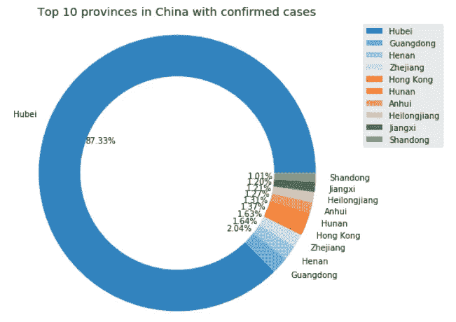

# 报告死亡人数最多的 10 个国家

接下来，显示报告死亡人数最多的 10 个国家:

```
df_most_deaths_recent_sorted = df_most_deaths_recent_sorted.head(10)
plot_pie(df_most_deaths_recent_sorted, 
         "Deaths", 
         "Top 10 Countries with Deaths Reported")
```

您应该看到以下内容:

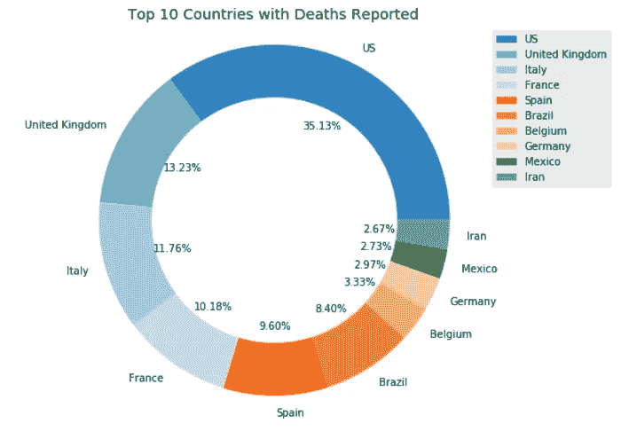

> 虽然英国在确诊病例数量上排名第四，但在报告的死亡人数上排名第二。

# 拉平曲线

还记得我之前提到过记录的数字(确诊和死亡)都是累积的吗？因为它们是累积的，所以很难知道一个国家的情况是在改善还是在恶化。因此，如果我们能够“展开”这些数字，以便能够获得每天新报告的数字，那将是非常有用的。所以这就是我们要做的:

```
plt.rcParams["figure.figsize"] = (12,7)# for each country
for country, df_country in df_daily.groupby(level=1):    
    # get the list of dates
    dates = list(df_country.index.get_level_values('Date'))

    # get the confirmed numbers
    confirmed = list(df_country.Confirmed)

    # get the deaths
    deaths = list(df_country.Deaths)

    # form a new dataframe for the specific country
    df = pd.DataFrame(dates)
    df["Confirmed"] = confirmed
    df["Deaths"] = deaths # unroll (reverse cumsum) the columns - confirmed and deaths    
    df_unrolled = df.diff().fillna(df)    
    df_unrolled[0] = dates

    # plot the line charts
    plt.plot(dates, df_unrolled["Confirmed"], color='blue', 
             label="Confirmed Cases Per Day")
    plt.plot(dates, df_unrolled["Deaths"], color='red', 
             label="Deaths Per Day")
    plt.xlabel("Dates")
    plt.ylabel("Number of people")
    plt.title(country)
    plt.legend() plt.show()
```

在上面的代码片段中，我们提取了每个国家的每日数字，以形成一个新的数据帧。然后我们使用 **diff()** 函数来展开累加的数字。一旦数字展开，我们将为每个国家绘制一个折线图。这里有一个例子:

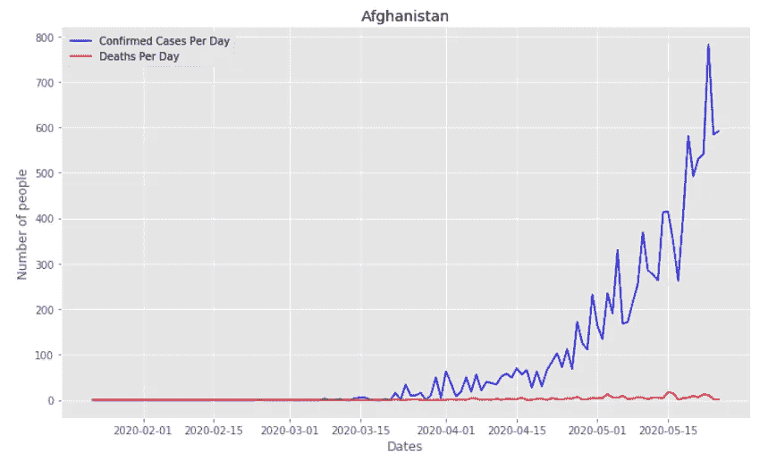

如你所见，新西兰几乎打败了病毒:

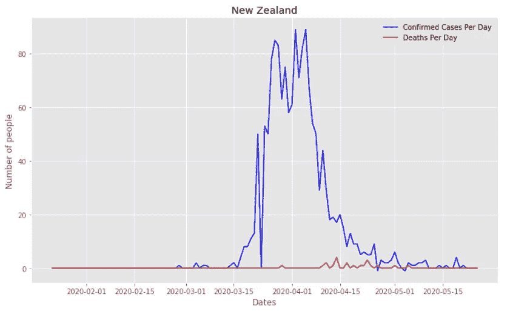

而南非仍在打一场艰苦的战斗:

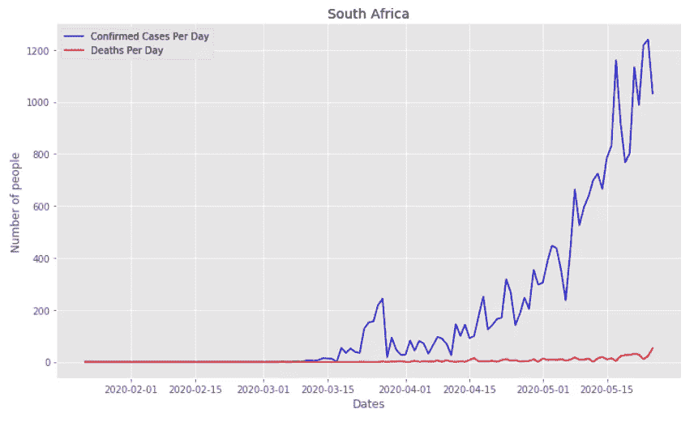

您可能还会看到一些国家的“峰值”低于 0:

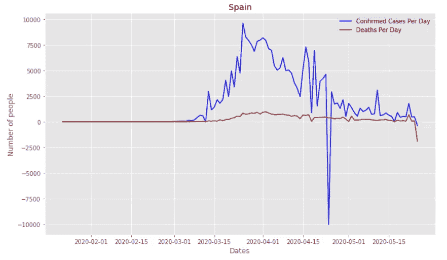

这很可能是由于对数字进行了调整。例如，某一天记录的数字可能是 5000，但第二天该数字(累计)可能向下调整到 4000(可能是由于测试、记录等方面的错误)。

# 在地图上显示所有确诊病例

最后，如果我们能在一张世界地图上显示所有案例，那不是很好吗？我们会在世界地图上画圆，用圆的半径来代表国家的严重程度。我们将使用绿色圆圈代表确诊病例，红色圆圈代表死亡病例:

```
import folium# get the most recent date in the df
most_recent_date = df_combined['Date'].max()# get all the data on this most recent date
df_latest_day = df_combined[df_combined.Date==most_recent_date]# create a map
folium_map = folium.Map(location=[40.738, -73.98], zoom_start=4)color="#E37222" # tangerine
scale = 5000for place in df_latest_day.index:
    lat = df_latest_day.loc[place]["Lat"]
    lng = df_latest_day.loc[place]["Long"]    
    confirmed = df_latest_day.loc[place]["Confirmed"]
    deaths    = df_latest_day.loc[place]["Deaths"] # CONFIRMED cases
    # draw a circle on the province/state/region/country
    marker_confirmed = folium.CircleMarker(location=[lat, lng],
                                 radius=confirmed/scale,
                                 color="green",
                                 fill=True)
    marker_confirmed.add_to(folium_map)

    # DEATHS cases
    # draw a circle on the province/state/region/country
    radius = deaths/scale if deaths>0 else 0.000000001
    marker_deaths = folium.CircleMarker(location=[lat, lng],
                                 radius=radius,
                                 color="red",
                                 fill=True)
    marker_deaths.add_to(folium_map)folium_map.save("Covid-19 Map.html")
```

> F 或者地图，我用的是**叶**库。Folium 是一个强大的 Python 库，可以帮助您创建多种类型的传单地图。传单是领先的移动友好的交互式地图的开源 JavaScript 库。
> 
> 使用的地图是 OpenStreetMap。要安装叶子，输入如下: **pip 安装叶子**

这是地图！您可以放大和缩小以查看各个国家的更多细节。


# 摘要

数据可视化是一个非常强大的工具，可以让您的数据分析结果栩栩如生。不要看数字，使用图表和图形通常可以更容易地传达重要的数字。希望这篇文章对你有用！