# 使用 Pandas 中的数据透视表执行探索性数据分析(EDA)

> 原文：<https://levelup.gitconnected.com/performing-exploratory-data-analysis-eda-using-pivot-tables-in-pandas-3f402f95681b>

## 了解如何使用 Pandas 中的 pivot_table()函数来聚合数据


安德里亚斯·楚在 [Unsplash](https://unsplash.com?utm_source=medium&utm_medium=referral) 上的照片

大多数 excel 用户都非常熟悉数据透视表的概念。数据透视表是一个由分组值组成的表，它聚合了一个更大的表中的所有单个项目。数据透视表提供了离散类别的汇总，如总和、平均值以及各种感兴趣的统计数据。数据透视表是一个非常有用的工具，可以帮助您浏览和分析数据，并使您可以轻松地进行比较和查看趋势。

在本文中，我将带您浏览 Pandas 中的数据透视表，以及如何利用它来执行 EDA。

# 示例 1 —分析世界人口数据

在第一部分，我将利用世界人口数据集来回答一些与世界人口有关的问题。

> ***数据来源*** *:本部分数据来源于*[https://github . com/RES baz/r-nosive-gapminder-files/blob/master/Data/gapminder-five year Data . CSV](https://github.com/resbaz/r-novice-gapminder-files/blob/master/data/gapminder-FiveYearData.csv)。
> 
> **来自网站**([https://github.com/resbaz/r-novice-gapminder-files](https://github.com/resbaz/r-novice-gapminder-files)):“此数据集未经 [Gapminder](http://www.gapminder.org/) 的人认可。特别是，我们删除了原始数据中相对不完整的部分，使其更清晰，便于教学。如果您需要未经过滤的数据，您应该从 [Gapminder](http://www.gapminder.org/data/) 处获取。还要注意，这个存储库目前并没有被积极地维护。但是，如果您希望改进此处的数据，我们会积极考虑重要的拉取请求。”

## 加载数据

让我们将数据加载到熊猫数据框架中:

```
import pandas as pddata_url = '[https://raw.githubusercontent.com/resbaz/r-novice-gapminder-files/master/data/gapminder-FiveYearData.csv'](https://raw.githubusercontent.com/resbaz/r-novice-gapminder-files/master/data/gapminder-FiveYearData.csv')
df = pd.read_csv(data_url)df
```

数据框架包含分布在非洲、美洲、亚洲、欧洲和大洋洲五大洲的国家的各种数据。它包含了从 1952 年到 2007 年的人口、预期寿命和人均 GDP 数据:

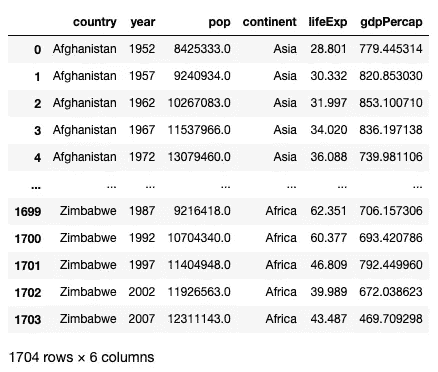

作者图片

## 找出每个国家的平均值

首先，让我们使用`pivot_table()`函数找出每个国家各种统计数据的平均值:

```
pd.pivot_table(
    df,
    index='country',
    aggfunc='mean'
)
```

`index`参数指定用于函数结果的索引。`aggfunc`参数指定应用于数据帧的数字列的函数。下图显示了结果以及各种参数如何决定结果:

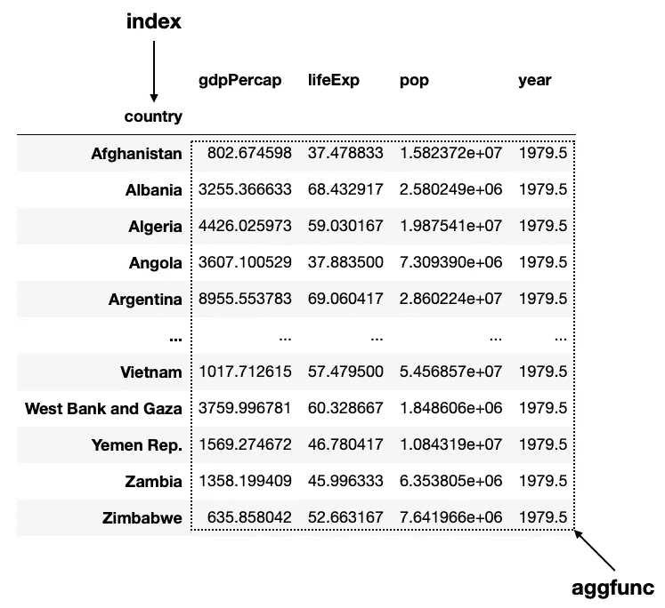

作者图片

> 如果你已经熟悉熊猫中的`*groupby()*`功能，你可以把`*pivot_table()*`功能想象成等于`*groupby()*` + `*agg()*` + `*unstack()*`。

如果没有指定值，默认的`aggfunc`值是`mean`(熊猫函数)。您还可以提供一个 **NumPy** 函数，比如`np.mean`，或者任何返回聚合值的函数(您将在本文的后面部分看到这一点):

```
**import numpy as np**pd.pivot_table(
    df,
    index='country',
    aggfunc=**np.mean**
)
```

## 找出平均国内生产总值和平均、最大和最小预期寿命

从前面的结果可以看出，计算**年**列的平均值实际上没有意义。此外，您可能想知道每个国家的最小、最大和平均预期寿命。为此，您可以为`aggfunc`参数指定一个字典，并指示将什么函数应用于哪一列:

```
import numpy as nppd.pivot_table(
    df,
    index='country',
    aggfunc=**{
        'gdpPercap':np.mean, 
        'lifeExp':[np.mean,np.max,np.min]
    }**
)
```

上述代码片段产生以下输出:

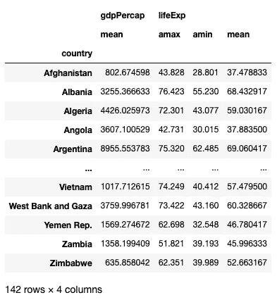

作者图片

注意，由于我们没有在字典中指定 **pop** 和 **year** 列，它们将不再出现在结果中。

## 找出每个国家每年的平均值

`index`参数还接受一个列列表，该列表将产生一个多索引数据帧结果。例如，我想知道从 1952 年到 2007 年每一年每个县的平均 GDP、预期寿命和人口。我可以这样做:

```
pd.pivot_table(
    df,
    **index=['country','year'],
    aggfunc='mean'**
)
```

结果是一个多索引数据框架，其中**国家**和**年份**作为索引，其余数值字段作为列:

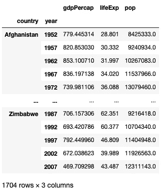

作者图片

## 找出每个国家每年的平均值

我们先根据年份，再根据国家对结果进行分组，怎么样？很简单，在此改变`index`参数中列表项的顺序:

```
pd.pivot_table(
    df,
 **index=['year','country'],**
    aggfunc='mean'
)
```

结果现在按**年**分组:

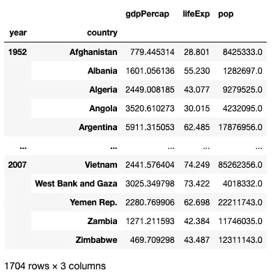

作者图片

## 找出每个洲的平均值

如果您想找到每个洲的平均值，只需将**索引**参数设置为`continent`:

```
pd.pivot_table(
    df,
 **index='continent'**
)
```

您现在将看到以下结果:

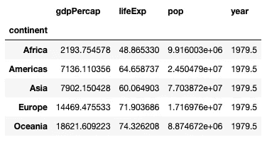

作者图片

## 找出每个国家的人口

如果你想知道从 1952 年到 2007 年每个国家的平均人口，设置`index`到`country`和`values`到`pop`:

```
pd.pivot_table(
    df, 
 **index='country', 
    values='pop',
    aggfunc='mean'** )
```

下面显示了`values`参数的使用:

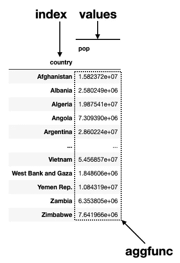

作者图片

## 找出每个大陆的平均预期寿命

要找到每个洲的平均预期寿命，按如下方式设置`index`和`values`参数:

```
pd.pivot_table(
    df,               
 **index='continent',
    values='lifeExp', 
    aggfunc='mean'** )
```

您将看到如下结果:

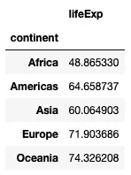

作者图片

如果要翻转结果的列和行呢？简单，把`index`参数改成`columns`:

```
pd.pivot_table(
    df,
    **columns**='continent',
    values='lifeExp',
    aggfunc='mean'
)
```

下图显示了各种参数的结果和用法:

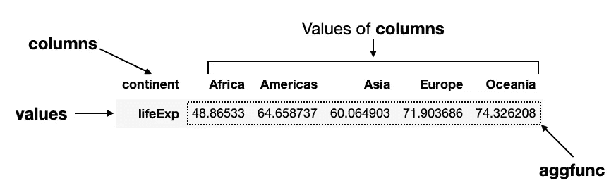

作者图片

## 找出各大洲每个国家的预期寿命

接下来，我们想知道五大洲每个国家的预期寿命。我们可以这样做:

```
pd.pivot_table(
    df,
 **index='country',
    columns='continent',
    values='lifeExp',**    aggfunc='mean'
)
```

现在，每个国家的预期寿命将显示在该国所属的各大洲:

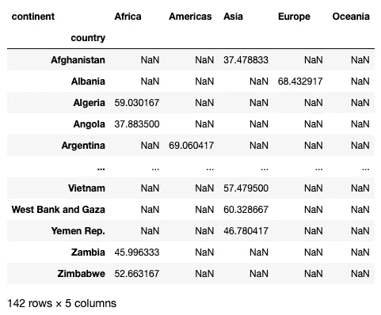

作者图片

注意结果中分散的 nan。如果您不想看到 nan，您可以设置`fill_value`参数，用一些值填充它们，例如 0s:

```
pd.pivot_table(
    df,
    index='country',
    columns='continent',
    values='lifeExp', 
    aggfunc='mean',
 **   fill_value=0**
)
```

您现在应该看到 0 而不是 nan:

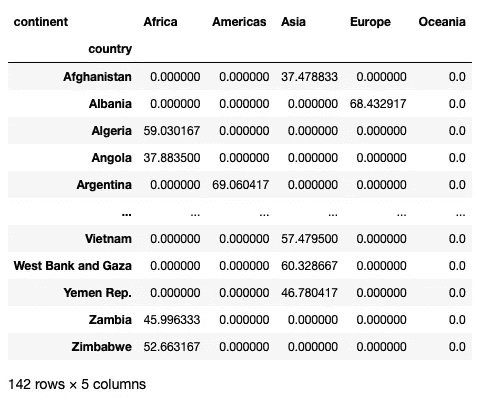

作者图片

## 找出各大洲每年的平均预期寿命

最后，让我们找出各大洲的平均预期寿命，并按年份分组:

```
pd.pivot_table(
    df,  
 **index='year',
    columns='continent',
    values='lifeExp',**    aggfunc='mean'
)
```

下图显示了结果和各种参数的使用:

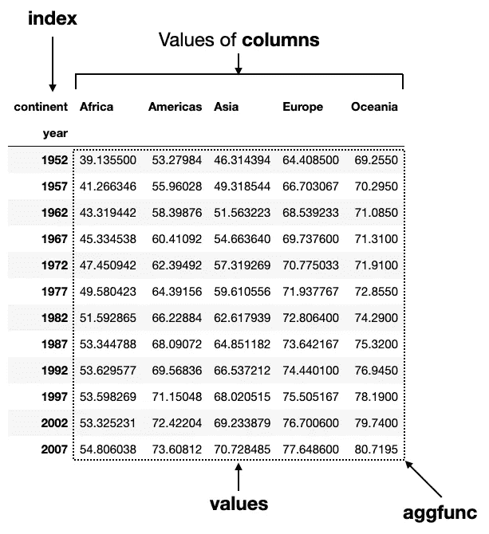

作者图片

# 示例 2 —分析泰坦尼克号数据

我要使用的下一个数据集是经典的泰坦尼克号数据集。

> ***数据来源*** *:该部分数据来源于*[https://www.kaggle.com/datasets/tedllh/titanic-train](https://www.kaggle.com/datasets/tedllh/titanic-train)。
> 
> **许可—** 数据库内容许可(DbCL)1.0 版【https://opendatacommons.org/licenses/dbcl/1-0/ 

让我们将 CSV 文件加载到熊猫数据帧中:

```
import pandas as pd
df = pd.read_csv('titanic_train.csv')
df
```

数据帧有 891 行和 12 列:

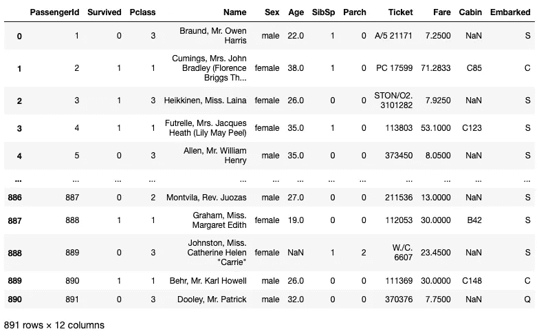

作者图片

## 找出每个性别的平均值

首先，我们有兴趣了解不同性别的平均值:

```
pd.pivot_table(
    df,  
    index='Sex'
)
```

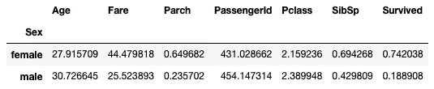

作者图片

对于某些列，查看它们的聚合值是没有意义的，例如— **PassengerId** 和 **Pclass** 。因此，让我们修改`aggfunc`参数，以便我可以获得以下信息:

*   得到平均值**年龄**
*   得到 **Pclass** 的分布
*   获取**幸存**的模式(最频繁出现)

您可以使用下面的代码片段来实现这一点:

```
**from scipy import stats**pd.pivot_table(
    df,  
    index='Sex',
    aggfunc=**{
        'Age': 'mean',
        'Pclass':lambda x: dict(x.value_counts()),
        'Survived':scipy.stats.mode
    }**
)
```

对于`aggfunc`参数，每个键的值必须是返回聚合结果的函数。到目前为止，我们使用的所有函数都很简单— `mean`和`sum`(你也可以使用像`min`和`max`这样的函数)。如果你想要更复杂的东西，你需要写你自己的函数。对于 **Pclass** 列，我将编写一个 lambda 函数来获取传递给它的系列的值计数，然后将其转换为一个字典。对于幸存的**列，我将使用 **scipy** 模块中的`mode`函数。**

结果看起来像这样:

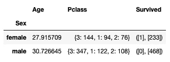

作者图片

从上面的结果可以看出:

*   大多数女乘客幸存，而大多数男乘客死亡
*   大多数男女乘客都在三等舱
*   女性乘客的平均年龄低于男性

## 发现不同起运港的性别分布

接下来，我们还想知道性别分布与装货港的关系:

```
df_sex_embarked = pd.pivot_table(
    df,
 **index='Sex',
    columns='Embarked',
    values='Survived',
    aggfunc='count'** )
df_sex_embarked
```

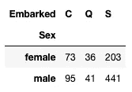

作者图片

从结果中，你可以看到大多数人在*南安普顿*(‘**S**’)登船，不分性别。

## 找出来自不同起运港的幸存者的性别分布

我们还想知道每个性别的幸存者人数与出发港口的关系。这很简单，因为您只需将`aggfunc`从`count`更改为`sum`:

```
df_sex_embarked_survived = pd.pivot_table(
    df,
    index='Sex',
    columns='Embarked',
    values='Survived',
 **aggfunc='sum'** )
df_sex_embarked_survived
```

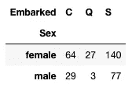

作者图片

但是这个结果并不能真正让你知道哪个港口的存活率更高。这里有一个更好的方法是计算不同装载港的每种性别的*存活率*:

```
df_sex_embarked_survived / df_sex_embarked * 100
```

结果现在显示了一个更加清晰的画面:

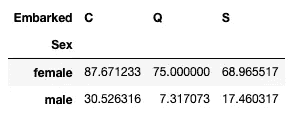

作者图片

你现在可以观察到更多在瑟堡登上泰坦尼克号的人幸存了下来。

## 找出每个舱位等级的性别分布

我们也很好奇各个舱位等级的性别分布:

```
df_sex_pclass = pd.pivot_table(
    df,
    index='Pclass',
    columns='Sex',
    values='Survived',
    aggfunc='count'
)
df_sex_pclass
```

你可以看到大多数乘客都在三等舱:

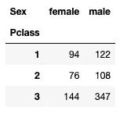

作者图片

他们的生存基于阶级:

```
df_sex_pclass_survived = pd.pivot_table(
    df,
    index='Pclass',
    columns='Sex',
    values='Survived',
 **aggfunc='sum'**
)
```

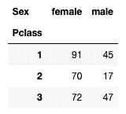

作者图片

同样，计算它们的存活率会更好:

```
df_sex_pclass_survived / df_sex_pclass * 100
```

有趣的是(但并不奇怪)，头等舱的乘客存活率更高:

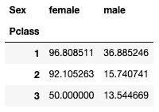

作者图片

有没有更简单的方法来计算它们的存活率，而不是把两个不同的数据帧分开？当然，如果你使用 lambda 函数:

```
pd.pivot_table(
    df,
    index='Pclass',
    columns='Sex',
    values='Survived',
 **aggfunc=lambda x: x.sum() / len(x)**
)
```

在上面的语句中，`x`将被传递类 1(作为一个序列)中的女性的值(对于**幸存**列)，接着是类 1 中的男性，类 2 中的女性，依此类推。

[](https://weimenglee.medium.com/membership) [## 加入媒介与我的介绍链接-李伟孟

### 阅读李维孟(以及媒体上成千上万的其他作家)的每一个故事。您的会员费直接支持…

weimenglee.medium.com](https://weimenglee.medium.com/membership) 

# 摘要

我希望这篇文章能够揭示出`pivot_table()`函数的用处。您可以直接调用`pivot_table()`函数并获得聚合结果，而不用花费时间执行 groupbys。您可以编写自己的自定义函数并在`pivot_table()`函数中使用，而不是使用内置的 Pandas 或 NumPy 函数。你有什么好的窍门可以分享吗？请在评论中告诉我！

# 分级编码

感谢您成为我们社区的一员！在你离开之前:

*   👏为故事鼓掌，跟着作者走👉
*   📰查看[升级编码出版物](https://levelup.gitconnected.com/?utm_source=pub&utm_medium=post)中的更多内容
*   🔔关注我们:[Twitter](https://twitter.com/gitconnected)|[LinkedIn](https://www.linkedin.com/company/gitconnected)|[时事通讯](https://newsletter.levelup.dev)

🚀👉 [**加入升级人才集体，找到一份神奇的工作**](https://jobs.levelup.dev/talent/welcome?referral=true)