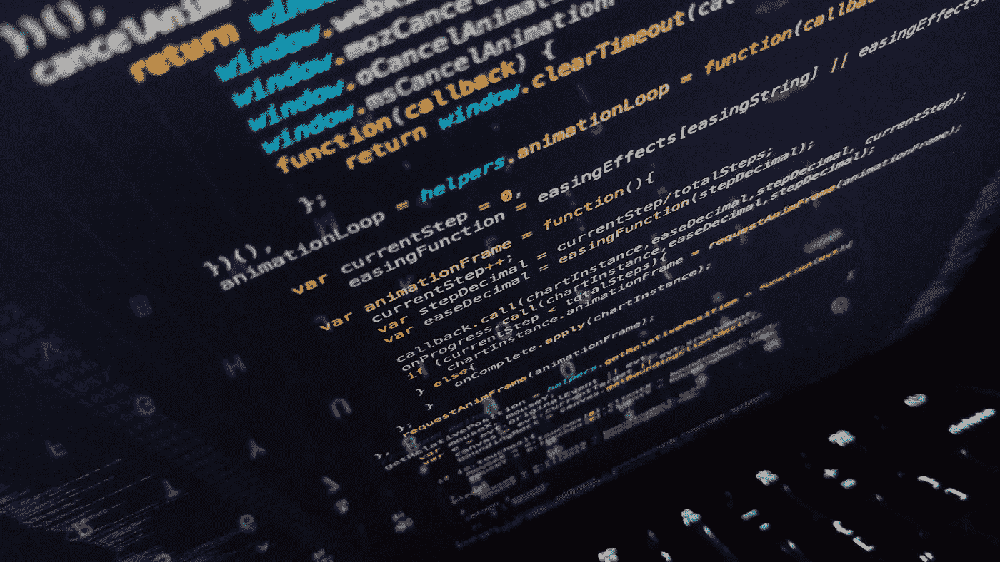

# 保持并记住页面滚动位置，即使用 React 钩子进行 window.scrollY

> 原文：<https://levelup.gitconnected.com/persist-and-remember-page-scroll-position-i-e-window-scrolly-using-react-hooks-f80884211f2d>

## 一个优雅的反应钩完成任务！



*** * 2020 年 10 月 16 日更新:**由于过于执着地追随 ESLint，我意识到在`useEffect`钩子中使用空的依赖数组(`[]`)有时是可以的。这最终导致构建了一个不需要设置自定义滚动位置的钩子。详情请继续阅读。钩子现在是稳定的，并且已经在我们需要它的项目中交付生产了！

*** 2020 年 10 月 14 日更新**:在意识到使用这个钩子可能会导致页面‘跳转’的副作用之后，我增加了需求 3(并相应地修改了钩子)——使用这个钩子的组件中的任何状态变化当然都会重新触发，导致`useWindowScrollPosition`中的逻辑*也*被执行。这篇文章可能会有进一步的更新，所以使用风险自担。抱歉，那些在这里复制代码的人，但是你应该知道这样做总是有风险的😉。

这篇文章[反映在我的博客 chrisfrew.in](https://chrisfrew.in/blog/persist-and-remember-page-scroll-position-with-react-hooks/) 上。

在最近的一个项目中，我的任务是创建能够保持页面间滚动位置的功能。起初，我确信解决方案必须是复杂的，我们必须监听`**scroll**`事件监听器(从性能和效率的角度来看，这总是一项关键任务)，并共享各种页面滚动位置的复杂状态(`**window.scrollY**`的值)，以便一切正常工作。

最后，利用 [localStorage](https://developer.mozilla.org/en-US/docs/Web/API/Window/localStorage) 和 React hooks 的一些高级功能，产生了一个相当优雅的解决方案。

我很乐意和你分享。

我们走吧！

# 要求

1.  首先，我们需要记住每页的`**window.scrollY**`值——这可以用 [localStorage](https://developer.mozilla.org/en-US/docs/Web/API/Window/localStorage) 解决。我们将传递一个 page 键来标识哪个`**localStorage**`变量具有我们需要再水合的`**scrollY**`值。
2.  我们只需要存储用户离开页面时的滚动位置*。这是我意识到不需要事件监听器的地方。不需要监听`**scroll**`事件来完成这个功能！(已经是巨大的加分了)。如果你愿意的话，这个“窍门”就是利用 React 的`**useEffect**` `**return**`值，它可以是一个函数，即一个`**useEffect**`调用可以具有以下形式:*

```
**useEffect(() => {
    // ...some effect code here...
    return () => {
        // this code fires on unmount! Perfect for our use case!
    }
}, [])**
```

3.最后，也可能是最棘手的一点:*我们应该在页面的全部内容加载完毕后再调整页面的滚动位置*。例如，如果我们从一个异步进程中加载一堆图片或图片(或者任何真正在 DOM 中结束的东西)，我们会在恢复我们的`**scrollY**`位置之前等待以确保数据在 DOM 中被设置。因此，我们的钩子也应该能够接受一个类型为`**boolean**`的参数。我把它叫做`**setCondition**`。只有当`**setCondition**`变量是`**true**`时，我们才会调用`**window.scrollTo**`。

# 实施

我向你介绍`**useWindowScrollPosition**`(打字稿):

```
**import { useEffect } from "react";
import useLocalStorage from "./useLocalStorage";****// sets scrollY position of window based on a setting condition, i.e. when api calls are done
// also sets the scroll position when unmounting, i.e. a user navigates to a different page
export default function useWindowScrollPosition(localStorageKey: string, setCondition: boolean): void {
    const [scrollYStorage, setScrollYStorage] = useLocalStorage(localStorageKey, 0);
    useEffect(() => {
        // if the setcondition is true (AKA everything in the DOM is loaded: fire off the scrollTo()!)
        if (setCondition) {
            window.scrollTo(0, scrollYStorage)
        }
    }, [setCondition, scrollYStorage])** **// purely on un mount (and thus we ignore the ESLint warning): store the scroll position the user was at to localStorage
    // see the yellow note at https://reactjs.org/docs/hooks-effect.html near the very bottom
    useEffect(()=> {
        return () => {
            setScrollYStorage(window.scrollY)
        };
       // eslint-disable-next-line react-hooks/exhaustive-deps
    }, [])
}**
```

其中`**useLocalStorage**`是一个“依赖”，如果你愿意的话，[来自 Gabe Ragland 在他的 **useHooks** 站点](https://usehooks.com/useLocalStorage/)上创建的一个漂亮的钩子。

因为这个钩子直接与窗口对象交互，所以在组件中使用它是一个真正的单行程序:

```
**import * as React from "react";
import { useEffect, useState } from "react";
import useWindowScrollPosition from "../hooks/useWindowScrollPosition";****export default function MyAwesomeComponent() {
    const [data, setData] = useState<any>(undefined);
    const [isLoading, setIsLoading] = useState<boolean>(true);** **// look at this; easy as pie:
    useWindowScrollPosition('MyAwesomeComponent_ScrollY', !isLoading);
    // done :)** **// example of setting a loading to false, which upon being set to 'true', triggers the effectful parts of useWindowScrollPosition
    const fetchData = async () => {
        try {
            const data = await fetch('https://your-api-url-here.com');
            setData(data);
            setIsLoading(false);
        } catch (error) {
            console.log(error);
            setIsLoading(false);
        }
    };** **useEffect(() => {
        if (!data) {
            fetchData();
        }
    });** **return (
        <p>Hello world!</p>
        <button onClick={onClick}>Click me!</button>
    );
}**
```

# 最后备注和注释

*   **最关键的**，这个钩子在它的一个`useEffect`钩子中利用了臭名昭著的空依赖数组。(你可以在代码的评论里看到关于这个特殊用法的 React 官方文档的链接，或者[点击这里](https://reactjs.org/docs/hooks-effect.html)。).如果你正在使用 ESLint(强烈推荐),当使用空数组时，你会得到一个警告。但是在这种情况下，我们真正想要的只是逻辑(设置 localStorage 键),特别是在组件卸载时，而不是其他时候。因此为第二个`**useEffect**`钩子提供空的依赖数组(`**[]**`)是合理的。
*   因为这个钩子利用了本地存储，所以这个解决方案既适用于单页应用程序，也适用于多页应用程序，比如用 Gatsby 生成的站点——比如这个博客！
*   你只需要提供`**localStorage**`键的名称，以及何时调用`**window.scrollTo**`的`**boolean**`触发条件。(如果想在 mount 上立即调用`**window.scrollTo**`，只需将`**true**`传递给钩子即可)。
*   我将`**localStorage**`键参数保留为`**string**`类型，但是您可以将其重构为特定的`**enum**`允许的页面名称，或者创建您自己的验证器。
*   最后，**也是相当重要的**，你应该在一个‘页面’内只使用这个钩子*一次*。如果`**setCondition**`可能位于页面的更深处，那么它*可以在页面的子组件中使用——但是尝试多次调用`**window.scrollTo()**`来恢复旧的滚动位置没有多大意义。我发现 99%的时间我都可以在我的顶级页面组件中使用它——这是我进行所有 API 调用和加载处理的地方。*

# 谢谢！

一如既往，感谢您的宝贵时间！希望这个钩子对你有用。

干杯！🍺

克里斯